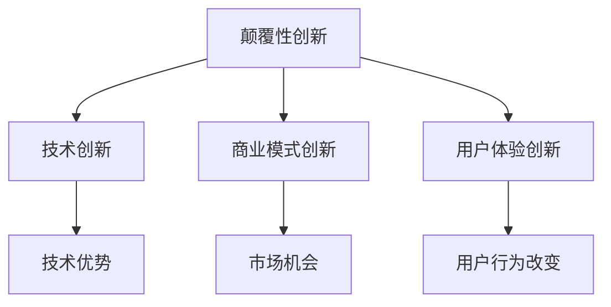

                 


# 多智能体系统在识别行业颠覆性创新中的应用

> 关键词：多智能体系统，颠覆性创新，创新识别，人工智能，分布式计算

> 摘要：本文探讨了多智能体系统在识别行业颠覆性创新中的应用，分析了多智能体系统的核心概念、算法原理和系统架构，结合实际案例展示了如何利用多智能体系统来预测和识别行业中的颠覆性创新。文章从理论到实践，详细阐述了多智能体系统在创新识别中的优势和应用场景。

---

# 目录

1. [多智能体系统概述](#多智能体系统概述)
2. [颠覆性创新识别方法](#颠覆性创新识别方法)
3. [多智能体系统中的关键算法](#多智能体系统中的关键算法)
4. [系统架构与设计](#系统架构与设计)
5. [项目实战：利用多智能体系统识别颠覆性创新](#项目实战利用多智能体系统识别颠覆性创新)
6. [总结与展望](#总结与展望)

---

## 1. 多智能体系统概述

### 1.1 多智能体系统的基本概念

多智能体系统（Multi-Agent System, MAS）是由多个智能体（Agent）组成的分布式系统，这些智能体通过协作完成复杂的任务。智能体是具有感知、决策和行动能力的实体，可以是软件程序、机器人或其他智能设备。

#### 1.1.1 多智能体系统的特征

| 特征 | 描述 |
|------|------|
| 分布式 | 智能体分布在不同的位置，独立运行 |
| 协作性 | 智能体之间通过协作完成共同目标 |
| 反应性 | 能够感知环境并实时调整行为 |
| 分层性 | 系统通常具有层次化的结构 |

### 1.2 多智能体系统的应用场景

多智能体系统广泛应用于多个领域：

#### 1.2.1 分布式计算
- **定义**：通过多智能体系统实现任务的分布式计算。
- **流程**：
  1. 任务分解：将复杂任务分解为多个子任务。
  2. 任务分配：通过算法将子任务分配给不同的智能体。
  3. 任务执行：各智能体独立完成分配的任务。
  4. 结果汇总：将各智能体的结果汇总，得到最终结果。

#### 1.2.2 机器人协作
- **应用场景**：工业机器人协作、服务机器人协作等。
- **案例**：工业生产线上的多机器人协作，完成零件组装、质量检测等任务。

#### 1.2.3 智能交通系统
- **应用场景**：城市交通管理、自动驾驶等。
- **案例**：通过多智能体系统协调交通信号灯、自动驾驶汽车的行动，优化交通流量。

---

## 2. 颠覆性创新识别方法

### 2.1 颠覆性创新的定义

颠覆性创新是指一种创新模式，通过引入新的技术、商业模式或产品，打破现有的市场格局，创造新的市场机会。

#### 2.1.1 颠覆性创新的特点

| 特点 | 描述 |
|------|------|
| 技术领先 | 引入了新技术或新的技术组合 |
| 商业模式创新 | 采用了新的商业模式，如免费模式、订阅模式等 |
| 用户体验优化 | 提供了更好的用户体验，改变了用户的消费习惯 |
| 市场破坏 | 打破了现有的市场格局，创造了新的市场机会 |

### 2.2 颠覆性创新的分析框架

#### 2.2.1 分析框架设计

以下是颠覆性创新分析框架的设计：



#### 2.2.2 分析框架的对比分析

| 框架要素 | 描述 |
|----------|------|
| 技术创新 | 新技术或技术组合的应用 |
| 商业模式创新 | 新的商业模式，如免费增值模式 |
| 用户体验创新 | 提供更好的用户体验，改变用户行为 |

---

## 3. 多智能体系统中的关键算法

### 3.1 分布式计算算法

#### 3.1.1 分布式一致性算法

分布式一致性算法用于保证分布式系统中各节点的数据一致性。常用的算法包括：

1. **Paxos算法**：用于在分布式系统中达成一致性协议。
2. **Raft算法**：Paxos算法的简化版本，更易理解和实现。

#### 3.1.2 分布式共识算法

分布式共识算法用于在分布式系统中达成共识。常用的算法包括：

1. **比特币的共识算法**：通过区块链技术实现分布式账本的一致性。
2. **以太坊的共识算法**：基于区块链的智能合约实现分布式共识。

### 3.2 多智能体系统中的优化算法

#### 3.2.1 分布式优化算法

分布式优化算法用于在多智能体系统中优化目标函数。常用的算法包括：

1. **分布式梯度下降算法**：通过分布式计算实现梯度下降。
2. **分布式粒子群优化算法**：基于粒子群优化的分布式实现。

#### 3.2.2 分布式强化学习

分布式强化学习是将强化学习应用于多智能体系统中，通过智能体之间的协作实现目标。常用的算法包括：

1. **分布式Q-learning**：通过分布式Q-learning算法实现智能体之间的协作。
2. **分布式深度强化学习**：基于深度学习的分布式强化学习算法。

### 3.3 多智能体系统中的博弈论模型

#### 3.3.1 博弈论基础

博弈论是研究多个智能体在冲突或合作环境下的决策理论。常用的博弈论模型包括：

1. **纳什均衡**：所有智能体都采用最优策略，使得没有任何智能体能够通过单方面改变策略而受益。
2. **帕累托最优**：系统中没有任何一方的境况能够通过改变策略而得到改善。

#### 3.3.2 多智能体博弈模型

多智能体博弈模型用于模拟多个智能体之间的博弈关系。常用的模型包括：

1. **完全理性博弈模型**：假设所有智能体都是理性的，能够预测其他智能体的决策。
2. **有限理性博弈模型**：智能体的决策受到信息限制和计算能力限制。

---

## 4. 系统架构与设计

### 4.1 系统功能设计

#### 4.1.1 领域模型设计

以下是领域模型的类图设计：

```mermaid
classDiagram
    class 多智能体系统 {
        +智能体列表：List<智能体>
        +通信协议：String
        +协作策略：String
        +任务分配算法：Algorithm
        +创新识别算法：Algorithm
    }
    class 智能体 {
        +id：Integer
        +状态：String
        +任务列表：List<Task>
        +通信接口：Interface
        +协作接口：Interface
    }
    class 任务 {
        +id：Integer
        +目标：String
        +优先级：Integer
        +状态：String
    }
    多智能体系统 --> 智能体：包含关系
    智能体 --> 任务：关联关系
```

#### 4.1.2 系统架构设计

以下是系统架构设计的架构图：


#### 4.1.3 系统接口设计

以下是系统接口设计的序列图：

```mermaid
sequenceDiagram
    participant 智能体1
    participant 智能体2
    participant 通信协议
    participant 协作策略
    智能体1 -> 通信协议：发送消息
    通信协议 -> 智能体2：接收消息
    智能体2 -> 协作策略：执行协作策略
    协作策略 -> 智能体1：返回协作结果
```

---

## 5. 项目实战：利用多智能体系统识别颠覆性创新

### 5.1 项目介绍

本项目旨在利用多智能体系统识别行业中的颠覆性创新。通过分析技术创新、商业模式创新和用户体验创新，预测可能的颠覆性创新。

### 5.2 环境配置

#### 5.2.1 系统要求

- 操作系统：Linux/Windows/MacOS
- 程序语言：Python 3.8+
- 依赖库：numpy、pandas、scikit-learn、matplotlib

#### 5.2.2 安装依赖

```bash
pip install numpy pandas scikit-learn matplotlib
```

### 5.3 核心代码实现

#### 5.3.1 多智能体系统实现

以下是多智能体系统的Python实现代码：

```python
class Agent:
    def __init__(self, id):
        self.id = id
        self.tasks = []
        self.communication_interface = CommunicationInterface()
        self.collaboration_interface = CollaborationInterface()

class MultiAgentSystem:
    def __init__(self):
        self.agents = []
        self.communication_protocol = "TCP/IP"
        self.collaboration_strategy = "Nash Equilibrium"
        self.task_allocation_algorithm = "Distributed Gradient Descent"
        self.innovation_detection_algorithm = "Game Theory Model"

    def add_agent(self, agent):
        self.agents.append(agent)

    def remove_agent(self, agent):
        self.agents.remove(agent)

    def assign_task(self, task, agent):
        agent.tasks.append(task)

    def execute(self):
        for agent in self.agents:
            for task in agent.tasks:
                self.execute_task(task, agent)

    def execute_task(self, task, agent):
        # 执行任务的具体实现
        pass
```

#### 5.3.2 创新识别算法实现

以下是创新识别算法的Python实现代码：

```python
from sklearn.cluster import KMeans
import numpy as np

class InnovationDetectionAlgorithm:
    def __init__(self):
        self.kmeans = KMeans(n_clusters=3)

    def detect_innovation(self, data):
        self.kmeans.fit(data)
        clusters = self.kmeans.labels_
        return clusters

    def get_cluster_centers(self):
        return self.kmeans.cluster_centers_
```

### 5.4 项目实现与分析

#### 5.4.1 创新识别案例分析

假设我们有一个数据集，包含多个公司的技术创新数据，我们可以通过多智能体系统识别其中的颠覆性创新。

1. **数据预处理**：
   - 数据清洗
   - 特征提取

2. **创新识别**：
   - 使用KMeans算法对数据进行聚类
   - 根据聚类结果识别颠覆性创新

3. **结果分析**：
   - 根据聚类结果，分析哪些公司可能具有颠覆性创新的潜力

#### 5.4.2 代码实现

以下是创新识别算法的具体实现：

```python
import numpy as np
from sklearn.cluster import KMeans

# 示例数据集
data = np.array([[1, 2], [3, 4], [5, 6], [7, 8], [9, 10]])

# 初始化创新识别算法
innovation_detector = InnovationDetectionAlgorithm()

# 检测创新
clusters = innovation_detector.detect_innovation(data)

# 获取聚类中心
cluster_centers = innovation_detector.get_cluster_centers()

# 打印结果
print("聚类结果：", clusters)
print("聚类中心：", cluster_centers)
```

#### 5.4.3 案例分析

通过上述代码，我们可以识别出哪些公司具有颠覆性创新的潜力。例如：

- 如果某公司的技术创新数据位于某个聚类中心，且该聚类中心代表的是颠覆性创新的特征，那么该公司可能具有颠覆性创新的潜力。

---

## 6. 总结与展望

### 6.1 总结

本文探讨了多智能体系统在识别行业颠覆性创新中的应用，分析了多智能体系统的核心概念、算法原理和系统架构，结合实际案例展示了如何利用多智能体系统来预测和识别行业中的颠覆性创新。通过本文的分析，我们可以看到多智能体系统在颠覆性创新识别中的巨大潜力。

### 6.2 展望

未来，随着人工智能技术的不断发展，多智能体系统在颠覆性创新识别中的应用将更加广泛。我们可以进一步研究多智能体系统在其他领域的应用，探索更多创新的可能性。

---

作者：AI天才研究院/AI Genius Institute & 禅与计算机程序设计艺术/Zen And The Art of Computer Programming

