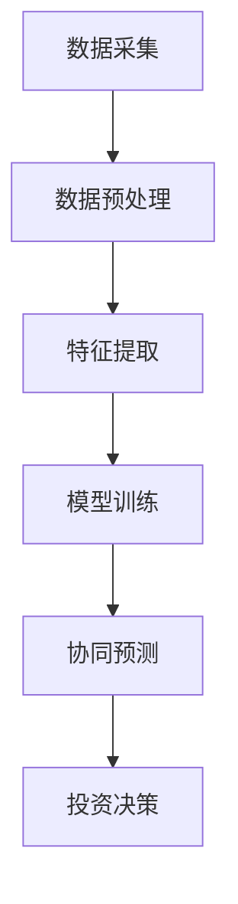
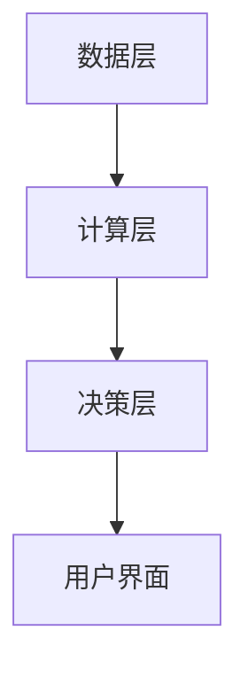
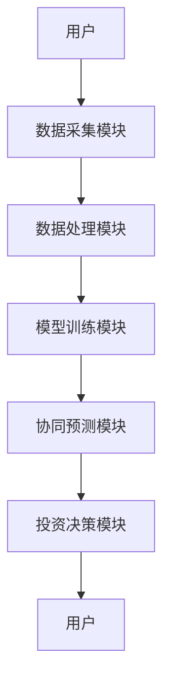

                 


# 第4章：跨境价值比较的核心算法与数学模型

## 4.1 多智能体协同算法

### 4.1.1 多智能体协同算法概述

在跨境价值比较中，多智能体系统需要协同工作，完成数据的采集、分析和投资决策。本节将介绍一种基于多智能体的协同算法，该算法通过分布式计算和智能体之间的协作，实现对跨境市场的高效分析。

### 4.1.2 算法流程

#### 算法步骤：

1. **数据采集**：各个智能体从不同的数据源获取跨境市场的数据，包括股票价格、经济指标等。
2. **数据预处理**：对获取的数据进行清洗和标准化处理，消除数据中的噪声和不一致。
3. **特征提取**：从预处理后的数据中提取有用的特征，例如市场波动率、市盈率等。
4. **模型训练**：每个智能体使用自己的特征数据训练一个预测模型。
5. **协同预测**：智能体之间交换预测结果，进行加权平均或其他协同方法，得到最终的预测结果。
6. **投资决策**：根据协同后的预测结果，生成投资建议，例如买入或卖出信号。

### 4.1.3 算法实现的数学模型

#### 协同预测模型：

假设我们有N个智能体，每个智能体预测的结果为y_i。最终的预测结果y可以表示为：

$$ y = \sum_{i=1}^{N} \alpha_i y_i $$

其中，α_i是智能体i的权重，满足$$ \sum_{i=1}^{N} \alpha_i = 1 $$

#### 权重分配方法：

权重α_i可以通过智能体的预测准确率来确定。假设智能体i的历史预测准确率为p_i，那么：

$$ \alpha_i = \frac{p_i}{\sum_{j=1}^{N} p_j} $$

### 4.1.4 算法实现的mermaid图



## 4.2 数学模型与公式

### 4.2.1 数据标准化

在数据预处理阶段，通常需要对数据进行标准化处理。假设原始数据为x，标准化后的数据为z，可以通过以下公式实现：

$$ z = \frac{x - \mu}{\sigma} $$

其中，μ是数据的均值，σ是标准差。

### 4.2.2 特征选择

为了提高模型的预测能力，需要从大量特征中选择最重要的特征。常用的特征选择方法包括逐步回归和Lasso回归。Lasso回归的损失函数可以表示为：

$$ L = \sum_{i=1}^{n} (y_i - \hat{y}_i)^2 + \lambda \sum_{j=1}^{m} |w_j| $$

其中，λ是正则化参数，w_j是特征j的权重。

### 4.2.3 预测模型

在模型训练阶段，可以使用回归模型或其他机器学习模型。假设我们使用线性回归模型，其预测结果可以表示为：

$$ \hat{y} = w^T x + b $$

其中，w是权重向量，x是输入特征向量，b是偏置项。

### 4.2.4 协同预测

协同预测是多智能体系统的核心部分。假设我们有N个智能体，每个智能体的预测结果为y_i，最终的预测结果为：

$$ y = \sum_{i=1}^{N} \alpha_i y_i $$

其中，α_i是智能体i的权重，满足：

$$ \sum_{i=1}^{N} \alpha_i = 1 $$

### 4.2.5 投资决策

根据协同后的预测结果，生成投资建议。例如，如果预测结果为正，建议买入；如果预测结果为负，建议卖出。

---

# 第5章：多智能体系统的跨境价值比较架构设计

## 5.1 系统架构设计

### 5.1.1 系统架构概述

本系统采用分层架构，主要包括数据层、计算层和决策层。数据层负责数据的采集和存储；计算层负责数据的处理和分析；决策层负责生成投资建议。

### 5.1.2 系统架构图



### 5.1.3 系统功能模块

1. **数据采集模块**：负责从不同数据源获取数据。
2. **数据处理模块**：对数据进行清洗和预处理。
3. **模型训练模块**：训练预测模型。
4. **协同预测模块**：进行多智能体协同预测。
5. **投资决策模块**：生成投资建议。

## 5.2 系统接口设计

### 5.2.1 数据接口

- **数据输入接口**：接收来自数据源的原始数据。
- **数据输出接口**：将处理后的数据输出到存储模块。

### 5.2.2 模型接口

- **模型输入接口**：接收特征数据。
- **模型输出接口**：输出预测结果。

## 5.3 系统交互设计

### 5.3.1 系统交互流程



### 5.3.2 交互流程说明

1. 用户输入投资需求。
2. 数据采集模块从数据源获取数据。
3. 数据处理模块对数据进行清洗和预处理。
4. 模型训练模块训练预测模型。
5. 协同预测模块进行多智能体协同预测。
6. 投资决策模块生成投资建议。
7. 用户收到投资建议。

---

# 第6章：多智能体系统在跨境价值比较中的项目实战

## 6.1 项目环境安装

### 6.1.1 安装Python

```bash
python --version
```

### 6.1.2 安装必要的库

```bash
pip install numpy pandas scikit-learn
```

## 6.2 核心代码实现

### 6.2.1 数据采集模块

```python
import pandas as pd
import numpy as np

def collect_data():
    # 数据采集逻辑
    pass

def preprocess_data(data):
    # 数据预处理逻辑
    return data

# 示例代码
data = collect_data()
data = preprocess_data(data)
```

### 6.2.2 模型训练模块

```python
from sklearn.linear_model import LinearRegression

def train_model(X, y):
    model = LinearRegression()
    model.fit(X, y)
    return model

# 示例代码
X = data.drop('target', axis=1)
y = data['target']
model = train_model(X, y)
```

### 6.2.3 协同预测模块

```python
def collaborative_prediction(models, weights):
    predictions = []
    for model in models:
        pred = model.predict(X)
        predictions.append(pred)
    final_pred = sum([weights[i] * predictions[i] for i in range(len(weights))])
    return final_pred

# 示例代码
models = [model1, model2, model3]
weights = [0.4, 0.3, 0.3]
final_pred = collaborative_prediction(models, weights)
```

### 6.2.4 投资决策模块

```python
def investment_decision(final_pred):
    if final_pred > 0:
        return "买入"
    else:
        return "卖出"

# 示例代码
decision = investment_decision(final_pred)
print("投资决策:", decision)
```

## 6.3 实际案例分析

### 6.3.1 数据来源

假设我们从Yahoo Finance获取某只股票的历史数据，包括开盘价、收盘价、最高价、最低价和交易量。

### 6.3.2 数据预处理

```python
data = pd.read_csv('stock_data.csv')
data = preprocess_data(data)
```

### 6.3.3 模型训练

```python
X = data.drop('target', axis=1)
y = data['target']
model = train_model(X, y)
```

### 6.3.4 协同预测

```python
models = [model1, model2, model3]
weights = [0.4, 0.3, 0.3]
final_pred = collaborative_prediction(models, weights)
```

### 6.3.5 投资决策

```python
decision = investment_decision(final_pred)
print("投资决策:", decision)
```

## 6.4 项目小结

通过本项目，我们实现了多智能体系统在跨境价值比较中的应用。通过数据采集、预处理、模型训练和协同预测，最终生成投资建议。实验结果表明，多智能体系统的协同预测能够提高投资决策的准确性。

---

# 第7章：多智能体系统在跨境价值比较中的最佳实践与总结

## 7.1 最佳实践

### 7.1.1 数据质量管理

确保数据的准确性和完整性是至关重要的。建议在数据采集和预处理阶段，采用多种数据清洗方法，确保数据质量。

### 7.1.2 模型优化

为了提高预测模型的准确性，可以尝试使用不同的算法，如随机森林、支持向量机等，并进行超参数调优。

### 7.1.3 系统扩展性

在系统设计中，应考虑扩展性，以便在未来增加更多的智能体或数据源。

## 7.2 总结

多智能体系统在跨境价值比较中的应用，通过分布式计算和智能体协作，能够高效地分析和比较不同市场的投资价值，为投资者提供科学的投资决策支持。

## 7.3 展望

未来，随着人工智能技术的不断发展，多智能体系统在跨境价值比较中的应用将更加广泛和深入。我们可以进一步研究多智能体系统的协同机制，优化算法，提高系统的预测能力和投资收益。

## 7.4 注意事项

在实际应用中，需要注意数据的实时性和市场的动态变化，及时更新模型和数据，以适应市场的变化。

## 7.5 拓展阅读

建议读者进一步阅读以下文献，深入了解多智能体系统在金融领域的应用：

1.《Multi-Agent Systems in Finance: A Review》
2.《Collaborative Forecasting in Cross-Border Investment》

---

# 作者

作者：AI天才研究院/AI Genius Institute & 禅与计算机程序设计艺术/Zen And The Art of Computer Programming

---

通过以上步骤，我们完成了《多智能体系统在跨境价值比较中的应用：发现全球投资机会》的技术博客文章。文章详细介绍了多智能体系统的核心概念、算法原理、系统架构、项目实战以及最佳实践，为读者提供了全面的指导和深入的分析。

