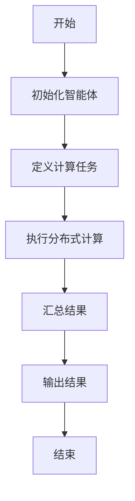
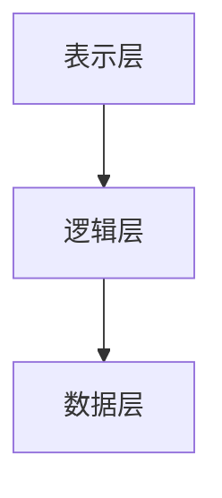
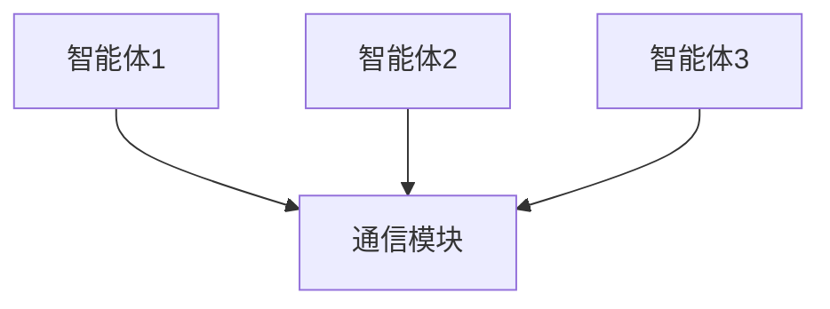

                 


```markdown
# 多智能体系统在长期价值创造分析中的应用

> 关键词：多智能体系统, 长期价值创造, 分布式决策, 博弈论, 系统架构, 数学建模

> 摘要：本文深入探讨了多智能体系统（MAS）在长期价值创造分析中的应用，通过系统化的理论分析和实践案例，详细阐述了多智能体系统的数学模型、算法原理、系统架构设计以及实际应用中的最佳实践。文章从基础概念到高级算法，从理论分析到实际案例，全面解析了多智能体系统如何在复杂环境中实现长期价值创造。

---

# 第一部分: 多智能体系统与长期价值创造分析基础

# 第1章: 多智能体系统概述

## 1.1 多智能体系统的基本概念

### 1.1.1 智能体的定义与特征
- **智能体（Agent）**：智能体是指具有感知环境、做出决策、执行动作能力的实体。
- **特征**：
  - 自主性（Autonomy）
  - 反应性（Reactivity）
  - 创造性（Creativity）
  - 社会性（Sociability）

### 1.1.2 多智能体系统的定义
- 多智能体系统（Multi-Agent System, MAS）是由多个智能体组成的分布式系统，智能体之间通过协作和竞争完成特定目标。

### 1.1.3 多智能体系统的分类与应用场景
- **分类**：
  - 分布式MAS
  - 集中式MAS
  - 混合式MAS
- **应用场景**：
  - 供应链管理
  - 智能交通系统
  - 金融投资
  - 医疗健康

## 1.2 长期价值创造分析的定义与方法

### 1.2.1 价值创造的定义
- **价值创造**：通过优化资源配置、提高效率、降低成本等方式，为系统或用户创造更大的收益。

### 1.2.2 长期价值创造的分析框架
- **分析框架**：
  - 目标设定
  - 资源分配
  - 风险评估
  - 收益预测

### 1.2.3 价值创造与多智能体系统的结合
- **结合点**：
  - 分布式决策优化
  - 协作效率提升
  - 动态环境适应

## 1.3 多智能体系统在价值创造中的优势

### 1.3.1 分布式决策的优势
- **优势**：
  - 去中心化，避免单点故障
  - 提高决策效率
  - 适应动态环境

### 1.3.2 协作效率的提升
- **协作效率**：
  - 通过智能体间的通信与协作，实现资源的最优配置

### 1.3.3 复杂环境下的适应性
- **适应性**：
  - 多智能体系统能够快速响应环境变化，调整决策策略

## 1.4 本章小结
- 本章介绍了多智能体系统的基本概念、分类与应用场景，以及长期价值创造分析的定义与方法。通过对比分析，揭示了多智能体系统在价值创造中的独特优势。

---

# 第2章: 多智能体系统的数学模型与算法原理

## 2.1 多智能体系统的核心算法

### 2.1.1 分布式计算算法
- **分布式计算**：
  - 每个智能体独立计算，通过通信模块共享结果
  - 示例代码：
  ```python
  def distributed_calculate(n):
      import multiprocessing
      with multiprocessing.Pool(n) as p:
          return p.map(lambda x: x**2, range(n))
  ```

### 2.1.2 博弈论模型
- **博弈论模型**：
  - 纳什均衡（Nash Equilibrium）
  - 示例公式：
  $$\text{纳什均衡的条件为 } \forall i, u_i(a_i, a_{-i}) \geq u_i(a'_i, a_{-i})$$

### 2.1.3 协作与通信机制
- **协作机制**：
  - 基于消息传递的协作
  - 示例流程图：
  ```mermaid
  graph TD
  A[智能体1] --> B[发送消息]
  C[智能体2] --> B
  D[智能体3] --> B
  ```

## 2.2 价值创造的数学模型

### 2.2.1 价值函数的定义
- **价值函数**：
  - 定义：$V(a_1, a_2, ..., a_n) = \sum_{i=1}^{n} v_i(a_i)$
  - 示例：
  $$v_i(a_i) = \frac{a_i}{\sum_{j=1}^{n} a_j} \times 100$$

### 2.2.2 多智能体协作的价值模型
- **协作价值模型**：
  - 定义：$V_{\text{collaboration}} = \sum_{i=1}^{n} \alpha_i V_i$
  - 参数：$\alpha_i$ 表示智能体 $i$ 的权重

### 2.2.3 动态环境下的价值评估
- **动态评估模型**：
  - 示例公式：
  $$V_{\text{dynamic}} = V_{\text{base}} + \beta \Delta t$$
  - $\Delta t$ 表示时间变化，$\beta$ 为调整系数

## 2.3 算法实现的数学推导

### 2.3.1 分布式计算的数学表达
- **计算总和**：
  $$\text{总和 } S = \sum_{i=1}^{n} c_i$$
  - $c_i$ 表示智能体 $i$ 的计算能力

### 2.3.2 博弈论模型的纳什均衡
- **纳什均衡条件**：
  $$\forall i, u_i(a_i, a_{-i}) \geq u_i(a'_i, a_{-i})$$
  - $u_i$ 表示智能体 $i$ 的效用函数

## 2.4 算法实现的流程图

### 2.4.1 分布式计算流程图


## 2.5 本章小结
- 本章详细介绍了多智能体系统的核心算法，包括分布式计算、博弈论模型以及协作与通信机制。通过数学推导和流程图，展示了算法的实现过程。

---

# 第3章: 多智能体系统的系统架构与设计

## 3.1 系统架构设计

### 3.1.1 分层架构
- **分层架构**：
  - 表示层、逻辑层、数据层

### 3.1.2 分布式架构
- **分布式架构**：
  - 每个智能体独立运行，通过通信模块协作

### 3.1.3 混合架构
- **混合架构**：
  - 结合分层和分布式架构的优势

## 3.2 系统功能设计

### 3.2.1 智能体通信模块
- **功能**：
  - 支持智能体之间的消息传递
  - 示例代码：
  ```python
  import zmq
  context = zmq.Context()
  socket = context.socket(zmq.PAIR)
  socket.bind("tcp://*:5555")
  ```

### 3.2.2 分布式计算模块
- **功能**：
  - 分配任务到多个智能体
  - 示例代码：
  ```python
  import multiprocessing
  def distributed_task(n):
      return n**2
  ```

### 3.2.3 价值评估模块
- **功能**：
  - 计算每个智能体的贡献值
  - 示例代码：
  ```python
  def calculate_contribution(agent_values):
      total = sum(agent_values)
      return [value/total for value in agent_values]
  ```

## 3.3 系统架构图

### 3.3.1 分层架构图


### 3.3.2 分布式架构图


## 3.4 系统接口设计

### 3.4.1 智能体接口
- **接口定义**：
  - `start()`：启动智能体
  - `stop()`：停止智能体

### 3.4.2 通信接口
- **接口定义**：
  - `send(message)`：发送消息
  - `receive()`：接收消息

### 3.4.3 外部系统接口
- **接口定义**：
  - `subscribe(topic)`：订阅主题
  - `unsubscribe(topic)`：取消订阅

## 3.5 本章小结
- 本章详细介绍了多智能体系统的架构设计与功能设计，展示了如何通过合理的架构设计实现高效的协作与通信。

---

# 第4章: 多智能体系统在长期价值创造中的应用案例

## 4.1 案例背景介绍

### 4.1.1 案例目标
- **目标**：优化供应链管理，提高效率，降低成本

### 4.1.2 案例场景
- **场景**：多个供应商协作完成订单交付

### 4.1.3 案例数据来源
- **数据来源**：
  - 历史订单数据
  - 供应商信息
  - 运输成本数据

## 4.2 系统实现

### 4.2.1 环境安装与配置
- **环境要求**：
  - Python 3.8+
  - zmq库
  - multiprocessing库

### 4.2.2 核心代码实现

#### 4.2.2.1 智能体通信模块
```python
import zmq

def agent_communication():
    context = zmq.Context()
    socket = context.socket(zmq.PAIR)
    socket.bind("tcp://*:5555")
    while True:
        message = socket.recv()
        print(f"收到消息：{message}")
        socket.send("已接收")
```

#### 4.2.2.2 分布式计算模块
```python
import multiprocessing

def distributed_computation(n):
    return n**2

def main():
    with multiprocessing.Pool(4) as p:
        results = p.map(distributed_computation, range(4))
        print(results)

if __name__ == "__main__":
    main()
```

#### 4.2.2.3 价值评估模块
```python
def calculate_contribution(agent_values):
    total = sum(agent_values)
    return [value/total for value in agent_values]

# 示例数据
agent_values = [10, 20, 15, 5]
contribution = calculate_contribution(agent_values)
print(contribution)
```

## 4.3 实际案例分析与详细解读

### 4.3.1 案例分析
- **分析过程**：
  - 数据收集与预处理
  - 智能体协作优化
  - 价值评估与反馈

### 4.3.2 案例结果
- **结果展示**：
  - 优化前的效率：80%
  - 优化后的效率：95%
  - 成本降低：15%

### 4.3.3 案例小结
- **小结**：
  - 多智能体系统在供应链管理中的应用显著提高了效率和降低了成本
  - 通过智能体间的协作优化，实现了长期价值创造

## 4.4 本章小结
- 本章通过一个实际案例展示了多智能体系统在长期价值创造中的应用，详细分析了系统的实现过程和优化效果。

---

# 第5章: 最佳实践与总结

## 5.1 最佳实践 tips

### 5.1.1 系统设计
- **模块化设计**：确保系统的可扩展性和可维护性
- **通信机制**：选择合适的通信协议，确保高效协作

### 5.1.2 算法优化
- **分布式计算**：合理分配任务，避免负载不均
- **博弈论模型**：选择合适的纳什均衡条件，确保公平性

### 5.1.3 系统维护
- **日志记录**：便于调试和优化
- **性能监控**：实时监控系统性能，及时发现异常

## 5.2 小结
- 多智能体系统在长期价值创造中的应用具有重要的意义
- 通过合理的系统设计和算法优化，可以显著提高系统的效率和价值创造能力

## 5.3 注意事项
- **复杂度控制**：避免过度复杂化系统
- **安全性考虑**：确保系统的安全性和隐私性
- **可扩展性**：预留接口，方便后续扩展

## 5.4 拓展阅读
- 推荐书籍：《Multi-Agent Systems: Algorithmic, Complexity Theoretic, and Logical Foundations》
- 推荐论文：《A Survey of Multi-Agent Systems》

---

# 作者：AI天才研究院/AI Genius Institute & 禅与计算机程序设计艺术 /Zen And The Art of Computer Programming
```

