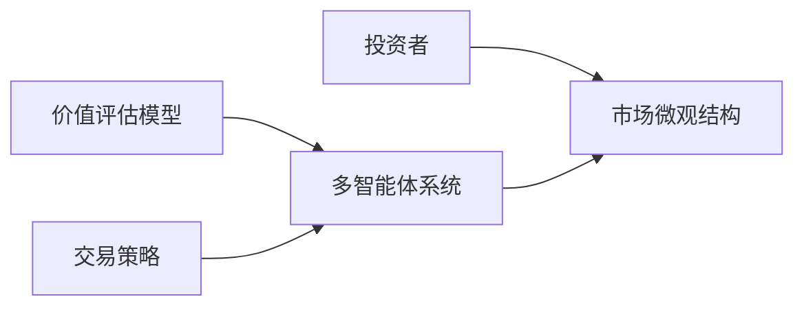

                 

# 多智能体系统增强价值投资的市场微观结构分析

> 关键词：多智能体系统，价值投资，市场微观结构，人工智能算法，强化学习，系统架构设计

> 摘要：本文探讨了多智能体系统在价值投资中的应用，分析了市场微观结构的特点，并结合强化学习算法和系统架构设计，提出了一种利用多智能体系统增强价值投资的方法。通过详细分析和案例研究，展示了如何在金融市场中利用多智能体系统优化投资策略。

---

# 第一部分: 多智能体系统与价值投资基础

## 第1章: 多智能体系统与价值投资概述

### 1.1 多智能体系统的定义与特点

#### 1.1.1 多智能体系统的定义
多智能体系统（Multi-Agent System, MAS）是由多个智能体（Agent）组成的复杂系统，这些智能体能够通过自主决策和协作完成特定任务。与单智能体系统相比，多智能体系统具有更强的适应性和灵活性。

#### 1.1.2 多智能体系统的核心特点
- **分布式性**：多个智能体独立运行，协同完成任务。
- **自主性**：每个智能体具备自主决策能力。
- **协作性**：智能体之间通过通信和协作优化整体目标。
- **动态性**：系统能够适应环境变化。

#### 1.1.3 多智能体系统与传统单智能体系统的主要区别
| 特性 | 多智能体系统 | 单智能体系统 |
|------|--------------|--------------|
| 决策主体 | 多个智能体 | 单个智能体   |
| 协作性 | 高          | 无           |
| 灵活性 | 高          | 低           |

### 1.2 价值投资的基本原理

#### 1.2.1 价值投资的定义
价值投资是一种投资策略，旨在通过分析企业的基本面，寻找被市场低估的投资标的。

#### 1.2.2 价值投资的核心理念
- **长期视角**：关注企业的长期价值，而非短期价格波动。
- **安全边际**：买入价格低于内在价值。
- **分散投资**：降低风险，避免过度集中。

#### 1.2.3 价值投资在金融市场中的应用
价值投资广泛应用于股票、债券等金融资产的投资中，投资者通过分析财务报表、行业地位等因素，寻找具有投资价值的标的。

### 1.3 多智能体系统与价值投资的结合

#### 1.3.1 多智能体系统在金融领域的应用背景
随着金融市场数据的爆炸式增长，传统的单智能体投资模型难以应对复杂多变的市场环境，而多智能体系统能够通过分布式计算和协作优化，提高投资决策的效率和准确性。

#### 1.3.2 价值投资与多智能体系统的契合点
- **数据处理能力**：多智能体系统能够高效处理大量金融数据。
- **协作优化**：多个智能体可以分别负责不同的分析任务，协同完成投资决策。
- **动态适应**：系统能够快速响应市场变化，优化投资策略。

#### 1.3.3 多智能体系统增强价值投资的潜力与优势
通过多智能体系统的协作，可以实现对市场微观结构的深入分析，发现传统方法难以察觉的投资机会。

---

## 第2章: 市场微观结构分析基础

### 2.1 市场微观结构的基本概念

#### 2.1.1 市场微观结构的定义
市场微观结构是指金融市场的内部运作机制，包括交易机制、参与者行为、订单簿等内容。

#### 2.1.2 市场微观结构的主要组成部分
- **订单簿**：记录当前市场上的买卖订单。
- **参与者行为**：不同市场参与者（机构投资者、散户等）的行为模式。
- **交易机制**：订单匹配和成交的规则。

#### 2.1.3 市场微观结构与宏观市场的关系
市场微观结构是宏观市场的基础，通过影响交易成本、流动性等因素，间接影响市场价格。

### 2.2 金融市场中的微观结构特征

#### 2.2.1 市场参与者的类型与行为特征
| 类型 | 行为特征 |
|------|----------|
| 机构投资者 | 高频交易、大数据分析 |
| 散户投资者 | 交易行为受情绪影响较大 |
| 做市商 | 提供流动性，维护市场秩序 |

#### 2.2.2 交易机制与订单簿分析
交易机制包括订单驱动和报价驱动两种类型，订单簿记录了所有未成交的订单，反映了市场的供需情况。

#### 2.2.3 市场微观结构中的信息不对称问题
信息不对称会导致市场价格扭曲，影响市场效率。多智能体系统可以通过协作减少信息不对称，优化投资决策。

### 2.3 多智能体系统在市场微观结构分析中的作用

#### 2.3.1 多智能体系统模拟市场微观结构的优势
多智能体系统能够模拟市场参与者的不同行为，提供更真实的市场微观结构模型。

#### 2.3.2 多智能体系统在捕捉市场微观特征中的应用
通过分析订单簿和参与者行为，多智能体系统可以识别市场中的套利机会和短期波动。

#### 2.3.3 多智能体系统对市场微观结构分析的创新点
利用强化学习算法，多智能体系统能够动态优化投资策略，适应市场变化。

---

## 第3章: 多智能体系统的核心概念与联系

### 3.1 多智能体系统的概念属性对比

#### 3.1.1 多智能体系统与单智能体系统的核心区别
| 特性 | 多智能体系统 | 单智能体系统 |
|------|--------------|--------------|
| 独立性 | 高          | 低           |
| 协作性 | 高          | 无           |
| 灵活性 | 高          | 低           |

### 3.2 多智能体系统与价值投资的实体关系图

---

## 第4章: 多智能体系统增强价值投资的算法原理

### 4.1 多智能体强化学习算法

#### 4.1.1 多智能体强化学习的基本原理
多智能体强化学习通过多个智能体协作，共同优化投资策略。每个智能体通过与环境交互，学习最优策略。

#### 4.1.2 多智能体强化学习的核心算法
- **Q-learning**：通过更新Q值函数，学习最优动作。
- **Actor-Critic**：通过动作和策略网络，优化投资决策。

#### 4.1.3 多智能体强化学习的数学模型
$$ Q(s, a) = r + \gamma \max_{a'} Q(s', a') $$

### 4.2 基于价值的投资策略优化算法

#### 4.2.1 基于

---

# 作者：AI天才研究院/AI Genius Institute & 禅与计算机程序设计艺术 /Zen And The Art of Computer Programming

---

**本文版权归作者所有，转载请注明出处。**

