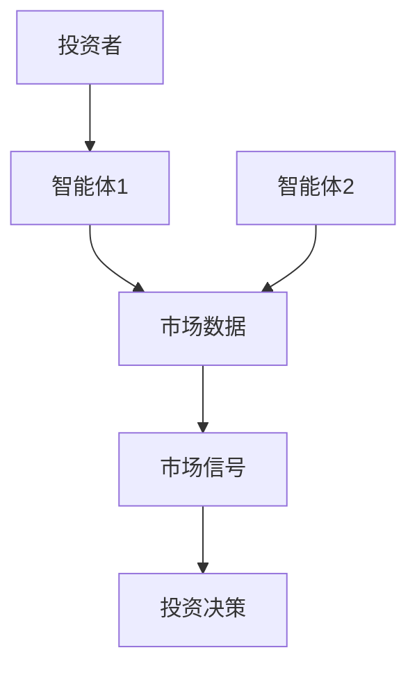
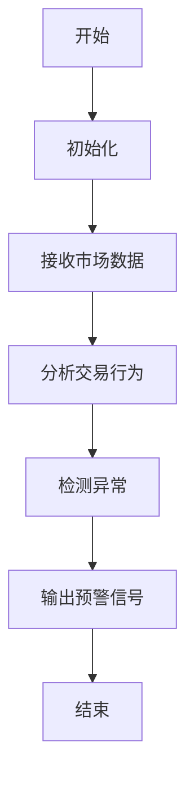
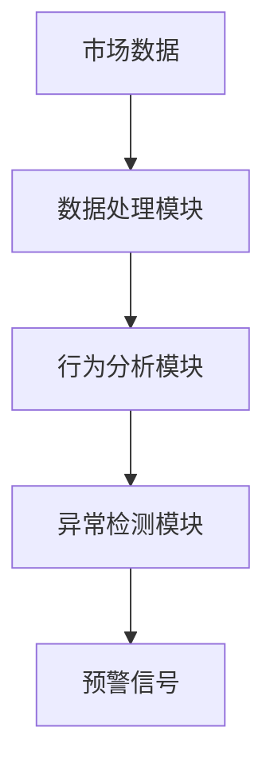
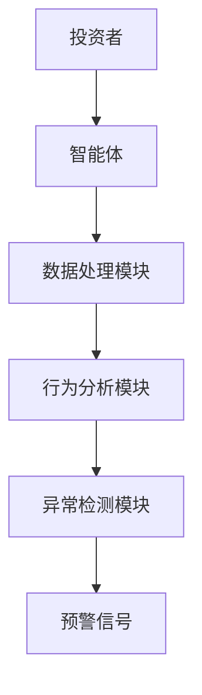

                 


# 多智能体系统增强价值投资的市场微观结构异常预警

> 关键词：多智能体系统，价值投资，市场微观结构，异常预警，强化学习，博弈论，数学模型

## 摘要

在金融市场中，价值投资是一种长期有效的投资策略，但其面临的市场微观结构异常（如闪崩、操纵等）却常常导致投资损失。多智能体系统通过模拟市场参与者的决策过程，能够实时捕捉市场异常信号，为价值投资者提供预警。本文系统地介绍了多智能体系统的核心概念、算法原理及其在价值投资中的应用，构建了基于强化学习和博弈论的多智能体模型，并通过实际案例展示了其在市场微观结构异常预警中的优势。

---

## 第1章: 多智能体系统与价值投资的背景

### 1.1 多智能体系统的定义与特点

#### 1.1.1 多智能体系统的定义

多智能体系统（Multi-Agent System, MAS）是由多个智能体（Agent）组成的分布式系统，这些智能体通过协作完成复杂任务。每个智能体具有自主性、反应性和社会性等特征，能够感知环境、做出决策并与其他智能体交互。

#### 1.1.2 多智能体系统的特性

| 特性 | 描述 |
|------|------|
| 自主性 | 智能体能够自主决策，无需外部控制 |
| 反应性 | 智能体能够实时感知环境并做出反应 |
| 社会性 | 智能体之间能够协作和竞争 |
| 分布性 | 智能体分布于不同的空间或时间 |

#### 1.1.3 多智能体系统与传统单智能体系统的区别

在单智能体系统中，决策过程集中于一个中心节点，而多智能体系统中，决策分散到多个智能体，通过协作完成任务。

### 1.2 价值投资的核心概念

#### 1.2.1 价值投资的定义

价值投资是一种投资策略，通过分析企业的基本面，寻找市场价格低于其内在价值的股票进行投资。其核心思想是“买入便宜的东西”。

#### 1.2.2 价值投资的基本原理

价值投资的原理基于市场有效性的不足，认为市场价格会偏离其内在价值，投资者可以通过深入分析找到被低估的资产。

#### 1.2.3 价值投资与市场微观结构的关系

市场微观结构影响资产价格的形成机制，价值投资者需要关注市场结构中的异常现象，以避免投资损失。

### 1.3 市场微观结构异常的定义与分类

#### 1.3.1 市场微观结构的定义

市场微观结构指的是市场的参与主体（如投资者、交易商）及其交易行为所构成的复杂系统。

#### 1.3.2 微观结构异常的表现形式

| 异常类型 | 描述 |
|----------|------|
| 市场操纵 | 某些主体通过虚假交易 manipulate 价格 |
| 闪崩 | 突然的、无明显原因的价格暴跌 |
| 流动性枯竭 | 市场交易量急剧下降，影响价格形成 |

#### 1.3.3 异常的分类与影响

市场微观结构异常通常分为结构性异常和事件性异常。结构性异常是由于市场机制设计不合理导致的，而事件性异常则是由突发事件引发。

### 1.4 多智能体系统在金融领域的应用前景

#### 1.4.1 多智能体系统在金融中的潜在应用领域

| 应用领域 | 描述 |
|----------|------|
| 交易自动化 | 智能体自动执行交易策略 |
| 风险管理 | 智能体实时监控市场风险 |
| 异常检测 | 智能体识别市场异常信号 |

#### 1.4.2 价值投资与多智能体系统的结合

多智能体系统可以模拟市场参与者的决策行为，帮助价值投资者识别潜在的投资机会。

#### 1.4.3 市场微观结构异常预警的挑战与机遇

多智能体系统通过实时监控市场行为，能够提前发现异常信号，为价值投资者提供预警。

---

## 第2章: 多智能体系统与价值投资的核心概念

### 2.1 多智能体系统的组成与功能

#### 2.1.1 实体关系图（ER图）：多智能体系统的核心要素

```mermaid
erd
  entity: MarketAgent
  entity: TradingBehavior
  entity: MarketData
  relation: MarketAgent -o[参与]-> TradingBehavior
  relation: TradingBehavior -o[产生]-> MarketData
```

#### 2.1.2 多智能体系统与价值投资的交互关系



#### 2.1.3 多智能体系统的功能模块划分

| 功能模块 | 描述 |
|----------|------|
| 数据采集 | 从市场获取实时数据 |
| 行为分析 | 分析市场参与者的交易行为 |
| 异常检测 | 识别市场微观结构中的异常信号 |

### 2.2 价值投资与多智能体系统的结合原理

#### 2.2.1 价值投资的决策过程

价值投资者通过分析企业的财务指标、行业地位等，寻找市场价格低于内在价值的股票。

#### 2.2.2 多智能体系统在价值投资中的角色

多智能体系统可以模拟不同投资者的行为，帮助价值投资者预测市场走势。

#### 2.2.3 价值投资与多智能体系统的协同机制

多智能体系统通过实时监控市场行为，为价值投资者提供动态的市场信息。

### 2.3 多智能体系统在市场微观结构异常预警中的作用

#### 2.3.1 微观结构异常的识别与预警

多智能体系统能够通过分析市场数据，识别潜在的异常信号。

#### 2.3.2 多智能体系统在异常预警中的优势

| 优势 | 描述 |
|------|------|
| 实时性 | 智能体能够实时监控市场数据 |
| 分布式 | 多个智能体协同工作，提高预警的准确性 |

---

## 第3章: 多智能体系统的算法原理

### 3.1 基于强化学习的多智能体算法

#### 3.1.1 强化学习的基本原理

强化学习是一种机器学习方法，通过智能体与环境的交互，学习最优策略。

#### 3.1.2 多智能体强化学习的挑战与解决方案

| 挑战 | 解决方案 |
|------|----------|
| 竞争与协作 | 使用价值函数分解方法 |

#### 3.1.3 多智能体算法的数学模型

$$ Q(s, a) = r + \gamma \max_{a'} Q(s', a') $$

### 3.2 多智能体系统的博弈论模型

#### 3.2.1 博弈论的基本概念

博弈论研究的是理性主体之间的策略互动。

#### 3.2.2 多智能体系统的博弈模型构建

| 元素 | 描述 |
|------|------|
| 状态 | 当前市场状态 |
| 行动 | 市场参与者的交易行为 |

#### 3.2.3 博弈论在异常预警中的应用

博弈论可以帮助智能体预测其他市场的参与者的行为。

### 3.3 多智能体系统的核心算法实现

#### 3.3.1 算法流程图



#### 3.3.2 算法实现的Python代码示例

```python
class MarketAgent:
    def __init__(self, id):
        self.id = id
        self.data = []
    
    def receive_data(self, data):
        self.data.append(data)
    
    def analyze_behavior(self):
        # 分析交易行为
        pass
    
    def detect_abnormal(self):
        # 检测异常
        pass

class TradingBehavior:
    def __init__(self, agent):
        self.agent = agent
    
    def execute_trade(self, signal):
        # 执行交易
        pass
```

---

## 第4章: 价值投资与多智能体系统的数学模型

### 4.1 价值投资的数学模型

#### 4.1.1 CAPM模型

$$ r_i = r_f + \beta_i (r_m - r_f) $$

#### 4.1.2 DCF模型

$$ V = \sum_{t=1}^n \frac{CF_t}{(1 + r)^t} $$

### 4.2 多智能体系统的数学模型

#### 4.2.1 强化学习模型

$$ Q(s, a) = r + \gamma \max_{a'} Q(s', a') $$

#### 4.2.2 博弈论模型

$$ \text{收益} = \sum_{i=1}^n \pi_i \cdot s_i $$

### 4.3 综合模型

将价值投资模型与多智能体系统模型相结合，构建综合数学模型。

---

## 第5章: 系统分析与架构设计

### 5.1 问题场景介绍

价值投资者需要实时监控市场数据，识别市场异常信号。

### 5.2 系统功能设计

| 功能模块 | 描述 |
|----------|------|
| 数据采集 | 从市场获取实时数据 |
| 行为分析 | 分析市场参与者的交易行为 |
| 异常检测 | 识别市场微观结构中的异常信号 |

### 5.3 系统架构设计



### 5.4 系统接口设计

| 接口 | 描述 |
|------|------|
| 数据接口 | 与市场数据源对接 |
| 预警接口 | 提供异常信号输出 |

### 5.5 系统交互流程图



---

## 第6章: 项目实战

### 6.1 环境安装

安装Python、TensorFlow、Keras等工具。

### 6.2 核心代码实现

```python
def detect_anomaly(data):
    # 实现异常检测算法
    pass
```

### 6.3 代码应用解读与分析

解释代码的功能和实现逻辑。

### 6.4 实际案例分析

通过具体案例展示多智能体系统的实际应用。

### 6.5 项目小结

总结项目成果和经验教训。

---

## 第7章: 总结与展望

### 7.1 最佳实践 tips

- 定期更新模型参数
- 加强数据预处理

### 7.2 小结

多智能体系统在价值投资中的应用前景广阔。

### 7.3 注意事项

- 数据隐私问题
- 算法的可解释性

### 7.4 拓展阅读

推荐相关书籍和论文。

---

## 作者

作者：AI天才研究院/AI Genius Institute & 禅与计算机程序设计艺术 /Zen And The Art of Computer Programming

---

## 参考文献

- 《算法之美》
- 《机器学习实战》
- 《多智能体系统入门》

