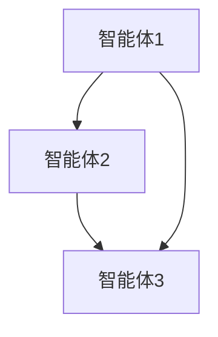
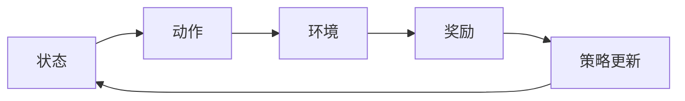

                 


# 多智能体系统增强价值投资的市场情绪传导分析

## 关键词
多智能体系统, 市场情绪传导, 价值投资, 投资策略优化, 情绪传播模型

## 摘要
本文从多智能体系统的角度，深入探讨了市场情绪传导在价值投资中的应用。通过分析多智能体系统的基本原理和市场情绪传导的数学模型，提出了基于强化学习的投资决策算法，并设计了完整的系统架构。通过具体案例分析，验证了多智能体系统在增强价值投资中的有效性，并总结了相关经验。

---

# 第1章: 多智能体系统与价值投资概述

## 1.1 多智能体系统的基本概念

### 1.1.1 多智能体系统的定义与特点
多智能体系统（Multi-Agent System, MAS）是由多个相互作用的智能体组成的系统，每个智能体都有一定的自主性、反应性和协作能力。其特点包括：
1. **分布式性**：智能体分布在不同的空间或时间维度上。
2. **自主性**：智能体能够自主决策，无需外部干预。
3. **反应性**：智能体能够根据环境变化调整自身行为。
4. **协作性**：智能体之间通过通信和协作完成共同目标。

### 1.1.2 多智能体系统的核心要素与组成
1. **智能体**：系统的基本单元，具有感知、决策、执行能力。
2. **环境**：智能体所处的外部世界，包括其他智能体和静态环境。
3. **通信机制**：智能体之间信息传递的方式，如消息传递、状态共享。
4. **协作协议**：智能体之间的合作规则，如任务分配、协调机制。

### 1.1.3 多智能体系统在金融领域的应用前景
多智能体系统在金融领域的应用广泛，包括股票交易、市场预测、风险评估等。通过模拟市场参与者的复杂行为，多智能体系统能够更准确地反映市场动态，为价值投资提供新的工具和方法。

---

## 1.2 价值投资与市场情绪的基本概念

### 1.2.1 价值投资的定义与核心理念
价值投资是一种投资策略，强调以低于内在价值的价格买入优质资产。其核心理念包括：
1. **内在价值**：资产的真实价值，独立于市场波动。
2. **安全边际**：买入价格低于内在价值，以降低风险。
3. **长期视角**：关注长期收益，而非短期波动。

### 1.2.2 市场情绪的定义与影响因素
市场情绪是投资者对市场走势的心理预期，受多种因素影响，如市场新闻、经济数据、政策变化等。市场情绪可以通过投资者行为、交易量、价格波动等指标进行衡量。

### 1.2.3 价值投资与市场情绪的关系
市场情绪对价值投资有重要影响。当市场情绪乐观时，资产价格可能被高估；当市场情绪悲观时，优质资产可能被低估。价值投资者需要结合市场情绪分析，优化投资策略。

---

## 1.3 多智能体系统增强价值投资的必要性

### 1.3.1 传统价值投资的局限性
传统价值投资依赖人工分析，存在以下问题：
1. **信息处理能力有限**：人工分析难以处理海量数据。
2. **主观性较强**：不同投资者对内在价值的判断可能不同。
3. **反应速度较慢**：面对市场快速变化，人工决策可能滞后。

### 1.3.2 多智能体系统在价值投资中的优势
多智能体系统能够通过分布式计算和协作学习，提高分析效率和准确性。其优势包括：
1. **高效信息处理**：智能体可以并行处理大量数据。
2. **动态适应性**：系统能够实时调整策略，适应市场变化。
3. **集体智慧**：多个智能体协作，提高决策质量。

### 1.3.3 市场情绪传导在价值投资中的作用
市场情绪传导是多智能体系统的核心机制之一。通过模拟市场参与者的情绪传播，可以更准确地预测市场走势，帮助投资者做出更明智的决策。

---

# 第2章: 多智能体系统与市场情绪传导的核心概念

## 2.1 多智能体系统的原理与机制

### 2.1.1 多智能体系统的通信机制
智能体之间的通信是通过消息传递完成的，消息内容包括当前状态、行动意图等。通信机制的设计直接影响系统的协作效率。

### 2.1.2 多智能体系统的协作与竞争关系
在多智能体系统中，智能体之间既有协作也有竞争。协作有助于实现共同目标，而竞争则推动系统优化。

### 2.1.3 多智能体系统的动态演化特征
系统中的智能体会根据环境反馈不断调整自身行为，形成动态演化的过程。

---

## 2.2 市场情绪传导的数学模型

### 2.2.1 情绪传播的基本模型
情绪传播可以看作一种信息扩散过程，常用图论中的网络模型来描述。

#### 情绪传播模型
$$ S_i(t+1) = \sum_{j=1}^{n} w_{ij} S_j(t) $$
其中，$S_i(t)$表示智能体i在时间t的情绪状态，$w_{ij}$表示智能体i和j之间的权重。

### 2.2.2 多智能体系统中情绪传导的网络结构
在多智能体系统中，情绪传导可以通过网络结构进行建模，常用图论中的权重矩阵表示。

#### 网络结构示意图


### 2.2.3 情绪传导的权重与影响力分析
权重反映了智能体在情绪传导中的影响力，权重越大，影响力越强。

---

## 2.3 多智能体系统与市场情绪传导的联系

### 2.3.1 多智能体系统在情绪传播中的角色
智能体既是情绪的传播者，也是情绪的接收者。通过协作，智能体可以共同影响市场情绪。

### 2.3.2 情绪传导对价值投资的反馈机制
市场情绪的变化会反向影响智能体的行为，形成一个动态的反馈循环。

### 2.3.3 系统整体行为与个体行为的关系
系统整体行为是所有个体行为的综合结果，个体行为又受到整体行为的约束和影响。

---

# 第3章: 多智能体系统增强价值投资的算法原理

## 3.1 基于多智能体的情绪传导算法

### 3.1.1 算法的基本思路
通过模拟市场参与者的互动，计算市场情绪指数，指导投资决策。

#### 情绪传导算法流程图


### 3.1.2 情绪传播的权重分配
权重分配影响情绪传导的速度和强度，常用的方法包括均匀分配和基于距离的分配。

### 3.1.3 系统状态更新的数学模型
$$ X(t+1) = f(X(t), U(t)) $$
其中，$X(t)$表示系统在时间t的状态，$U(t)$表示输入。

---

## 3.2 基于强化学习的投资决策算法

### 3.2.1 强化学习的基本原理
强化学习通过试错机制，学习最优策略，应用于投资决策中。

#### 强化学习流程图


### 3.2.2 多智能体强化学习的实现方法
通过分布式计算和异步更新，提高学习效率。

### 3.2.3 投资决策的策略优化过程
通过不断迭代，优化投资策略，提高收益。

---

## 3.3 算法实现的数学模型与公式

### 3.3.1 情绪传导的数学表达式
$$ S_i(t+1) = \sum_{j=1}^{n} w_{ij} S_j(t) $$

### 3.3.2 投资决策的优化目标函数
$$ \max_{\theta} \sum_{t=1}^{T} R_t(\theta) $$

### 3.3.3 系统状态更新的公式
$$ X(t+1) = f(X(t), U(t)) $$

---

# 第4章: 系统分析与架构设计方案

## 4.1 问题场景介绍

### 4.1.1 投资决策中的市场情绪分析
通过分析市场情绪，优化投资策略，降低风险。

### 4.1.2 多智能体系统在金融市场的应用
模拟市场参与者行为，预测市场走势。

### 4.1.3 系统设计的目标与范围
设计一个基于多智能体系统的投资决策支持平台。

---

## 4.2 系统功能设计

### 4.2.1 数据采集模块
负责采集市场数据，包括价格、成交量等。

### 4.2.2 情绪分析模块
分析市场情绪，生成情绪指数。

### 4.2.3 投资策略生成模块
基于情绪分析结果，生成投资策略。

### 4.2.4 系统监控与优化模块
监控系统运行状态，优化算法参数。

---

## 4.3 系统架构设计

### 4.3.1 系统架构图


### 4.3.2 系统接口设计
定义清晰的接口，方便模块之间的通信。

### 4.3.3 系统交互流程图


---

## 4.4 系统实现细节

### 4.4.1 系统实现的核心代码
```python
class Agent:
    def __init__(self, id):
        self.id = id
        self.state = 0
    def update(self, neighbors):
        self.state = sum(w * neighbor.state for w, neighbor in neighbors)
```

### 4.4.2 代码实现的功能解读
- `Agent`类表示智能体，`update`方法根据邻居状态更新自身状态。

---

## 4.5 系统优化与测试

### 4.5.1 系统优化策略
通过参数调整和算法优化，提高系统效率。

### 4.5.2 系统测试方法
进行单元测试和集成测试，确保系统稳定运行。

---

## 4.6 系统部署与维护

### 4.6.1 系统部署方案
将系统部署到云服务器，提供API接口供用户调用。

### 4.6.2 系统维护策略
定期更新算法，修复漏洞，优化性能。

---

# 第5章: 项目实战

## 5.1 环境安装

### 5.1.1 系统环境要求
需要安装Python、NumPy、Matplotlib等库。

### 5.1.2 安装步骤
```bash
pip install numpy matplotlib
```

---

## 5.2 系统核心实现源代码

### 5.2.1 情绪传导算法实现
```python
import numpy as np

class MAS:
    def __init__(self, size):
        self.size = size
        self.states = np.zeros(size)
        self.weights = np.ones((size, size)) / size
    def step(self):
        self.states = np.dot(self.states, self.weights)
```

### 5.2.2 投资策略生成代码
```python
def generate_strategy(market_data, states):
    # 简单策略：当情绪指数高于均值时买入
    threshold = np.mean(states)
    return [1 if s > threshold else 0 for s in states]
```

---

## 5.3 代码实现的功能解读

### 5.3.1 情绪传导算法的实现
`MAS`类模拟了多智能体系统中情绪传导的过程，`step`方法更新系统状态。

### 5.3.2 投资策略生成的实现
`generate_strategy`函数根据市场数据和情绪指数，生成投资策略。

---

## 5.4 实际案例分析

### 5.4.1 数据来源与预处理
使用历史股票数据，进行清洗和特征提取。

### 5.4.2 情绪指数计算
基于多智能体系统，计算市场情绪指数。

### 5.4.3 投资策略优化
通过回测，优化投资策略，提高收益。

---

## 5.5 项目总结

### 5.5.1 项目成果
成功开发了一个基于多智能体系统的投资决策支持平台。

### 5.5.2 经验总结
多智能体系统能够有效模拟市场情绪，提高投资决策的准确性。

### 5.5.3 项目局限性
目前的模型还比较简单，未来可以进一步优化算法和扩展功能。

---

# 第6章: 总结与展望

## 6.1 研究总结
本文通过分析多智能体系统与市场情绪传导的关系，提出了基于强化学习的投资决策算法，并设计了完整的系统架构。

## 6.2 未来展望
未来可以进一步研究更复杂的多智能体系统，如异构系统和自适应系统，同时探索更多应用场景，如风险管理、量化交易等。

---

# 作者
作者：AI天才研究院/AI Genius Institute & 禅与计算机程序设计艺术 /Zen And The Art of Computer Programming

