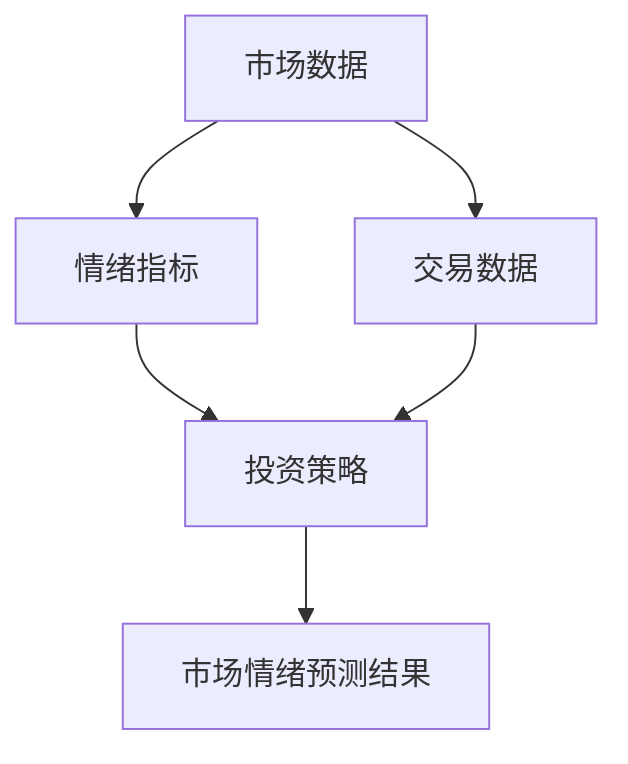

                 


# 多智能体系统增强价值投资的市场情绪预测能力

> **关键词**：多智能体系统、市场情绪预测、价值投资、协同学习、强化学习、金融数据分析  
> **摘要**：本文探讨了多智能体系统在价值投资中的应用，特别是通过增强市场情绪预测能力来优化投资决策。文章详细介绍了多智能体系统的概念、市场情绪预测的必要性，以及如何通过协同学习和强化学习算法来构建高效的预测模型。最后，通过实际案例分析，展示了多智能体系统在金融市场的优势与潜力。

---

## 第一部分：背景与概念

### 第1章：多智能体系统与价值投资概述

#### 1.1 多智能体系统的定义与特点
多智能体系统（Multi-Agent Systems, MAS）由多个智能体组成，每个智能体能够感知环境、做出决策并进行交互。其特点包括：
- **分布式性**：多个智能体协同工作，而非单一中心化系统。
- **自主性**：每个智能体具备自主决策能力。
- **协作性**：智能体之间通过通信和协作完成复杂任务。
- **反应性**：能够实时感知环境变化并做出响应。

#### 1.2 价值投资的基本原理
价值投资是一种投资策略，通过分析企业的基本面（如财务状况、行业地位）来判断其内在价值，从而在市场价格低于内在价值时进行投资。其核心理念是寻找被市场低估的机会。

#### 1.3 市场情绪预测的必要性
市场情绪是投资者对市场的整体看法，通常通过新闻、社交媒体、交易数据等反映。准确预测市场情绪可以帮助投资者识别市场波动，优化投资策略，增强决策的准确性。

---

## 第二部分：核心概念与联系

### 第2章：市场情绪预测的多智能体模型

#### 2.1 市场情绪预测的核心概念
市场情绪预测涉及多个因素，包括新闻情感分析、社交媒体 sentiment、市场交易数据等。多智能体系统能够通过分布式计算和协同学习，整合这些信息，提升预测精度。

#### 2.2 多智能体系统与市场情绪预测的联系
多智能体系统通过以下方式增强市场情绪预测能力：
- **分布式计算**：多个智能体分别处理不同类型的数据，提高计算效率。
- **协同学习**：智能体之间共享信息，优化模型参数，提升预测准确性。
- **动态适应**：根据市场变化实时调整预测策略。

#### 2.3 实体关系图：市场情绪预测的核心要素



---

## 第三部分：算法原理讲解

### 第3章：多智能体协同学习算法

#### 3.1 基于强化学习的多智能体协作机制
强化学习是一种通过试错优化决策的算法。多智能体系统中，每个智能体通过与环境和其他智能体的交互，学习最优策略。

#### 3.2 算法流程图：多智能体协同学习


#### 3.3 Python代码实现：协同学习框架

```python
import numpy as np
from tensorflow.keras import layers

# 初始化智能体
class Agent:
    def __init__(self, input_dim):
        self.model = self.build_model(input_dim)
    
    def build_model(self, input_dim):
        model = keras.Sequential()
        model.add(layers.Dense(64, activation='relu', input_dim=input_dim))
        model.add(layers.Dense(1, activation='sigmoid'))
        model.compile(optimizer='adam', loss='binary_crossentropy')
        return model

# 多智能体训练
def train_agents(agents, X, y, epochs=100):
    for agent in agents:
        agent.model.fit(X, y, epochs=epochs, verbose=0)
    return agents
```

#### 3.4 数学模型：损失函数与策略梯度
损失函数用于衡量预测与真实值的差距：
$$ L = \frac{1}{n}\sum_{i=1}^{n}(y_i - \hat{y_i})^2 $$

策略梯度用于优化智能体的决策：
$$ \nabla \theta = \sum_{i=1}^{n} \nabla \log \pi_\theta(a|s) \cdot (r - V_\theta(s)) $$

---

## 第四部分：系统分析与架构设计

### 第4章：系统架构设计方案

#### 4.1 问题场景介绍
系统目标是通过多智能体协同学习，实时预测市场情绪，辅助价值投资决策。

#### 4.2 项目介绍
项目名称：基于多智能体系统的市场情绪预测系统  
目标：提升价值投资中的市场情绪预测能力。

#### 4.3 系统功能设计
- 数据采集模块：收集市场数据、新闻、社交媒体 sentiment。
- 数据预处理模块：清洗、归一化数据。
- 模型训练模块：基于强化学习训练多智能体模型。
- 结果分析模块：输出市场情绪预测结果。

#### 4.4 系统架构图：分层架构


#### 4.5 接口设计与交互流程
API接口用于数据输入和结果输出，交互流程图展示用户与系统之间的交互步骤。

---

## 第五部分：项目实战

### 第5章：环境搭建与核心代码实现

#### 5.1 环境搭建
安装必要的库：TensorFlow、Keras、NLTK、Pandas等。

#### 5.2 核心代码实现：数据预处理与特征提取

```python
import pandas as pd
from sklearn.preprocessing import StandardScaler

# 数据预处理
def preprocess_data(df):
    df['Date'] = pd.to_datetime(df['Date'])
    df.set_index('Date', inplace=True)
    df = df.resample('D').mean()
    scaler = StandardScaler()
    df_scaled = scaler.fit_transform(df)
    return df_scaled

# 特征提取
def extract_features(data, window_size=30):
    features = []
    for i in range(window_size, len(data)):
        window = data[i-window_size:i]
        features.append(window.flatten())
    return np.array(features)
```

#### 5.3 案例分析：市场情绪预测
使用历史数据训练模型，并对当前市场数据进行预测，分析结果的有效性。

---

## 第六部分：总结与展望

### 第6章：总结与展望

#### 6.1 总结
多智能体系统通过分布式计算和协同学习，显著提升了市场情绪预测能力，为价值投资提供了有力支持。

#### 6.2 小结
文章从理论到实践，详细介绍了多智能体系统在市场情绪预测中的应用，展示了其在金融领域的潜力。

### 第7章：注意事项与拓展阅读

#### 7.1 注意事项
- 数据质量对预测结果影响重大。
- 模型调参需谨慎，避免过拟合。
- 结果验证需结合实际市场情况。

#### 7.2 拓展阅读
推荐相关书籍和论文，深入学习多智能体系统与金融分析的结合。

---

**作者：AI天才研究院/AI Genius Institute & 禅与计算机程序设计艺术 /Zen And The Art of Computer Programming**

