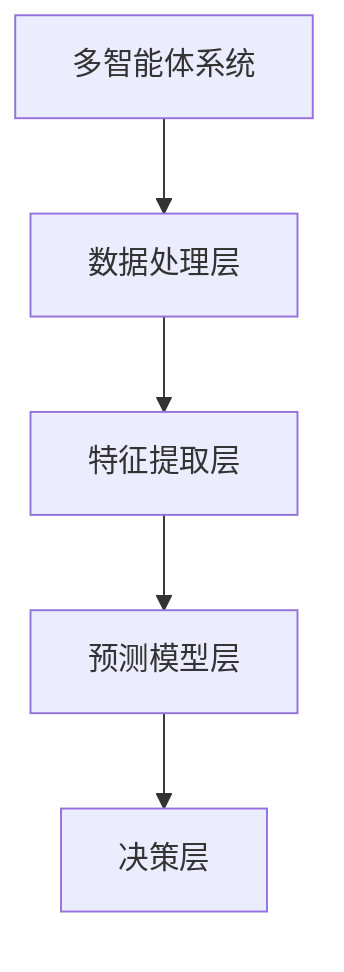
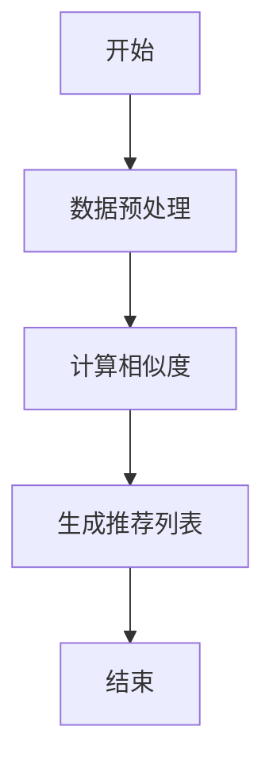
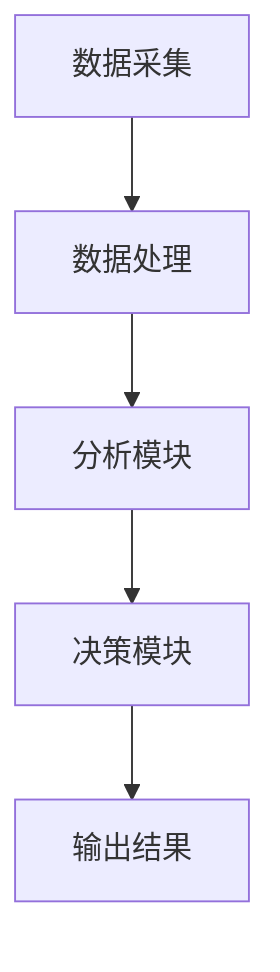
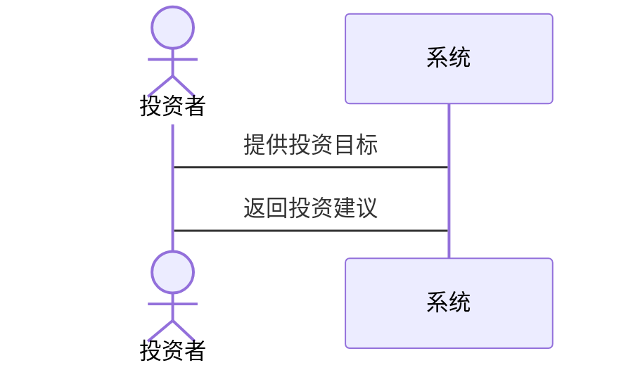

                 


# 多智能体系统增强价值投资的行业生命周期分析

## 关键词：多智能体系统，增强价值投资，行业生命周期分析，投资策略，系统架构设计，算法原理

## 摘要：本文探讨了多智能体系统在价值投资中的应用，特别是在分析和优化行业生命周期阶段的作用。通过详细讲解系统架构、算法原理和实际案例，展示了如何利用多智能体系统来提升投资决策的准确性和效率。

---

# 第一章：背景介绍

## 1.1 多智能体系统与价值投资的结合
### 1.1.1 多智能体系统的基本概念
- 多智能体系统的定义：多个智能体通过协同完成复杂任务的系统。
- 核心特征：分布式、协作性、自主性、反应性。

### 1.1.2 价值投资的基本原理
- 价值投资的定义：基于企业内在价值进行投资。
- 核心理念：长期持有优质资产，注重基本面分析。

### 1.1.3 多智能体系统如何增强价值投资
- 通过数据处理和分析优化投资决策。
- 提供实时市场反馈和风险评估。

## 1.2 行业生命周期分析的重要性
### 1.2.1 行业生命周期的四个阶段
- 初创阶段：高风险、高增长。
- 成长阶段：稳定增长。
- 成熟阶段：低速增长。
- 衰退阶段：需求下降。

### 1.2.2 不同阶段的投资策略
- 初创阶段：高风险高回报，适合风险投资者。
- 成长阶段：稳定收益，适合长期投资者。
- 成熟阶段：低风险，适合保守投资者。
- 衰退阶段：避免投资，或寻找转型机会。

---

# 第二章：多智能体系统的核心概念与联系

## 2.1 多智能体系统的组成与结构
### 2.1.1 实体关系图（ER图）
- 使用 Mermaid 绘制 ER 图，展示多智能体系统中的实体关系。

```mermaid
erDiagram
    actor 投资者 {
        <属性> 投资目标
        <属性> 风险偏好
    }
    actor 市场数据 {
        <属性> 市场指数
        <属性> 行业趋势
    }
    entity 多智能体系统 {
        <属性> 数据处理模块
        <属性> 分析模块
    }
    entity 投资决策模块 {
        <属性> 投资策略
        <属性> 风险评估
    }
    投资者 --> 多智能体系统 : 提供投资目标和偏好
    市场数据 --> 多智能体系统 : 提供市场数据
    多智能体系统 --> 投资决策模块 : 输出分析结果
```

### 2.1.2 多智能体系统的层次结构
- 使用 Mermaid 绘制层次结构图。



## 2.2 价值投资的核心要素
### 2.2.1 价值投资的核心要素对比表
| 要素 | 描述 |
|------|------|
| 内在价值 | 企业的真实价值 |
| 市场价格 | 当前市场价 |
| 安全边际 | 价格与价值的差距 |
| 长期视角 | 投资时间跨度 |

### 2.2.2 多智能体系统与价值投资的联系
- 多智能体系统用于分析行业趋势和企业基本面。
- 通过数据挖掘和机器学习优化投资决策。

---

# 第三章：多智能体系统的算法原理

## 3.1 协同过滤算法
### 3.1.1 协同过滤的定义
- 基于用户行为相似性推荐投资标的。

### 3.1.2 协同过滤的数学模型
- 使用余弦相似度计算用户相似度：
  $$ sim(u, v) = \frac{\sum_{i} (u_i - \bar{u})(v_i - \bar{v})}{\sqrt{\sum_{i} (u_i - \bar{u})^2} \sqrt{\sum_{i} (v_i - \bar{v})^2}} $$

### 3.1.3 协同过滤的流程图


## 3.2 遗传算法
### 3.2.1 遗传算法的定义
- 通过模拟生物进化过程优化投资组合。

### 3.2.2 遗传算法的步骤
1. 初始化种群。
2. 计算适应度。
3. 选择、交叉、变异。
4. 重复迭代。

### 3.2.3 遗传算法的应用
- 优化投资组合的风险和收益。

---

# 第四章：系统分析与架构设计

## 4.1 系统架构设计
### 4.1.1 系统功能模块
- 数据采集模块：收集市场数据。
- 数据处理模块：清洗和预处理数据。
- 分析模块：使用多智能体系统进行分析。
- 决策模块：生成投资策略。

### 4.1.2 系统架构图


## 4.2 接口设计与交互
### 4.2.1 系统接口设计
- API 接口定义：
  - 输入：市场数据、投资目标。
  - 输出：投资建议。

### 4.2.2 系统交互流程图


---

# 第五章：项目实战

## 5.1 环境安装
### 5.1.1 安装 Python 和相关库
- 使用 pip 安装 numpy、pandas、scikit-learn。

## 5.2 核心代码实现
### 5.2.1 协同过滤算法实现
```python
import numpy as np
from sklearn.metrics.pairwise import cosine_similarity

# 示例数据
users = ['A', 'B', 'C']
ratings = {
    'A': [4, 3, 2],
    'B': [3, 2, 4],
    'C': [2, 4, 3]
}

# 计算余弦相似度
matrix = np.array([ratings[u] for u in users])
similarity = cosine_similarity(matrix)
print(similarity)
```

### 5.2.2 遗传算法实现
```python
import random

def fitness(population):
    # 计算适应度，这里简化为随机值
    return random.random()

def evolve(population_size, genes):
    # 初始化种群
    population = [''.join(random.choices('01', k=genes)) for _ in range(population_size)]
    for _ in range(10):
        # 计算适应度
        fitness_scores = {p: fitness(p) for p in population}
        # 选择
        selected = sorted(population, key=lambda x: -fitness_scores[x])[:population_size//2]
        # 交叉
        new_population = []
        for i in range(population_size):
            parent1 = selected[i % len(selected)]
            parent2 = selected[i % len(selected) + 1]
            child = ''
            for j in range(len(parent1)):
                if random.random() < 0.5:
                    child += parent1[j]
                else:
                    child += parent2[j]
            new_population.append(child)
        population = new_population
    return population

print(evolve(5, 10))
```

## 5.3 案例分析
### 5.3.1 案例背景
- 假设分析一个处于成长阶段的行业。

### 5.3.2 分析结果解读
- 系统输出的投资建议基于协同过滤和遗传算法的结果。

---

# 第六章：最佳实践与总结

## 6.1 最佳实践
### 6.1.1 系统优化建议
- 定期更新模型参数。
- 提供多种算法选择。

### 6.1.2 风险管理策略
- 设置止损点。
- 分散投资组合。

## 6.2 小结
多智能体系统通过协同过滤和遗传算法优化投资决策，帮助投资者在不同行业生命周期阶段制定最优策略。

## 6.3 注意事项
- 数据质量和实时性影响系统表现。
- 需要定期维护和更新系统。

## 6.4 拓展阅读
推荐阅读《The Intelligent Investor》和《Multi-Agent Systems》。

---

# 结语
通过多智能体系统的应用，价值投资的分析和决策过程更加智能化和高效。未来，随着技术进步，系统将更加精准和多样化。

---

# 作者：AI天才研究院 & 禅与计算机程序设计艺术

