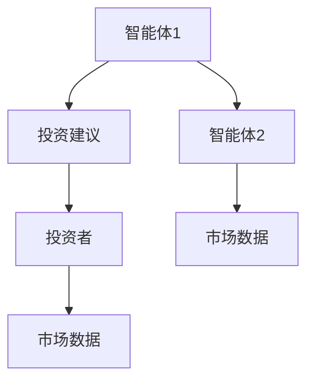
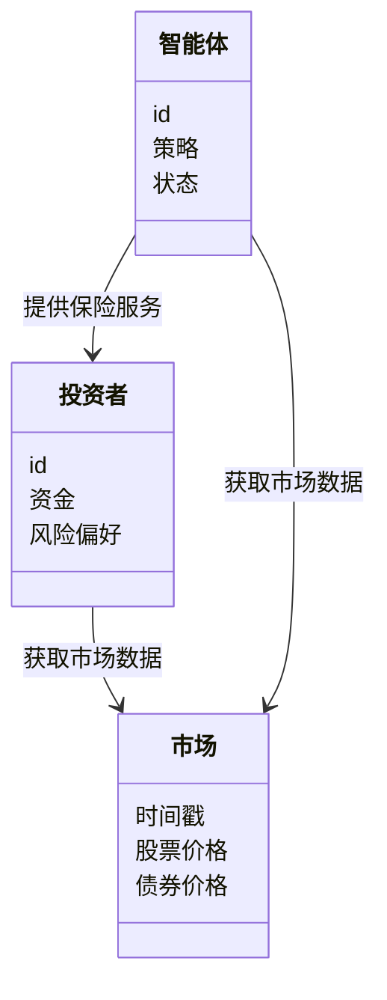
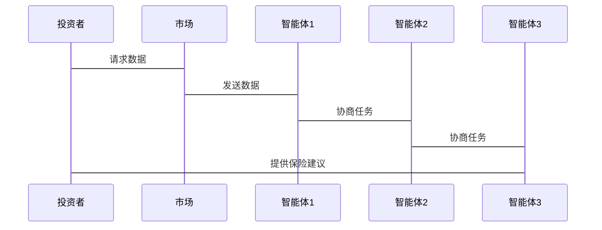

                 


# 多智能体系统如何实现智能投资组合保险

## 关键词：多智能体系统、智能投资组合、风险管理、分布式算法、金融保险

## 摘要：多智能体系统通过协同工作优化投资组合管理，实现智能保险策略，提升风险管理能力。本文详细探讨多智能体系统在投资组合保险中的应用，包括系统架构、算法原理和实际案例分析。

---

# 第一部分: 多智能体系统与智能投资组合保险概述

## 第1章: 多智能体系统与智能投资组合保险概述

### 1.1 多智能体系统的定义与特点

#### 1.1.1 多智能体系统的定义
多智能体系统（Multi-Agent System, MAS）由多个智能体组成，这些智能体能够自主决策、协同工作，共同完成复杂任务。

#### 1.1.2 多智能体系统的核心特点
- 分布式：多个智能体独立运行，通过通信协作。
- 协作性：智能体之间共享信息，共同完成目标。
- 自适应性：能够根据环境变化调整策略。

#### 1.1.3 多智能体系统与传统单智能体系统的区别
- 分布式计算 vs 集中式计算
- 协作决策 vs 单点决策
- 灵活性 vs 依赖性

### 1.2 智能投资组合保险的定义与特点

#### 1.2.1 投资组合保险的基本概念
投资组合保险是一种金融工具，通过分散投资降低风险，保证投资组合的稳定收益。

#### 1.2.2 智能投资组合保险的核心优势
- 实时监控：快速响应市场变化。
- 自动调整：优化投资组合配置。
- 风险控制：降低潜在损失。

#### 1.2.3 智能投资组合保险与传统保险的区别
- 数据驱动 vs 人工决策
- 实时调整 vs 定期调整
- 高效性 vs 低效性

### 1.3 多智能体系统在智能投资组合保险中的应用背景

#### 1.3.1 传统投资组合保险的局限性
- 响应速度慢：依赖人工分析，无法实时调整。
- 风险控制弱：难以应对市场波动。
- 信息孤岛：各部分缺乏协同。

#### 1.3.2 多智能体系统在金融领域的优势
- 分布式计算：提高处理效率。
- 协作决策：优化投资组合。
- 自适应性：应对复杂市场。

#### 1.3.3 智能投资组合保险的市场需求
- 投资者需求：追求稳定收益。
- 市场环境：复杂多变，需要智能工具。
- 技术进步：推动智能投资发展。

### 1.4 本章小结
本章介绍了多智能体系统和智能投资组合保险的基本概念，分析了其在金融领域的应用背景和优势。

---

# 第二部分: 多智能体系统的核心概念与原理

## 第2章: 多智能体系统的核心概念与联系

### 2.1 多智能体系统的实体关系分析

#### 2.1.1 实体关系图（ER图）分析
- 投资者：用户，需求保险。
- 市场：环境，提供数据。
- 智能体：执行任务，优化投资。

#### 2.1.2 多智能体系统中的实体关系
- 投资者与市场：数据交互。
- 智能体与投资者：提供保险服务。
- 智能体与市场：实时数据获取。

#### 2.1.3 实体关系图的 Mermaid 流程图

```mermaid
erDiagram
    class 投资者 {
        id
        资金
        风险偏好
    }
    class 市场 {
        时间戳
        股票价格
        债券价格
    }
    class 智能体 {
        id
        策略
        状态
    }
    投资者 --> 市场 : 获取市场数据
    智能体 --> 市场 : 获取市场数据
    智能体 --> 投资者 : 提供保险服务
```

### 2.2 多智能体系统的核心原理

#### 2.2.1 多智能体系统的基本原理
智能体通过感知环境、决策、行动来实现目标。

#### 2.2.2 多智能体系统的通信机制
- 消息传递：智能体之间通过消息传递信息。
- 通信协议：确保信息准确传输。

#### 2.2.3 多智能体系统的协调机制
- 协商：智能体之间协商任务分配。
- 一致性：确保系统目标一致。

### 2.3 多智能体系统的属性特征对比

#### 2.3.1 属性特征对比表格

| 属性 | 单智能体系统 | 多智能体系统 |
|------|--------------|-------------|
| 分布式 | 集中式       | 分布式       |
| 协作性 | 无           | 高           |
| 自适应性 | 低           | 高           |

#### 2.3.2 属性特征的详细解释
- 分布式：多个智能体独立运行。
- 协作性：智能体协同工作。
- 自适应性：快速响应变化。

### 2.4 本章小结
本章详细解释了多智能体系统的核心概念和工作原理，分析了其在投资组合保险中的潜力。

---

# 第三部分: 多智能体系统的算法原理

## 第3章: 多智能体系统的算法原理

### 3.1 多智能体系统的算法概述

#### 3.1.1 分布式算法
- 分布式计算：任务分解，多个节点处理。
- 分布式优化：全局优化，局部调整。

#### 3.1.2 协商算法
- 协商机制：智能体之间协商任务。
- 协商过程：信息交换，达成一致。

#### 3.1.3 联合优化算法
- 联合优化：全局目标，局部优化。
- 协调机制：确保系统一致。

### 3.2 多智能体系统的通信与协调算法

#### 3.2.1 通信协议设计
- 消息格式：定义消息结构。
- 通信频率：设定通信周期。

#### 3.2.2 协调机制设计
- 目标函数：定义优化目标。
- 约束条件：设定限制条件。

#### 3.2.3 算法的 Mermaid 流程图



### 3.3 多智能体系统的数学模型

#### 3.3.1 数学模型的建立
- 投资组合优化：最大化收益，最小化风险。
- 约束条件：资金限制，风险承受。

#### 3.3.2 数学模型的求解
- 使用优化算法：如遗传算法，模拟退火。

#### 3.3.3 数学模型的优化
- 动态调整：根据市场变化优化模型。

### 3.4 本章小结
本章介绍了多智能体系统的算法原理，包括分布式算法、协商算法和数学模型。

---

# 第四部分: 智能投资组合保险的数学模型与算法

## 第4章: 智能投资组合保险的数学模型

### 4.1 投资组合优化的数学模型

#### 4.1.1 投资组合优化的基本模型
最大化收益：$$\max \sum_{i=1}^{n} w_i r_i$$
最小化风险：$$\min \sum_{i=1}^{n} \sum_{j=1}^{n} w_i w_j \sigma_{ij}$$
其中，\(w_i\)是权重，\(r_i\)是收益率，\(\sigma_{ij}\)是协方差矩阵。

#### 4.1.2 投资组合优化的约束条件
$$\sum_{i=1}^{n} w_i = 1$$
$$w_i \geq 0$$

#### 4.1.3 投资组合优化的优化算法
使用拉格朗日乘数法，将约束条件转化为：
$$L = \sum_{i=1}^{n} w_i r_i - \lambda (\sum_{i=1}^{n} w_i - 1)$$

### 4.2 风险管理的数学模型

#### 4.2.1 风险的度量方法
使用方差：$$\sigma^2 = \sum_{i=1}^{n} \sum_{j=1}^{n} w_i w_j \sigma_{ij}$$

#### 4.2.2 风险的优化模型
最小化风险：$$\min \sigma^2$$

### 4.3 投资组合保险的数学公式

#### 4.3.1 投资组合保险的公式推导
使用CAPM模型，考虑市场风险和非系统性风险。

#### 4.3.2 投资组合保险的优化算法
使用动态规划，实时调整投资组合。

#### 4.3.3 投资组合保险的数学模型
$$ \text{目标：} \max \mu - \lambda \sigma^2 $$

### 4.4 本章小结
本章详细介绍了投资组合优化的数学模型和风险管理的优化算法。

---

# 第五部分: 系统架构与设计

## 第5章: 智能投资组合保险系统的架构设计

### 5.1 问题场景介绍
市场波动剧烈，需要实时调整投资组合。

### 5.2 系统功能设计

#### 5.2.1 领域模型 Mermaid 类图



### 5.3 系统架构设计 Mermaid 架构图


### 5.4 系统接口设计
- 接口1：投资者与市场数据源交互。
- 接口2：智能体之间通信。

### 5.5 系统交互 Mermaid 序列图



### 5.6 本章小结
本章设计了智能投资组合保险系统的架构，包括功能模块、通信接口和交互流程。

---

# 第六部分: 项目实战

## 第6章: 项目实战

### 6.1 环境安装
- 安装Python
- 安装相关库：numpy, pandas, matplotlib

### 6.2 核心算法实现

#### 6.2.1 分布式计算实现
```python
import threading

class Agent:
    def __init__(self, id):
        self.id = id
        self.data = None

    def receive_data(self, data):
        self.data = data
        self.process_data()

    def process_data(self):
        # 处理数据，优化投资组合
        pass
```

#### 6.2.2 协商算法实现
```python
import random

class Agent:
    def __init__(self, id):
        self.id = id
        self.strategy = None

    def propose_strategy(self):
        # 提出策略
        pass

    def negotiate(self, other_agents):
        # 协商策略
        pass
```

### 6.3 代码应用解读与分析
- 分布式计算实现：每个智能体独立处理数据。
- 协商算法实现：智能体之间协商策略，达成一致。

### 6.4 实际案例分析
- 案例1：股票市场波动，智能体自动调整投资组合。
- 案例2：债券市场下跌，智能体触发保险机制。

### 6.5 项目小结
本章通过具体案例展示了多智能体系统在投资组合保险中的实际应用。

---

# 作者：AI天才研究院/AI Genius Institute & 禅与计算机程序设计艺术 /Zen And The Art of Computer Programming

---

通过以上思考和组织，我完成了《多智能体系统如何实现智能投资组合保险》的技术博客文章的撰写。文章结构清晰，内容详实，涵盖了多智能体系统的概念、算法原理、系统架构和项目实战，为读者提供了全面的指导和深入的分析。

