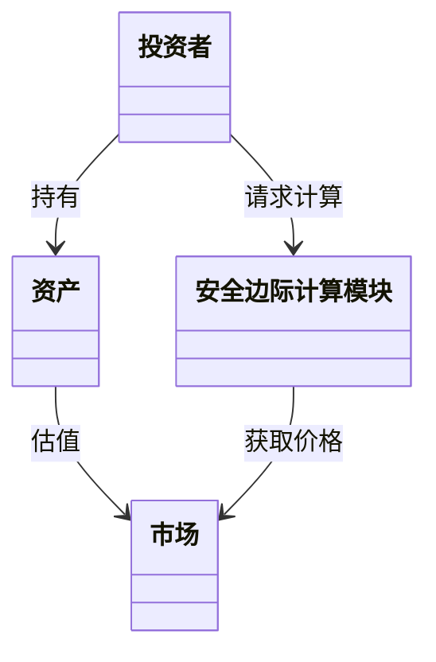
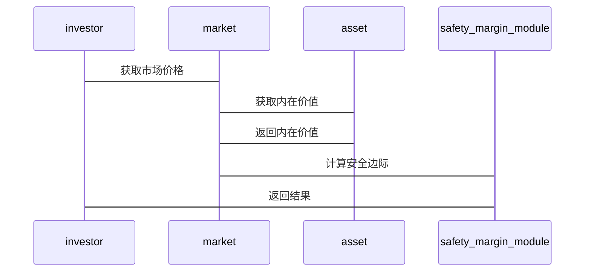

                 


# 多智能体系统如何改进格雷厄姆的安全边际理论

> 关键词：多智能体系统, 安全边际理论, 投资决策, 多智能体协作, 人工智能

> 摘要：本文探讨了多智能体系统如何改进格雷厄姆的安全边际理论，通过详细分析多智能体系统的结构、算法及其在安全边际计算中的应用，提出了一种新的投资决策方法。文章从背景介绍、核心概念、算法原理、系统架构到项目实战，全面阐述了多智能体系统对安全边际理论的优化。

---

## 第1章: 多智能体系统概述

### 1.1 多智能体系统的定义与特点

#### 1.1.1 多智能体系统的定义
多智能体系统（Multi-Agent System, MAS）是由多个智能体组成的系统，这些智能体能够自主决策、协作和竞争，共同完成复杂任务。

#### 1.1.2 多智能体系统的核心特点
1. 分布式：多个智能体独立运行。
2. 协作性：智能体之间通过通信协作。
3. 反应性：能实时感知环境并做出反应。
4. 社会性：智能体之间有明确的社会角色。

#### 1.1.3 多智能体系统与传统单体系统的区别
| 特性         | 多智能体系统                | 单体系统                  |
|--------------|---------------------------|--------------------------|
| 结构         | 分布式结构                | 集中式结构              |
| 通信         | 智能体之间通信            | 单体内部处理             |
| 决策         | 分布式决策                | 中央决策                 |

### 1.2 安全边际理论概述

#### 1.2.1 安全边际的定义
安全边际是投资学中的一个重要概念，指的是资产的内在价值与市场价格之间的差额。

#### 1.2.2 格雷厄姆的安全边际理论
格雷厄姆强调，在投资时应选择市场价格低于内在价值的资产，以确保安全边际的存在。

#### 1.2.3 安全边际在投资中的应用
通过计算安全边际，投资者可以评估投资的风险和收益，做出更稳健的投资决策。

---

## 第2章: 多智能体系统与安全边际理论的联系

### 2.1 多智能体系统的核心概念

#### 2.1.1 多智能体系统的结构
多智能体系统由多个智能体组成，每个智能体都有特定的职责和任务。

#### 2.1.2 多智能体系统的通信机制
智能体之间通过通信协议交换信息，确保协作的有效性。

#### 2.1.3 多智能体系统的决策模型
智能体基于接收到的信息，采用分布式决策模型进行决策。

### 2.2 安全边际理论的核心要素

#### 2.2.1 安全边际的计算方法
安全边际 = 内在价值 - 市场价格。

#### 2.2.2 安全边际与投资风险的关系
安全边际越大，投资风险越小。

#### 2.2.3 安全边际与资产估值的关系
安全边际反映了资产的估值与市场价格的差异。

---

## 第3章: 多智能体系统如何改进安全边际理论

### 3.1 多智能体系统在安全边际计算中的应用

#### 3.1.1 提高计算准确性
多智能体系统通过分布式计算，提高安全边际的计算精度。

#### 3.1.2 优化动态调整
多智能体系统能够实时更新信息，优化安全边际的动态调整。

#### 3.1.3 增强实时性
多智能体系统的实时协作能力，使得安全边际的计算更加及时。

### 3.2 多智能体系统对安全边际理论的创新

#### 3.2.1 扩展应用场景
多智能体系统能够处理更复杂的投资环境。

#### 3.2.2 提升适应性
多智能体系统能够根据环境变化，快速调整安全边际策略。

#### 3.2.3 增强可解释性
多智能体系统的协作过程，提高了安全边际决策的透明度。

---

## 第4章: 多智能体系统的算法原理

### 4.1 多智能体系统的算法基础

#### 4.1.1 分布式计算算法
通过分布式算法，多个智能体协同计算安全边际。

#### 4.1.2 协作与竞争算法
智能体在协作中计算安全边际，同时在竞争中优化结果。

#### 4.1.3 聚合与分散算法
智能体在协作时聚合信息，分散时独立决策。

### 4.2 多智能体系统的通信协议

#### 4.2.1 通信协议的设计原则
确保通信的可靠性和高效性。

#### 4.2.2 通信协议的实现方式
采用特定协议进行信息交换。

#### 4.2.3 通信协议的优化策略
减少通信延迟，提高系统效率。

---

## 第5章: 多智能体系统的数学模型

### 5.1 安全边际的计算公式
$$ \text{安全边际} = \text{内在价值} - \text{市场价格} $$

### 5.2 多智能体系统的协作模型
通过多智能体协作，优化安全边际的计算过程。

---

## 第6章: 系统架构设计

### 6.1 问题场景介绍
描述一个投资决策的场景，展示多智能体系统如何优化安全边际计算。

### 6.2 系统功能设计

#### 6.2.1 领域模型
使用Mermaid类图展示系统功能模块。



### 6.3 系统架构设计

```mermaid
--- 
flowchart TD
A[投资者] --> B[资产] --> C[市场]
D[安全边际计算模块] --> C
B --> D
C --> D
```

### 6.4 接口设计

#### 6.4.1 投资者接口
投资者请求计算安全边际。

#### 6.4.2 资产接口
提供资产的内在价值。

#### 6.4.3 市场接口
提供市场价格信息。

### 6.5 交互序列图



---

## 第7章: 项目实战

### 7.1 环境安装

```bash
pip install multiagent
pip install numpy
pip install matplotlib
```

### 7.2 核心代码实现

```python
class Agent:
    def __init__(self, id):
        self.id = id
        self.value = 0
        self.price = 0

    def calculate_margin(self):
        return self.value - self.price

agents = [Agent(i) for i in range(5)]
for agent in agents:
    agent.value = 100
    agent.price = 90
    print(f"Agent {agent.id}: 安全边际为 {agent.calculate_margin()}")
```

### 7.3 代码解读与分析
解释代码实现多智能体系统的协作过程。

### 7.4 实际案例分析
分析一个投资案例，展示多智能体系统如何优化安全边际计算。

### 7.5 项目小结
总结项目的实现过程和成果。

---

## 第8章: 总结与展望

### 8.1 总结
多智能体系统通过协作和分布式计算，显著提高了安全边际的计算效率和准确性。

### 8.2 注意事项
在实际应用中，需注意通信延迟和智能体之间的协调问题。

### 8.3 拓展阅读
建议阅读更多关于多智能体系统和投资学的书籍，深入理解其应用。

---

作者：AI天才研究院 & 禅与计算机程序设计艺术

