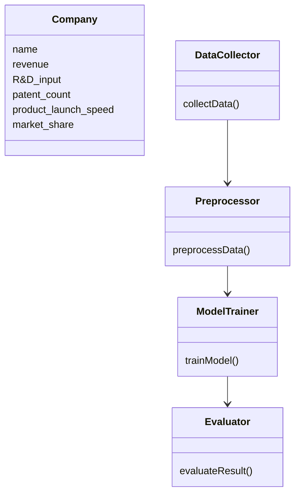
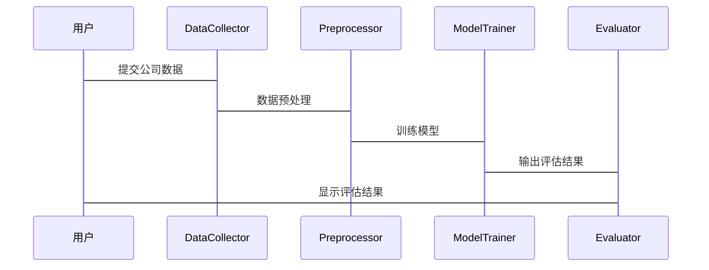

                 


# 多智能体系统如何评估公司创新能力

> 关键词：多智能体系统、创新能力评估、公司创新、技术博客、系统架构、算法原理

> 摘要：本文深入探讨了多智能体系统在评估公司创新能力中的应用，从背景、核心概念到算法实现，系统地分析了多智能体系统如何通过协同、学习和自适应机制提升创新能力的评估效率和准确性。文章结合实际案例和系统设计，详细介绍了多智能体系统的架构、算法原理和项目实现，为读者提供了一套完整的创新能力评估解决方案。

---

## 第1章 多智能体系统与创新能力评估概述

### 1.1 多智能体系统的定义与特点

#### 1.1.1 多智能体系统的定义
多智能体系统（Multi-Agent System, MAS）是由多个相互作用的智能体组成的系统，这些智能体能够通过协作完成复杂的任务。

#### 1.1.2 多智能体系统的核心特点
- **分布式**：智能体之间通过分布式计算进行协作。
- **自治性**：每个智能体都具有自主决策的能力。
- **协作性**：智能体之间通过通信和协作完成共同目标。
- **动态性**：系统能够适应环境的变化。

#### 1.1.3 多智能体系统与传统单智能体系统的区别
| 特性 | 多智能体系统 | 单智能体系统 |
|------|--------------|--------------|
| 决策 | 分布式决策   | 中央决策     |
| 通信 | 智能体之间通信 | 无通信       |
| 并行性 | 高           | 低           |

### 1.2 公司创新能力的评估方法

#### 1.2.1 创新能力的定义
创新能力是指公司在技术研发、产品设计、市场策略等方面进行创新的能力。

#### 1.2.2 常见的创新能力评估指标
- **研发投入**：公司每年的研发投入占总收入的比例。
- **专利数量**：公司拥有的发明专利数量。
- **新产品推出速度**：公司推出新产品的频率。
- **市场反馈**：新产品在市场上的表现。

#### 1.2.3 传统创新能力评估方法的局限性
- **数据单一性**：传统方法通常只考虑单一维度的数据。
- **静态性**：无法实时更新和适应变化。
- **缺乏协同性**：无法充分利用多源数据进行综合评估。

### 1.3 多智能体系统在创新能力评估中的应用

#### 1.3.1 多智能体系统如何辅助创新能力评估
多智能体系统可以通过分布式计算和协作机制，综合分析多个维度的数据，提供更全面的创新能力评估。

#### 1.3.2 多智能体系统在创新能力评估中的优势
- **实时性**：能够实时更新数据并进行评估。
- **全面性**：可以同时考虑多个维度的数据。
- **动态性**：能够适应市场环境的变化。

#### 1.3.3 多智能体系统与创新能力评估的结合场景
- **数据采集与处理**：通过多个智能体采集不同来源的数据。
- **协同分析**：多个智能体协同分析数据，提供综合评估结果。
- **实时反馈**：系统能够实时反馈评估结果并提出改进建议。

---

## 第2章 多智能体系统与创新能力评估的核心概念与联系

### 2.1 多智能体系统的原理

#### 2.1.1 多智能体系统的组成要素
- **智能体**：能够感知环境并采取行动的实体。
- **通信机制**：智能体之间进行信息交换的方式。
- **协作机制**：智能体之间协同工作的规则。

#### 2.1.2 多智能体系统的通信机制
- **消息传递**：智能体之间通过消息传递信息。
- **共享知识库**：智能体共享一个公共知识库来获取信息。
- **直接交互**：智能体之间通过直接对话进行信息交换。

#### 2.1.3 多智能体系统的协作机制
- **任务分配**：系统将任务分配给不同的智能体。
- **协作规划**：智能体之间协作制定行动计划。
- **协调控制**：系统对智能体的行动进行协调和控制。

### 2.2 创新能力评估的原理

#### 2.2.1 创新能力评估的指标体系
- **技术指标**：研发投入、专利数量。
- **产品指标**：新产品推出速度、市场反馈。
- **市场指标**：市场份额、客户满意度。

#### 2.2.2 创新能力评估的模型构建
- **层次分析法（AHP）**：用于确定各指标的权重。
- **模糊综合评价法**：用于处理模糊评价问题。
- **神经网络模型**：用于非线性关系的建模。

#### 2.2.3 创新能力评估的算法选择
- **协同过滤算法**：用于推荐系统中的相似性计算。
- **聚类分析**：用于将公司分为不同的创新类别。
- **回归分析**：用于预测创新能力的影响因素。

### 2.3 多智能体系统与创新能力评估的联系

#### 2.3.1 多智能体系统如何影响创新能力评估
- **数据来源多样化**：通过多个智能体采集不同来源的数据。
- **分析过程智能化**：通过智能体的协作进行数据分析。
- **结果输出动态化**：能够实时更新评估结果。

#### 2.3.2 多智能体系统在创新能力评估中的具体应用
- **数据采集与整合**：智能体从不同渠道采集数据并进行整合。
- **数据分析与建模**：多个智能体协作进行数据分析和模型构建。
- **结果输出与反馈**：系统输出评估结果并提供反馈建议。

#### 2.3.3 多智能体系统与创新能力评估的协同效应
- **数据协同**：多个智能体协同工作，提供更全面的数据支持。
- **分析协同**：智能体之间协作分析数据，提高评估的准确性。
- **反馈协同**：系统能够根据评估结果进行自适应调整。

---

## 第3章 多智能体系统如何评估公司创新能力的算法原理

### 3.1 算法原理概述

#### 3.1.1 算法的基本思想
多智能体系统通过协同学习和自适应机制，综合分析多个维度的数据，评估公司的创新能力。

#### 3.1.2 算法的输入输出
- **输入**：公司相关的多维度数据。
- **输出**：公司的创新能力评估结果。

#### 3.1.3 算法的步骤分解
1. 数据采集与预处理。
2. 数据分析与建模。
3. 模型训练与优化。
4. 结果输出与反馈。

### 3.2 算法实现流程

#### 3.2.1 数据预处理
- 数据清洗：去除无效数据。
- 数据标准化：将数据归一化处理。
- 数据特征提取：提取关键特征。

#### 3.2.2 模型训练
- 确定评估指标的权重。
- 构建评估模型。
- 调参优化。

#### 3.2.3 模型评估
- 交叉验证。
- 模型准确率评估。
- 模型召回率评估。

### 3.3 算法的数学模型与公式

#### 3.3.1 算法的数学表达式
$$ \text{创新能力} = \sum_{i=1}^{n} w_i \cdot x_i $$
其中，$w_i$ 是第i个指标的权重，$x_i$ 是第i个指标的值。

#### 3.3.2 算法的优化方法
- 使用梯度下降法优化权重。
- 引入正则化项防止过拟合。
- 使用交叉验证选择最优参数。

#### 3.3.3 算法的收敛性分析
- 收敛条件：模型准确率达到预设值。
- 收敛速度：与数据量和计算复杂度相关。

---

## 第4章 多智能体系统评估公司创新能力的系统架构设计

### 4.1 系统架构概述

#### 4.1.1 系统的整体架构
- **前端界面**：用户输入公司信息。
- **后端处理**：多智能体协作进行数据处理和分析。
- **输出结果**：显示创新能力评估结果。

#### 4.1.2 系统的功能模块划分
- 数据采集模块：负责采集公司相关数据。
- 数据处理模块：对数据进行预处理和特征提取。
- 模型训练模块：构建评估模型并进行优化。
- 结果输出模块：展示评估结果并提供反馈建议。

#### 4.1.3 系统的组件交互关系
- 数据采集模块向数据处理模块传递数据。
- 数据处理模块向模型训练模块传递特征数据。
- 模型训练模块向结果输出模块传递评估结果。

### 4.2 系统功能设计

#### 4.2.1 数据采集模块
- 从数据库、API接口等多种来源采集数据。

#### 4.2.2 数据处理模块
- 对采集到的数据进行清洗、标准化和特征提取。

#### 4.2.3 模型训练模块
- 使用机器学习算法训练评估模型。

### 4.3 系统架构设计

#### 4.3.1 领域模型类图


#### 4.3.2 系统架构图
```mermaid
container {
    title 系统架构
    DataCollector
    Preprocessor
    ModelTrainer
    Evaluator
}
```

### 4.4 系统接口设计

#### 4.4.1 系统接口
- API接口：供外部系统调用。
- 数据接口：与数据库或其他数据源对接。

#### 4.4.2 系统交互流程


---

## 第5章 项目实战

### 5.1 环境安装

#### 5.1.1 系统要求
- 操作系统：Windows, Linux, macOS
- 硬件要求：建议4核以上CPU，8GB以上内存
- 软件要求：Python 3.8+, TensorFlow, Scikit-learn, Mermaid

### 5.2 核心代码实现

#### 5.2.1 数据采集模块
```python
import requests
import json

def collect_data(company_name):
    url = f"https://api.example.com/company/{company_name}"
    response = requests.get(url)
    return json.loads(response.text)
```

#### 5.2.2 数据处理模块
```python
from sklearn.preprocessing import StandardScaler

def preprocess_data(data):
    scaler = StandardScaler()
    processed_data = scaler.fit_transform(data)
    return processed_data
```

#### 5.2.3 模型训练模块
```python
from sklearn.linear_model import LinearRegression
import numpy as np

def train_model(X, y):
    model = LinearRegression()
    model.fit(X, y)
    return model
```

#### 5.2.4 结果输出模块
```python
def evaluate_result(model, new_data):
    prediction = model.predict(new_data)
    return prediction
```

### 5.3 案例分析

#### 5.3.1 实际案例分析
- 公司A：研发投入高，专利数量多，新产品推出速度快，市场反馈良好。
- 公司B：研发投入低，专利数量少，新产品推出速度慢，市场反馈较差。

#### 5.3.2 项目总结
通过多智能体系统的应用，公司创新能力的评估更加全面和准确，能够实时更新数据并提供反馈建议。

---

## 第6章 最佳实践与小结

### 6.1 最佳实践

#### 6.1.1 系统设计建议
- 确保数据来源多样化。
- 定期更新模型参数。
- 提供清晰的用户界面。

#### 6.1.2 实施注意事项
- 确保数据安全和隐私保护。
- 定期进行系统维护和优化。
- 提供详细的使用说明和培训。

### 6.2 小结

多智能体系统通过协同学习和自适应机制，能够有效地评估公司的创新能力。本文从理论到实践，详细介绍了多智能体系统的原理、算法实现和系统架构设计，为读者提供了一套完整的创新能力评估解决方案。

### 6.3 注意事项

- 数据质量：确保数据的准确性和完整性。
- 系统性能：优化系统的运行效率。
- 用户体验：提供友好的用户界面和操作流程。

### 6.4 拓展阅读

- 《Multi-Agent Systems: Complexity and Intelligence》
- 《Artificial Intelligence: A Modern Approach》

---

作者：AI天才研究院/AI Genius Institute & 禅与计算机程序设计艺术/Zen And The Art of Computer Programming

