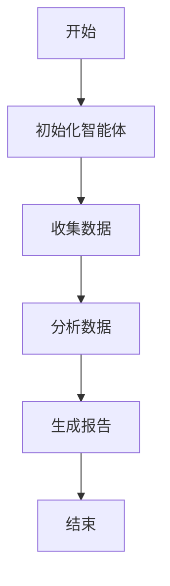
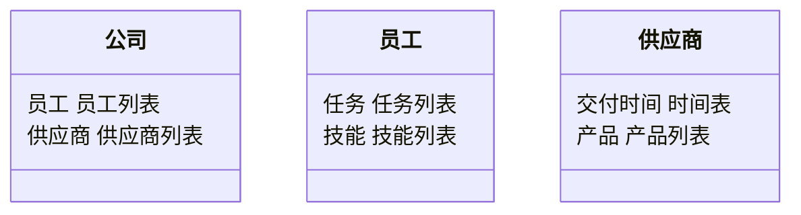
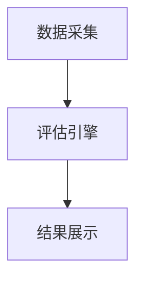
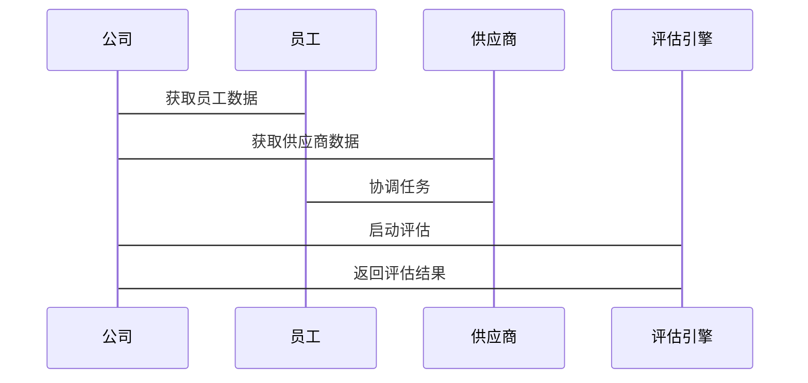

                 


# 多智能体系统如何评估公司的数字化转型能力

## 关键词
多智能体系统, 数字化转型, 企业能力评估, 多智能体协同, 数字化能力评估模型

## 摘要
随着数字化转型的深入推进，企业需要一种高效、智能的方法来评估其数字化能力。多智能体系统作为一种分布式、协作式的计算范式，为企业提供了一种新的评估方法。本文将详细探讨多智能体系统如何评估公司的数字化转型能力，包括核心概念、算法原理、系统架构设计、项目实战及最佳实践。

---

# 第1章 多智能体系统与数字化转型概述

## 1.1 多智能体系统的基本概念

### 1.1.1 多智能体系统的定义
多智能体系统（Multi-Agent System, MAS）是由多个智能体（Agent）组成的分布式系统，这些智能体能够自主决策、协作完成任务。每个智能体都有自己的目标、知识和行为规则。

### 1.1.2 多智能体系统的特点
- **自主性**：智能体能够独立决策。
- **反应性**：智能体能够感知环境并实时响应。
- **协作性**：多个智能体协同完成复杂任务。
- **分布性**：智能体分布在不同的物理或逻辑位置。

### 1.1.3 多智能体系统与单智能体系统的区别
| 属性 | 单智能体系统 | 多智能体系统 |
|------|-------------|-------------|
| 决策 | 中央决策 | 分布式决策 |
| 协作 | 无协作 | 高度协作 |
| 复杂性 | 低 | 高 |

---

## 1.2 数字化转型的定义与重要性

### 1.2.1 数字化转型的定义
数字化转型是指将企业的业务流程、组织结构、文化等各个方面通过数字技术进行重构和优化的过程。

### 1.2.2 数字化转型对企业的影响
- **提升效率**：通过自动化减少人工干预。
- **增强客户体验**：提供个性化的服务。
- **创新驱动增长**：通过数据驱动决策。

### 1.2.3 数字化转型的关键领域
1. **业务流程自动化**：优化企业运营效率。
2. **数据分析**：利用数据驱动决策。
3. **智能系统集成**：构建智能化的业务系统。

---

## 1.3 多智能体系统与数字化转型的关系

### 1.3.1 多智能体系统在数字化转型中的作用
- **分布式决策**：多智能体系统能够帮助企业在不同部门或业务单元中实现分布式决策。
- **实时协作**：智能体之间的协作能够实现实时的信息共享和任务分配。
- **灵活适应**：多智能体系统能够快速适应业务需求的变化。

### 1.3.2 多智能体系统如何提升企业数字化能力
通过多智能体系统的协同，企业能够更好地整合数据、优化流程、提升决策效率。

### 1.3.3 多智能体系统与企业数字化转型的结合案例
例如，某制造企业在供应链管理中使用多智能体系统，通过智能体实时监控库存、优化物流，显著提升了供应链效率。

---

# 第2章 多智能体系统的核心概念与联系

## 2.1 多智能体系统的组成与结构

### 2.1.1 实体与角色的定义
在企业数字化转型评估中，多智能体系统中的实体包括：
- **公司**：作为整体评估的主体。
- **员工**：执行具体任务的个体。
- **供应商**：提供资源的外部实体。
- **客户**：需求的来源。

### 2.1.2 实体之间的关系与交互
通过ER图可以清晰地展示各实体之间的关系。例如，公司与员工之间存在雇佣关系，公司与供应商之间存在供应链关系。

### 2.1.3 实体的属性与行为分析
每个实体都有自己的属性和行为。例如，员工的行为包括执行任务、提供反馈；供应商的属性包括交付时间、产品质量。

```mermaid
erDiagram
    actor 公司 : 实体
    actor 员工 : 实体
    actor 供应商 : 实体
    actor 客户 : 实体
    company --> 员工 : 雇佣关系
    company --> 供应商 : 供应链关系
    company --> 客户 : 服务关系
```

---

## 2.2 多智能体系统的原理与机制

### 2.2.1 多智能体系统的通信机制
智能体之间通过消息传递进行通信，消息内容包括任务分配、状态更新等。

### 2.2.2 多智能体系统的协同机制
通过协商和协作，智能体共同完成任务。例如，任务分配可以通过拍卖机制实现。

### 2.2.3 多智能体系统的决策机制
基于局部信息和全局目标，智能体自主决策，确保整体任务完成。

---

## 2.3 多智能体系统的ER实体关系图

通过ER图可以清晰展示各实体之间的关系，帮助我们更好地理解多智能体系统在企业数字化转型中的应用。

---

# 第3章 多智能体系统的算法原理

## 3.1 多智能体系统的评估模型

### 3.1.1 基于多智能体的评估模型
通过多智能体协同，构建一个评估企业数字化转型能力的模型。

### 3.1.2 评估模型的流程
1. 收集数据：从各实体收集相关信息。
2. 分析数据：通过算法分析数据，评估能力。
3. 生成报告：输出评估结果和改进建议。

---

## 3.2 评估能力的算法实现

### 3.2.1 算法原理
使用基于多智能体的协同算法，通过智能体之间的协作完成评估任务。

### 3.2.2 算法实现步骤


### 3.2.3 算法代码实现
```python
class Agent:
    def __init__(self, id):
        self.id = id
        self.data = {}
    
    def collect_data(self):
        # 收集数据
        pass
    
    def analyze(self):
        # 分析数据
        pass

class CompanyAgent(Agent):
    def __init__(self, id):
        super().__init__(id)
    
    def collect_data(self):
        self.data['employees'] = ...  # 收集员工数据
        self.data['suppliers'] = ...  # 收集供应商数据

class EmployeeAgent(Agent):
    def __init__(self, id):
        super().__init__(id)
    
    def collect_data(self):
        self.data['tasks'] = ...  # 收集任务数据

# 初始化智能体
company_agent = CompanyAgent(1)
employee_agent = EmployeeAgent(2)

# 收集数据
company_agent.collect_data()
employee_agent.collect_data()

# 分析数据
company_agent.analyze()
```

---

# 第4章 系统分析与架构设计

## 4.1 系统功能设计

### 4.1.1 领域模型类图
通过类图展示系统中的各个类及其关系。



### 4.1.2 系统架构设计
整体架构分为数据采集、评估引擎和结果展示三个部分。

### 4.1.3 系统架构图


### 4.1.4 接口设计
通过RESTful API实现各模块之间的通信。

---

## 4.2 系统交互设计

### 4.2.1 交互流程


### 4.2.2 交互图
通过交互图展示系统中各组件之间的协作过程。

---

# 第5章 项目实战

## 5.1 环境安装

### 5.1.1 安装Python
确保安装了Python 3.8及以上版本。

### 5.1.2 安装依赖库
安装必要的库，如`mermaid`、`graphviz`等。

---

## 5.2 核心代码实现

### 5.2.1 多智能体系统实现
```python
class Agent:
    def __init__(self, id):
        self.id = id
        self.data = {}
    
    def collect_data(self):
        pass
    
    def analyze(self):
        pass

class CompanyAgent(Agent):
    def __init__(self, id):
        super().__init__(id)
    
    def collect_data(self):
        self.data['employees'] = [...]  # 示例数据
        self.data['suppliers'] = [...]  # 示例数据

class EmployeeAgent(Agent):
    def __init__(self, id):
        super().__init__(id)
    
    def collect_data(self):
        self.data['tasks'] = [...]  # 示例数据

# 初始化智能体
company_agent = CompanyAgent(1)
employee_agent = EmployeeAgent(2)

# 收集数据
company_agent.collect_data()
employee_agent.collect_data()

# 分析数据
company_agent.analyze()
```

### 5.2.2 评估系统实现
```python
class EvaluationSystem:
    def __init__(self):
        self.agents = []
    
    def add_agent(self, agent):
        self.agents.append(agent)
    
    def start_evaluation(self):
        for agent in self.agents:
            agent.collect_data()
            agent.analyze()

evaluation_system = EvaluationSystem()
evaluation_system.add_agent(company_agent)
evaluation_system.add_agent(employee_agent)
evaluation_system.start_evaluation()
```

---

## 5.3 案例分析与结果解读

### 5.3.1 案例分析
以某制造企业的数字化转型评估为例，展示系统如何通过多智能体协同完成评估。

### 5.3.2 评估结果解读
根据评估结果，提出改进建议，如优化供应链管理、提升员工技能等。

---

# 第6章 最佳实践与总结

## 6.1 小结
通过多智能体系统的应用，企业能够更高效地评估数字化转型能力。

## 6.2 注意事项
- 确保数据安全。
- 合理设计智能体的协作机制。
- 定期更新评估模型。

## 6.3 拓展阅读
推荐阅读相关书籍和论文，深入理解多智能体系统的原理和应用。

---

# 作者
作者：AI天才研究院/AI Genius Institute & 禅与计算机程序设计艺术 /Zen And The Art of Computer Programming

---

这篇文章详细探讨了多智能体系统在评估公司数字化转型能力中的应用，通过理论分析、算法实现和项目实战，帮助读者全面理解相关知识。希望对您有所帮助！

