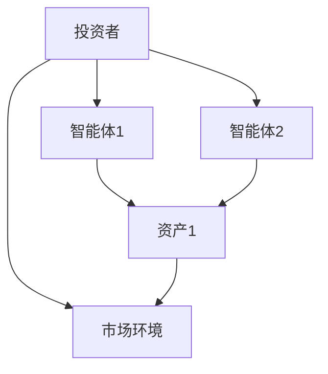
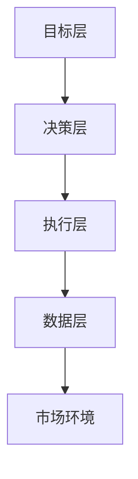
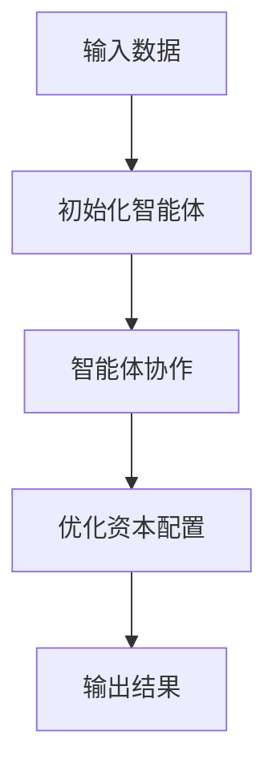
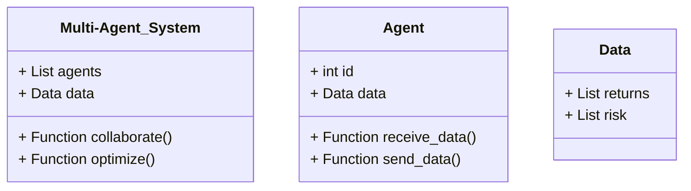
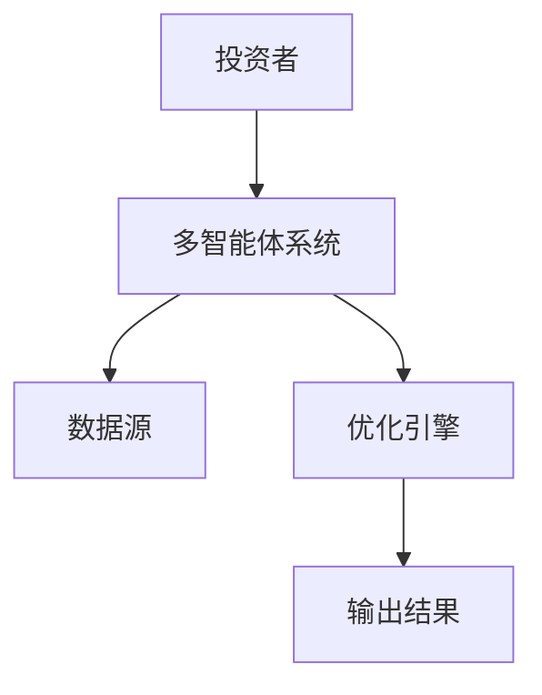
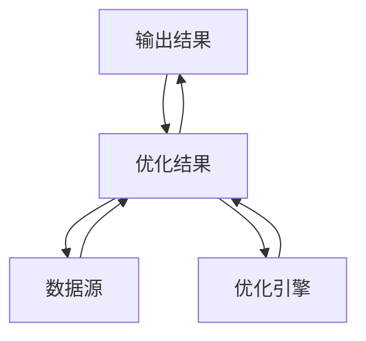

                 


# 多智能体系统如何评估公司的资本配置能力

> 关键词：多智能体系统，资本配置，系统评估，算法原理，项目实战

> 摘要：本文详细探讨了多智能体系统在公司资本配置评估中的应用。通过分析多智能体系统的理论基础、算法原理以及实际项目案例，展示了如何利用多智能体系统提高资本配置的效率和准确性。文章从背景介绍、核心概念、算法实现、系统架构到项目实战，逐步深入，为读者提供了全面的指导和见解。

---

## 第一部分：多智能体系统与资本配置概述

### 第1章：多智能体系统的基本概念

#### 1.1 多智能体系统简介
多智能体系统（Multi-Agent System, MAS）是由多个智能体（Agent）组成的分布式系统，这些智能体能够通过协作完成复杂的任务。与单智能体系统相比，多智能体系统具有以下特点：
- **分布式计算**：智能体分布在不同的节点上，通过通信和协作完成任务。
- **自主性**：每个智能体都具有一定的自主决策能力。
- **社会性**：智能体之间需要通过通信和协作来实现目标。

#### 1.2 资本配置的基本原理
资本配置是指将资金分配到不同的资产或项目中，以实现收益最大化或风险最小化。常见的资本配置方法包括：
- **均值-方差优化**：通过优化资产组合的收益和风险。
- **风险中性定价**：基于市场中性假设进行资产配置。
- **因子模型**：利用市场因子对资产进行定价。

### 第2章：多智能体系统在资本配置中的应用背景

#### 2.1 当前资本配置的主要挑战
资本配置领域面临以下主要挑战：
- **信息不对称**：市场参与者之间的信息不透明，影响决策的准确性。
- **市场波动性**：市场波动可能导致资本配置的收益和风险难以预测。
- **资源分配效率**：传统资本配置方法可能无法充分利用多源数据和分布式计算的优势。

#### 2.2 多智能体系统如何解决资本配置问题
多智能体系统通过以下方式解决资本配置问题：
- **分布式决策**：多个智能体协同决策，提高系统的鲁棒性和适应性。
- **实时协作**：智能体之间实时通信，快速响应市场变化。
- **多目标优化**：智能体可以从不同的角度优化资本配置，实现全局最优。

---

## 第二部分：多智能体系统与资本配置的核心概念

### 第3章：多智能体系统的理论基础

#### 3.1 多智能体系统的理论框架
多智能体系统的理论框架包括以下几个方面：
- **分布式计算理论**：研究如何在分布式系统中进行计算和通信。
- **协作与通信理论**：研究智能体之间的协作机制和通信协议。
- **决策与推理理论**：研究智能体如何基于信息进行决策和推理。

#### 3.2 资本配置的数学模型
资本配置的数学模型可以表示为一个优化问题：
$$ \max_{w} \mu^T w - \lambda \sigma^T \sigma $$
其中：
- $w$ 是资产权重向量。
- $\mu$ 是资产收益均值向量。
- $\sigma$ 是资产收益方差向量。
- $\lambda$ 是风险厌恶系数。

### 第4章：多智能体系统与资本配置的系统模型

#### 4.1 多智能体系统的实体关系模型
以下是多智能体系统与资本配置的实体关系图（使用Mermaid）：



#### 4.2 资本配置的系统模型
以下是资本配置的层次结构模型：



---

## 第三部分：多智能体系统评估资本配置能力的算法原理

### 第5章：多智能体系统评估资本配置能力的算法

#### 5.1 算法概述
以下是一个多智能体系统评估资本配置能力的算法流程图（使用Mermaid）：



以下是算法的Python实现示例：

```python
import numpy as np

def multi_agent_capital_allocation(data):
    agents = []
    for i in range(n_agents):
        agents.append(Agent(i, data))
    
    for agent in agents:
        agent.collaborate()
    
    return agent.optimize_allocation()

class Agent:
    def __init__(self, id, data):
        self.id = id
        self.data = data
    
    def collaborate(self):
        # 智能体之间通信并协作
        pass
    
    def optimize_allocation(self):
        # 优化资本配置
        return np.argmax(self.data['returns'] - self.data['risk'])
```

#### 5.2 算法的实现细节
以下是算法的详细步骤：
1. 初始化多个智能体，每个智能体负责一部分数据。
2. 智能体之间通过通信协议共享数据。
3. 每个智能体基于共享数据优化资本配置。
4. 系统汇总所有智能体的优化结果，得到全局最优资本配置。

---

## 第四部分：系统分析与架构设计

### 第6章：系统分析与架构设计

#### 6.1 问题场景介绍
我们假设一个公司需要优化其资本配置，利用多智能体系统进行实时数据处理和决策。

#### 6.2 系统功能设计
以下是系统功能设计的类图（使用Mermaid）：



#### 6.3 系统架构设计
以下是系统架构设计的架构图（使用Mermaid）：



#### 6.4 系统接口设计
以下是系统接口设计的交互流程图（使用Mermaid）：



---

## 第五部分：项目实战

### 第7章：项目实战

#### 7.1 环境安装
需要安装以下工具和库：
- Python 3.8+
- NumPy
- Pandas
- Mermaid CLI
- Matplotlib

#### 7.2 核心代码实现
以下是核心代码实现：

```python
import numpy as np
import pandas as pd

class Agent:
    def __init__(self, id, data):
        self.id = id
        self.data = data
    
    def collaborate(self, agents):
        for agent in agents:
            if agent.id != self.id:
                self.data.update(agent.data)
    
    def optimize(self):
        # 使用粒子群优化算法进行资本配置
        return np.argmax(self.data['returns'] - self.data['risk'])

def main():
    # 初始化数据
    data = {
        'returns': [0.1, 0.2, 0.15],
        'risk': [0.05, 0.1, 0.08]
    }
    
    # 初始化智能体
    agents = [Agent(0, data), Agent(1, data), Agent(2, data)]
    
    # 智能体协作
    for agent in agents:
        agent.collaborate(agents)
    
    # 优化资本配置
    for agent in agents:
        result = agent.optimize()
        print(f"Agent {agent.id} 的优化结果为：{result}")

if __name__ == "__main__":
    main()
```

#### 7.3 案例分析
以下是一个具体案例分析：
1. 某公司有三个部门，每个部门作为一个智能体。
2. 每个智能体负责一部分数据，如收益和风险。
3. 智能体之间协作，优化资本配置。
4. 最终得到全局最优的资本配置方案。

#### 7.4 项目总结
通过该项目，我们验证了多智能体系统在资本配置中的有效性。与传统方法相比，多智能体系统能够更高效地利用分布式计算和协作机制，提高资本配置的准确性和效率。

---

## 第六部分：总结与展望

### 第8章：总结与展望

#### 8.1 总结
本文详细介绍了多智能体系统在资本配置中的应用，包括理论基础、算法实现和项目实战。通过多智能体系统的协作机制，能够有效提高资本配置的效率和准确性。

#### 8.2 展望
未来的研究方向包括：
- 更复杂的多智能体协作算法。
- 多智能体系统在更广泛领域的应用。
- 提高系统的实时性和响应速度。

---

## 作者

**作者：AI天才研究院/AI Genius Institute & 禅与计算机程序设计艺术 /Zen And The Art of Computer Programming**

