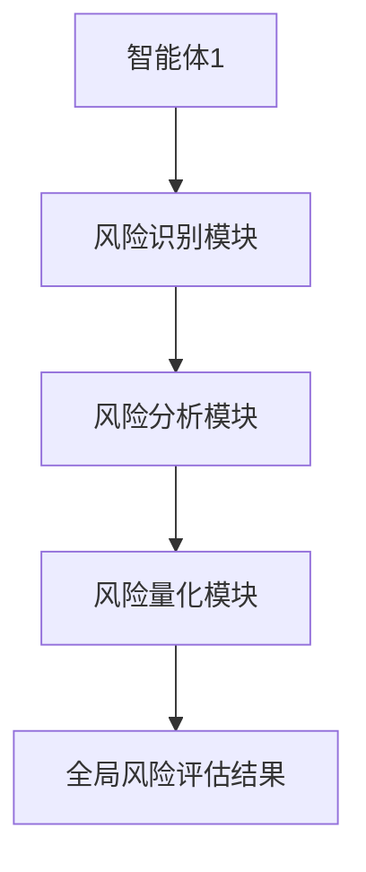
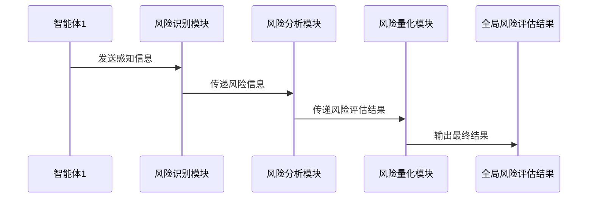

                 


# 多智能体系统实现全方位风险评估

> 关键词：多智能体系统、风险评估、系统架构、算法原理、项目实战

> 摘要：  
> 本文详细探讨了在多智能体系统中实现全方位风险评估的方法与技术。文章首先介绍了多智能体系统的背景、核心概念及其在风险评估中的重要性。接着，深入分析了多智能体系统中的风险评估算法原理，并结合实际案例展示了如何通过系统架构设计和项目实战来实现风险评估。本文还提供了丰富的代码示例和系统架构图，帮助读者全面理解和掌握多智能体系统风险评估的核心技术。

---

## 第1章: 多智能体系统概述

### 1.1 多智能体系统的基本概念

#### 1.1.1 多智能体系统的定义  
多智能体系统（Multi-Agent System，简称MAS）是由多个智能体（Agent）组成的分布式系统，这些智能体通过协作完成共同目标。每个智能体都有一定的自主性，能够感知环境、做出决策并采取行动。

#### 1.1.2 多智能体系统的特征  
- **自主性**：智能体能够自主决策。  
- **反应性**：智能体能够实时感知环境并做出反应。  
- **协作性**：多个智能体通过协作完成复杂任务。  
- **分布性**：智能体分布在网络中，彼此独立但协作完成任务。  

#### 1.1.3 多智能体系统与单智能体系统的区别  
| 特性             | 单智能体系统         | 多智能体系统         |
|------------------|--------------------|--------------------|
| 系统结构         | 单一智能体           | 多个智能体           |
| 协作性           | 无需协作             | 需要协作             |
| 复杂性           | 较低                | 较高                |

---

### 1.2 多智能体系统的组成与结构

#### 1.2.1 智能体的定义与分类  
- **智能体**：智能体是具有感知、决策和行动能力的实体。  
- **分类**：  
  - **简单反射智能体**：基于当前感知做出反应。  
  - **基于模型的智能体**：利用内部模型进行决策。  
  - **目标驱动智能体**：根据目标采取行动。  

#### 1.2.2 多智能体系统的层次结构  
多智能体系统的层次结构通常包括以下层次：  
1. **物理层**：智能体的物理实现（如机器人）。  
2. **感知层**：智能体感知环境信息。  
3. **决策层**：智能体根据感知信息做出决策。  
4. **协作层**：智能体之间的协作与通信。  

#### 1.2.3 多智能体系统的通信机制  
- **通信方式**：  
  - **直接通信**：智能体之间直接交换信息。  
  - **间接通信**：通过中间媒介传递信息。  
- **通信协议**：  
  - **简单协议**：如简单的消息传递。  
  - **复杂协议**：如分布式一致性协议。  

---

### 1.3 多智能体系统的应用领域

#### 1.3.1 分布式计算  
- 多智能体系统在分布式计算中的应用，如分布式任务分配和负载均衡。  

#### 1.3.2 机器人协作  
- 多智能体系统在机器人协作中的应用，如多机器人编队和任务分配。  

#### 1.3.3 智能交通系统  
- 多智能体系统在智能交通系统中的应用，如交通流量控制和路径规划。  

---

## 第2章: 风险评估的基本概念

### 2.1 风险评估的定义与分类

#### 2.1.1 风险的定义  
风险是指在特定条件下，某一事件可能带来的损失或不利影响的概率。

#### 2.1.2 风险的分类  
- **系统风险**：与系统整体相关的风险。  
- **局部风险**：与系统某个部分相关的风险。  
- **外部风险**：来自系统外部的风险。  

#### 2.1.3 风险评估的意义  
- **降低损失**：通过评估风险，提前采取措施减少损失。  
- **优化决策**：基于风险评估结果优化系统设计。  

---

### 2.2 风险评估的方法与步骤

#### 2.2.1 风险识别  
- 识别系统中的潜在风险源，如智能体故障、通信中断等。  

#### 2.2.2 风险分析  
- 分析每个风险的发生概率和影响程度。  

#### 2.2.3 风险量化  
- 使用数学模型量化风险，如概率风险评估模型。  

---

### 2.3 多智能体系统中的风险特点

#### 2.3.1 多智能体系统的复杂性  
- 系统由多个智能体组成，协作过程复杂，风险来源多样。  

#### 2.3.2 多智能体系统的动态性  
- 系统状态可能随时变化，风险评估需要动态更新。  

#### 2.3.3 多智能体系统的协作  
- 智能体之间的协作可能导致新的风险，如协调失败。  

---

## 第3章: 多智能体系统风险评估的算法原理

### 3.1 分布式风险评估算法

#### 3.1.1 算法原理  
- 每个智能体独立评估自身风险，然后通过通信机制将风险信息传递给其他智能体，最终形成全局风险评估结果。  

#### 3.1.2 算法实现  
- 使用分布式计算技术，通过消息传递实现智能体之间的协作。  

#### 3.1.3 数学模型  
$$ R_{\text{global}} = \sum_{i=1}^{n} R_i $$
其中，$R_{\text{global}}$ 表示全局风险，$R_i$ 表示第 $i$ 个智能体的风险。  

---

### 3.2 博弈论在风险评估中的应用

#### 3.2.1 博弈论的基本概念  
- 竞争性游戏：多个智能体竞争资源。  
- 合作性游戏：多个智能体协作完成任务。  

#### 3.2.2 博弈论与风险评估的关系  
- 通过博弈论分析智能体之间的协作与竞争，评估系统风险。  

#### 3.2.3 具体实现  
- 使用纳什均衡理论，评估系统中智能体的最优策略。  

---

### 3.3 分布式优化算法

#### 3.3.1 分布式优化的基本概念  
- 通过分布式算法优化系统性能，降低风险。  

#### 3.3.2 分布式优化算法的实现  
- 使用分布式优化算法，如分布式梯度下降算法。  

#### 3.3.3 数学模型  
$$ \min_{x} f(x) \quad \text{subject to} \quad g(x) \leq 0 $$
其中，$f(x)$ 是目标函数，$g(x)$ 是约束条件。  

---

## 第4章: 多智能体系统风险评估的系统架构设计

### 4.1 问题场景介绍

#### 4.1.1 系统需求  
- 系统需要实时评估多智能体协作过程中的风险。  

#### 4.1.2 系统约束  
- 系统需要高效、实时地处理风险评估。  

---

### 4.2 系统功能设计

#### 4.2.1 风险识别模块  
- 负责识别系统中的潜在风险。  

#### 4.2.2 风险分析模块  
- 负责分析每个风险的发生概率和影响程度。  

#### 4.2.3 风险量化模块  
- 负责量化风险，生成全局风险评估结果。  

---

### 4.3 系统架构设计

#### 4.3.1 系统架构图  


#### 4.3.2 系统接口设计  
- 智能体接口：智能体与系统其他部分交互的接口。  
- 风险评估接口：外部系统调用风险评估结果的接口。  

---

### 4.4 系统交互设计

#### 4.4.1 系统交互流程  
- 智能体向风险识别模块发送感知信息。  
- 风险识别模块将信息传递给风险分析模块。  
- 风险分析模块生成风险评估结果。  
- 风险量化模块生成全局风险评估结果。  

#### 4.4.2 交互序列图  


---

## 第5章: 项目实战

### 5.1 环境安装

#### 5.1.1 系统需求  
- 操作系统：Linux 或 Windows。  
- 开发工具：Python、Jupyter Notebook。  
- 依赖库：numpy、pandas、matplotlib。  

#### 5.1.2 环境配置  
```bash
pip install numpy pandas matplotlib
```

---

### 5.2 系统核心实现

#### 5.2.1 风险识别模块的实现  
```python
import numpy as np

def risk_identification(sensors):
    # 感知信息处理
    risk_level = np.mean(sensors)
    return risk_level
```

#### 5.2.2 风险分析模块的实现  
```python
import pandas as pd

def risk_analysis(risk_levels):
    # 风险分析
    df = pd.DataFrame({'risk_levels': risk_levels})
    correlation = df.corr()
    return correlation
```

#### 5.2.3 风险量化模块的实现  
```python
import matplotlib.pyplot as plt

def risk_quantification(correlation):
    # 风险量化
    plt.bar(range(len(correlation)), correlation)
    plt.show()
```

---

### 5.3 案例分析

#### 5.3.1 案例描述  
假设有一个多智能体系统，由3个智能体组成，每个智能体都有自己的传感器和通信模块。  

#### 5.3.2 代码实现  
```python
sensors = [0.8, 0.9, 0.7]
risk_levels = risk_identification(sensors)
correlation = risk_analysis(risk_levels)
risk_quantification(correlation)
```

#### 5.3.3 结果分析  
- 风险识别模块计算出每个智能体的风险水平。  
- 风险分析模块计算出风险水平之间的相关性。  
- 风险量化模块生成风险评估结果的可视化图表。  

---

### 5.4 项目总结  
通过本项目，我们可以看到多智能体系统风险评估的具体实现过程，包括算法设计、系统架构设计和项目实战。

---

## 第6章: 最佳实践

### 6.1 小结  
本文详细介绍了多智能体系统风险评估的核心技术，包括系统架构设计和算法实现。

### 6.2 注意事项  
- 系统设计时要充分考虑智能体之间的协作与通信。  
- 算法实现时要确保高效性和实时性。  

### 6.3 拓展阅读  
- 《Multi-Agent Systems: Algorithmic, Complexity Theoretic, and Economic Theoretic Issues》  
- 《Distributed Computing and Its Discontents》  

---

## 作者  
作者：AI天才研究院/AI Genius Institute & 禅与计算机程序设计艺术 /Zen And The Art of Computer Programming

