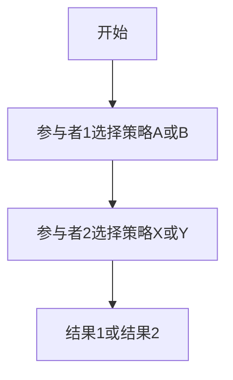
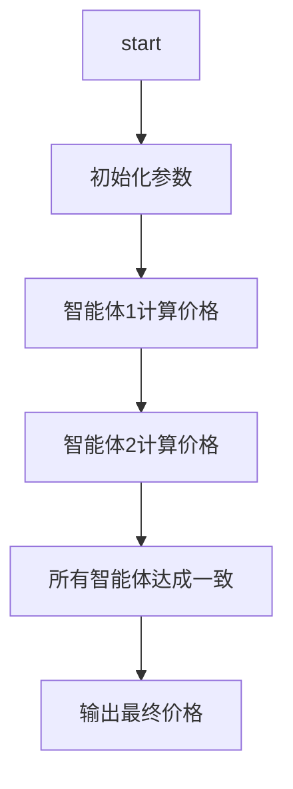
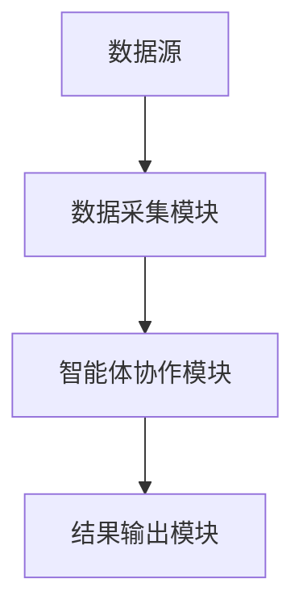

                 


# 多智能体系统实现全球资产定价

> 关键词：多智能体系统，资产定价，分布式计算，博弈论，金融建模

> 摘要：本文探讨了多智能体系统在全球资产定价中的应用，从理论基础到算法实现，结合实际案例，详细分析了多智能体系统在金融领域的优势与挑战。通过博弈论模型和分布式计算算法，本文为实现高效、准确的全球资产定价提供了新的思路。

---

## 第一部分：多智能体系统与全球资产定价背景

### 第1章：多智能体系统的基本概念

#### 1.1 多智能体系统的定义
多智能体系统（Multi-Agent System, MAS）是由多个智能体（Agent）组成的分布式系统，这些智能体能够通过交互和协作完成复杂的任务。每个智能体都是一个独立的实体，具有自主性、反应性和社会性。

#### 1.2 全球资产定价的背景
资产定价是金融领域的重要问题，传统的资产定价模型（如CAPM和APT）主要依赖于单一智能体的分析。然而，全球化市场中的复杂性要求我们采用更灵活、更分布化的定价方法。

#### 1.3 多智能体系统在资产定价中的作用
通过多智能体系统的协作，可以实现对市场参与者的行为建模，从而更准确地预测资产价格。

### 第2章：多智能体系统的核心概念

#### 2.1 智能体的结构
- **自主性**：智能体能够自主决策。
- **反应性**：智能体能够感知环境并做出反应。
- **社会性**：智能体能够与其他智能体交互和协作。

#### 2.2 智能体之间的通信机制
- **直接通信**：智能体之间通过消息传递进行交流。
- **间接通信**：通过共享数据库或消息队列进行通信。

---

## 第二部分：博弈论与资产定价

### 第3章：博弈论基础

#### 3.1 博弈论的基本概念
- **博弈**：参与者在规则下进行决策的活动。
- **策略**：参与者在博弈中的行动方案。
- **纳什均衡**：博弈中所有参与者都不再改变策略的稳定状态。

#### 3.2 纳什均衡在资产定价中的应用
通过纳什均衡，我们可以分析市场参与者的最优策略，从而预测资产价格。

### 第4章：多智能体系统中的博弈论模型

#### 4.1 博弈树分析
- **构建博弈树**：通过mermaid图展示博弈过程。
- **博弈树的分析**：通过遍历博弈树，找到纳什均衡。



---

## 第三部分：算法实现

### 第5章：分布式计算算法

#### 5.1 分布式计算的基本概念
- **分布式系统**：多个计算节点通过网络连接，协同完成任务。
- **分布式计算的特点**：高可用性、高扩展性。

#### 5.2 基于博弈论的分布式算法设计
- **算法设计思路**：通过智能体之间的协作，实现资产定价。

### 第6章：资产定价算法的实现

#### 6.1 算法流程


#### 6.2 代码实现
```python
class Agent:
    def __init__(self, id):
        self.id = id
        self.price = 0

    def calculate_price(self, data):
        # 具体定价逻辑
        pass

# 初始化智能体
agents = [Agent(i) for i in range(5)]

# 分布式计算
for agent in agents:
    agent.calculate_price(data)
```

---

## 第四部分：系统架构设计

### 第7章：系统功能设计

#### 7.1 系统功能模块
- **数据采集模块**：采集市场数据。
- **智能体协作模块**：实现智能体之间的协作。
- **结果输出模块**：输出最终资产价格。

#### 7.2 系统架构设计


### 第8章：系统接口设计

#### 8.1 接口定义
- **数据接口**：智能体之间通过API传递数据。
- **通信接口**：智能体之间的通信接口。

---

## 第五部分：项目实战

### 第9章：环境安装

#### 9.1 环境要求
- **Python 3.8以上**
- **必要的库（如numpy, pandas）**

### 第10章：代码实现

#### 10.1 核心实现
```python
import numpy as np

class MarketAgent:
    def __init__(self, id):
        self.id = id
        self.price_prediction = 0

    def predict_price(self, market_data):
        # 示例定价逻辑
        self.price_prediction = np.mean(market_data)
        return self.price_prediction

# 初始化市场数据
market_data = np.random.rand(100)

# 初始化多个智能体
agents = [MarketAgent(i) for i in range(5)]

# 分布式计算
prices = []
for agent in agents:
    prices.append(agent.predict_price(market_data))

# 输出结果
print("预测价格：", prices)
```

---

## 第六部分：总结与展望

### 第11章：总结

#### 11.1 本章小结
多智能体系统通过协作和分布式计算，能够更准确地进行全球资产定价。

### 11.2 注意事项
- 数据的实时性
- 智能体之间的通信延迟
- 系统的扩展性

### 11.3 拓展阅读
- 《Multi-Agent Systems: Complexity and Cognitive Architectures》
- 《Game Theory and Economic Modelling》

---

作者：AI天才研究院/AI Genius Institute & 禅与计算机程序设计艺术 /Zen And The Art of Computer Programming

---

这篇博客文章详细介绍了多智能体系统在全球资产定价中的应用，从理论到实践，结合具体的算法和系统设计，为读者提供了全面的视角。

