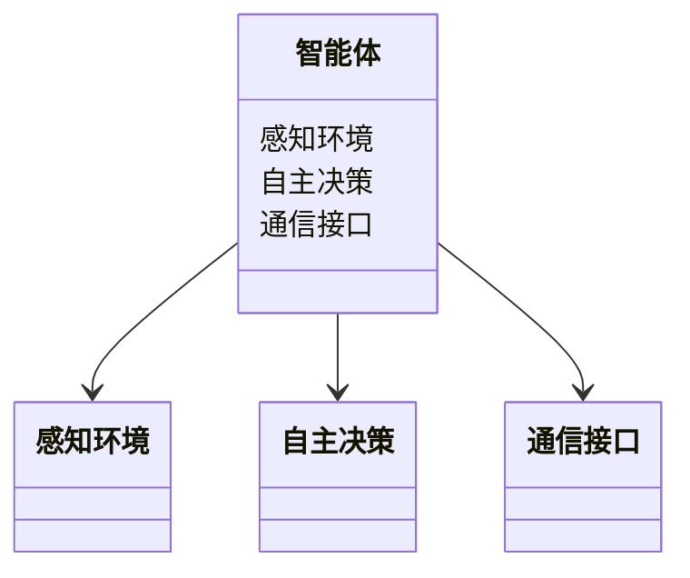
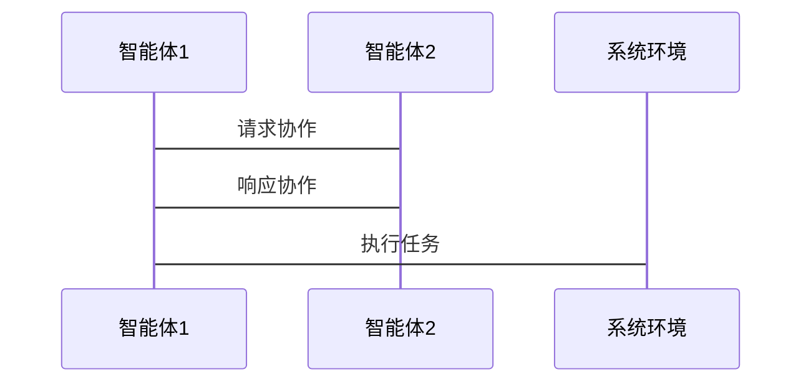

                 


# 多智能体系统实现智能化产业链分析

> 关键词：多智能体系统、智能化产业链、系统架构、分布式计算、协同优化

> 摘要：随着人工智能技术的快速发展，多智能体系统（Multi-Agent System, MAS）在智能化产业链中的应用越来越广泛。本文从多智能体系统的定义、核心概念、算法原理、系统架构、项目实战等多个方面进行详细分析，探讨多智能体系统如何实现智能化产业链的优化与协同。

---

# 第1章: 多智能体系统概述

## 1.1 多智能体系统的基本概念
### 1.1.1 多智能体系统的定义
多智能体系统是由多个智能体（Agent）组成的分布式系统，这些智能体通过协作和通信共同完成复杂任务。每个智能体都是一个能够感知环境、自主决策的实体。

### 1.1.2 多智能体系统的特点
- **分布性**：智能体分布在网络中，各自独立运行。
- **协作性**：智能体之间通过通信和协作完成共同目标。
- **自主性**：每个智能体都具备自主决策的能力。
- **动态性**：系统环境和任务需求可能动态变化。

### 1.1.3 多智能体系统与单智能体系统的区别
| 特性 | 单智能体系统 | 多智能体系统 |
|------|--------------|--------------|
| 结构  | 单一实体     | 多个实体     |
| 协作  | 无需协作     | 需要协作     |
| 通信  | 无           | 需要通信     |
| 决策  | 中央决策     | 分布式决策   |

---

## 1.2 多智能体系统的组成与结构
### 1.2.1 智能体的定义与分类
智能体是一种能够感知环境、采取行动以实现目标的实体。根据智能体的智能程度，可以分为：
- **反应式智能体**：基于当前感知做出反应。
- **认知式智能体**：具备推理和规划能力。
- **混合式智能体**：结合反应式和认知式智能体的特点。

### 1.2.2 多智能体系统的组成结构
多智能体系统通常由以下部分组成：
1. **智能体**：负责具体任务的执行。
2. **通信层**：智能体之间进行信息交换的机制。
3. **协作层**：实现智能体之间的协作与协调。
4. **环境层**：系统运行的外部环境。

### 1.2.3 多智能体系统的通信机制
智能体之间的通信可以通过以下方式进行：
- **直接通信**：智能体之间通过消息传递。
- **间接通信**：通过中间代理或共享数据库进行通信。

---

## 1.3 多智能体系统的应用领域
### 1.3.1 多智能体系统在智能制造中的应用
在智能制造中，多智能体系统可以用于设备监控、生产调度和供应链优化。

### 1.3.2 多智能体系统在供应链管理中的应用
通过多智能体系统，可以实现供应链各环节的协同优化，提高效率。

### 1.3.3 多智能体系统在金融领域的应用
在金融领域，多智能体系统可以用于风险评估、交易决策和 fraud detection。

---

## 1.4 本章小结
本章介绍了多智能体系统的定义、特点、组成结构及其在不同领域的应用。通过这些内容，我们可以理解多智能体系统在智能化产业链中的重要性。

---

# 第2章: 智能化产业链的背景与挑战

## 2.1 智能化产业链的定义与特点
### 2.1.1 智能化产业链的定义
智能化产业链是指通过智能化技术优化和重组产业链各环节，以提高效率和竞争力的产业体系。

### 2.1.2 智能化产业链的特点
- **数据驱动**：依赖大数据分析和人工智能技术。
- **协同优化**：产业链各环节协同工作，实现资源优化配置。
- **动态调整**：能够根据市场变化快速调整生产计划。

---

## 2.2 智能化产业链的现状与发展趋势
### 2.2.1 当前智能化产业链的发展现状
随着人工智能和物联网技术的快速发展，智能化产业链逐渐成为各行业的核心竞争力。

### 2.2.2 智能化产业链未来的发展趋势
未来，智能化产业链将更加注重智能化技术的深度应用和跨行业协同。

---

## 2.3 多智能体系统在智能化产业链中的作用
### 2.3.1 多智能体系统在产业链中的应用价值
- **提高效率**：通过智能体的协作，优化生产流程。
- **降低成本**：通过智能体的自主决策，减少人工干预。
- **增强灵活性**：智能体能够快速响应市场变化。

### 2.3.2 多智能体系统在产业链优化中的作用
多智能体系统可以通过实时数据共享和智能决策，优化产业链的资源配置。

### 2.3.3 多智能体系统在产业链协同中的优势
通过多智能体系统的协作机制，实现产业链各环节的高效协同。

---

## 2.4 本章小结
本章分析了智能化产业链的背景、现状和未来趋势，并重点探讨了多智能体系统在其中的作用和优势。

---

# 第3章: 多智能体系统的核心概念与联系

## 3.1 多智能体系统的原理
### 3.1.1 多智能体系统的通信机制
智能体之间的通信可以通过消息队列（Message Queue）实现。

### 3.1.2 多智能体系统的协调机制
通过协商算法（Negotiation Protocol）实现智能体之间的协作。

### 3.1.3 多智能体系统的决策机制
基于分布式计算和多智能体协同的决策模型。

---

## 3.2 多智能体系统的属性与特征
### 3.2.1 智能体的主动性与反应性
智能体能够主动感知环境并做出反应。

### 3.2.2 智能体的自主性与协作性
智能体具备自主决策能力，并能够与其他智能体协作。

### 3.2.3 智能体的动态性与适应性
智能体能够根据环境变化动态调整行为。

---

## 3.3 多智能体系统与其他技术的对比
### 3.3.1 多智能体系统与分布式系统
| 特性 | 分布式系统 | 多智能体系统 |
|------|------------|--------------|
| 数据共享 | 基于共享数据 | 基于消息传递 |
| 任务分配 | 静态分配 | 动态分配 |

### 3.3.2 多智能体系统与区块链技术
多智能体系统注重智能体的协作与通信，而区块链技术注重数据的安全与不可篡改性。

---

## 3.4 本章小结
本章深入分析了多智能体系统的核心概念、属性以及与其他技术的联系，为后续章节的分析打下基础。

---

# 第4章: 多智能体系统的算法与系统架构

## 4.1 多智能体系统的算法原理
### 4.1.1 分布式计算算法
通过分布式计算算法，实现智能体之间的任务分配和资源协调。

### 4.1.2 协调与通信算法
基于协商算法（Negotiation Protocol）实现智能体之间的协作与通信。

### 4.1.3 多智能体系统的数学模型
$$ C = \sum_{i=1}^{n} \text{Task}_i $$

---

## 4.2 多智能体系统的架构设计
### 4.2.1 领域模型设计


### 4.2.2 系统架构图


---

## 4.3 本章小结
本章通过算法和系统架构的分析，详细阐述了多智能体系统的实现原理和设计方法。

---

# 第5章: 项目实战——多智能体系统在智能制造中的应用

## 5.1 项目背景
智能制造中的多智能体系统可以用于设备监控、生产调度和供应链优化。

## 5.2 环境搭建
### 5.2.1 系统环境
- 操作系统：Linux
- 开发工具：Python、Django
- 数据库：MySQL

## 5.3 核心代码实现
```python
class Agent:
    def __init__(self, id):
        self.id = id
        self.task = None

    def perceive(self, environment):
        pass

    def decide(self):
        pass

    def communicate(self, other_agent):
        pass
```

### 代码解读
- `Agent`类：定义智能体的基本属性和方法。
- `perceive`方法：感知环境。
- `decide`方法：智能体的决策逻辑。
- `communicate`方法：与其他智能体通信。

## 5.4 系统实现
### 5.4.1 系统功能
- 任务分配
- 智能体协作
- 系统监控

### 5.4.2 系统流程


---

## 5.5 项目小结
本章通过一个具体的项目案例，详细讲解了多智能体系统在智能制造中的应用和实现过程。

---

# 第6章: 总结与展望

## 6.1 本章总结
本文从多智能体系统的定义、核心概念、算法原理、系统架构和项目实战等多个方面，详细分析了多智能体系统在智能化产业链中的应用。

## 6.2 未来展望
未来，多智能体系统将在更多领域得到广泛应用，尤其是在智能化产业链中的协同优化和动态调整方面。

---

# 作者：AI天才研究院/AI Genius Institute & 禅与计算机程序设计艺术 /Zen And The Art of Computer Programming

