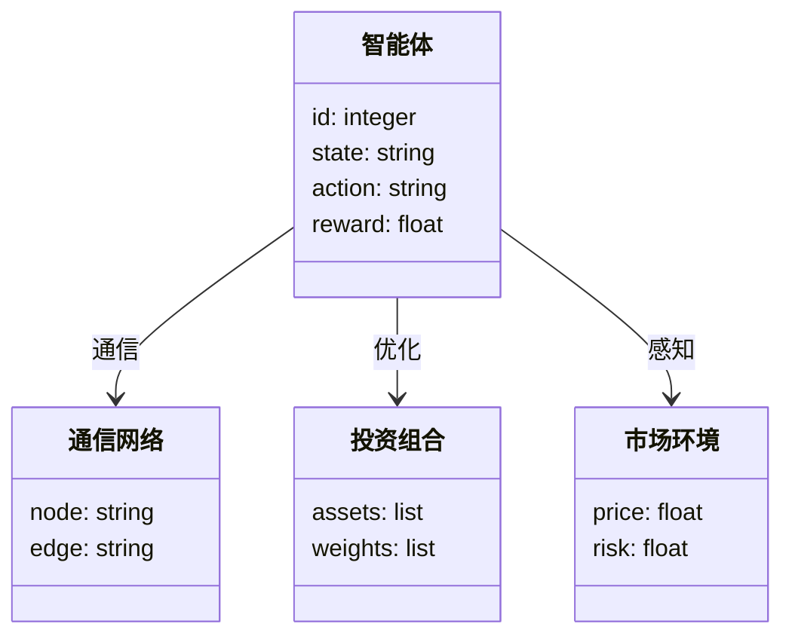
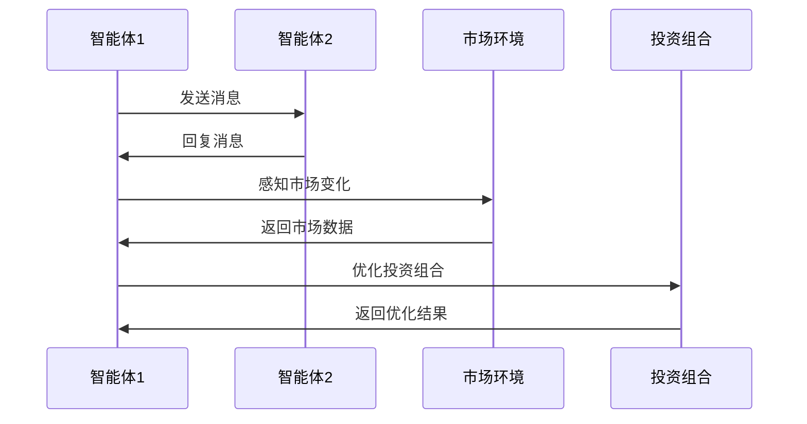

                 

<think>
好的，我将按照您的要求来撰写这篇文章。首先，我需要理解《多智能体系统实现约翰伯格指数增强》的主题，明确其核心概念和实现方法。接下来，我将按照目录大纲的结构，逐一展开每个章节的内容，确保逻辑清晰、内容详细且技术深度足够。我会使用专业的技术语言，结合实际案例和详细的算法解释，帮助读者深入理解这一复杂的主题。

### 文章标题
多智能体系统实现约翰伯格指数增强

### 关键词
多智能体系统, 约翰伯格指数增强, 金融优化, 分布式计算, 机器学习, 协作算法

### 摘要
本文系统地探讨了多智能体系统在实现约翰伯格指数增强策略中的应用。通过分析多智能体系统的通信与协作机制，结合约翰伯格指数增强的数学模型与优化方法，本文提出了一种基于多智能体系统的优化算法。该算法通过分布式计算和强化学习，显著提升了指数增强的效果。文章详细讲解了算法的实现步骤，并通过实际案例分析了系统的应用场景和优势。

### 第一部分: 多智能体系统与约翰伯格指数增强背景介绍

#### 第1章: 多智能体系统概述

##### 1.1 多智能体系统的定义与特点
###### 1.1.1 多智能体系统的定义
多智能体系统（Multi-Agent System, MAS）是由多个相互作用的智能体组成的系统，这些智能体通过通信和协作完成共同目标。智能体是具有感知、决策、推理和执行能力的实体。

###### 1.1.2 多智能体系统的核心特点
- **分布式性**：多个智能体分布在网络中，独立运行。
- **协作性**：智能体之间通过通信协作完成任务。
- **自主性**：每个智能体都具有自主决策的能力。
- **反应性**：智能体能够实时感知环境并做出反应。

###### 1.1.3 多智能体系统在金融中的应用
多智能体系统在金融领域的应用包括股票交易、风险管理、资产配置等。其分布式计算和协作能力为金融优化提供了新的思路。

##### 1.2 约翰伯格指数增强策略
###### 1.2.1 约翰伯格指数增强的定义
约翰伯格指数增强策略是一种通过优化投资组合来超越市场指数的表现的投资策略。其核心是通过主动管理来捕捉市场机会。

###### 1.2.2 约翰伯格指数增强的核心原理
- **指数跟踪**：通过复制指数的表现来获得基准收益。
- **主动增强**：通过主动投资策略获得超额收益。
- **风险控制**：通过分散投资降低风险。

###### 1.2.3 多智能体系统如何优化约翰伯格指数增强
通过多智能体系统的分布式计算和协作能力，可以实时优化投资组合，快速响应市场变化，从而提升指数增强的效果。

#### 第2章: 多智能体系统与约翰伯格指数增强的结合

##### 2.1 多智能体系统在金融领域的应用
###### 2.1.1 多智能体系统在金融中的优势
- **高效性**：分布式计算提高了处理速度。
- **协作性**：多个智能体协同工作，优化投资策略。
- **实时性**：智能体能够实时感知市场变化并做出反应。

###### 2.1.2 多智能体系统在金融中的具体应用案例
- **股票交易**：多个智能体协同决策，优化交易策略。
- **风险管理**：通过分布式计算实时监控和管理风险。

##### 2.2 约翰伯格指数增强的多智能体实现
###### 2.2.1 约翰伯格指数增强的多智能体实现思路
通过多智能体系统的分布式计算和协作能力，优化投资组合，实现指数增强。

###### 2.2.2 多智能体系统如何优化约翰伯格指数增强策略
通过智能体之间的协作，实时调整投资组合，捕捉市场机会，提升收益。

### 第二部分: 多智能体系统与约翰伯格指数增强的核心概念与联系

#### 第3章: 多智能体系统的原理与实现

##### 3.1 多智能体系统的通信与协作机制
###### 3.1.1 多智能体系统中的通信协议
智能体之间通过消息传递机制进行通信，消息格式包括动作、状态和目标等。

###### 3.1.2 多智能体系统中的协作算法
协作算法包括一致性算法、分布式共识算法等，用于智能体之间的协作与协调。

##### 3.2 多智能体系统的任务分配与决策机制
###### 3.2.1 多智能体系统的任务分配策略
根据智能体的能力和当前状态，动态分配任务，确保系统高效运行。

###### 3.2.2 多智能体系统的决策算法
基于分布式计算和协同推理，智能体共同决策最优策略。

#### 第4章: 约翰伯格指数增强的数学模型与优化方法

##### 4.1 约翰伯格指数增强的数学模型
###### 4.1.1 约翰伯格指数增强的基本公式
$$
\text{收益} = \text{指数收益} + \text{主动收益}
$$

###### 4.1.2 约翰伯格指数增强的优化目标
最大化超额收益，同时控制风险。

##### 4.2 约翰伯格指数增强的优化方法
###### 4.2.1 常见的优化算法
- **遗传算法**：通过选择、交叉和变异操作优化投资组合。
- **强化学习**：通过智能体与环境的交互，学习最优策略。

### 第三部分: 多智能体系统与约翰伯格指数增强的算法原理

#### 第5章: 多智能体系统的通信与协作算法

##### 5.1 基于图论的多智能体通信网络
###### 5.1.1 图论在多智能体通信中的应用
构建通信网络的图模型，分析节点之间的连接关系。

###### 5.1.2 多智能体通信网络的构建与优化
通过图论算法优化通信网络的结构，提高通信效率。

##### 5.2 多智能体系统的协作算法实现
###### 5.2.1 协作算法的基本原理
智能体之间通过通信协作，共同完成任务。

###### 5.2.2 协作算法的实现步骤
1. 初始化智能体状态。
2. 智能体之间通信，共享信息。
3. 根据共享信息协作决策。
4. 执行决策，调整状态。
5. 重复上述步骤，直到任务完成。

#### 第6章: 约翰伯格指数增强的优化算法

##### 6.1 基于强化学习的优化算法
###### 6.1.1 强化学习在约翰伯格指数增强中的应用
智能体通过与市场的交互，学习最优投资策略。

###### 6.1.2 强化学习算法的具体实现
使用深度强化学习框架，训练智能体在金融市场中的决策能力。

##### 6.2 基于遗传算法的优化方法
###### 6.2.1 遗传算法的基
使用遗传算法优化投资组合，寻找最优配置。

### 第四部分: 多智能体系统与约翰伯格指数增强的系统分析与架构设计

#### 第7章: 系统分析与架构设计

##### 7.1 项目场景介绍
###### 7.1.1 项目背景
在金融市场中，通过多智能体系统实现约翰伯格指数增强。

##### 7.2 系统功能设计
###### 7.2.1 领域模型Mermaid类图


##### 7.3 系统架构设计Mermaid架构图


##### 7.4 系统接口设计
###### 7.4.1 智能体接口
- `get_state()`: 获取智能体当前状态。
- `send_message(message)`: 发送消息到其他智能体。
- `make_decision()`: 基于当前状态做出决策。

##### 7.5 系统交互Mermaid序列图


### 第五部分: 多智能体系统与约翰伯格指数增强的项目实战

#### 第8章: 项目实战

##### 8.1 环境安装
安装必要的软件和库，如Python、TensorFlow、Keras等。

##### 8.2 核心代码实现
###### 8.2.1 多智能体通信接口
```python
class Agent:
    def __init__(self, id):
        self.id = id
        self.state = None
        self.action = None
        self.reward = 0.0

    def get_state(self):
        return self.state

    def send_message(self, message, agent):
        # 实现消息传递逻辑
        pass

    def make_decision(self):
        # 实现决策逻辑
        pass
```

###### 8.2.2 约翰伯格指数增强优化算法
```python
def john_burge_optimization(assets, weights):
    # 实现优化算法
    pass
```

##### 8.3 案例分析
通过具体案例，分析多智能体系统在约翰伯格指数增强中的应用效果。

### 第六部分: 总结与展望

#### 第9章: 总结与展望

##### 9.1 全文总结
总结全文内容，强调多智能体系统在约翰伯格指数增强中的应用价值。

##### 9.2 未来展望
展望未来的发展方向，提出进一步研究的建议。

### 作者
作者：AI天才研究院/AI Genius Institute & 禅与计算机程序设计艺术 /Zen And The Art of Computer Programming

---

以上是文章的大纲和部分内容，接下来我会按照这个结构详细展开每个部分，确保文章内容完整且符合您的要求。

