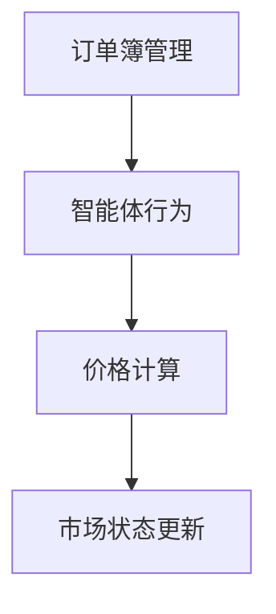
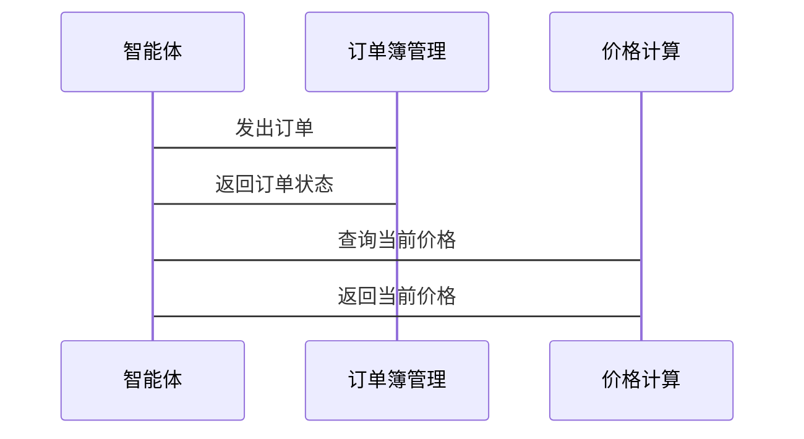

                 


# 多智能体系统模拟市场流动性

> 关键词：多智能体系统、市场流动性、金融模拟、智能体行为、市场微观结构

> 摘要：本文探讨了多智能体系统在模拟市场流动性中的应用，从基本概念、核心算法、数学模型到系统架构和项目实战，详细分析了多智能体系统如何帮助理解市场流动性的动态特征和价格形成机制。文章旨在为读者提供一个全面的视角，从理论到实践，深入理解多智能体系统在金融模拟中的潜力和应用。

---

# 第一部分：多智能体系统与市场流动性概述

## 第1章：多智能体系统基础

### 1.1 多智能体系统的定义与特点

#### 1.1.1 多智能体系统的定义
多智能体系统（Multi-Agent System, MAS）是由多个智能体组成的分布式系统，这些智能体能够通过交互和协作完成复杂的任务。每个智能体都有一定的自主性、目标和决策能力。

#### 1.1.2 多智能体系统的属性与特征
- **自主性**：每个智能体独立决策。
- **反应性**：智能体能够感知环境并实时调整行为。
- **协作性**：智能体之间通过通信和协调完成共同目标。
- **分布式性**：智能体分布在不同的位置，通过网络进行通信。

#### 1.1.3 多智能体系统与传统单智能体系统的区别
| 属性             | 单智能体系统          | 多智能体系统          |
|------------------|---------------------|---------------------|
| 结构             | 集中式              | 分布式              |
| 决策             | 单一决策中心        | 多个决策中心        |
| 通信             | 无或单向            | 高度交互            |
| 灵活性           | 较低                | 较高                |

### 1.2 市场流动性的定义与特点

#### 1.2.1 市场流动性的定义
市场流动性是指资产在市场中迅速以合理价格买卖的能力。流动性越高，买卖难度越小，价格波动越小。

#### 1.2.2 市场流动性的影响因素
- **市场深度**：订单簿中的订单量。
- **市场广度**：市场的参与者数量。
- **交易成本**：买卖价差、佣金等。
- **市场波动**：市场的波动性影响流动性。

#### 1.2.3 市场流动性在金融系统中的作用
- 提供资产定价的参考。
- 降低交易成本。
- 维持市场的稳定性和效率。

### 1.3 多智能体系统在市场流动性模拟中的应用

#### 1.3.1 多智能体系统模拟市场流动性的优势
- **分布式决策**：模拟市场中多个参与者的行为。
- **动态交互**：反映市场参与者的实时互动。
- **复杂性处理**：能够处理市场中的非线性关系。

#### 1.3.2 多智能体系统模拟市场流动性的应用场景
- **金融市场的模拟**：研究市场行为和价格波动。
- **政策制定**：模拟政策对市场流动性的影响。
- **风险管理**：评估市场的风险敞口。

#### 1.3.3 多智能体系统模拟市场流动性的研究现状
当前研究主要集中在智能体行为模型和市场价格模拟上，未来的研究方向包括复杂网络和深度学习的结合。

---

## 第2章：多智能体系统与市场流动性的核心概念

### 2.1 多智能体系统的核心概念

#### 2.1.1 智能体的定义与分类
- **定义**：智能体是具有感知、决策和行动能力的实体。
- **分类**：
  - **简单智能体**：基于当前状态做出反应。
  - **复杂智能体**：具有目标和长期规划。

#### 2.1.2 多智能体系统的架构与通信机制
- **架构类型**：
  - **反应式架构**：基于当前感知做出反应。
  - **规划式架构**：基于长期规划做出决策。
- **通信机制**：智能体之间通过消息传递进行通信。

#### 2.1.3 多智能体系统的协同与冲突
- **协同**：智能体通过协作完成共同目标。
- **冲突**：智能体之间的目标差异可能导致冲突。

### 2.2 市场流动性的核心概念

#### 2.2.1 市场深度与订单簿
- **市场深度**：订单簿中买方和卖方的订单总量。
- **订单簿**：记录所有未成交订单的结构。

#### 2.2.2 市场微观结构与价格形成
- **市场微观结构**：市场的组织形式和参与者行为规则。
- **价格形成**：买方和卖方的互动决定市场价格。

#### 2.2.3 市场流动性的动态特征
- **短期波动**：市场的短期价格波动。
- **长期趋势**：市场的长期价格走势。

### 2.3 多智能体系统与市场流动性的关系

#### 2.3.1 多智能体系统模拟市场流动性的基本原理
- 智能体模拟市场参与者的行为，通过交互影响市场流动性。

#### 2.3.2 多智能体系统在市场流动性中的角色与行为
- **投资者**：模拟市场参与者的行为。
- **做市商**：提供流动性，维护市场深度。

#### 2.3.3 多智能体系统与市场流动性的相互作用
- 智能体行为影响市场流动性，市场流动性反过来影响智能体决策。

---

## 第3章：多智能体系统模拟市场流动性的算法原理

### 3.1 基于多智能体的市场流动性模拟算法

#### 3.1.1 算法的基本框架
1. 初始化智能体和市场环境。
2. 智能体根据环境信息做出决策。
3. 智能体执行交易，更新市场状态。
4. 重复步骤2和3，直到达到终止条件。

#### 3.1.2 算法的实现步骤
- **步骤1**：定义智能体的属性和行为。
- **步骤2**：初始化市场环境。
- **步骤3**：智能体感知环境并做出决策。
- **步骤4**：执行交易，更新市场状态。

#### 3.1.3 算法的优化与改进
- **优化**：增加智能体的自主性和适应性。
- **改进**：引入机器学习算法提高决策精度。

### 3.2 市场参与者行为模型

#### 3.2.1 投资者行为模型
- **理性投资者**：基于理性决策做出交易。
- **情绪化投资者**：受情绪影响做出交易。

#### 3.2.2 市场做市商模型
- **做市商**：提供买卖双向报价，维护市场深度。

#### 3.2.3 市场订单生成机制
- **订单生成**：基于概率模型生成订单。
- **订单撤销**：智能体根据市场变化撤销订单。

### 3.3 市场价格形成机制

#### 3.3.1 市场价格的动态调整
- **价格调整**：根据买卖订单的均衡点调整价格。

#### 3.3.2 市场微观结构对价格的影响
- **订单簿状态**：订单簿的深度和分布影响价格。

#### 3.3.3 多智能体系统对价格波动的模拟
- **价格波动**：智能体的交互影响价格波动。

---

## 第4章：多智能体系统模拟市场流动性的数学模型

### 4.1 市场流动性模型

#### 4.1.1 市场深度模型
- **定义**：市场深度是订单簿中的订单总量。
- **公式**：$$ D = \sum_{i=1}^{n} O_i $$
  其中，$D$ 是市场深度，$O_i$ 是第 $i$ 个订单的大小。

#### 4.1.2 市场订单簿模型
- **订单簿状态**：记录所有未成交订单的状态。
- **订单生成概率**：基于市场环境生成订单的概率。

#### 4.1.3 市场微观结构模型
- **微观结构**：市场的组织形式和参与者行为规则。
- **模型公式**：$$ P = f(S, D) $$
  其中，$P$ 是价格，$S$ 是市场状态，$D$ 是市场深度。

---

## 第5章：多智能体系统模拟市场流动性的系统分析与架构设计

### 5.1 系统功能设计

#### 5.1.1 项目介绍
- **项目名称**：多智能体市场流动性模拟系统。
- **项目目标**：模拟市场流动性，分析市场行为。

#### 5.1.2 系统功能模块
- **订单簿管理模块**：管理订单簿的状态。
- **智能体行为模块**：模拟市场参与者的决策和交易。
- **价格计算模块**：计算市场价格。

#### 5.1.3 系统功能流程图


### 5.2 系统架构设计

#### 5.2.1 系统架构图


#### 5.2.2 系统交互流程图


---

## 第6章：多智能体系统模拟市场流动性的项目实战

### 6.1 项目环境安装

#### 6.1.1 安装Python环境
- 使用Anaconda安装Python 3.8及以上版本。

#### 6.1.2 安装依赖库
- 使用pip安装numpy、pandas、matplotlib。

### 6.2 系统核心实现

#### 6.2.1 订单生成代码
```python
import random

def generate_order(volume):
    return {
        'type': 'buy' if random.random() < 0.5 else 'sell',
        'volume': volume
    }
```

#### 6.2.2 价格计算代码
```python
def calculate_price(order_book):
    bid_volume = sum(order['volume'] for order in order_book['bids'])
    ask_volume = sum(order['volume'] for order in order_book['asks'])
    return (bid_volume + ask_volume) / 2
```

### 6.3 代码应用解读

#### 6.3.1 订单生成解读
- 生成随机订单，类型为买入或卖出，体积固定。

#### 6.3.2 价格计算解读
- 根据订单簿中的买方和卖方订单总量计算平均价格。

### 6.4 实际案例分析

#### 6.4.1 案例1：简单市场模拟
- 初始化订单簿为空。
- 生成10个订单，计算最终价格。

#### 6.4.2 案例2：复杂市场模拟
- 初始化订单簿有一定深度。
- 生成动态订单，计算价格波动。

---

## 第7章：多智能体系统模拟市场流动性的小结

### 7.1 最佳实践 tips
- **环境配置**：确保安装了必要的依赖库。
- **代码实现**：建议使用面向对象的方式设计智能体。
- **结果分析**：结合实际市场数据验证模拟结果。

### 7.2 小结
本文从理论到实践，详细探讨了多智能体系统在模拟市场流动性中的应用，通过算法和数学模型的分析，结合实际案例，展示了多智能体系统在金融模拟中的潜力。

### 7.3 注意事项
- **数据准确性**：确保输入数据的准确性。
- **模型合理性**：验证模型的合理性和有效性。
- **结果解释**：结合实际情况解释模拟结果。

### 7.4 拓展阅读
- 建议阅读相关领域的书籍和论文，深入理解市场微观结构和多智能体系统。

---

# 作者：AI天才研究院/AI Genius Institute & 禅与计算机程序设计艺术 /Zen And The Art of Computer Programming

