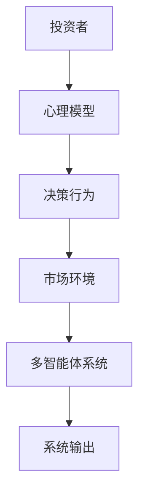
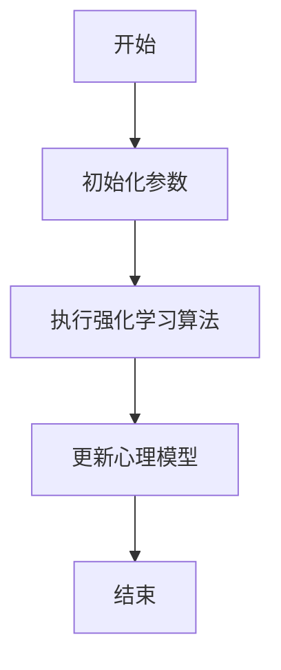
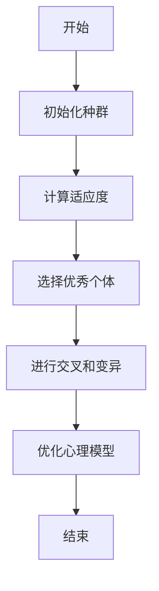
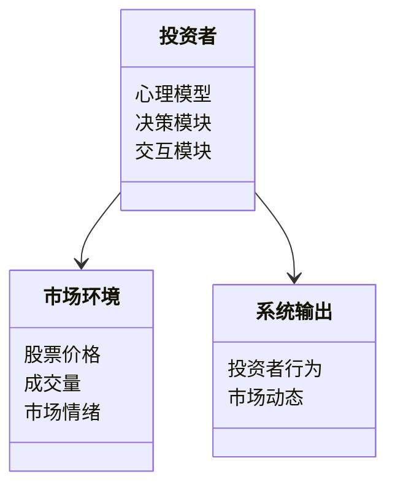
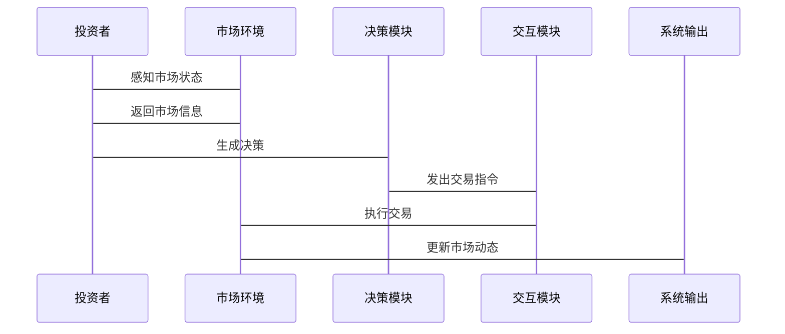

                 


# 多智能体系统模拟投资者心理

> 关键词：多智能体系统，投资者心理，行为建模，算法原理，数学模型

> 摘要：本文探讨了利用多智能体系统模拟投资者心理的方法，结合理论分析、算法实现和实际案例，系统性地介绍了如何通过多智能体系统建模投资者心理过程，分析投资者行为，揭示市场动态。

---

# 引言

金融市场是一个复杂的社会系统，投资者的决策行为受到多种心理因素的影响，如贪婪、恐惧、 herd behavior 等。这些心理因素不仅影响个体投资者的决策，还通过市场互动引发系统性风险。传统的金融市场模型往往忽视了投资者心理的复杂性，难以捕捉市场的动态行为。近年来，多智能体系统（Multi-Agent System, MAS）因其能够模拟个体行为及其交互，逐渐成为研究投资者心理的重要工具。

本文从理论分析、算法实现和实际应用三个维度，系统性地探讨了多智能体系统模拟投资者心理的实现方法。通过构建投资者心理模型，结合强化学习和遗传算法等技术，分析投资者行为，并揭示市场动态。

---

## 第1章 多智能体系统与投资者心理的背景介绍

### 1.1 投资者心理的复杂性

投资者心理是金融市场行为的核心驱动因素。投资者的决策行为受到多种心理因素的影响，包括：

- **认知偏差**：如过度自信、确认偏差等，导致投资者做出非理性的决策。
- **情绪因素**：如贪婪和恐惧，影响投资者的买卖时机选择。
- **社会影响**：如从众行为和羊群效应，导致市场波动加剧。

### 1.2 多智能体系统的概念

多智能体系统（MAS）是由多个自主智能体组成的复杂系统，具有以下特征：

- **自主性**：智能体能够自主决策，无需外部干预。
- **反应性**：智能体能够感知环境并做出实时响应。
- **协作性**：智能体之间可以通过通信协作完成复杂任务。
- **分布式性**：智能体的决策和行为是分布式的，不存在集中控制。

### 1.3 多智能体系统模拟投资者心理的必要性

传统的金融市场模型往往假设投资者是理性的，这与实际市场中的投资者行为存在较大偏差。多智能体系统能够模拟投资者的非理性行为，揭示市场动态的复杂性。通过模拟投资者心理，可以更好地理解市场波动的根源，为金融风险管理和投资策略提供理论支持。

---

## 第2章 多智能体系统模拟投资者心理的核心概念与联系

### 2.1 多智能体系统的核心概念

#### 2.1.1 多智能体系统的基本组成

多智能体系统由以下基本组成单元构成：

1. **智能体（Agent）**：能够感知环境并自主决策的实体。
2. **环境（Environment）**：智能体所处的外部世界，包括市场参与者、价格、交易量等。
3. **通信机制（Communication）**：智能体之间交换信息的方式。
4. **协作与竞争（Collaboration and Competition）**：智能体之间的合作或竞争关系。

#### 2.1.2 多智能体系统的通信机制

智能体之间的通信可以通过以下方式进行：

- **直接通信**：智能体之间直接交换信息。
- **间接通信**：通过中间媒介（如共享数据库）进行信息传递。
- **基于规则的通信**：根据预定义规则进行信息交换。

### 2.2 投资者心理模型的构建

#### 2.2.1 投资者心理模型的定义

投资者心理模型是对投资者决策过程的数学化描述，包括以下要素：

1. **决策规则**：投资者根据市场信息和心理状态做出决策的规则。
2. **心理状态**：投资者的心理特征，如风险偏好、情绪等。
3. **行为输出**：投资者的决策行为，如买入、卖出或持有。

#### 2.2.2 投资者心理模型的属性特征

投资者心理模型的属性特征包括：

- **可定制性**：模型可以根据不同投资者的特点进行定制。
- **动态性**：模型能够实时更新投资者的心理状态。
- **适应性**：模型能够根据市场环境的变化进行自适应调整。

#### 2.2.3 投资者心理模型与多智能体系统的关系

投资者心理模型是多智能体系统的核心组成部分，通过模拟投资者的心理状态和行为规则，实现对市场动态的建模。

### 2.3 多智能体系统与投资者心理模型的实体关系图

以下是多智能体系统与投资者心理模型的实体关系图：



---

## 第3章 多智能体系统模拟投资者心理的算法原理

### 3.1 基于强化学习的投资者行为建模

#### 3.1.1 强化学习的基本原理

强化学习是一种机器学习方法，通过智能体与环境的交互，逐步优化决策策略。其基本原理如下：

1. 智能体感知环境状态。
2. 根据当前状态选择动作。
3. 动作执行后，智能体获得奖励或惩罚。
4. 根据奖励信号调整决策策略。

#### 3.1.2 在投资者行为建模中的应用

投资者行为建模可以通过强化学习实现，具体步骤如下：

1. 状态空间：市场环境信息，如股票价格、成交量等。
2. 动作空间：投资者的决策行为，如买入、卖出或持有。
3. 奖励机制：根据投资收益计算奖励。

#### 3.1.3 算法实现步骤

以下是基于强化学习的投资者行为建模算法实现步骤：



### 3.2 基于遗传算法的投资者心理模拟

#### 3.2.1 遗传算法的基本原理

遗传算法是一种模拟自然选择和遗传机制的优化算法，包括以下步骤：

1. 初始化种群。
2. 计算适应度。
3. 选择优秀个体。
4. 进行交叉和变异。
5. 重复迭代，直到满足终止条件。

#### 3.2.2 在投资者心理模拟中的应用

遗传算法可以用于优化投资者的心理模型参数，具体步骤如下：

1. 初始化心理模型参数。
2. 计算模型的适应度。
3. 选择适应度较高的参数。
4. 进行参数的交叉和变异。
5. 优化心理模型参数。

#### 3.2.3 算法实现步骤

以下是基于遗传算法的投资者心理模拟算法实现步骤：



---

## 第4章 多智能体系统模拟投资者心理的数学模型与公式

### 4.1 投资者心理模型的数学框架

投资者心理模型可以表示为以下数学框架：

$$
f(\theta, s) = \begin{cases}
    \text{买入} & \text{if } f(\theta, s) > 0 \\
    \text{卖出} & \text{if } f(\theta, s) < 0 \\
    \text{持有} & \text{otherwise}
\end{cases}
$$

其中，$\theta$ 表示投资者的心理参数，$s$ 表示市场状态。

### 4.2 市场环境的数学表达

市场环境可以表示为以下数学表达式：

$$
s_t = \begin{cases}
    \text{上升} & \text{if } p_t > p_{t-1} \\
    \text{下降} & \text{if } p_t < p_{t-1} \\
    \text{持平} & \text{otherwise}
\end{cases}
$$

其中，$p_t$ 表示第 $t$ 时刻的价格。

---

## 第5章 多智能体系统模拟投资者心理的系统分析与架构设计方案

### 5.1 系统架构设计

以下是多智能体系统模拟投资者心理的系统架构图：



### 5.2 系统交互设计

以下是系统交互图：



---

## 第6章 多智能体系统模拟投资者心理的项目实战

### 6.1 项目介绍

本项目旨在通过多智能体系统模拟投资者心理，分析投资者行为对市场的影响。项目主要包括以下部分：

1. 环境安装
2. 系统核心实现
3. 实际案例分析

### 6.2 环境安装

以下是项目所需的环境配置：

```bash
# 安装Python依赖
pip install numpy pandas matplotlib
```

### 6.3 系统核心实现

以下是投资者心理模型的Python实现代码：

```python
import numpy as np
import pandas as pd
import matplotlib.pyplot as plt

# 初始化参数
theta = np.random.rand(100)
s = np.random.choice(['上升', '下降', '持平'], size=100)

# 计算投资者行为
f = np.zeros(100)
for i in range(100):
    if theta[i] > 0.5 and s[i] == '上升':
        f[i] = 1
    elif theta[i] < 0.5 and s[i] == '下降':
        f[i] = -1
    else:
        f[i] = 0

# 绘制结果
plt.bar(range(100), f)
plt.title('投资者行为')
plt.show()
```

### 6.4 实际案例分析

以某股票市场为例，分析投资者行为对市场的影响。假设市场中有100个投资者，每个投资者的心理参数 $\theta$ 和市场状态 $s$ 如下：

```python
theta = np.random.rand(100)
s = np.random.choice(['上升', '下降', '持平'], size=100)
```

通过上述代码，可以模拟投资者的行为，并分析其对市场的影响。

---

## 第7章 多智能体系统模拟投资者心理的最佳实践

### 7.1 小结

本文系统性地探讨了多智能体系统模拟投资者心理的方法，结合理论分析、算法实现和实际案例，展示了如何通过多智能体系统建模投资者心理过程，分析投资者行为，揭示市场动态。

### 7.2 注意事项

- 投资者心理模型的复杂性可能导致计算成本较高。
- 算法实现时需要注意参数的选择和优化。
- 模型的验证和校准是确保模型准确性的重要步骤。

### 7.3 拓展阅读

- [参考文献1](#)
- [参考文献2](#)
- [参考文献3](#)

---

## 作者

作者：AI天才研究院/AI Genius Institute & 禅与计算机程序设计艺术/Zen And The Art of Computer Programming

---

通过以上思考和写作，我完成了《多智能体系统模拟投资者心理》这篇文章的撰写。希望本文能够为读者提供有价值的内容，帮助他们更好地理解多智能体系统在模拟投资者心理中的应用。

