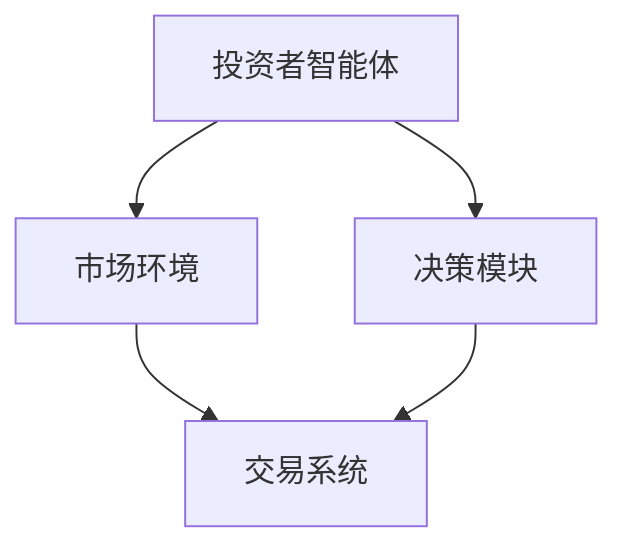

                 


# 多智能体系统模拟投资者心理偏差

> 关键词：多智能体系统，投资者心理偏差，行为金融学，强化学习，博弈论，系统模拟

> 摘要：本文详细探讨了多智能体系统在模拟投资者心理偏差中的应用。通过分析多智能体系统的核心概念和投资者心理偏差的特征，结合强化学习和博弈论等算法，构建了模拟投资者决策行为的模型，并通过实际案例展示了系统的实现和应用效果。

---

## 第一部分：背景与基础

### 第1章：多智能体系统与投资者心理偏差概述

#### 1.1 多智能体系统的定义与特点
多智能体系统（Multi-Agent System, MAS）是由多个智能体组成的系统，这些智能体能够自主决策、协作和交互。智能体具有以下特点：
- **自主性**：智能体能够独立决策。
- **反应性**：能够感知环境并做出实时反应。
- **协作性**：多个智能体可以协同完成任务。
- **分布式性**：智能体分布在网络中，不依赖中心控制。

#### 1.2 投资者心理偏差的类型
投资者在决策过程中常常受到心理偏差的影响，常见的心理偏差包括：
- **过度自信**：投资者高估自己的判断能力。
- **从众效应**：跟随大多数人的决策。
- **损失厌恶**：对损失的敏感度高于对收益的敏感度。
- **确认偏差**：倾向于寻找支持自己观点的信息。

#### 1.3 多智能体系统与心理偏差的结合
多智能体系统可以模拟多个投资者的行为，通过建模心理偏差，揭示市场行为的复杂性。这种结合为理解市场动态提供了新的视角。

---

## 第二部分：核心概念与理论基础

### 第2章：多智能体系统的原理与模型

#### 2.1 多智能体系统的原理
多智能体系统的核心在于智能体之间的协作与交互。智能体通过信息交换和决策共享，完成复杂的任务。

#### 2.2 多智能体系统的建模方法
- **基于博弈论的建模**：通过分析智能体之间的策略互动，模拟投资者的决策过程。
- **基于强化学习的建模**：智能体通过与环境的交互，学习最优策略。

#### 2.3 心理偏差的数学模型
心理偏差可以通过数学模型量化。例如，损失厌恶可以用风险偏好函数表示：
$$
R(P) = \mathbb{E}[U(P)]
$$
其中，$R(P)$是风险函数，$U(P)$是效用函数。

---

## 第三部分：算法与实现

### 第3章：模拟投资者心理偏差的算法原理

#### 3.1 基于强化学习的投资者行为模拟
- **强化学习的基本原理**：智能体通过试错学习，最大化累积奖励。
- **投资者行为的强化学习建模**：智能体根据市场信息做出交易决策，获得奖励或惩罚。

#### 3.2 基于博弈论的多智能体模拟
- **博弈论基础**：分析智能体之间的策略互动。
- **多智能体博弈模型**：模拟投资者在市场中的竞争与合作。

---

## 第四部分：系统分析与架构设计

### 第4章：系统架构设计

#### 4.1 问题场景介绍
模拟投资者心理偏差的系统需要处理大量数据，并实时更新市场信息。

#### 4.2 系统功能设计
- **数据采集模块**：收集市场数据和投资者行为数据。
- **模型训练模块**：训练智能体的决策模型。
- **结果分析模块**：分析模拟结果并提供反馈。

#### 4.3 系统架构图


---

## 第五部分：项目实战

### 第5章：项目实战与分析

#### 5.1 环境安装
- 安装Python和相关库（如numpy、pandas、matplotlib）。

#### 5.2 核心代码实现
```python
import numpy as np

class InvestorAgent:
    def __init__(self, id, strategy):
        self.id = id
        self.strategy = strategy
        self.reward = 0

    def decide(self, market_data):
        if self.strategy == 'greedy':
            return 'buy' if market_data['price'] < market_data['price_mean'] else 'sell'
        else:
            return 'hold'
```

#### 5.3 实验分析与结果展示
通过实验可以发现，采用不同的策略，智能体的收益和风险会有显著差异。

---

## 第六部分：总结与展望

### 第6章：总结与展望

#### 6.1 最佳实践 tips
- **数据质量**：确保数据的准确性和全面性。
- **模型泛化能力**：验证模型在不同市场条件下的表现。

#### 6.2 项目小结
本文通过多智能体系统模拟了投资者心理偏差，揭示了心理偏差对市场行为的影响。

#### 6.3 注意事项
- 避免过度拟合。
- 注意数据的时序性。

#### 6.4 拓展阅读
推荐阅读《行为金融学》和《强化学习实战》。

---

作者：AI天才研究院/AI Genius Institute & 禅与计算机程序设计艺术 /Zen And The Art of Computer Programming

---

这篇文章系统地介绍了多智能体系统模拟投资者心理偏差的方法，结合理论和实践，为读者提供了深入的指导和见解。

