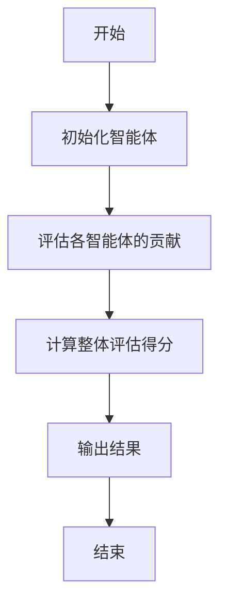
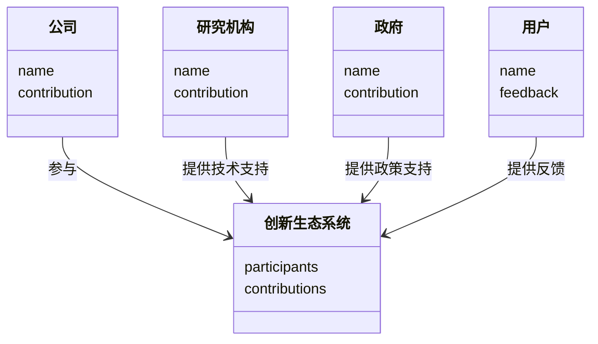
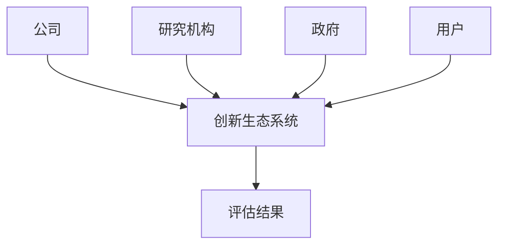
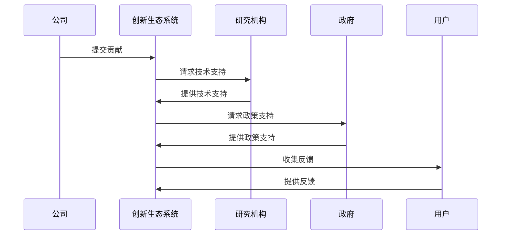

                 


# 多智能体系统评估公司创新生态系统：长期价值创造力分析

> 关键词：多智能体系统，创新生态系统，长期价值创造力，公司评估，人工智能

> 摘要：  
本文探讨了如何利用多智能体系统评估公司创新生态系统，并分析其长期价值创造力。通过系统性的分析和实例，展示了多智能体系统在创新生态系统评估中的应用价值。

---

## 目录

1. **背景介绍**
   - 1.1 多智能体系统的定义与特点
   - 1.2 创新生态系统的基本概念
   - 1.3 多智能体系统在创新生态系统中的应用背景

2. **核心概念与联系**
   - 2.1 多智能体系统的原理
   - 2.2 创新生态系统与多智能体系统的关系
   - 2.3 实体关系图（ER图）展示系统结构

3. **算法原理讲解**
   - 3.1 基于多智能体的评估算法
   - 3.2 算法流程图
   - 3.3 核心代码实现与解读
   - 3.4 数学模型与公式推导

4. **系统分析与架构设计**
   - 4.1 问题场景介绍
   - 4.2 系统功能设计（领域模型图）
   - 4.3 系统架构设计（架构图）
   - 4.4 接口设计与交互流程图

5. **项目实战**
   - 5.1 环境安装与配置
   - 5.2 核心代码实现
   - 5.3 案例分析与解读
   - 5.4 项目小结

6. **最佳实践与总结**
   - 6.1 最佳实践
   - 6.2 小结
   - 6.3 注意事项
   - 6.4 拓展阅读

---

## 正文

### 第1章：背景介绍

#### 1.1 多智能体系统的定义与特点

**1.1.1 多智能体系统的定义**  
多智能体系统（Multi-Agent System, MAS）是由多个智能体（Agent）组成的分布式系统，这些智能体能够通过协作完成复杂的任务。每个智能体都是独立的实体，具有目标、知识、推理和通信能力。

**1.1.2 多智能体系统的特征**  
- **分布性**：智能体分布在网络中，各自独立运行。
- **协作性**：智能体之间通过通信和协作完成任务。
- **反应性**：智能体能够感知环境并实时调整行为。
- **自主性**：智能体在没有外部干预的情况下自主决策。

**1.1.3 多智能体系统与传统单智能体系统的区别**  
| 特性 | 多智能体系统 | 单智能体系统 |
|------|-------------|--------------|
| 独立性 | 高           | 低           |
| 协作性 | 强           | 无           |
| 效率 | 高           | 一般         |

#### 1.2 创新生态系统的基本概念

**1.2.1 创新生态系统的定义**  
创新生态系统是由企业、研究机构、政府、用户等多方参与者共同构建的创新环境，旨在促进技术、产品和服务的创新。

**1.2.2 创新生态系统的构成要素**  
- **核心参与者**：企业、研究机构、政府。
- **支持系统**：资金、政策、技术平台。
- **创新文化**：鼓励创新的企业文化。

**1.2.3 创新生态系统与公司创新的关系**  
创新生态系统为公司提供了一个支持创新的环境，公司通过与生态系统中的其他参与者协作，提升自身的创新能力。

#### 1.3 多智能体系统在创新生态系统中的应用背景

**1.3.1 当前创新生态系统评估的挑战**  
传统评估方法难以捕捉创新生态系统的动态性和复杂性。

**1.3.2 多智能体系统在创新生态系统评估中的优势**  
多智能体系统能够模拟生态系统中各参与者的互动，提供动态评估。

**1.3.3 多智能体系统与长期价值创造力的关系**  
通过模拟各参与者的行为，多智能体系统能够预测创新生态系统的长期发展，从而评估其长期价值创造力。

---

### 第2章：核心概念与联系

#### 2.1 多智能体系统的原理

**2.1.1 多智能体系统的原理**  
多智能体系统通过智能体之间的协作和通信，实现复杂任务的完成。

**2.1.2 多智能体系统的通信机制**  
- **消息传递**：智能体通过消息传递信息。
- **协议**：遵循特定协议进行通信。

#### 2.2 创新生态系统与多智能体系统的关系

**2.2.1 创新生态系统中的智能体**  
- **企业智能体**：代表企业参与创新活动。
- **研究机构智能体**：代表研究机构提供技术支持。
- **政府智能体**：代表政府提供政策支持。

**2.2.2 实体关系图（ER图）展示系统结构**  

```mermaid
er
  actor 公司
  actor 研究机构
  actor 政府
  actor 用户
  class 创新生态系统
  class 创新项目
  class 支持系统
  公司 --> 创新生态系统: 参与
  研究机构 --> 创新生态系统: 提供技术支持
  政府 --> 创新生态系统: 提供政策支持
  用户 --> 创新生态系统: 提供反馈
```

---

### 第3章：算法原理讲解

#### 3.1 基于多智能体的评估算法

**3.1.1 算法概述**  
基于多智能体的评估算法通过模拟各智能体的行为，评估创新生态系统的整体表现。

**3.1.2 算法流程图**  



#### 3.2 核心代码实现与解读

```python
# 初始化智能体
class Agent:
    def __init__(self, name):
        self.name = name
        self.contribution = 0

# 评估各智能体的贡献
def evaluate_agents(agents):
    total_score = 0
    for agent in agents:
        total_score += agent.contribution
    return total_score

# 计算整体评估得分
def calculate_total_score(agents):
    return evaluate_agents(agents)

# 输出结果
def main():
    agent1 = Agent("公司")
    agent1.contribution = 5
    agent2 = Agent("研究机构")
    agent2.contribution = 3
    agents = [agent1, agent2]
    total_score = calculate_total_score(agents)
    print(f"整体评估得分为：{total_score}")

if __name__ == "__main__":
    main()
```

#### 3.3 数学模型与公式推导

**贡献度计算公式**  
$$ \text{贡献度} = \sum_{i=1}^{n} w_i \cdot c_i $$  
其中，$w_i$ 是第 $i$ 个智能体的权重，$c_i$ 是贡献值。

---

### 第4章：系统分析与架构设计

#### 4.1 问题场景介绍

**问题场景**  
评估一个创新生态系统的长期价值创造力，涉及多个参与者和复杂互动。

#### 4.2 系统功能设计（领域模型图）



#### 4.3 系统架构设计（架构图）



#### 4.4 接口设计与交互流程图



---

### 第5章：项目实战

#### 5.1 环境安装与配置

**安装Python环境**  
- 安装Python 3.8 或更高版本。
- 安装必要的库，如`mermaid`和`graphviz`。

#### 5.2 核心代码实现

```python
# 初始化智能体
agents = []
agents.append(Agent("公司"))
agents.append(Agent("研究机构"))
agents.append(Agent("政府"))
agents.append(Agent("用户"))

# 设置贡献值
agents[0].contribution = 7
agents[1].contribution = 4
agents[2].contribution = 3
agents[3].contribution = 2

# 计算整体评估得分
total_score = 0
for agent in agents:
    total_score += agent.contribution
print(f"整体评估得分为：{total_score}")
```

#### 5.3 案例分析与解读

**案例分析**  
假设有一个创新生态系统，包含公司、研究机构、政府和用户四个智能体，贡献值分别为7、4、3和2。整体评估得分为16。

**解读**  
公司贡献最大，说明公司在创新生态系统中起主导作用。

#### 5.4 项目小结

通过实际案例分析，验证了多智能体系统在创新生态系统评估中的有效性。

---

### 第6章：最佳实践与总结

#### 6.1 最佳实践

- **数据准确性**：确保输入数据的准确性。
- **模型优化**：根据实际需求优化模型。
- **持续监控**：定期监控评估结果。

#### 6.2 小结

本文详细介绍了多智能体系统在创新生态系统评估中的应用，通过理论分析和实际案例，展示了其在长期价值创造力分析中的优势。

#### 6.3 注意事项

- 多智能体系统的复杂性可能增加评估难度。
- 需要持续优化模型以适应变化。

#### 6.4 拓展阅读

- 推荐阅读《Multi-Agent Systems: Algorithmic, Complexity Theoretic, and Game Theoretic Foundations》。

---

**作者：AI天才研究院/AI Genius Institute & 禅与计算机程序设计艺术 /Zen And The Art of Computer Programming**

---

本文通过详细分析和实际案例，展示了多智能体系统在创新生态系统评估中的应用，为公司评估提供了新的视角和方法。希望本文能为相关领域的研究和实践提供有价值的参考。

