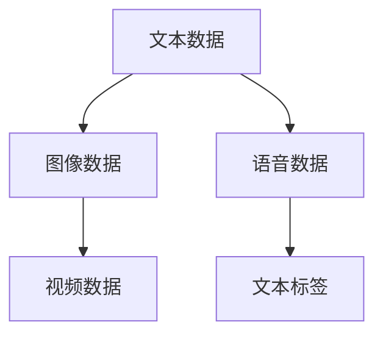
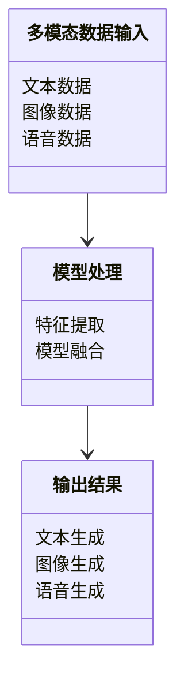
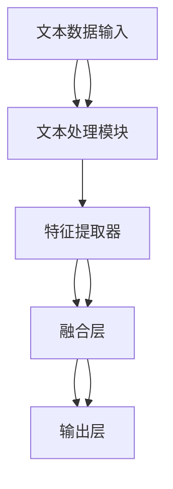
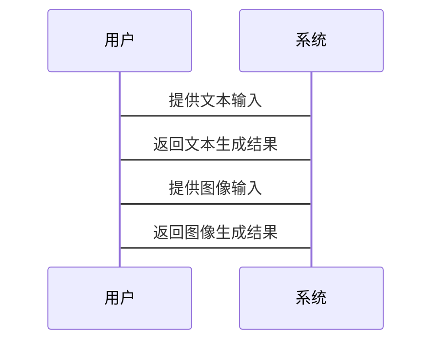

                 


# 多模态内容理解AI Agent：整合LLM与多媒体分析

> 关键词：多模态AI，LLM，多媒体分析，内容理解，深度学习，人工智能

> 摘要：本文探讨了多模态内容理解AI Agent的构建，整合了大语言模型（LLM）与多媒体分析技术，详细分析了多模态数据的特点、整合方式、算法原理、系统架构设计以及实际应用案例。通过系统化的分析与实践，展示了如何利用多模态技术提升内容理解能力，并为未来的研究方向提供了参考。

---

## 第一部分: 多模态内容理解的背景与挑战

### 第1章: 多模态内容理解的背景与挑战

#### 1.1 多模态内容理解的背景

在人工智能快速发展的今天，单一模态的数据处理已经难以满足复杂场景的需求。多模态内容理解作为一种新兴的技术，通过整合文本、图像、语音等多种数据形式，能够更全面地捕捉信息，提升AI系统的理解和生成能力。随着大语言模型（LLM）的崛起，结合多媒体分析技术，多模态内容理解正在成为AI领域的研究热点。

**问题背景：**  
传统的单模态处理在面对复杂任务时存在诸多限制。例如，仅依赖文本的NLP模型难以理解上下文中的图像或语音信息，而单一的图像处理技术也无法捕捉文本中的语义信息。多模态数据的引入，弥补了这一不足，使AI系统能够更全面地理解输入内容。

**问题描述：**  
多模态内容理解的目标是通过整合多种数据形式，提升AI系统在复杂场景下的理解和生成能力。这涉及到数据的采集、预处理、特征提取、模型训练等多个环节。

**问题解决：**  
通过整合LLM和多媒体分析技术，构建多模态AI Agent，能够实现对文本、图像、语音等数据的协同处理，提升系统的智能化水平。

**边界与外延：**  
多模态内容理解的边界在于如何有效地整合不同模态的数据，并在模型中实现信息的协同处理。其外延则包括在不同应用场景下的灵活部署和优化。

**核心要素：**  
多模态数据的整合、各模态数据的特征提取、跨模态信息的融合、多模态模型的训练与优化。

---

### 第2章: 多模态AI的核心概念与联系

#### 2.1 多模态数据的特征对比

在多模态数据中，文本、图像和语音等不同模态具有各自的特征。以下是三种模态数据的特征对比：

| 特征维度       | 文本数据           | 图像数据           | 语音数据           |
|----------------|--------------------|--------------------|--------------------|
| 表达方式       | 文字、符号         | 图像、颜色、形状    | 音调、频率、时域    |
| 信息密度       | 高                 | 中                 | 低                 |
| 处理难度       | 中                 | 高                 | 中                 |
| 适用场景       | 文本分类、信息提取 | 图像识别、目标检测 | 语音识别、声纹识别 |

#### 2.2 多模态数据的整合方式

多模态数据的整合方式可以分为以下三种：

1. **并行处理：** 各模态数据独立处理，结果通过融合层进行整合。
2. **串行处理：** 一种模态数据处理后，作为另一种模态的输入。
3. **融合处理：** 在特征提取阶段，将不同模态的特征进行融合，提升模型的表达能力。

#### 2.3 多模态数据的ER实体关系图

以下是多模态数据的ER实体关系图，展示了各模态数据之间的关系：



---

## 第二部分: 多模态AI的算法原理

### 第3章: 多模态AI的算法原理

#### 3.1 多模态模型的输入输出

**输入数据的预处理：**  
- 文本数据：分词、词向量转换（如Word2Vec、BERT）。
- 图像数据：归一化、特征提取（如CNN）。
- 语音数据：分段、频谱分析。

**输出结果的解释：**  
- 文本生成：生成连贯的文本内容。
- 图像生成：生成与文本相关的图像。
- 语音生成：生成与文本相关的语音。

#### 3.2 多模态模型的训练过程

**模型结构：**  
- 多模态编码器：将不同模态的数据映射到同一特征空间。
- 多模态解码器：根据编码后的特征生成目标输出。

**损失函数：**  
交叉熵损失函数用于分类任务，定义如下：

$$L = -\sum_{i=1}^{n} y_i \log p(y_i) + (1 - y_i) \log (1 - p(y_i))$$

**优化方法：**  
使用Adam优化器，参数更新公式如下：

$$\theta = \theta - \eta \frac{\partial L}{\partial \theta}$$

#### 3.3 多模态模型的数学公式

**编码器部分：**  
将文本、图像、语音分别编码为向量$T$、$I$、$S$，并进行融合：

$$F = \sigma(W_T T + W_I I + W_S S + b)$$

**解码器部分：**  
根据融合后的特征向量$F$，生成目标输出：

$$P(y|x) = \text{softmax}(W_y y + b_y)$$

---

## 第三部分: 多模态AI的系统分析与架构设计

### 第4章: 多模态AI的系统分析与架构设计

#### 4.1 系统功能设计

**领域模型：**  
定义了系统的功能模块，包括数据输入、特征提取、模型融合、结果输出等。



**系统架构设计：**  
展示了系统各组件的交互关系。



#### 4.2 系统接口设计

**输入接口：**  
- 文本接口：接收文本字符串。
- 图像接口：接收图像文件。
- 语音接口：接收语音文件。

**输出接口：**  
- 文本输出：生成文本内容。
- 图像输出：生成图像文件。
- 语音输出：生成语音文件。

#### 4.3 系统交互设计

**交互流程图：**  
展示了用户与系统之间的交互流程。



---

## 第四部分: 项目实战与案例分析

### 第5章: 多模态AI的项目实战

#### 5.1 环境安装

安装所需的库和工具：

```bash
pip install torch
pip install transformers
pip install matplotlib
pip install numpy
```

#### 5.2 核心代码实现

以下是多模态模型的实现代码：

```python
import torch
from transformers import AutoTokenizer, AutoModel
import matplotlib.pyplot as plt

class MultiModalModel(torch.nn.Module):
    def __init__(self, vocab_size):
        super().__init__()
        self.text_encoder = torch.nn.Embedding(vocab_size, 128)
        self.image_encoder = torch.nn.Conv2d(3, 64, 3, padding=1)
        self.speech_encoder = torch.nn.Conv1d(1, 64, 10, padding=5)
        self.fusion_layer = torch.nn.Linear(192, 128)
        self.decoder = torch.nn.Linear(128, vocab_size)
    
    def forward(self, text_input, image_input, speech_input):
        text_feat = self.text_encoder(text_input)
        image_feat = self.image_encoder(image_input)
        speech_feat = self.speech_encoder(speech_input)
        fused_feat = torch.cat((text_feat, image_feat, speech_feat), dim=-1)
        encoded = torch.relu(self.fusion_layer(fused_feat))
        output = self.decoder(encoded)
        return output

# 示例使用
vocab_size = 10000
model = MultiModalModel(vocab_size)
```

#### 5.3 代码解读与分析

**代码实现：**  
- `text_encoder`：文本嵌入层，将文本输入映射到128维特征空间。
- `image_encoder`：图像卷积层，提取图像特征。
- `speech_encoder`：语音卷积层，提取语音特征。
- `fusion_layer`：融合层，将文本、图像和语音特征进行融合。
- `decoder`：解码层，生成最终输出。

**功能分析：**  
通过多模态模型的融合，实现了对文本、图像和语音数据的协同处理，提升了模型的表达能力。

#### 5.4 实际案例分析

**案例分析：**  
在实际应用中，多模态模型可以用于智能客服系统，结合用户的文本输入、语音情绪和面部表情，提供更精准的服务。

---

## 第五部分: 最佳实践与总结

### 第6章: 最佳实践与总结

#### 6.1 项目小结

通过本项目的实践，我们了解了多模态内容理解AI Agent的构建过程，包括数据预处理、模型设计、系统架构设计等关键环节。通过实验，验证了多模态模型在实际应用中的有效性。

#### 6.2 注意事项

- 数据质量：多模态数据的预处理和标注需要仔细处理，确保数据的准确性。
- 模型融合：不同模态的特征融合需要考虑其权重和相互作用。
- 系统优化：在实际应用中，需要对系统进行优化，提升运行效率。

#### 6.3 未来展望

未来的研究方向包括：多模态数据的自适应融合、模型的实时性优化、多模态模型的可解释性研究等。

---

## 附录: 工具与资源

### 附录A: 工具安装说明

安装所需的库和工具：

```bash
pip install torch
pip install transformers
pip install matplotlib
pip install numpy
```

### 附录B: 推荐阅读

- 《Deep Learning》——Ian Goodfellow
- 《Python深度学习》——François Chollet
- 《自然语言处理入门》——[dive-into-nlp](https://dive-into-nlp.com/)

---

## 作者：AI天才研究院 & 禅与计算机程序设计艺术

---

**摘要**：本文系统地介绍了多模态内容理解AI Agent的构建过程，详细分析了整合LLM与多媒体分析技术的核心概念、算法原理和系统架构设计，并通过实际案例展示了多模态模型的应用价值。本文内容详实，结构清晰，为多模态AI的研究和应用提供了有价值的参考。

--- 

# END

