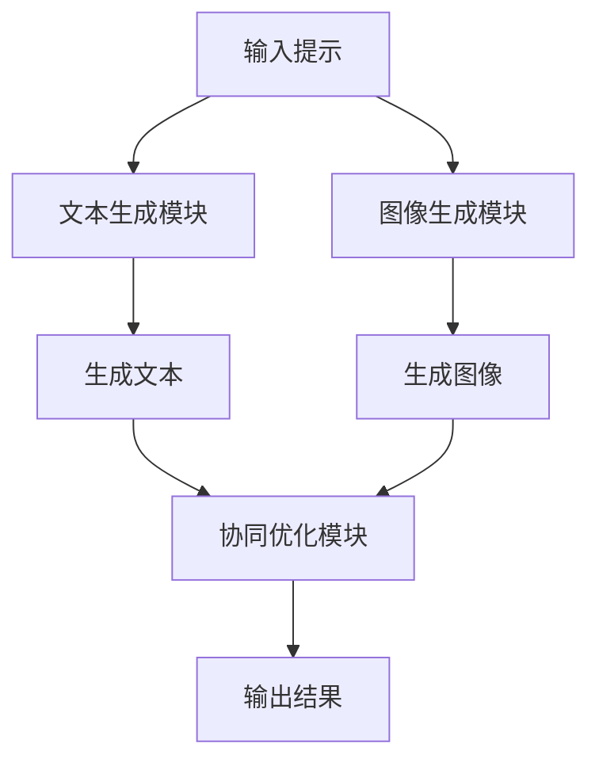
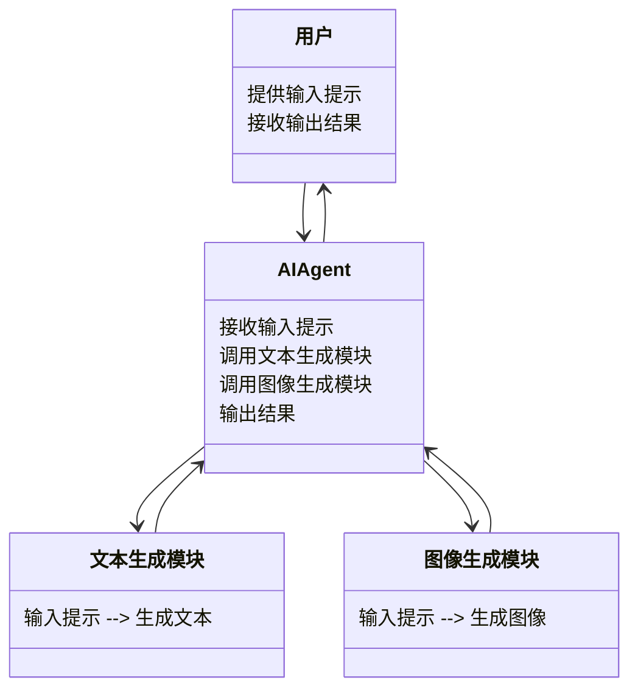
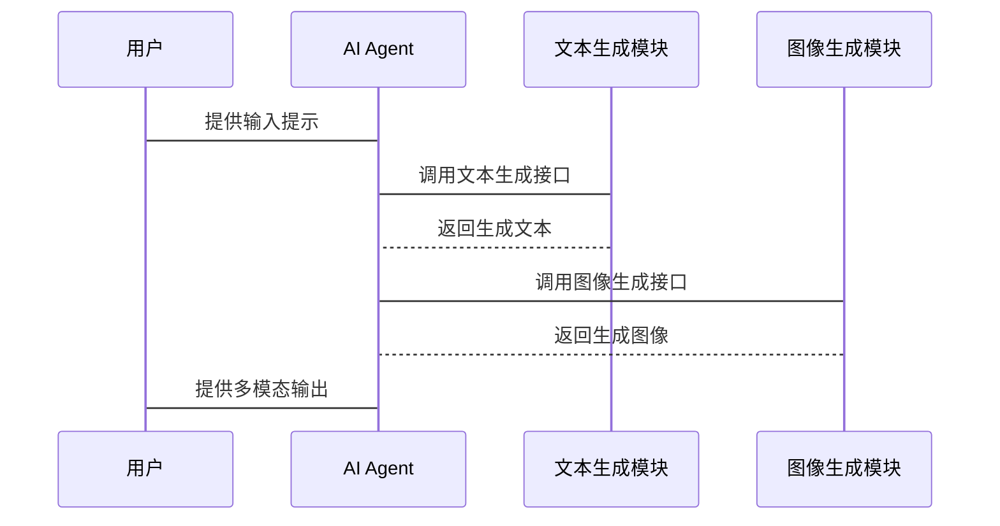

                 


# 多模态内容生成 AI Agent：整合 LLM 与图像生成

---

## 关键词：多模态内容生成，LLM，图像生成，AI Agent，深度学习，生成式AI，多模态交互

---

## 摘要：  
多模态内容生成 AI Agent 是一种结合语言模型（LLM）和图像生成技术的创新工具，能够生成同时包含文本和图像的多模态内容。本文将深入探讨多模态内容生成的背景、核心概念、算法原理、系统架构，以及实际应用案例。通过整合 LLM 和图像生成技术，本文将揭示多模态 AI Agent 的实现细节和未来发展方向，为读者提供全面的技术解析。

---

## 正文

### 第一部分：多模态内容生成的背景与概念

#### 第1章：多模态内容生成的背景与问题背景

##### 1.1 多模态内容生成的定义与核心概念  
多模态内容生成是指通过 AI 技术生成包含多种模态（如文本、图像、语音等）的内容。本文主要关注文本和图像的结合，探讨如何通过 AI Agent 实现这种多模态生成。  
- **核心概念**：  
  - **文本生成**：基于 LLM（大语言模型）生成高质量的文本内容。  
  - **图像生成**：通过生成式 AI 技术（如 GAN 或扩散模型）生成图像。  
  - **多模态整合**：将文本和图像生成过程结合起来，形成协同生成的效果。  

##### 1.2 多模态内容生成的背景与问题背景  
随着 AI 技术的快速发展，单一模态的生成技术（如纯文本生成或纯图像生成）已经相对成熟。然而，实际应用场景中，用户往往需要同时获取文本和图像信息，例如在电子商务中生成产品描述和图片，在教育中生成课程内容和插图等。因此，整合 LLM 和图像生成技术的多模态生成成为必然趋势。  
- **问题背景**：  
  - 如何高效地生成高质量的多模态内容？  
  - 如何实现文本和图像生成的协同优化？  
  - 如何设计高效的 AI Agent 来管理多模态生成过程？  

##### 1.3 多模态内容生成的应用场景  
- **电子商务**：生成产品描述和图片，提升用户体验。  
- **教育**：生成课程内容和插图，增强学习效果。  
- **娱乐**：生成故事和配图，丰富用户体验。  
- **广告**：生成吸引眼球的广告内容和图片。  

---

### 第二部分：多模态内容生成 AI Agent 的核心概念与联系

#### 第2章：多模态 AI Agent 的核心概念与联系

##### 2.1 多模态 AI Agent 的核心概念  
- **AI Agent**：一个智能代理，能够接收输入（文本、图像等），并生成相应的多模态输出。  
- **多模态整合**：AI Agent 需要同时处理文本和图像生成任务，并确保两者的协同性。  
- **生成过程**：  
  - 文本生成：基于输入的提示（prompt）生成文本内容。  
  - 图像生成：基于生成的文本内容生成图像。  
  - 多模态优化：通过反馈机制优化生成的文本和图像之间的关联性。  

##### 2.2 多模态 AI Agent 的工作原理  
- **输入**：用户输入一个提示（例如：“生成一张描述未来城市的图片，并附上一段描述文字。”）。  
- **文本生成**：LLM 根据提示生成描述文字。  
- **图像生成**：图像生成模型根据描述文字生成图像。  
- **协同优化**：AI Agent 调整生成过程，确保文本和图像的高度一致性和相关性。  

##### 2.3 多模态 AI Agent 的核心要素  
| 核心要素 | 描述 | 示例 |
|----------|------|------|
| 输入提示 | 用户提供的生成指令 | "生成一张未来城市的图片，并附上一段描述文字。" |
| 文本生成模块 | 基于 LLM 的文本生成 | GPT-3、GPT-4 等 |
| 图像生成模块 | 基于 GAN 或扩散模型的图像生成 | Stable Diffusion、DALL-E 等 |
| 协同优化模块 | 调整文本和图像的生成过程 | 基于反馈的优化算法 |

##### 2.4 多模态 AI Agent 的 ER 实体关系图  
```mermaid
erDiagram
    customer[用户] 
    agent[AI Agent] 
    text_generator[文本生成模块] 
    image_generator[图像生成模块]
    output[text 和 image 输出]
    
    customer -> agent: 提供输入提示
    agent -> text_generator: 调用文本生成模块
    text_generator -> output: 输出生成的文本
    agent -> image_generator: 调用图像生成模块
    image_generator -> output: 输出生成的图像
    output --> customer: 提供多模态输出
```

---

### 第三部分：多模态内容生成 AI Agent 的算法原理

#### 第3章：多模态内容生成的算法原理

##### 3.1 LLM 的算法原理  
- **核心算法**：基于 Transformer 的自注意力机制。  
- **数学模型**：  
  $$ \text{Attention}(Q, K, V) = \text{softmax}\left(\frac{QK^T}{\sqrt{d_k}}\right)V $$
  其中，$Q$ 是查询向量，$K$ 是键向量，$V$ 是值向量，$d_k$ 是维度。  

##### 3.2 图像生成模型的算法原理  
- **扩散模型**：  
  - 步骤 1：逐步生成噪声。  
  - 步骤 2：逐步去噪，得到图像。  
- **数学模型**：  
  $$ x_t = \sqrt{\beta_t}x_{t-1} + \sqrt{1-\beta_t}\epsilon $$
  其中，$\beta_t$ 是预设的参数，$\epsilon$ 是噪声。  

##### 3.3 多模态协同生成的算法原理  
- **联合生成**：文本和图像生成模块协同工作，通过共享的隐层特征实现关联。  
- **联合优化**：通过联合损失函数优化文本和图像生成过程。  
  $$ \mathcal{L} = \mathcal{L}_{\text{text}} + \mathcal{L}_{\text{image}} + \lambda \mathcal{L}_{\text{joint}} $$
  其中，$\lambda$ 是平衡系数，$\mathcal{L}_{\text{joint}}$ 是协同损失函数。  

##### 3.4 算法流程图  


---

### 第四部分：多模态内容生成 AI Agent 的系统架构

#### 第4章：多模态 AI Agent 的系统架构

##### 4.1 系统功能设计  
- **用户交互界面**：接收输入提示，输出多模态结果。  
- **文本生成模块**：基于 LLM 生成文本。  
- **图像生成模块**：基于扩散模型生成图像。  
- **协同优化模块**：优化文本和图像的关联性。  

##### 4.2 系统架构设计  


##### 4.3 系统接口设计  
- **文本生成接口**：  
  - 输入：提示（prompt）  
  - 输出：生成的文本  
- **图像生成接口**：  
  - 输入：描述文本  
  - 输出：生成的图像  

##### 4.4 系统交互流程图  


---

### 第五部分：多模态内容生成 AI Agent 的项目实战

#### 第5章：多模态内容生成的项目实战

##### 5.1 环境安装  
- **Python**：3.8+  
- **依赖库**：  
  - LLM：Hugging Face 的 GPT-2 或 GPT-3  
  - 图像生成：Stable Diffusion  
  - 其他：PyTorch、TensorFlow、Jieba  

##### 5.2 核心实现代码  
```python
import torch
from transformers import GPT2LMHeadModel, GPT2Tokenizer
from diffusers import StableDiffusionModel, AutoTokenizer, AutoImageProcessor

# 文本生成模块
tokenizer = GPT2Tokenizer.from_pretrained("gpt2")
model = GPT2LMHeadModel.from_pretrained("gpt2")

# 图像生成模块
image_processor = AutoImageProcessor.from_pretrained("stability/ai-stable-diffusion")
model = StableDiffusionModel.from_pretrained("stability/ai-stable-diffusion")

# 多模态生成函数
def generate_multimodal_content(prompt):
    # 生成文本
    input_ids = tokenizer.encode(prompt, return_tensors="pt")
    output = model.generate(input_ids, max_length=100, do_sample=True)
    text = tokenizer.decode(output[0], skip_special_tokens=True)
    
    # 生成图像
    inputs = image_processor(prompt, return_tensors="pt")
    outputs = model.generate(**inputs, max_length=512, do_sample=True)
    image = outputs.images[0]
    
    return text, image
```

##### 5.3 代码解读与分析  
- **文本生成**：使用 GPT-2 模型生成文本内容。  
- **图像生成**：使用 Stable Diffusion 模型生成图像。  
- **协同优化**：通过共享的提示（prompt）实现文本和图像的关联生成。  

##### 5.4 实际案例分析  
- **输入提示**：  
  "生成一张描述未来城市的图片，并附上一段描述文字。"  
- **生成输出**：  
  - 文本：描述未来城市的段落。  
  - 图像：生成的未来城市图片。  

---

### 第六部分：多模态内容生成 AI Agent 的最佳实践

#### 第6章：多模态 AI Agent 的最佳实践

##### 6.1 小结  
- 多模态内容生成是一种结合文本和图像生成的创新技术。  
- AI Agent 的设计需要考虑文本和图像生成的协同优化。  

##### 6.2 注意事项  
- **输入提示设计**：确保提示的清晰性和完整性。  
- **模型选择**：根据需求选择合适的 LLM 和图像生成模型。  
- **性能优化**：优化生成过程，减少计算资源消耗。  

##### 6.3 拓展阅读  
- 《Large Language Models：A Survey》  
- 《Image Generation with Diffusion Models》  

---

## 作者：AI天才研究院/AI Genius Institute & 禅与计算机程序设计艺术 /Zen And The Art of Computer Programming

