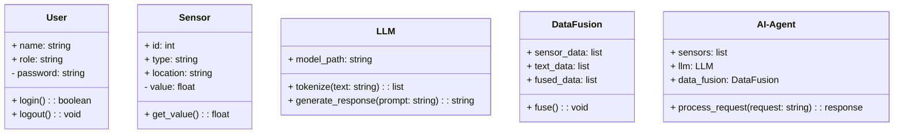
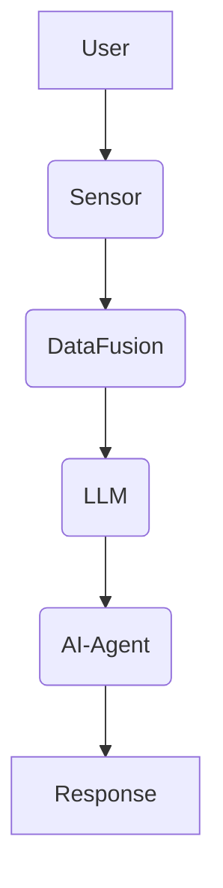
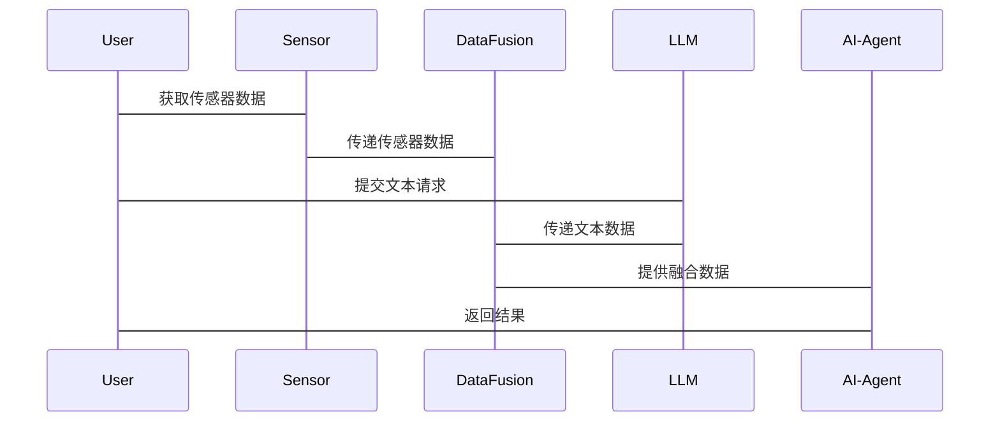

                 


# 多模态感知AI Agent：LLM与多种传感器输入的协同

## 关键词：多模态感知、AI Agent、LLM、传感器输入、数据融合、协同学习

## 摘要

多模态感知AI Agent通过结合大语言模型（LLM）与多种传感器输入，实现了更智能、更高效的感知与决策能力。本文详细探讨了多模态感知AI Agent的核心概念、算法原理、系统架构设计以及实际应用案例，为读者提供全面的理论与实践指导。

---

# 第一部分: 多模态感知AI Agent概述

## 第1章: 多模态感知AI Agent的背景与概念

### 1.1 多模态感知的基本概念

#### 1.1.1 多模态数据的定义与特点
多模态数据指的是来自不同感官渠道（如视觉、听觉、触觉等）的数据，具有多样性、互补性和冗余性的特点。例如，图像数据和文本数据可以互补地描述同一场景。

#### 1.1.2 多模态感知的背景与重要性
随着AI技术的发展，单一模态的数据处理已难以满足复杂场景的需求。多模态感知通过融合多种数据源，能够更全面地理解环境，提升系统的智能性。

#### 1.1.3 多模态感知与传统感知的区别
传统感知主要依赖单一模态数据，而多模态感知通过融合多种数据源，能够更准确地识别和理解场景。

### 1.2 多模态感知AI Agent的核心特征

#### 1.2.1 AI Agent的基本概念
AI Agent是一种智能实体，能够感知环境、执行任务并做出决策。

#### 1.2.2 多模态感知AI Agent的核心特征
多模态感知AI Agent通过融合多种传感器数据和LLM，能够更高效地完成复杂任务。

#### 1.2.3 多模态与AI Agent的协同作用
多模态数据为AI Agent提供了更丰富的感知信息，而AI Agent则通过处理这些信息，实现了更智能的决策与行动。

### 1.3 问题背景与问题描述

#### 1.3.1 传统AI Agent的局限性
传统AI Agent依赖单一模态数据，难以应对复杂多变的环境。

#### 1.3.2 多模态感知的需求与挑战
在复杂场景中，单一模态数据往往不足以提供足够的信息，因此需要多模态数据的融合。

#### 1.3.3 多模态感知AI Agent的目标与应用场景
目标是通过融合多模态数据，提升AI Agent的感知与决策能力。应用场景包括智能机器人、自动驾驶、智能安防等。

### 1.4 问题解决与边界定义

#### 1.4.1 多模态感知AI Agent的解决方案
通过融合多种传感器数据和LLM，实现更高效的感知与决策。

#### 1.4.2 问题的边界与外延
多模态感知AI Agent主要关注数据融合与协同学习，边界在于如何有效处理多源异构数据。

#### 1.4.3 核心要素与概念结构
核心要素包括传感器数据、LLM、数据融合算法、协同学习机制。

## 第2章: 多模态感知AI Agent的核心概念与联系

### 2.1 多模态数据融合原理

#### 2.1.1 数据融合的基本概念
数据融合是指将来自不同传感器的数据进行整合，以提高信息的准确性和完整性。

#### 2.1.2 多模态数据融合的方法与技术
常用方法包括基于统计的方法（如加权融合）、基于深度学习的方法（如注意力机制）等。

#### 2.1.3 数据融合的数学模型与公式
例如，加权融合模型可以表示为：
$$ y = \sum_{i=1}^{n} w_i x_i $$
其中，$w_i$是第i个传感器的权重，$x_i$是传感器数据。

### 2.2 多模态学习与LLM的协同机制

#### 2.2.1 多模态学习的基本原理
多模态学习通过同时处理多种数据类型，提升模型的表达能力。

#### 2.2.2 LLM在多模态感知中的作用
LLM可以处理文本数据，提供语义理解能力，与传感器数据协同工作。

#### 2.2.3 多模态与LLM协同的实现方式
例如，通过将传感器数据和文本数据输入到LLM中，实现联合推理。

### 2.3 核心概念对比与ER实体关系图

#### 2.3.1 多模态数据与LLM的对比分析
| 特性 | 多模态数据 | LLM |
|------|------------|-----|
| 类型 | 图像、文本、音频等 | 文本 |
| 优势 | 提供丰富信息 | 高语义理解能力 |
| 挑战 | 数据异构性 | 需要文本输入 |

#### 2.3.2 ER实体关系图展示
```mermaid
er
actor: User
action: Query
model: LLM
sensor: Sensor Data
process: Data Fusion
```

---

# 第三部分: 多模态感知AI Agent的算法实现

## 第3章: 数据融合算法

### 3.1 多模态融合算法的设计与实现

#### 3.1.1 算法流程
1. 收集多模态数据
2. 数据预处理
3. 数据融合
4. 输出结果

#### 3.1.2 算法实现代码
```python
def multi_modal_fusion(sensor_data, text_data):
    # 数据预处理
    processed_sensor = preprocess(sensor_data)
    processed_text = preprocess(text_data)
    
    # 数据融合
    fused_data = weighted_sum(processed_sensor, processed_text)
    
    return fused_data
```

#### 3.1.3 算法的数学模型与公式
$$ fused\_data = \sum_{i=1}^{n} w_i x_i + \sum_{j=1}^{m} w_j y_j $$
其中，$w_i$和$w_j$分别是传感器数据和文本数据的权重。

---

# 第四部分: 系统分析与架构设计

## 第4章: 系统架构设计

### 4.1 问题场景介绍
设计一个智能安防系统，利用多模态感知AI Agent进行实时监控和异常检测。

### 4.2 系统功能设计

#### 4.2.1 领域模型类图


### 4.3 系统架构设计

#### 4.3.1 系统架构图


#### 4.3.2 系统接口设计
主要接口包括：
- Sensor接口：获取传感器数据
- LLM接口：处理文本数据
- DataFusion接口：融合数据
- AI-Agent接口：处理请求并返回响应

### 4.4 系统交互序列图

#### 4.4.1 系统交互流程


---

# 第五部分: 项目实战

## 第5章: 项目实现与案例分析

### 5.1 环境安装

#### 5.1.1 安装Python和相关库
```bash
pip install numpy
pip install tensorflow
pip install pymermaid
```

### 5.2 核心代码实现

#### 5.2.1 数据融合代码
```python
import numpy as np

def weighted_sum(sensor_data, text_data, weights):
    return np.dot(weights, np.array([sensor_data, text_data]))
```

#### 5.2.2 LLM调用代码
```python
def call_llm(prompt):
    # 示例：使用本地模型或API调用
    pass
```

### 5.3 项目实战案例

#### 5.3.1 实际案例分析
设计一个智能安防系统，利用多模态感知AI Agent进行实时监控和异常检测。

#### 5.3.2 代码应用解读
通过代码实现多模态数据的融合与处理，展示AI Agent的实际应用能力。

### 5.4 项目小结

#### 5.4.1 项目总结
通过本项目，展示了多模态感知AI Agent在实际应用中的潜力与价值。

#### 5.4.2 经验分享
数据融合的关键在于选择合适的权重和算法，模型的可解释性需要进一步优化。

---

# 第六部分: 总结与展望

## 第6章: 总结与展望

### 6.1 核心内容总结
多模态感知AI Agent通过融合多种数据源，提升了感知与决策能力。

### 6.2 未来展望
未来，随着技术的进步，多模态感知AI Agent将在更多领域得到广泛应用。

### 6.3 最佳实践 tips

#### 6.3.1 数据质量的重要性
确保传感器数据的准确性和完整性。

#### 6.3.2 模型可解释性
优化模型的可解释性，便于调试与优化。

#### 6.3.3 安全性考虑
确保系统的安全性，防止数据泄露与攻击。

---

作者：AI天才研究院/AI Genius Institute & 禅与计算机程序设计艺术 /Zen And The Art of Computer Programming

