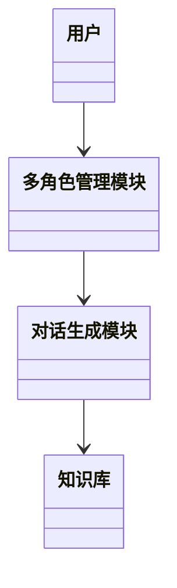
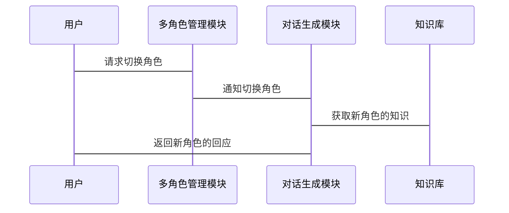

                 


# 多角色AI Agent：基于LLM的虚拟角色扮演系统

> 关键词：多角色AI Agent, 大语言模型（LLM）, 虚拟角色扮演, 对话生成, 系统架构设计

> 摘要：本文深入探讨了多角色AI Agent的概念、原理及其基于大语言模型（LLM）的实现机制。文章从多角色AI Agent的背景和核心要素出发，详细分析了LLM在角色管理、对话生成以及系统架构设计中的应用。通过实际案例分析和系统架构设计，展示了如何构建一个高效的多角色AI Agent系统。文章还提供了代码实现和优化建议，为读者提供了全面的技术指导。

---

# 第1章: 多角色AI Agent的基本概念

## 1.1 多角色AI Agent的定义与核心要素

### 1.1.1 多角色AI Agent的定义
多角色AI Agent（Multi-Role AI Agent）是一种能够根据上下文和用户需求，动态切换并扮演不同角色的人工智能系统。它通过结合大语言模型（LLM）和多角色管理机制，实现与用户的多样化交互。

**核心概念：**
- **动态角色切换**：AI Agent能够根据对话内容和用户需求，自动切换角色。
- **多角色协作**：多个角色之间能够协同工作，共同完成复杂任务。
- **上下文感知**：AI Agent能够理解对话上下文，并根据上下文调整角色行为。

### 1.1.2 多角色AI Agent的核心要素
多角色AI Agent的核心要素包括：
1. **角色定义**：每个角色都有特定的行为模式、知识库和技能。
2. **角色切换机制**：根据对话内容和用户需求，动态切换角色。
3. **对话生成算法**：生成符合当前角色的对话内容。
4. **系统架构**：支持多角色协作和动态切换的系统架构。

### 1.1.3 多角色AI Agent的边界与外延
- **边界**：多角色AI Agent主要关注角色切换和对话生成，不涉及硬件和传感器。
- **外延**：可以与其他系统集成，如知识图谱、数据库等。

---

## 1.2 多角色AI Agent与传统AI Agent的区别

### 1.2.1 传统AI Agent的特点
- **单一角色**：传统AI Agent通常固定在一个角色（如助手、客服）。
- **有限上下文感知**：无法根据上下文动态调整行为。
- **固定功能**：功能相对单一，难以应对复杂场景。

### 1.2.2 多角色AI Agent的独特优势
- **动态角色切换**：能够根据需求切换角色，适应不同场景。
- **多角色协作**：多个角色协同工作，提高任务完成效率。
- **上下文感知**：能够根据上下文调整角色行为，提供更智能的服务。

### 1.2.3 多角色AI Agent的应用场景
- **教育**：模拟老师、学生等多种角色，提供个性化的学习指导。
- **游戏**：在游戏中扮演不同角色，提升玩家体验。
- **客服**：根据用户需求切换角色，提供更精准的服务。

---

## 1.3 本章小结

本章介绍了多角色AI Agent的基本概念、核心要素以及与传统AI Agent的区别。通过对比分析，展示了多角色AI Agent的独特优势和应用场景，为后续章节的深入分析奠定了基础。

---

# 第2章: 基于LLM的多角色AI Agent原理

## 2.1 大语言模型（LLM）的基本原理

### 2.1.1 大语言模型的定义与特点
大语言模型（LLM）是一种基于深度学习的自然语言处理模型，具有以下特点：
- **大规模训练数据**：通常使用 billions of parameters（参数）进行训练。
- **上下文感知**：能够理解对话的上下文，并生成连贯的回答。
- **多任务能力**：可以完成多种任务，如翻译、问答、文本生成等。

### 2.1.2 大语言模型的训练与优化
- **训练方法**：通常采用监督学习和强化学习的结合。
- **优化策略**：包括参数调整、模型剪枝等技术。

---

## 2.2 多角色管理的核心原理

### 2.2.1 角色定义与角色属性
- **角色定义**：明确每个角色的行为模式和知识库。
- **角色属性**：包括角色的知识、技能、语言偏好等。

### 2.2.2 角色切换机制
- **切换触发条件**：根据对话内容和用户需求自动切换。
- **切换过程**：包括角色状态的保存、切换和恢复。

### 2.2.3 角色协作机制
- **协作流程**：多个角色协同完成任务。
- **冲突处理**：当角色间出现冲突时，如何进行协调。

---

## 2.3 对话生成与控制算法

### 2.3.1 对话生成的基本原理
- **生成模型**：基于LLM的生成模型，如GPT系列。
- **生成策略**：根据当前角色和上下文生成对话内容。

### 2.3.2 多角色对话的控制策略
- **角色状态跟踪**：实时跟踪当前角色的状态。
- **对话上下文管理**：管理对话历史，确保生成的回答连贯。

---

## 2.4 本章小结

本章详细分析了大语言模型（LLM）在多角色AI Agent中的应用，重点介绍了多角色管理的核心原理和对话生成与控制算法。通过对LLM的工作原理和角色管理机制的分析，为后续章节的系统设计奠定了基础。

---

# 第3章: 系统架构设计

## 3.1 系统功能设计

### 3.1.1 领域模型
- **领域模型**：展示系统的功能模块和它们之间的关系。



### 3.1.2 功能模块
- **用户输入**：接收用户的输入。
- **多角色管理模块**：负责角色切换和管理。
- **对话生成模块**：生成符合当前角色的对话内容。
- **知识库**：存储各角色的知识和数据。

---

## 3.2 系统架构设计

### 3.2.1 系统架构
- **分层架构**：分为用户层、业务逻辑层和数据层。
- **模块化设计**：各模块相对独立，便于维护和扩展。



---

## 3.3 本章小结

本章详细分析了多角色AI Agent系统的架构设计，包括功能模块的设计和系统架构的实现。通过对系统的模块化设计和分层架构的分析，展示了如何实现一个高效、可扩展的多角色AI Agent系统。

---

# 第4章: 项目实战

## 4.1 环境安装

### 4.1.1 安装Python
```bash
# 安装Python和pip
sudo apt-get install python3 python3-pip
```

### 4.1.2 安装依赖
```bash
pip install transformers torch
```

---

## 4.2 核心代码实现

### 4.2.1 多角色管理模块
```python
class RoleManager:
    def __init__(self):
        self.roles = {}
    
    def add_role(self, role_name, role_config):
        self.roles[role_name] = role_config
    
    def switch_role(self, role_name):
        # 切换当前角色
        return self.roles.get(role_name, None)
```

### 4.2.2 对话生成模块
```python
from transformers import AutoModelForCausalLM, AutoTokenizer

class DialogGenerator:
    def __init__(self, model_name):
        self.model = AutoModelForCausalLM.from_pretrained(model_name)
        self.tokenizer = AutoTokenizer.from_pretrained(model_name)
    
    def generate_response(self, role, input_text):
        # 根据当前角色生成响应
        inputs = self.tokenizer(input_text, return_tensors="pt")
        outputs = self.model.generate(inputs.input_ids, max_length=100)
        response = self.tokenizer.decode(outputs[0], skip_special_tokens=True)
        return response
```

---

## 4.3 实际案例分析

### 4.3.1 案例分析
假设我们有一个教育场景，AI Agent需要扮演老师和学生两个角色。当用户选择老师角色时，AI Agent会以老师的身份回答问题；当用户选择学生角色时，AI Agent会以学生的身份提问或回答问题。

### 4.3.2 代码实现
```python
role_manager = RoleManager()
role_manager.add_role("teacher", {"knowledge": "教育专家", "response_style": "正式"})
role_manager.add_role("student", {"knowledge": "学生", "response_style": "口语化"})

dialog_generator = DialogGenerator("gpt2")

# 切换到老师角色
role_manager.switch_role("teacher")
response = dialog_generator.generate_response("teacher", "如何学习编程？")
print(response)

# 切换到学生角色
role_manager.switch_role("student")
response = dialog_generator.generate_response("student", "你有没有好的学习方法？")
print(response)
```

---

## 4.4 本章小结

本章通过实际案例分析和代码实现，展示了如何基于LLM构建一个多角色AI Agent系统。通过对环境安装、核心代码实现和案例分析的详细讲解，帮助读者掌握多角色AI Agent的实现方法。

---

# 第5章: 系统优化与扩展

## 5.1 系统优化

### 5.1.1 性能优化
- **模型压缩**：通过剪枝和量化技术减少模型大小。
- **并行计算**：利用多线程和分布式计算提高处理速度。

### 5.1.2 可扩展性优化
- **模块化设计**：各模块相对独立，便于扩展。
- **接口标准化**：统一接口规范，方便接入新模块。

---

## 5.2 功能扩展

### 5.2.1 新角色的添加
- **新增角色**：添加新的角色定义和知识库。
- **角色间协作**：增加新角色与其他角色的协作机制。

### 5.2.2 新对话生成算法的引入
- **引入新模型**：如GPT-4或其他先进的生成模型。
- **优化生成策略**：改进生成算法，提高对话质量。

---

## 5.3 注意事项

### 5.3.1 安全性问题
- **内容过滤**：防止生成不当内容。
- **权限管理**：控制角色的访问权限。

### 5.3.2 伦理问题
- **避免偏见**：确保生成内容公平、公正。
- **隐私保护**：保护用户数据隐私。

---

## 5.4 本章小结

本章讨论了多角色AI Agent系统的优化与扩展，包括性能优化、可扩展性优化和功能扩展等内容。同时，还提出了安全性问题和伦理问题的注意事项，为系统的实际应用提供了指导。

---

# 第6章: 总结与展望

## 6.1 总结

本文深入探讨了多角色AI Agent的概念、原理及其基于LLM的实现机制。通过系统的分析和实际案例的展示，展示了如何构建一个多角色AI Agent系统。文章内容涵盖了从理论到实践的各个方面，为读者提供了全面的技术指导。

---

## 6.2 展望

随着大语言模型（LLM）技术的不断发展，多角色AI Agent的应用场景将更加广泛。未来，可以通过引入更多先进的生成算法和优化技术，进一步提升系统的性能和智能性。同时，多角色AI Agent在教育、医疗、客服等领域的应用也将更加深入，为人类带来更多的便利。

---

# 作者

作者：AI天才研究院/AI Genius Institute & 禅与计算机程序设计艺术 /Zen And The Art of Computer Programming

