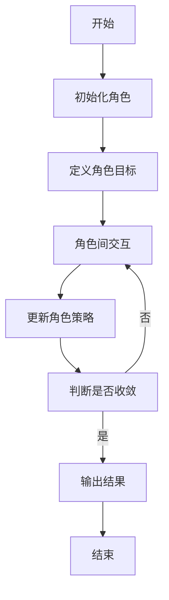
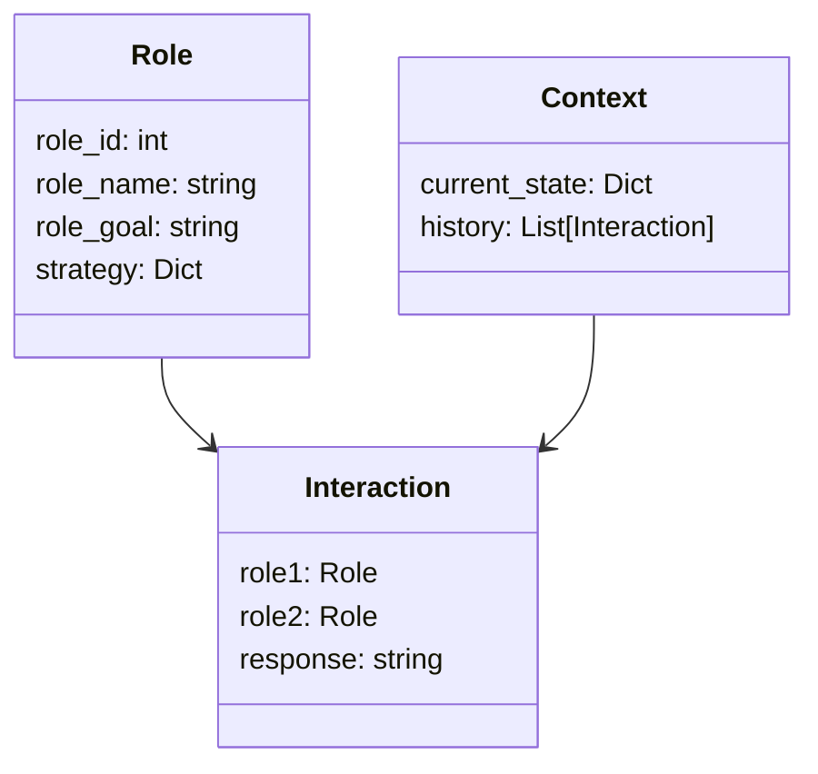
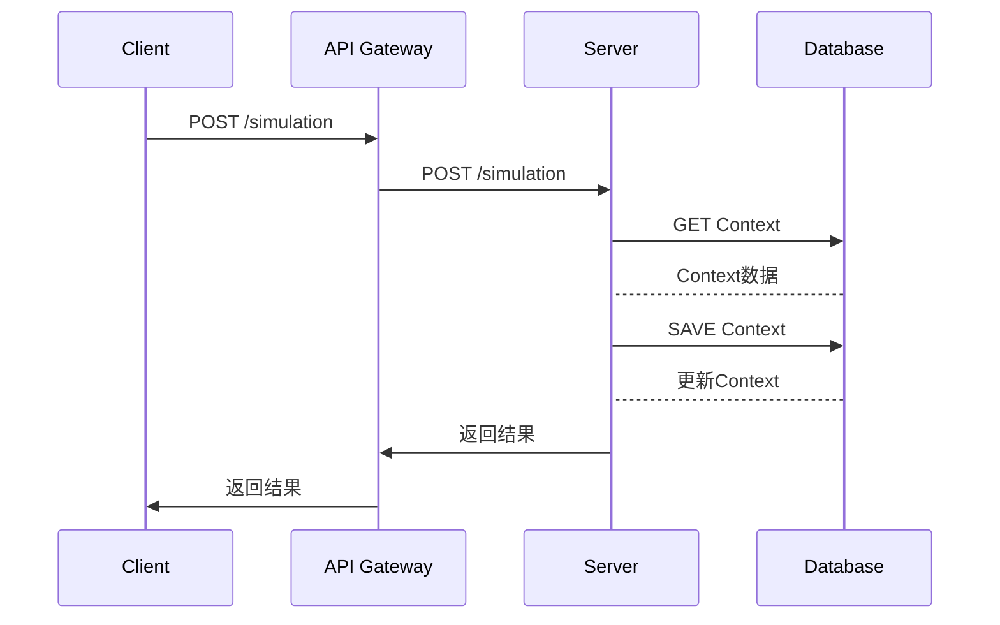

                 


# 多角色扮演AI Agent：基于LLM的复杂场景模拟

## 关键词：多角色模拟，LLM，AI Agent，复杂场景，算法原理，系统架构

## 摘要：  
本文深入探讨了基于大语言模型（LLM）的多角色扮演AI Agent在复杂场景模拟中的应用。文章首先介绍了多角色模拟的背景、核心概念和问题描述，随后详细讲解了多角色模拟的核心原理、算法实现和数学模型，接着通过系统架构设计和项目实战展示了如何将理论应用于实际场景，最后总结了多角色模拟的优势、注意事项和未来发展方向。通过本文，读者将能够全面理解多角色模拟的技术原理和应用价值。

---

## 第1章：多角色模拟的背景与意义

### 1.1 AI Agent的基本概念  
AI Agent（人工智能代理）是一种能够感知环境、自主决策并执行任务的智能实体。它可以是一个软件程序、机器人或其他智能系统，旨在通过与环境的交互来实现特定目标。  

多角色模拟是指AI Agent在模拟环境中同时扮演多个不同角色，以实现更复杂的任务。例如，在模拟谈判场景中，AI Agent可以同时扮演买方和卖方，通过互动来优化解决方案。  

### 1.2 复杂场景模拟的需求  
在现实世界中，许多问题需要多个角色协同工作才能得到有效的解决方案。例如：  
- **商业谈判**：买方和卖方需要在价格、条款等方面达成一致。  
- **团队协作**：在企业决策中，不同部门需要协调合作。  
- **社会模拟**：模拟社会中的不同个体行为，以研究社会现象。  

传统的AI Agent往往只能处理单角色任务，难以应对复杂场景中的多角色协同问题。因此，多角色模拟成为解决复杂问题的重要技术手段。  

### 1.3 多角色模拟的核心要素  
多角色模拟的核心要素包括：  
1. **角色建模**：定义每个角色的目标、行为和决策规则。  
2. **角色交互**：角色之间的对话、协商和协作机制。  
3. **环境感知**：角色对环境的感知和反馈能力。  

---

## 第2章：多角色模拟的核心概念  

### 2.1 多角色模拟的核心原理  
多角色模拟的核心原理是通过让AI Agent在模拟环境中扮演多个角色，模拟真实世界的复杂互动。这种模拟不仅可以帮助人类理解复杂场景中的行为模式，还可以用于优化决策过程。  

### 2.2 多角色模拟与单角色模拟的对比  
以下是多角色模拟与单角色模拟的对比表：

| 对比维度 | 单角色模拟 | 多角色模拟 |
|----------|------------|------------|
| 角色数量 | 1          | 多          |
| 互动复杂度 | 简单       | 复杂       |
| 应用场景 | 简单任务   | 复杂场景   |
| 决策难度 | 低         | 高         |

### 2.3 实体关系图（ER图）  
为了更好地理解多角色模拟的实体关系，我们可以通过ER图来展示：  

```mermaid
erDiagram
    actor Role1 {
        role_id : int
        role_name : string
        role_goal : string
    }
    actor Role2 {
        role_id : int
        role_name : string
        role_goal : string
    }
    actor Role3 {
        role_id : int
        role_name : string
        role_goal : string
    }
    role(Role1) -|> interaction
    role(Role2) -|> interaction
    role(Role3) -|> interaction
    note right of interaction: 交互记录
```

---

## 第3章：基于LLM的多角色模拟算法  

### 3.1 算法概述  
基于LLM的多角色模拟算法通过让AI Agent在模拟环境中扮演多个角色，利用大语言模型的自然语言处理能力进行交互。算法的核心思想是通过角色间的对话和协商，逐步逼近最优解决方案。  

### 3.2 算法流程图  



### 3.3 算法实现  

#### 3.3.1 Python代码示例  
以下是基于LLM的多角色模拟算法的Python代码示例：  

```python
import logging
from typing import List, Dict

# 定义角色类
class Role:
    def __init__(self, role_id: int, role_name: str, role_goal: str):
        self.role_id = role_id
        self.role_name = role_name
        self.role_goal = role_goal
        self.strategy = {}  # 策略字典

# 定义交互函数
def interact(roles: List[Role], context: str) -> str:
    # 这里可以调用LLM进行对话生成
    return "这是交互结果。"

# 定义算法主函数
def multi_role_simulation(roles: List[Role], max_steps: int) -> List[Role]:
    for step in range(max_steps):
        for role in roles:
            # 更新角色策略
            role.strategy = update_strategy(role.strategy, context)
            # 角色间交互
            response = interact(roles, context)
            # 更新上下文
            context = response
        # 检查是否收敛
        if check_convergence(roles):
            break
    return roles

# 辅助函数
def update_strategy(strategy: Dict, context: str) -> Dict:
    # 这里可以实现策略更新逻辑
    return strategy

def check_convergence(roles: List[Role]) -> bool:
    # 检查是否收敛
    return True  # 示例中假设收敛
```

#### 3.3.2 算法数学模型  

对抗训练模型：  
$$L = \max_{\theta} \min_{\phi} L(\theta, \phi)$$  

协作网络模型：  
$$J = \sum_{i=1}^n J_i$$  

---

## 第4章：系统架构设计  

### 4.1 系统功能设计  

#### 4.1.1 领域模型（类图）  



#### 4.1.2 系统架构设计  


#### 4.1.3 接口设计与交互图  



---

## 第5章：项目实战  

### 5.1 环境安装  

```bash
pip install mermaid
pip install python-dotenv
pip install transformers
```

### 5.2 核心代码实现  

```python
from transformers import AutoTokenizer, AutoModelForCausalLM
import torch

# 初始化LLM模型
tokenizer = AutoTokenizer.from_pretrained("gpt2")
model = AutoModelForCausalLM.from_pretrained("gpt2")

# 定义交互函数
def interact(roles: List[Role], context: str) -> str:
    inputs = tokenizer.encode(context, return_tensors="pt")
    outputs = model.generate(inputs, max_length=50)
    return tokenizer.decode(outputs[0], skip_special_tokens=True)
```

### 5.3 案例分析  
以模拟谈判场景为例，我们可以让AI Agent分别扮演买方和卖方，通过多轮对话来模拟谈判过程。通过观察角色的策略调整和最终结果，我们可以分析出最优的解决方案。

---

## 第6章：最佳实践  

### 6.1 小结  
多角色模拟是一种强大的技术工具，能够帮助我们更好地理解和解决复杂场景中的问题。通过本文的讲解，我们可以看到，基于LLM的多角色模拟在实际应用中具有广泛的可能性。  

### 6.2 注意事项  
1. 在实际应用中，需确保角色建模的准确性和全面性。  
2. 多角色模拟的收敛性问题需要特别关注。  
3. 确保系统的可扩展性和可维护性。  

### 6.3 拓展阅读  
- [论文推荐] "Multi-Role Simulation in Large Language Models"  
- [工具推荐] "Hugging Face Transformers"  

---

## 作者：AI天才研究院 & 禅与计算机程序设计艺术

---

以上是《多角色扮演AI Agent：基于LLM的复杂场景模拟》的详细内容，涵盖了从理论到实践的全过程，希望对读者有所帮助。

