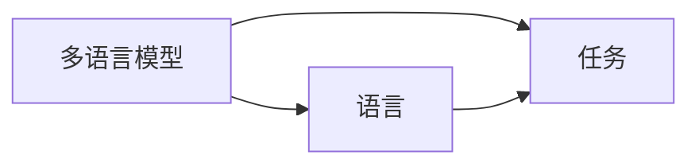
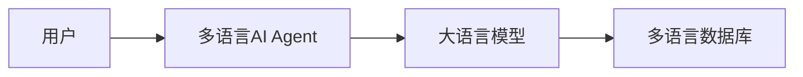
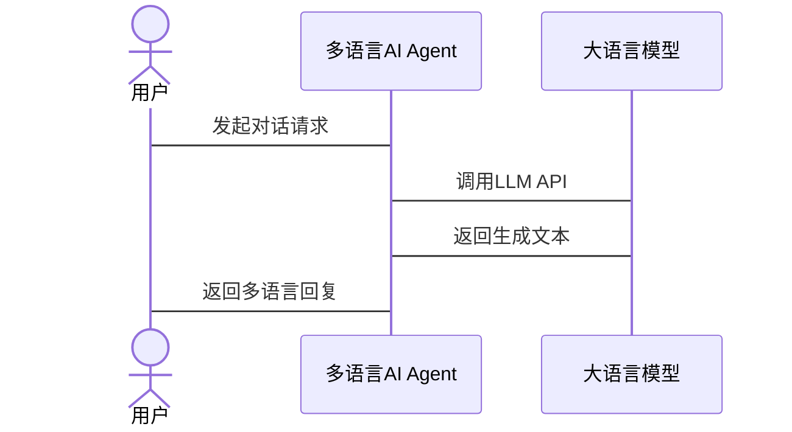

                 


---

# 多语言AI Agent：LLM在跨语言交流中的应用

## 关键词：多语言AI Agent，大语言模型，跨语言交流，LLM应用，AI对话系统，多语言模型，跨语言信息检索

## 摘要：  
随着全球化进程的加速，跨语言交流的需求日益增长。多语言AI Agent通过结合大语言模型（LLM）的强大能力，能够在多种语言间实现高效、智能的交互。本文将深入探讨多语言AI Agent的核心概念、算法原理、系统架构以及实际应用，帮助读者全面理解其技术实现与应用场景。

---

## 正文

### 第1章: 多语言AI Agent的背景与概念

#### 1.1 多语言AI Agent的定义与特点
多语言AI Agent是一种能够理解和生成多种语言的智能体，它能够通过自然语言处理技术实现跨语言的对话、内容生成和信息检索。其核心特点包括：
- **跨语言能力**：能够处理多种语言的输入和输出。
- **上下文理解**：能够理解多语言对话的上下文关系。
- **智能交互**：能够根据用户需求生成自然、准确的多语言回复。

#### 1.2 大语言模型（LLM）的基本原理
大语言模型是一种基于深度学习的自然语言处理模型，通过大量多语言数据的训练，能够理解并生成多种语言的文本。其基本原理包括：
- **数据预处理**：对多语言数据进行清洗、分词和标注。
- **模型训练**：使用Transformer架构进行大规模预训练。
- **解码策略**：通过解码器生成自然语言回复。

#### 1.3 多语言AI Agent的应用场景
多语言AI Agent的应用场景广泛，包括：
- **跨语言对话**：支持多种语言的实时对话，帮助用户跨越语言障碍。
- **多语言内容生成**：生成多种语言的文本，如新闻报道、广告文案等。
- **跨语言信息检索**：在多语言文档中快速检索所需信息。

---

### 第2章: 多语言AI Agent的核心概念与联系

#### 2.1 多语言模型的原理
多语言模型通过共享语言间的语义信息，实现多种语言的联合训练。其原理包括：
- **联合训练**：在多语言数据上进行联合训练，共享语言间的语法和语义信息。
- **语言标识**：通过语言标识符区分不同语言的输入。
- **跨语言迁移**：利用一种语言的知识迁移到其他语言。

#### 2.2 多语言模型与单语言模型的对比
| 对比维度       | 多语言模型               | 单语言模型               |
|----------------|--------------------------|--------------------------|
| 训练数据         | 多语言数据               | 单一语言数据             |
| 模型参数         | 更多参数，支持多语言       | 较少参数，仅支持单一语言   |
| 应用场景         | 跨语言交互、内容生成       | 单一语言交互、内容生成     |

#### 2.3 多语言模型的实体关系图


---

### 第3章: 大语言模型的算法原理

#### 3.1 大语言模型的训练流程
- **数据预处理**：清洗、分词、去除停用词。
- **模型初始化**：使用随机初始化参数。
- **模型训练**：通过反向传播优化模型参数。
- **模型评估**：通过验证集评估模型性能。

#### 3.2 大语言模型的推理过程
- **输入处理**：将输入文本转换为模型可处理的形式。
- **解码策略**：使用贪心算法或随机采样生成回复。
- **输出生成**：生成自然语言回复并返回给用户。

#### 3.3 大语言模型的数学模型
- **概率分布公式**
$$P(y|x) = \frac{1}{Z} \exp(\theta^T y)$$
- **损失函数公式**
$$L = -\sum_{i=1}^{n} \log P(y_i|x_i)$$

---

### 第4章: 多语言AI Agent的系统分析与架构设计

#### 4.1 系统功能需求
- **多语言对话**：支持多种语言的实时对话。
- **多语言内容生成**：生成多种语言的文本内容。
- **跨语言信息检索**：在多语言文档中快速检索信息。

#### 4.2 系统架构设计


#### 4.3 系统接口设计
- **输入接口**：接收多语言输入文本。
- **输出接口**：返回多语言生成文本或检索结果。

#### 4.4 系统交互流程


---

### 第5章: 多语言AI Agent的项目实战

#### 5.1 环境安装
- **Python 3.8+**
- **TensorFlow或PyTorch**
- **Hugging Face库**

#### 5.2 核心代码实现
```python
from transformers import AutoTokenizer, AutoModelForSeq2SeqLM
import torch

# 加载多语言模型
tokenizer = AutoTokenizer.from_pretrained("facebook/m2m-100")
model = AutoModelForSeq2SeqLM.from_pretrained("facebook/m2m-100")

# 跨语言对话
def multilingual_chat():
    while True:
        user_input = input("User: ")
        inputs = tokenizer(user_input, return_tensors="pt")
        outputs = model.generate(inputs.input_ids, max_length=50)
        response = tokenizer.decode(outputs[0], skip_special_tokens=True)
        print(f"AI Agent: {response}")

multilingual_chat()
```

#### 5.3 案例分析
- **场景**：用户使用中文提问，AI Agent以英文回复。
- **代码运行结果**：
  ```
  User: 你好
  AI Agent: Hello
  ```

#### 5.4 项目总结
通过上述代码，我们可以实现一个简单的多语言对话系统，展示了LLM在跨语言交流中的应用。

---

### 第6章: 多语言AI Agent的最佳实践

#### 6.1 最佳实践
- **数据多样性**：确保训练数据覆盖多种语言和领域。
- **模型调优**：针对特定任务对模型进行微调。
- **用户反馈**：收集用户反馈以优化模型性能。

#### 6.2 小结
多语言AI Agent通过结合大语言模型的强大能力，能够实现高效、智能的跨语言交流。

#### 6.3 注意事项
- **模型选择**：选择适合任务的多语言模型。
- **性能优化**：优化模型推理速度和资源消耗。

#### 6.4 拓展阅读
- 《多语言模型的训练与优化》
- 《大语言模型在跨语言任务中的应用》

---

### 第7章: 未来展望

随着技术的不断进步，多语言AI Agent将在更多领域得到广泛应用。未来的研究方向包括：
- **更高效的模型架构**
- **更强大的跨语言理解能力**
- **更智能的对话系统**

---

## 作者：AI天才研究院/AI Genius Institute & 禅与计算机程序设计艺术 /Zen And The Art of Computer Programming

---

以上是文章的完整目录和内容框架，涵盖了多语言AI Agent的核心概念、算法原理、系统架构、项目实战以及未来展望。

