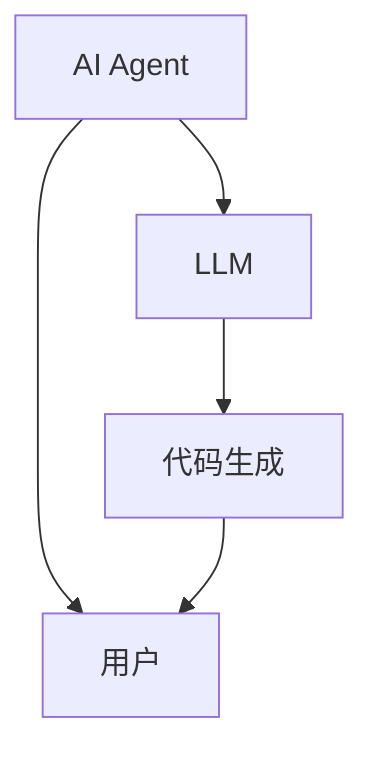

                 


# 多语言编程AI Agent：LLM在软件开发全周期的应用

## 关键词：
多语言编程、AI Agent、LLM、软件开发全周期、应用、系统架构

## 摘要：
本文探讨了多语言编程AI Agent在软件开发全周期中的应用，详细分析了LLM（大型语言模型）如何通过AI技术提升软件开发的效率和质量。文章从背景介绍、核心概念、算法原理、系统架构到项目实战，系统地阐述了多语言编程AI Agent的实现和应用，为读者提供了全面的技术指导和实践参考。

---

## 第一部分：多语言编程AI Agent的背景与概念

### 第1章：多语言编程AI Agent的背景介绍

#### 1.1 问题背景
- **软件开发的挑战**：现代软件开发涉及多种编程语言，开发人员需要掌握多语言编程技能，但在复杂项目中容易出现语法错误和逻辑问题。
- **多语言编程的复杂性**：不同语言有不同的语法规则和编程范式，开发人员在跨语言开发时容易出错，尤其是在团队协作中。
- **AI在软件开发中的潜力**：AI技术，特别是LLM，可以通过自然语言理解和生成，辅助开发人员完成代码编写、调试和优化。

#### 1.2 问题描述
- **软件开发中的痛点**：开发周期长、错误率高、代码维护困难。
- **多语言编程的难点**：语法多样性、跨语言调用复杂性、代码转换困难。
- **LLM在软件开发中的应用需求**：需要一种能够理解多种编程语言、生成高质量代码的AI工具，帮助开发人员提高效率。

#### 1.3 问题解决
- **多语言编程AI Agent的定义**：一种基于LLM的智能助手，能够理解多种编程语言，辅助开发人员完成编码、调试和优化。
- **LLM在软件开发中的具体应用**：代码生成、错误检测、代码解释、跨语言调用辅助。
- **AI Agent的优势与不足**：优势包括高效性、准确性、可扩展性；不足之处在于对上下文的理解有限，需要不断优化。

#### 1.4 边界与外延
- **多语言编程AI Agent的适用范围**：适用于需要多语言开发的项目，尤其是复杂系统和团队协作场景。
- **与传统编程工具的区别**：传统工具依赖规则匹配，AI Agent基于上下文理解和生成，更加智能和灵活。
- **与其他AI技术的对比**：相比其他AI技术，LLM在自然语言处理和生成方面更具优势，能够直接生成代码。

#### 1.5 概念结构与核心要素
- **核心概念的组成**：AI Agent、LLM、编程语言、代码生成。
- **概念之间的关系**：AI Agent通过LLM理解编程语言的需求，生成代码。
- **核心要素的特征分析**：AI Agent具备学习能力，LLM具备生成能力，编程语言提供语法支持。

### 第2章：多语言编程AI Agent的核心概念与联系

#### 2.1 AI Agent与LLM的关系
- **AI Agent**：作为智能助手，AI Agent负责接收用户需求，调用LLM生成代码。
- **LLM**：负责理解和生成自然语言文本，能够根据上下文生成符合需求的代码。
- **关系图**：
  ```mermaid
  graph TD
    AIAgent[AI Agent] --> LLM[LLM]
    LLM --> Code[代码生成]
    AIAgent --> User[用户]
    Code --> User
  ```

#### 2.2 核心概念的原理
- **AI Agent的原理**：接收用户输入，解析需求，调用LLM生成代码。
- **LLM的原理**：基于大量编程语言数据，生成符合需求的代码片段。

#### 2.3 实体关系图
- **实体关系表**：
  | 实体 | 关系 | 目的实体 |
  |------|------|----------|
  | AI Agent | 接收 | 用户需求 |
  | LLM | 生成 | 代码片段 |
  | 代码片段 | 提供 | AI Agent |

---

## 第二部分：算法原理讲解

### 第3章：算法原理讲解

#### 3.1 LLM的工作原理
- **LLM的输入输出过程**：
  1. 接收用户输入（如自然语言描述）。
  2. 分析需求，生成代码片段。
  3. 返回生成的代码。
- **LLM的数学模型**：
  - 使用Transformer架构，包含编码器和解码器。
  - 通过自注意力机制捕捉上下文信息。

#### 3.2 算法流程图


#### 3.3 代码实现
- **Python代码示例**：
  ```python
  def generate_code(prompt):
      # 调用LLM生成代码
      response = llm.generate_code(prompt)
      return response
  ```

#### 3.4 数学模型
- **概率分布**：
  $$ P(y|x) = \frac{P(x,y)}{P(x)} $$
- **损失函数**：
  $$ \text{Loss} = -\sum_{i=1}^{n} \log P(y_i|x) $$

---

## 第三部分：系统分析与架构设计

### 第4章：系统分析与架构设计

#### 4.1 项目背景
- **项目目标**：开发一个多语言编程AI Agent，辅助开发人员完成软件开发任务。
- **项目范围**：支持多种编程语言，如Python、Java、C++。

#### 4.2 系统功能设计
- **领域模型**：
  ```mermaid
  classDiagram
      class AI_Agent {
          receive_request()
          send_request()
          receive_response()
      }
      class LLM {
          generate_code()
      }
      AI_Agent --> LLM
  ```

#### 4.3 系统架构设计
- **架构图**：
  ```mermaid
  graph TD
      Client --> AI_Agent
      AI_Agent --> LLM
      LLM --> Database
      Database --> AI_Agent
      AI_Agent --> Client
  ```

#### 4.4 接口设计
- **API接口**：
  - 输入：用户需求描述。
  - 输出：生成的代码片段。

#### 4.5 交互序列图
- **交互流程**：
  ```mermaid
  sequenceDiagram
      Client -> AI_Agent: 提交需求
      AI_Agent -> LLM: 请求代码生成
      LLM -> AI_Agent: 返回代码
      AI_Agent -> Client: 返回代码
  ```

---

## 第四部分：项目实战

### 第5章：项目实战

#### 5.1 环境安装
- **工具安装**：
  - Python 3.9+
  - LLM库（如Hugging Face的GPT模型）

#### 5.2 核心代码实现
- **代码示例**：
  ```python
  import llm_library

  def main():
      prompt = "生成一个Python函数，计算两个数的和。"
      code = llm.generate_code(prompt)
      print(code)

  if __name__ == "__main__":
      main()
  ```

#### 5.3 代码解读
- **代码功能**：接收用户输入，调用LLM生成代码，输出结果。

#### 5.4 案例分析
- **案例1**：生成一个Python函数，计算两个数的和。
  - 用户输入：计算两个数的和。
  - AI Agent调用LLM生成代码：
    ```python
    def add_numbers(a, b):
        return a + b
    ```

#### 5.5 项目小结
- **项目总结**：展示了AI Agent如何通过LLM生成代码，简化了开发过程。

---

## 第五部分：最佳实践与注意事项

### 第6章：最佳实践

#### 6.1 最佳实践
- **模型优化**：定期更新LLM模型，提升生成代码的准确性。
- **错误处理**：增加错误检测机制，处理生成代码中的潜在问题。

#### 6.2 小结
- **总结**：多语言编程AI Agent通过LLM技术，显著提升了软件开发效率。

#### 6.3 注意事项
- **数据隐私**：确保生成代码的数据安全，避免敏感信息泄露。
- **性能优化**：在高并发场景下，优化AI Agent的响应速度。

#### 6.4 拓展阅读
- **推荐书籍**：
  - 《Effective Python》
  - 《Programming in C++》
- **技术博客**：
  - [Hugging Face的LLM文档](https://huggingface.co/transformers)

---

## 作者：AI天才研究院 & 禅与计算机程序设计艺术

---

**注**：由于篇幅限制，上述内容为部分章节的简要展示，完整文章将包含更详细的内容和图表。

