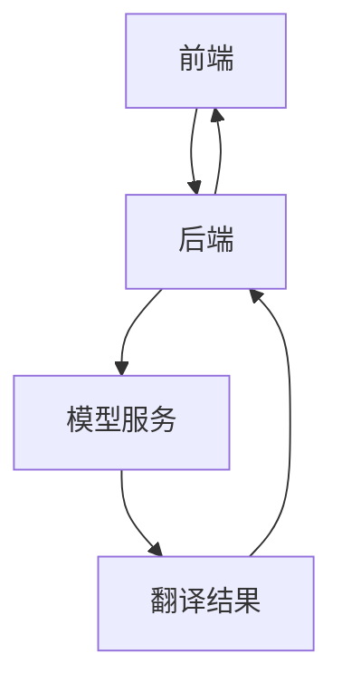

                 

<think>
好的，我需要根据用户提供的《多语言翻译 AI Agent：LLM 在跨语言交流中的应用》的目录大纲来撰写一篇详细的技术博客文章。文章需要符合以下要求：

1. **标题**：《多语言翻译 AI Agent：LLM 在跨语言交流中的应用》
2. **关键词**：多语言翻译、AI代理、LLM、跨语言交流、自然语言处理、大语言模型
3. **摘要**：介绍文章的核心内容和主题思想，强调LLM在多语言翻译中的应用及其优势。
4. **章节内容**：按照目录大纲，逐步展开每一部分的内容，包括背景介绍、核心概念与联系、算法原理、系统分析与架构设计、项目实战、最佳实践等，每个部分需要详细讲解，确保内容丰富且逻辑清晰。
5. **格式要求**：使用Markdown格式，包含数学公式、图表（如ER图、流程图、类图等），并在适当位置插入代码示例。
6. **作者信息**：文章末尾注明作者信息。

在撰写过程中，我需要确保每个章节的内容详细具体，涵盖所有必要的技术细节，并且语言简洁明了，适合技术读者阅读。

---

## 摘要

在当今全球化的背景下，多语言翻译技术的需求日益增长。传统的翻译方法和工具在处理复杂的语义和文化差异时显得力不从心。随着大语言模型（LLM）的崛起，AI代理在多语言翻译领域展现出了巨大的潜力。本文将深入探讨LLM在跨语言交流中的应用，从背景介绍到系统设计，再到实际案例分析，全面解析多语言翻译AI代理的核心原理和实现方式。通过本文，读者将能够理解如何利用LLM构建高效的多语言翻译系统，并掌握相关的技术细节和最佳实践。

---

## 第一部分：背景介绍

### 第1章：多语言翻译的背景与挑战

#### 1.1 多语言翻译的现状

多语言翻译在现代社会中扮演着至关重要的角色。随着全球化的发展，跨语言交流的需求急剧增加。无论是商务合作、国际会议，还是社交媒体互动，准确的翻译都是确保信息传递的关键。然而，传统的翻译技术，如基于规则的翻译和统计机器翻译，由于其固有的局限性，难以应对复杂的语义理解和文化差异。

#### 1.2 多语言翻译中的问题背景

翻译不仅仅是语言的转换，更涉及语境、文化和语用学的理解。例如，同一个词语在不同语言和文化背景下可能有不同的含义。传统的翻译方法往往难以捕捉这些细微差别，导致翻译结果的不准确。此外，实时翻译和大规模数据处理的需求也对翻译技术提出了更高的要求。

#### 1.3 AI代理的概念与优势

AI代理是一种能够自主执行任务的智能系统，其核心能力包括感知、推理和行动。在多语言翻译中，AI代理可以实时理解和生成多种语言的文本，具备高效性、准确性和智能化的特点。通过整合大语言模型，AI代理能够显著提升翻译质量，同时降低人工干预的需求。

---

### 第2章：大语言模型（LLM）的核心原理

#### 2.1 LLM的基本原理

大语言模型是一种基于深度学习的自然语言处理模型，其核心结构通常采用Transformer架构。Transformer由编码器和解码器组成，编码器负责将输入文本转换为上下文表示，解码器则根据编码器的输出生成目标语言的文本。这种结构使得LLM能够捕捉到语言中的长距离依赖关系，从而实现更准确的翻译。

---

### 第3章：核心概念的对比与实体关系图

#### 3.1 LLM与传统翻译模型的对比

传统的翻译模型主要依赖规则和统计方法，而LLM则基于大规模数据的预训练和微调。LLM的优势在于其强大的上下文理解和生成能力，能够处理复杂和模糊的语义信息。下表对比了三种翻译模型的特点：

| 模型类型       | 基于规则的翻译 | 统计机器翻译 | 基于LLM的翻译 |
|----------------|----------------|--------------|---------------|
| 核心原理       | 翻译规则的匹配 | 统计概率模型 | 大模型预训练 |
| 优点           | 准确性高       | 处理大规模数据 | 翻译质量高     |
| 缺点           | 规则难以覆盖所有情况 | 训练数据依赖 | 需要大量计算资源 |

#### 3.2 实体关系图（ER图）

下图展示了多语言翻译AI代理的核心实体关系。用户输入文本，AI代理通过LLM进行翻译，输出目标语言的文本。系统还支持多种语言的存储和管理。

```mermaid
er
  %%{init: { 'title': '多语言翻译AI代理的实体关系图' }}
  classDiagram
    class 用户
    class 翻译请求
    class 翻译结果
    class 语言
    用户 --> 翻译请求 : 提交翻译请求
    翻译请求 --> 翻译结果 : 返回翻译结果
    翻译请求 --> 语言 : 源语言和目标语言
    翻译结果 --> 语言 : 目标语言文本
```

---

## 第四部分：算法原理与数学模型

### 第4章：LLM的算法原理

#### 4.1 Transformer架构

Transformer由编码器和解码器组成，编码器将输入文本转换为上下文向量，解码器根据这些向量生成目标语言的文本。其核心组件包括多头注意力机制和前馈网络。

#### 4.2 注意力机制

注意力机制通过计算输入序列中每个词的重要性，赋予关键词更高的权重。数学公式如下：

$$
\text{Attention}(Q, K, V) = \text{softmax}\left(\frac{QK^T}{\sqrt{d_k}}\right)V
$$

其中，$Q$、$K$、$V$分别为查询、键和值向量。

---

### 第5章：数学模型

多语言翻译的数学模型基于Transformer架构，通过预训练和微调实现翻译任务。预训练目标是使模型在大规模单语言数据上学习语言表示，微调则在特定翻译任务上优化模型参数。

---

## 第五部分：系统分析与架构设计

### 第6章：系统功能设计

#### 6.1 系统功能模块

系统主要包括输入处理、翻译引擎和输出展示三个模块。输入处理负责接收用户请求，翻译引擎基于LLM进行翻译，输出展示将结果呈现给用户。

#### 6.2 系统架构设计

下图展示了多语言翻译AI代理的系统架构。系统包括前端、后端和模型服务三部分。前端接收用户输入，后端处理请求，模型服务负责翻译任务。



---

## 第六部分：项目实战

### 第7章：环境安装与核心代码实现

#### 7.1 环境安装

需要安装Python、TensorFlow和Hugging Face库：

```bash
pip install python==3.8
pip install tensorflow==2.5
pip install transformers==4.12
```

#### 7.2 核心代码实现

以下是基于Hugging Face库实现多语言翻译的代码示例：

```python
from transformers import AutoTokenizer, AutoModelForSeq2Seq
import torch

# 加载模型和分词器
model_name = "facebook/m2m-large-4m-1632"
tokenizer = AutoTokenizer.from_pretrained(model_name)
model = AutoModelForSeq2Seq.from_pretrained(model_name)

def translate(text, source_lang, target_lang):
    inputs = tokenizer(text, return_tensors="pt", padding=True, truncation=True)
    outputs = model.generate(**inputs, forced_bos_token_id=tokenizer.get_special_tokens_mask(1)[0])
    return tokenizer.decode(outputs[0], skip_special_tokens=True)

# 示例
text = "Hello, how are you?"
source_lang = "en"
target_lang = "zh"
print(translate(text, source_lang, target_lang))
```

---

## 第七部分：最佳实践与小结

### 第8章：最佳实践

- **模型选择**：根据需求选择合适的LLM模型，如M2M或_mBART。
- **数据预处理**：确保训练数据的多样性和质量。
- **性能优化**：通过并行计算和模型剪枝提升翻译效率。

### 第9章：小结与展望

本文详细探讨了多语言翻译AI代理的实现和应用，从背景介绍到系统设计，再到实际案例分析，全面解析了LLM在跨语言交流中的潜力和优势。未来，随着AI技术的不断进步，多语言翻译将更加智能化和高效化。

---

## 作者信息

作者：AI天才研究院/AI Genius Institute & 禅与计算机程序设计艺术 /Zen And The Art of Computer Programming

---

**注**：以上内容为思考过程和部分章节的初步内容，实际撰写时需要根据具体需求进行调整和扩展。

