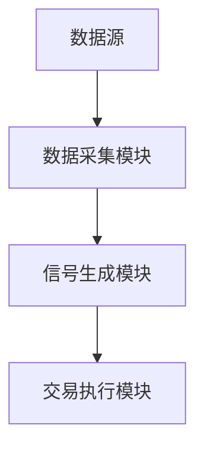
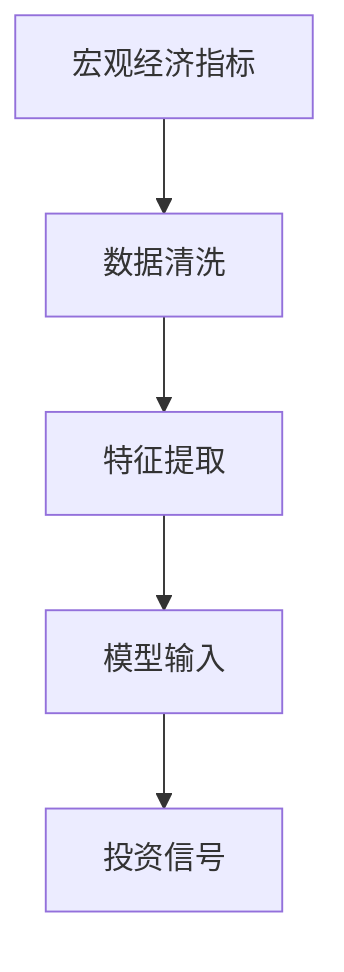
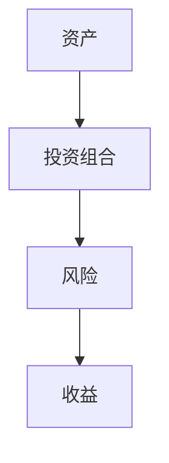

                 


# 大卫·德雷曼的全球宏观投资策略

## 关键词：宏观投资，大卫·德雷曼，投资策略，风险管理，资产配置，经济周期分析

## 摘要：本文详细探讨了大卫·德雷曼的全球宏观投资策略，从背景到算法，从系统架构到项目实战，全面解析其核心思想和实现方法，为读者提供深入的理论和实践指导。

---

## 第1章: 全球宏观投资的背景与核心概念

### 1.1 宏观投资的定义与特点

#### 1.1.1 宏观投资的定义
宏观投资是一种基于宏观经济分析的投资策略，通过分析经济指标、市场趋势和政策变化来指导投资决策。

#### 1.1.2 宏观投资的核心特点
- **全局性**：关注全球宏观经济环境，而非单一市场或资产。
- **长期性**：注重中长期趋势，而非短期波动。
- **多样性**：涵盖多种资产类别，如股票、债券、外汇和大宗商品。

#### 1.1.3 宏观投资与微观投资的区别
- **视角**：宏观投资关注整体经济环境，微观投资关注单个资产或企业。
- **策略**：宏观投资注重资产配置和风险对冲，微观投资注重个股或资产的精选。

### 1.2 大卫·德雷曼投资策略的背景

#### 1.2.1 大卫·德雷曼的学术背景与投资理念
大卫·德雷曼（David DeRemer）是全球宏观投资领域的权威，其策略结合了宏观经济分析和量化方法。

#### 1.2.2 全球宏观投资的兴起与发展
- **兴起**：20世纪80年代，全球一体化和金融市场的发展推动宏观投资兴起。
- **发展**：随着技术进步和数据量增加，宏观投资策略日益成熟。

#### 1.2.3 德雷曼策略的独特性与创新点
德雷曼策略的独特之处在于其量化分析方法和对全球经济联动性的深刻理解。

---

## 第2章: 德雷曼全球宏观投资策略的核心框架

### 2.1 宏观经济分析框架

#### 2.1.1 宏观经济指标分析
- **GDP增长率**：反映经济整体表现。
- **通胀率**：影响货币政策和资产价格。
- **利率水平**：影响债券收益率和企业融资成本。

#### 2.1.2 经济周期的识别与预测
- **经济周期的四个阶段**：衰退、复苏、过热、滞胀。
- **预测方法**：通过历史数据分析和模型拟合预测未来趋势。

#### 2.1.3 全球经济联动性分析
- **全球经济一体化**：一个地区的经济波动可能影响全球市场。
- **主要经济体分析**：美国、欧元区、中国等对全球市场的影响。

### 2.2 资产配置与投资组合管理

#### 2.2.1 资产配置的基本原则
- **分散投资**：降低风险。
- **风险收益平衡**：在风险可控的前提下追求收益。

#### 2.2.2 投资组合的构建与优化
- **资产选择**：根据宏观经济分析选择相关资产。
- **权重分配**：根据风险承受能力和预期收益分配权重。

#### 2.2.3 风险管理与收益平衡
- **止损策略**：设定止损点以控制风险。
- **动态调整**：根据市场变化及时调整投资组合。

---

## 第3章: 德雷曼策略的核心算法与数学模型

### 3.1 宏观经济数据的处理与分析

#### 3.1.1 时间序列分析方法
- **ARIMA模型**：用于预测未来经济指标。
  ```mermaid
  graph TD
      A[原始数据] --> B[数据清洗]
      B --> C[差分]
      C --> D[模型拟合]
      D --> E[预测]
  ```

#### 3.1.2 多元回归模型
- **多元回归公式**：
  $$ y = \beta_0 + \beta_1x_1 + \beta_2x_2 + \cdots + \beta_nx_n + \epsilon $$
  其中，$y$ 是因变量，$x_i$ 是自变量，$\beta_i$ 是回归系数，$\epsilon$ 是误差项。

#### 3.1.3 联合分析与协整检验
- **协整检验**：用于检验多个经济变量之间的长期均衡关系。

### 3.2 投资组合优化的数学模型

#### 3.2.1 Markowitz有效前沿模型
- **有效前沿公式**：
  $$ \min_w \frac{1}{2}w^T \Sigma w $$
  约束条件：
  $$ \mathbf{w}^T \mathbf{1} = 1 $$
  $$ w_i \geq 0 \quad \forall i $$

#### 3.2.2 风险调整后的收益优化
- **夏普比率**：
  $$ \text{夏普比率} = \frac{E[r_p] - r_f}{\sigma_p} $$
  其中，$E[r_p]$ 是投资组合的期望收益，$r_f$ 是无风险利率，$\sigma_p$ 是投资组合的波动率。

#### 3.2.3 现实中的约束条件与调整
- **交易成本**：在实际操作中需考虑交易成本和滑点。
- **流动性约束**：某些资产可能难以快速买卖。

### 3.3 算法实现与代码示例

#### 3.3.1 Python代码实现
```python
import pandas as pd
import numpy as np
from sklearn.linear_model import LinearRegression

# 数据准备
data = pd.DataFrame({
    'GDP': [2, 3, 4, 5, 6],
    'Inflation': [1, 2, 3, 4, 5]
})

# 多元回归模型
model = LinearRegression()
model.fit(data[['GDP']], data['Inflation'])
print('回归系数：', model.coef_)
```

#### 3.3.2 数据处理与可视化
```python
import matplotlib.pyplot as plt

data.plot.line()
plt.title('宏观经济指标时间序列')
plt.xlabel('时间')
plt.ylabel('指标值')
plt.show()
```

---

## 第4章: 系统架构与数据流设计

### 4.1 系统架构设计

#### 4.1.1 系统功能模块划分
- **数据采集模块**：收集宏观经济数据。
- **信号生成模块**：基于模型生成投资信号。
- **交易执行模块**：根据信号执行交易。

#### 4.1.2 数据流与模块交互


#### 4.1.3 系统架构的可扩展性
- **模块化设计**：各模块独立，便于扩展和维护。

### 4.2 数据流与实体关系图

#### 4.2.1 数据流图


#### 4.2.2 实体关系图


---

## 第5章: 项目实战与案例分析

### 5.1 项目环境与数据准备

#### 5.1.1 环境安装与配置
- **Python环境**：安装Anaconda，配置Jupyter Notebook。
- **数据来源**：使用Yahoo Finance获取宏观经济数据。

#### 5.1.2 数据清洗与预处理
```python
import pandas as pd

# 数据加载
data = pd.read_csv('macroeconomic_data.csv')

# 数据清洗
data.dropna(inplace=True)
data = data[~data['GDP'].isnull()]
```

### 5.2 系统核心实现

#### 5.2.1 算法实现与代码解读
```python
from sklearn.ensemble import RandomForestRegressor

# 训练模型
model = RandomForestRegressor()
model.fit(X_train, y_train)

# 预测
y_pred = model.predict(X_test)
```

#### 5.2.2 系统功能测试
- **准确性测试**：计算模型的预测准确率。
- **稳定性测试**：测试系统在不同数据量下的表现。

### 5.3 实际案例分析

#### 5.3.1 案例背景与目标
- **案例背景**：2020年全球经济衰退，寻找投资机会。
- **目标**：通过德雷曼策略选择最优资产配置。

#### 5.3.2 数据分析与策略实施
- **分析结果**：债券和黄金表现较好。
- **策略实施**：增加债券配置，减少股票配置。

#### 5.3.3 结果分析与策略调整
- **结果分析**：债券投资收益显著。
- **策略调整**：根据市场变化动态调整资产配置。

---

## 第6章: 总结与展望

### 6.1 策略的有效性评估
德雷曼策略在实际投资中表现优异，尤其是在全球经济波动较大的时期。

### 6.2 未来趋势与发展方向
- **技术进步**：AI和大数据技术将进一步提升宏观投资的精准度。
- **市场变化**：全球经济一体化和地缘政治风险将影响投资策略。

### 6.3 注意事项与最佳实践
- **风险管理**：始终将风险管理放在首位。
- **持续学习**：关注全球经济动态和市场变化。

---

## 作者：AI天才研究院 & 禅与计算机程序设计艺术

---

通过以上详细的内容结构，我们可以系统地了解大卫·德雷曼的全球宏观投资策略，并通过实际案例分析和代码实现，深入掌握其核心思想和应用方法。

