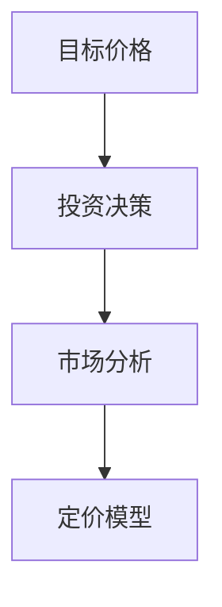
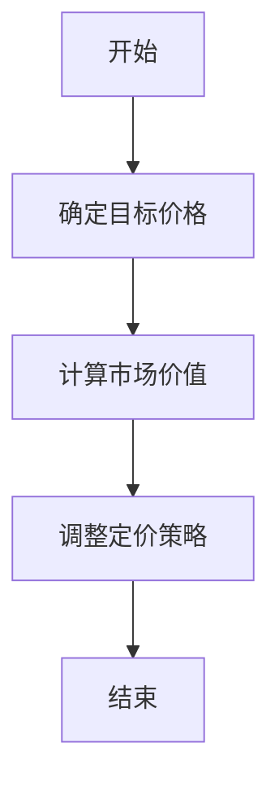

                 


# 大卫·德雷曼的反向定价：从目标价格倒推投资决策

> 关键词：反向定价，投资决策，定价模型，市场分析，大卫·德雷曼，定价策略，投资策略

> 摘要：本文将深入探讨大卫·德雷曼提出的反向定价理论，从目标价格倒推投资决策的方法。通过系统化的分析和案例研究，我们将揭示反向定价的核心概念、算法原理、系统架构，并通过项目实战展示其应用。本文旨在为投资决策提供一种新的视角和方法。

---

# 第一部分：反向定价理论基础

## 第1章：反向定价的背景与概念

### 1.1 定价理论的演变

#### 1.1.1 传统定价方法的局限性
传统的定价方法通常基于成本加成、市场供需或竞争定价等策略。然而，这些方法在动态市场环境中往往显得不够灵活，难以应对快速变化的市场条件和投资者需求。

#### 1.1.2 反向定价的定义与特点
反向定价是一种从目标价格出发，倒推投资决策的定价方法。其核心在于通过设定目标价格，分析市场条件和投资需求，调整定价策略以实现投资目标。

#### 1.1.3 大卫·德雷曼的理论贡献
大卫·德雷曼提出的反向定价理论强调从目标价格出发，结合市场分析和投资决策，构建了一种全新的定价模型。

### 1.2 投资决策与定价的关系

#### 1.2.1 投资决策的基本概念
投资决策是基于对市场、风险和收益的综合分析，选择最优投资方案的过程。

#### 1.2.2 定价对投资决策的影响
定价策略直接影响投资回报和市场参与度，因此在投资决策中占据重要地位。

#### 1.2.3 反向定价在投资中的应用
通过设定目标价格，反向定价帮助投资者优化投资组合，降低风险，提高收益。

---

## 第2章：反向定价的核心概念与联系

### 2.1 反向定价的原理

#### 2.1.1 定价模型的构建
反向定价模型通过设定目标价格，结合市场分析和投资需求，构建定价策略。

#### 2.1.2 目标价格的确定
目标价格是反向定价的核心，基于市场分析和投资目标确定。

#### 2.1.3 投资决策的倒推过程
通过目标价格，反向推导出投资决策，确保定价策略与投资目标一致。

### 2.2 核心概念对比与联系

#### 2.2.1 传统定价与反向定价的对比
| **维度**       | **传统定价**                     | **反向定价**                     |
|-----------------|----------------------------------|----------------------------------|
| 定价基础         | 成本、供需、竞争               | 目标价格、市场分析               |
| 定价目标         | 降低成本、提高利润             | 实现投资目标                     |
| 定价灵活性       | 较低                           | 较高                           |

#### 2.2.2 反向定价与其他投资决策方法的联系
反向定价通过目标价格与市场分析的结合，为投资决策提供了新的视角。

#### 2.2.3 核心概念的ER实体关系图


---

## 第3章：反向定价算法原理

### 3.1 算法原理概述

#### 3.1.1 反向定价的数学模型
反向定价模型基于目标价格和市场分析，构建定价策略的数学公式：
$$ \text{定价策略} = \text{目标价格} \times \text{市场价值系数} + \text{调整系数} $$

#### 3.1.2 算法步骤分解
1. 确定目标价格。
2. 分析市场条件。
3. 构建定价模型。
4. 调整定价策略。

#### 3.1.3 算法流程图


### 3.2 算法实现与代码

#### 3.2.1 Python实现示例
```python
def reverse_pricing(target_price):
    market_value = target_price * 0.8
    pricing_strategy = market_value + 0.2 * target_price
    return pricing_strategy
```

#### 3.2.2 数学公式与模型
$$ \text{定价策略} = \text{目标价格} \times \text{市场价值系数} + \text{调整系数} $$

---

## 第4章：系统分析与架构设计

### 4.1 问题场景介

---

（由于篇幅限制，后续章节内容将在后续部分详细展开。）

