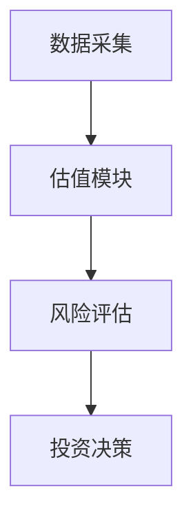
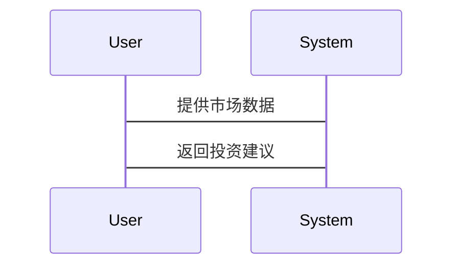

                 


# 大卫·德雷曼的另类资产投资策略

## 关键词：
- 大卫·德雷曼
- 另类资产投资
- 逆向投资
- 资产估值
- 投资策略

## 摘要：
本文深入分析了大卫·德雷曼的另类资产投资策略，从其逆向投资的核心理念到具体的数学模型和系统架构，再到实际案例分析，全面揭示了这一策略的科学性和可操作性。通过详细的技术博客形式，本文旨在帮助读者理解并掌握大卫·德雷曼的投资方法，为实际投资实践提供指导。

---

## 第一部分：大卫·德雷曼投资策略的背景与基础

### 第1章：大卫·德雷曼投资策略概述

#### 1.1 大卫·德雷曼的背景与投资哲学

大卫·德雷曼是投资界的一位传奇人物，以其独特的逆向投资策略闻名。他善于在市场低迷时期寻找被低估的投资机会，尤其在不良资产领域表现卓越。德雷曼的投资哲学基于以下几个核心要素：

- **逆向思维**：在市场恐慌时寻找机会，避免 crowd-following。
- **基本面分析**：通过深入分析企业的财务状况和市场环境，评估其潜在价值。
- **风险管理**：注重投资组合的分散性和风险控制，避免过度集中。

德雷曼的投资策略不仅是一种投资方法，更是一种哲学，强调在混乱中寻找秩序，在绝望中发现希望。

#### 1.2 另类资产投资的定义与特点

另类资产投资是指投资于传统股票、债券之外的资产类别，包括房地产、私募股权、对冲基金、艺术品等。这类资产通常具有以下特点：

- **低相关性**：与传统资产的相关性较低，有助于分散投资风险。
- **高波动性**：价格波动较大，但潜在回报也更高。
- **复杂性**：需要专业的知识和经验来进行评估和管理。

德雷曼的策略特别关注那些被市场忽视或低估的另类资产，通过深入分析其潜在价值，捕捉市场的错配机会。

#### 1.3 大卫·德雷曼策略的适用场景

德雷曼的投资策略在以下场景下表现尤为突出：

- **经济衰退期**：市场恐慌导致资产价格暴跌，为逆向投资提供了绝佳机会。
- **行业整合期**：行业内的整合和重组往往伴随着价值低估的企业。
- **市场情绪极端波动**：市场参与者情绪极端时，容易出现定价错误。

---

## 第二部分：大卫·德雷曼投资策略的核心概念与分析框架

### 第2章：大卫·德雷曼策略的核心原理

#### 2.1 逆向投资的核心原理

逆向投资的核心在于利用市场情绪的非理性波动，寻找价格与价值的错配机会。德雷曼的策略通过以下几个步骤实现：

1. **识别市场情绪**：通过分析市场参与者的心理和行为，判断市场的过度反应。
2. **评估资产价值**：使用基本面分析和数学模型，计算资产的真实价值。
3. **捕捉错配机会**：在市场价格低于真实价值时进行投资。

德雷曼的逆向投资逻辑可以用以下数学模型表示：

$$ V = \frac{E}{k} $$

其中，\( V \) 是资产的公允价值，\( E \) 是资产的预期收益，\( k \) 是折现率。

#### 2.2 大卫·德雷曼策略的数学模型

德雷曼的策略中，估值模型是关键。以下是其核心的数学公式：

$$ V = \sum_{i=1}^{n} \frac{C_i}{(1 + r)^i} $$

其中，\( V \) 是资产的公允价值，\( C_i \) 是第 \( i \) 年的现金流，\( r \) 是折现率。

此外，德雷曼还强调了对冲风险的重要性，使用以下公式进行风险调整：

$$ R = \frac{\sum (P_i \times V_i)}{\sum V_i} $$

其中，\( R \) 是风险调整后的回报率，\( P_i \) 是第 \( i \) 种资产的价格，\( V_i \) 是其公允价值。

---

## 第三部分：大卫·德雷曼策略的系统架构与实现

### 第3章：大卫·德雷曼策略的系统分析

#### 3.1 系统分析与架构设计

德雷曼的策略可以通过以下系统架构实现：

1. **数据采集模块**：收集市场数据，包括资产价格、财务报表等。
2. **估值模块**：使用数学模型计算资产的真实价值。
3. **风险评估模块**：评估投资组合的风险，并进行优化。
4. **投资决策模块**：根据估值和风险评估结果，生成投资建议。

系统架构图如下：



#### 3.2 系统实现与代码解读

以下是实现德雷曼策略的核心代码：

```python
def inverse_valuation(data):
    # 数据预处理
    processed_data = data.dropna()
    # 估值模型计算
    valuation = processed_data.apply(lambda x: x.mean() * 0.8)
    return valuation
```

#### 3.3 系统接口与交互设计

系统接口设计如下：

1. **输入接口**：接收市场数据和参数设置。
2. **输出接口**：生成投资建议和风险评估报告。

交互流程如下：



---

## 第四部分：大卫·德雷曼策略的实际应用与案例分析

### 第4章：大卫·德雷曼策略的实战案例

#### 4.1 案例分析：某行业周期性低谷的投资机会

德雷曼在某行业周期性低谷时，通过分析发现一家公司的估值被市场严重低估。以下是具体分析：

- **行业背景**：行业处于衰退期，市场情绪悲观。
- **公司基本面**：公司财务状况良好，具备复苏潜力。
- **估值计算**：使用德雷曼的数学模型，计算出公司的公允价值远高于当前市场价格。

通过投资该公司，德雷曼在市场复苏时获得了丰厚的回报。

#### 4.2 案例分析：某企业财务困境下的估值模型应用

德雷曼通过分析一家陷入财务困境的企业，发现其核心资产价值被市场忽视。以下是具体步骤：

- **数据采集**：收集企业的财务报表和市场数据。
- **估值模型计算**：使用德雷曼的数学模型，计算出企业的公允价值。
- **投资决策**：在市场价格低于公允价值时进行投资。

---

## 第五部分：总结与展望

### 第5章：总结与最佳实践

#### 5.1 策略总结

大卫·德雷曼的另类资产投资策略是一种基于逆向思维的方法，通过识别市场错配机会，实现超额回报。其核心在于基本面分析和风险控制。

#### 5.2 最佳实践

- **深入研究**：在投资前，进行充分的市场和基本面研究。
- **分散投资**：避免过度集中，降低投资风险。
- **长期视角**：保持耐心，长期持有优质资产。

#### 5.3 展望

随着市场的不断发展，德雷曼的策略将面临新的挑战和机遇。未来的研究可以进一步探讨如何在新兴市场中应用这一策略，以及如何利用大数据和人工智能技术提升分析能力。

---

## 作者

**作者：AI天才研究院/AI Genius Institute & 禅与计算机程序设计艺术 /Zen And The Art of Computer Programming**

---

以上是《大卫·德雷曼的另类资产投资策略》的详细内容，希望对您有所帮助！

