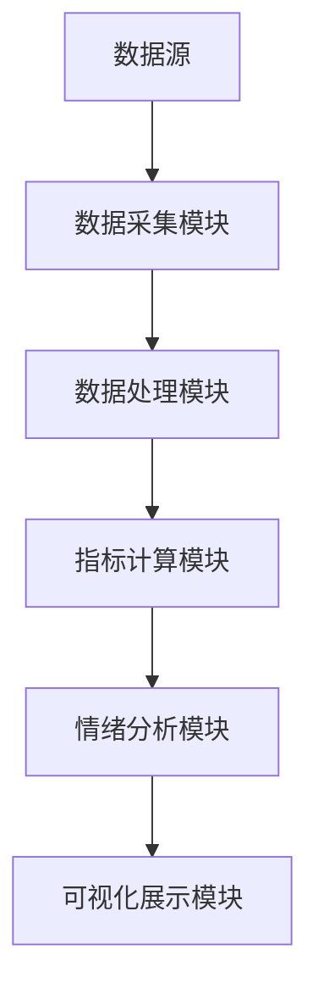

                 

# 大卫·德雷曼的宏观经济指标解读

## 关键词：
- 宏观经济指标
- 大卫·德雷曼
- 市场情绪
- 投资决策
- 经济预测

## 摘要：
大卫·德雷曼是研究市场情绪和宏观经济指标的权威专家。本文将深入解读德雷曼提出的宏观经济指标体系，探讨其在投资决策中的应用，并通过实际案例分析，展示如何利用这些指标进行市场预测和投资策略的制定。

---

# 第一部分：宏观经济指标的基础与应用

## 第1章：宏观经济指标概述

### 1.1 宏观经济指标的基本概念

#### 1.1.1 宏观经济指标的定义
宏观经济指标是衡量经济整体运行状况的关键数据，包括GDP、失业率、通货膨胀率等。这些指标反映了经济的健康状况和未来趋势。

#### 1.1.2 宏观经济指标的核心要素
- **国内生产总值（GDP）**：衡量一个国家或地区的经济规模。
- **失业率**：反映劳动力市场的就业情况。
- **通货膨胀率（CPI）**：衡量物价水平的变化。
- **利率**：影响资金成本和投资行为。
- **财政赤字**：政府支出与收入的差额。

#### 1.1.3 宏观经济指标的分类与层次
宏观经济指标可以分为总量指标和结构指标。总量指标如GDP、CPI，结构指标如行业就业率、区域经济数据。

### 1.2 大卫·德雷曼的宏观经济指标分析方法

#### 1.2.1 德雷曼宏观经济指标体系的构建
德雷曼提出了一套基于市场情绪的宏观经济指标体系，将经济数据与投资者情绪相结合，预测市场走势。

#### 1.2.2 德雷曼指标与市场情绪的关系
德雷曼认为，市场情绪是影响经济指标的重要因素。通过分析市场情绪的变化，可以提前预测经济指标的波动。

#### 1.2.3 德雷曼指标在投资决策中的应用
德雷曼指标帮助投资者在市场波动中找到投资机会，特别是在经济周期变化中捕捉市场拐点。

---

## 第2章：宏观经济指标的核心概念与联系

### 2.1 宏观经济指标的核心概念

#### 2.1.1 GDP与GDP平减指数
GDP衡量经济总量，GDP平减指数衡量价格变化，两者结合可以分析经济的实际增长情况。

#### 2.1.2 失业率与劳动力市场指标
失业率反映劳动力市场的健康状况，低失业率通常意味着经济繁荣。

#### 2.1.3 消费者价格指数（CPI）与通货膨胀
CPI是衡量通货膨胀的重要指标，影响货币政策和投资者决策。

#### 2.1.4 利率与货币政策
利率是货币政策的核心工具，直接影响借贷成本和投资行为。

#### 2.1.5 财政赤字与政府支出
财政赤字反映了政府的财政健康状况，影响市场对经济的信心。

### 2.2 宏观经济指标之间的关系

#### 2.2.1 经济周期与指标波动
经济周期（衰退、复苏、繁荣、衰退）与各项指标密切相关，例如GDP在衰退期下降，失业率上升。

#### 2.2.2 指标之间的相互影响
例如，高利率可能导致企业借贷成本上升，进而影响投资和就业。

#### 2.2.3 指标与市场情绪的关联
市场情绪受经济指标影响，例如高通货膨胀可能导致市场恐慌，引发抛售行为。

---

## 第3章：宏观经济指标的数学模型与公式

### 3.1 宏观经济指标的数学模型

#### 3.1.1 GDP核算公式
$$ GDP = C + I + G + (X - M) $$
其中，C为消费，I为投资，G为政府支出，X为出口，M为进口。

#### 3.1.2 消费者价格指数（CPI）计算公式
$$ CPI = \sum (p_i \times q_i) / \sum q_i $$
其中，\( p_i \) 为商品价格，\( q_i \) 为商品数量。

### 3.2 德雷曼指标的数学模型

#### 3.2.1 市场情绪指数计算
$$ 情绪指数 = \frac{正向指标}{负向指标} $$
例如，使用市场上涨股票数量除以下跌股票数量。

#### 3.2.2 市场趋势预测模型
$$ 预测趋势 = \beta_0 + \beta_1 \times 指标值 + \epsilon $$
其中，\( \beta_0 \) 和 \( \beta_1 \) 是回归系数，\( \epsilon \) 是误差项。

---

## 第4章：宏观经济指标的系统分析与架构设计

### 4.1 宏观经济指标分析系统的功能设计

#### 4.1.1 数据采集模块
负责收集GDP、失业率、CPI等宏观经济数据。

#### 4.1.2 数据处理模块
对收集的数据进行清洗和标准化处理。

#### 4.1.3 指标计算模块
计算市场情绪指数和其他宏观经济指标。

#### 4.1.4 情绪分析模块
基于指标计算结果，分析市场情绪并预测趋势。

#### 4.1.5 可视化展示模块
将分析结果以图表形式展示，便于用户理解。

### 4.2 系统架构设计

#### 4.2.1 分层架构图

---

## 第5章：宏观经济指标的项目实战

### 5.1 项目背景与目标

#### 5.1.1 项目背景介绍
通过构建一个基于德雷曼指标的市场情绪分析系统，帮助投资者做出更明智的投资决策。

#### 5.1.2 项目目标设定
开发一个能够实时监测宏观经济指标并预测市场情绪的系统。

### 5.2 项目核心实现

#### 5.2.1 数据采集与预处理
使用Python的pandas库清洗数据，处理缺失值和异常值。

#### 5.2.2 指标计算与分析
利用Python的numpy库进行指标计算，使用matplotlib库进行可视化。

#### 5.2.3 情绪分析与预测
通过机器学习算法（如线性回归）建立预测模型，预测市场情绪。

#### 5.2.4 可视化展示
将分析结果以图表形式展示，例如折线图、柱状图等。

### 5.3 实际案例分析

#### 5.3.1 案例背景
分析2020年全球经济衰退期间的宏观经济指标变化。

#### 5.3.2 数据分析与结果解读
通过德雷曼指标分析市场情绪的变化，预测经济复苏的趋势。

### 5.4 项目小结

#### 5.4.1 项目成果
成功开发了一个基于德雷曼指标的市场情绪分析系统。

#### 5.4.2 经验总结
数据清洗和模型选择是项目成功的关键。

---

## 第6章：最佳实践与注意事项

### 6.1 最佳实践

#### 6.1.1 数据源的选择
确保数据的准确性和及时性。

#### 6.1.2 模型的优化
通过交叉验证和超参数调优提高模型的预测精度。

#### 6.1.3 可视化的应用
使用直观的图表帮助用户更好地理解分析结果。

### 6.2 小结

本文详细解读了大卫·德雷曼的宏观经济指标体系，探讨了其在投资决策中的应用，并通过实际案例展示了如何利用这些指标进行市场预测和投资策略的制定。

### 6.3 注意事项

- 数据的准确性和及时性是分析的基础。
- 模型的选择需要根据实际情况进行调整。
- 市场情绪是多因素影响的结果，需要综合分析。

### 6.4 拓展阅读

- 《The New York Times》的经济分析专栏。
- 大卫·德雷曼的著作《MarketPsych》。

---

## 作者：AI天才研究院 & 禅与计算机程序设计艺术

---

感谢您的阅读，希望本文能为您提供有价值的信息和启发！

