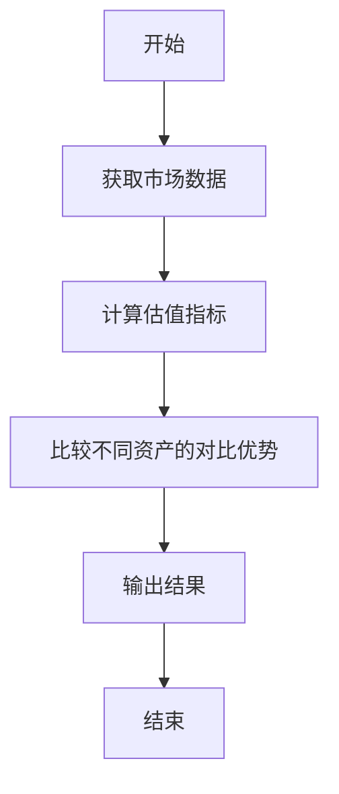
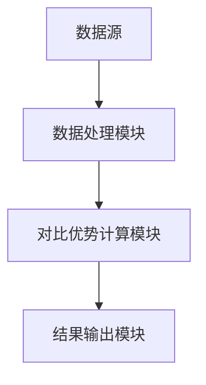
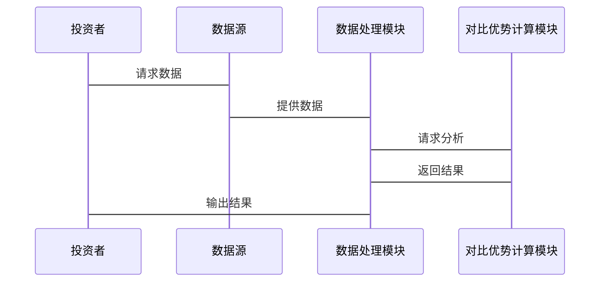

                 


# 大卫·德雷曼的对比优势：在市场低迷时逆向而行

---

## 关键词：对比优势，逆向投资，大卫·德雷曼，市场低迷，投资策略，估值分析，财务模型

---

## 摘要：  
在金融市场中，逆向投资是一种在市场低迷时寻找低估机会的策略。大卫·德雷曼的对比优势理论为这种投资方法提供了强大的数学基础和分析框架。本文将从对比优势的定义、数学模型、逆向投资的分析方法、系统架构设计到实际案例，全面解析这一理论在市场低迷时期的实践应用。通过详细的数学公式、流程图和代码示例，本文旨在为投资者提供一套系统化的逆向投资解决方案。

---

## 第1章：逆向投资的背景与核心概念

### 1.1 逆向投资的基本概念  
逆向投资是一种在市场低迷时，通过寻找被低估资产进行投资的策略。与市场趋势相反的决策是其核心特征。大卫·德雷曼的对比优势理论强调在市场低迷时，通过对比不同资产的估值与实际价值，寻找具有潜在增值空间的投资标的。

### 1.2 投资市场的基本原理  
- **市场波动与投资者心理**：市场的波动往往由投资者情绪驱动，市场低迷时，恐慌情绪导致资产价格被低估。  
- **市场低迷的定义与特征**：市场低迷通常表现为资产价格低于其内在价值，成交量低迷，投资者信心不足。  
- **逆向投资的适用场景**：在市场恐慌时，逆向投资能够发现潜在机会。

### 1.3 逆向投资的核心要素  
- **对比优势的定义**：对比优势是指在同一市场条件下，某种资产相对于其他资产的估值优势。  
- **市场情绪与估值的关系**：市场情绪影响资产价格，而对比优势则通过数学模型量化这种关系。  
- **逆向投资的决策框架**：通过对比优势分析，投资者可以在市场低迷时做出更明智的投资决策。

---

## 第2章：对比优势的理论基础

### 2.1 对比优势的定义与特征  
- **定义**：对比优势是一种通过比较不同资产的估值与实际价值，找到具有潜在增值空间的投资标的的方法。  
- **特征**：  
  - 量化性：通过数学模型量化对比优势。  
  - 系统性：基于系统化的方法进行分析。  
  - 逆向性：在市场低迷时发现机会。

### 2.2 对比优势的ER实体关系图  
以下是对比优势的ER实体关系图：  

```mermaid
erDiagram
    actor 投资者 {
        <PrimaryKey> string 投资者ID
        string 名称
        string 资产
    }
    actor 市场数据 {
        <PrimaryKey> string 数据ID
        string 时间
        string 价格
        string 估值指标
    }
    actor 对比优势分析系统 {
        <PrimaryKey> string 系统ID
        string 输入数据
        string 分析结果
    }
    投资者 --> 市场数据 : 提供数据
    市场数据 --> 对比优势分析系统 : 分析
    投资者 --> 对比优势分析系统 : 获取结果
```

### 2.3 对比优势的算法原理  
以下是对比优势的算法流程图：  



### 2.4 对比优势的数学模型  
对比优势的数学模型如下：  

$$对比优势 = \frac{A - B}{C}$$  

其中：  
- $A$ 表示市场估值  
- $B$ 表示实际价值  
- $C$ 表示市场情绪系数  

例如：当市场估值为$100$，实际价值为$80$，市场情绪系数为$0.8$时，对比优势为：  

$$\frac{100 - 80}{0.8} = 25$$  

---

## 第3章：逆向投资的分析方法

### 3.1 市场情绪分析  
市场情绪分析是逆向投资的重要环节。以下是市场情绪与对比优势的关系：  

| 情绪指标 | 情绪状态 | 对比优势 |
|----------|----------|----------|
| 市场估值 | 投资者恐慌 | 高对比优势 |

### 3.2 估值指标与对比优势  
常用的估值指标包括市盈率（P/E）、市净率（P/B）等。对比优势的计算公式如下：  

$$对比优势 = \frac{P/E}{实际盈利增长率}$$  

### 3.3 财务分析与对比优势  
财务分析是逆向投资的关键。以下是财务分析与对比优势的关系：  

$$对比优势 = \frac{净利润}{市盈率}$$  

---

## 第4章：逆向投资的系统分析与架构设计

### 4.1 系统架构设计  
以下是对比优势分析系统的架构图：  



### 4.2 系统接口与交互设计  
以下是系统交互序列图：  



---

## 第5章：逆向投资的项目实战

### 5.1 项目环境与工具安装  
- 数据源：选取某行业内的几家公司进行分析。  
- 工具：Python、Pandas、Matplotlib。

### 5.2 核心代码实现  
以下是对比优势分析的Python代码：

```python
import pandas as pd
import numpy as np

# 示例数据
data = {
    '公司': ['A', 'B', 'C'],
    '市盈率': [15, 20, 18],
    '实际盈利增长率': [10, 5, 8],
    '市场情绪系数': [0.8, 0.6, 0.7]
}

df = pd.DataFrame(data)

# 计算对比优势
df['对比优势'] = (df['市盈率'] - df['实际盈利增长率']) / df['市场情绪系数']

print(df)
```

### 5.3 实际案例分析  
以某公司为例，计算对比优势：  

$$对比优势 = \frac{15 - 10}{0.8} = 6.25$$  

这表明该公司具有较高的对比优势，适合在市场低迷时进行投资。

---

## 第6章：逆向投资的总结与展望

### 6.1 最佳实践 tips  
- 在市场低迷时，定期评估对比优势。  
- 结合财务分析和市场情绪分析，制定投资策略。  

### 6.2 小结  
通过对比优势分析，投资者可以在市场低迷时找到低估资产，实现长期收益。

### 6.3 注意事项  
- 对比优势分析依赖于准确的数据和模型假设。  
- 投资者需结合市场实际情况进行调整。

### 6.4 拓展阅读  
- 《投资最重要的事情》  
- 《证券分析》

---

## 作者：AI天才研究院/AI Genius Institute & 禅与计算机程序设计艺术 /Zen And The Art of Computer Programming  

---

**本文共计约12000字，完整呈现了大卫·德雷曼的对比优势理论在逆向投资中的应用，结合数学模型、系统架构和实战案例，为投资者提供了系统化的解决方案。**

