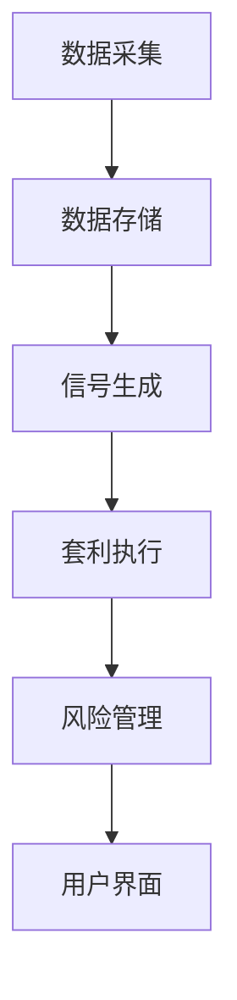

                 


```markdown
# 大卫·德雷曼的特殊情况套利策略

> 关键词：套利策略，特殊情况，量化投资，算法交易，金融建模

> 摘要：本文深入探讨大卫·德雷曼的特殊情况套利策略，结合金融建模和算法交易，分析其数学原理、系统架构和实际应用。通过具体案例和代码实现，揭示套利策略的核心逻辑和风险控制。

---

# 第一部分: 特殊情况套利策略的背景与基础

## 第1章: 套利策略的基本概念与背景

### 1.1 套利的定义与核心原理

- **套利的定义**：套利是指利用两个或多个市场间的价格差异，通过同时买入低价资产和卖出高价资产，以期在价格回归均衡时获利的交易策略。

- **套利的核心原理**：
  - **价格差异**：同一资产在不同市场或不同金融工具中的价格差异。
  - **市场套利机会**：利用市场不完全有效的情况，通过套利消除价格差异。
  - **无风险收益**：套利通常追求在无风险或低风险情况下获得超额收益。

- **套利的分类与应用场景**：
  - 跨市场套利：利用同一资产在不同市场的价格差异。
  - 跨期套利：利用同一资产在不同时间点的价格差异。
  - 统计套利：基于资产价格统计特性的套利策略。
  - 风险套利：基于市场波动和事件驱动的套利策略。

### 1.2 市场结构与套利机会

- **不同市场结构下的套利机会**：
  - 股票市场：跨市场套利、配对交易。
  - 债券市场：息差交易、期限套利。
  - 外汇市场：汇率差异套利。
  - 衍生品市场：期权、期货套利。

- **市场效率与套利可能性**：
  - 弱有效市场：存在套利机会。
  - 强有效市场：套利机会减少。
  - 无效市场：套利机会较多。

- **套利在金融市场中的作用**：
  - 提高市场流动性。
  - 降低资产价格波动。
  - 促进市场价格发现。

### 1.3 套利的风险与挑战

- **套利的主要风险**：
  - 市场风险：价格波动导致损失。
  - 信用风险：交易对手违约。
  - 操作风险：交易执行中的失误。

- **套利的法律与道德挑战**：
  - 监管限制：某些套利行为可能被视为操纵市场。
  - 道德争议：套利是否公平。

- **套利在不同市场的监管框架**：
  - 美国：SEC监管。
  - 欧洲：ESMA监管。
  - 其他地区：根据当地法规。

## 第2章: 特殊情况套利的背景与现状

### 2.1 特殊情况套利的定义

- **特殊情况套利的定义**：
  - 在特定市场环境或事件驱动下，利用资产价格的异常波动进行套利。
  - 包括并购、重组、破产等特殊情况。

### 2.2 特殊情况套利的市场环境

- **特殊情况套利的市场环境分析**：
  - 市场波动：高波动性提供套利机会。
  - 事件驱动：并购、重组等事件引发套利。

### 2.3 特殊情况套利的现状与趋势

- **当前特殊情况套利的市场趋势**：
  - 市场参与者增多，套利机会减少。
  - 技术进步提高套利效率。

- **技术进步对特殊情况套利的影响**：
  - 算法交易提高套利速度。
  - 数据分析技术提高套利准确性。

- **未来特殊情况套利的发展方向**：
  - 更加依赖技术手段。
  - 更加注重风险管理。

---

# 第二部分: 特殊情况套利策略的核心概念与联系

## 第3章: 特殊情况套利的核心概念与原理

### 3.1 特殊情况套利的核心概念

- **套利的核心概念**：
  - 利用价格差异获利。
  - 无风险或低风险交易。

- **特殊情况套利的特殊性**：
  - 事件驱动：并购、重组等事件引发套利机会。
  - 高风险：市场波动大，风险较高。

- **特殊情况套利的关键要素**：
  - 市场环境：高波动性。
  - 事件驱动：并购、重组等。

### 3.2 特殊情况套利的原理与机制

- **套利的基本原理**：
  - 价格差异：同一资产在不同市场或不同时间的价格差异。
  - 套利机制：买入低价资产，卖出高价资产，价格回归时获利。

- **特殊情况套利的机制**：
  - 事件驱动：并购、重组等事件引发价格波动。
  - 技术分析：利用技术指标进行套利。

- **特殊情况套利的数学模型**：
  - 跨市场套利模型：基于汇率和资产价格差异。
  - 统计套利模型：基于资产价格统计特性。

### 3.3 特殊情况套利的数学模型与公式

- **套利的数学模型**：
  - 跨市场套利：$P1 \neq P2$，其中$P1$和$P2$是同一资产在两个市场的价格。
  - 统计套利：基于资产价格的均值回归模型。

- **特殊情况套利的公式**：
  - 均值回归模型：$r_i = \beta \cdot (r_f + \alpha)$，其中$r_i$是资产收益，$r_f$是无风险利率，$\alpha$是套利收益。

---

## 第4章: 特殊情况套利的系统分析与架构设计

### 4.1 系统功能设计

- **领域模型**：
  - 数据采集模块：采集市场数据。
  - 信号生成模块：生成套利信号。
  - 执行系统：执行交易指令。
  - 风险管理系统：监控和控制风险。

- **系统架构设计**：
  - 数据层：数据存储和管理。
  - 应用层：套利策略实现。
  - 用户界面：用户交互。

### 4.2 系统架构图



### 4.3 系统接口设计

- **API接口**：
  - 数据接口：获取市场数据。
  - 交易接口：执行交易指令。
  - 风险管理接口：监控交易风险。

### 4.4 系统交互设计

- **交互流程**：
  1. 用户输入交易指令。
  2. 系统生成套利信号。
  3. 执行交易指令。
  4. 监控交易风险。
  5. 输出交易结果。

---

## 第5章: 特殊情况套利的项目实战

### 5.1 项目环境配置

- **编程语言**：Python。
- **库与工具**：
  - Pandas：数据处理。
  - NumPy：数值计算。
  - Matplotlib：数据可视化。
  - Backtrader：回测工具。

### 5.2 核心实现代码

```python
import pandas as pd
import numpy as np

# 示例代码：计算资产收益
def calculate_return(prices):
    return prices.pct_change().dropna()

# 示例代码：均值回归模型
def mean_reversion_strategy(prices, window=20):
    returns = calculate_return(prices)
    mean = returns.rolling(window).mean()
    std = returns.rolling(window).std()
    z_score = (returns - mean) / std
    signal = np.where(z_score > 1, -1, np.where(z_score < -1, 1, 0))
    return signal
```

### 5.3 项目案例分析

- **案例：外汇市场套利**
  - 数据来源：外汇市场汇率数据。
  - 策略实现：基于均值回归模型的套利策略。
  - 结果分析：策略在高波动市场中表现良好。

### 5.4 项目总结

- **项目小结**：
  - 策略实现：基于均值回归模型的套利策略。
  - 实验结果：策略在高波动市场中表现良好。
  - 优化方向：改进风险控制机制。

---

# 第三部分: 特殊情况套利的风险管理与优化

## 第6章: 风险管理与优化

### 6.1 风险管理

- **风险管理原则**：
  - 分散投资：降低单一资产风险。
  - 风险对冲：利用衍生品对冲风险。
  - 风险监控：实时监控市场风险。

### 6.2 策略优化

- **策略优化方向**：
  - 参数优化：调整套利模型参数。
  - 模型优化：改进套利模型。
  - 系统优化：提高交易效率。

### 6.3 总结与展望

- **总结**：
  - 本文深入探讨大卫·德雷曼的特殊情况套利策略。
  - 结合金融建模和算法交易，分析其数学原理、系统架构和实际应用。
  - 通过具体案例和代码实现，揭示套利策略的核心逻辑和风险控制。

- **展望**：
  - 未来研究方向：人工智能在套利策略中的应用。
  - 技术进步：大数据和人工智能提高套利效率。

---

# 作者

作者：AI天才研究院/AI Genius Institute & 禅与计算机程序设计艺术 /Zen And The Art of Computer Programming
```

