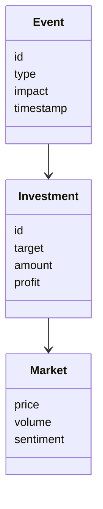
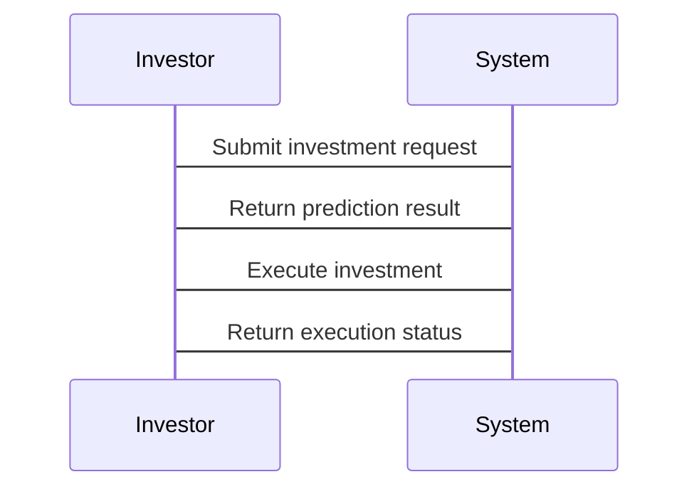

                 


# 大卫·德雷曼的特殊情况投资：从公司事件中获利

> 关键词：特殊情况投资，大卫·德雷曼，投资策略，公司事件，投资模型，数学公式

> 摘要：本文深入分析了大卫·德雷曼的特殊情况投资策略，从公司事件中发现投资机会，构建了德雷曼三要素模型，提出了基于信息不对称的事件驱动投资框架，给出了具体的算法实现和数学公式，通过实际案例分析了如何从公司事件中获利。文章最后给出了最佳实践、小结和注意事项。

---

## 第一部分: 大卫·德雷曼的特殊情况投资概述

### 第1章: 特殊情况投资的背景与核心概念

#### 1.1 投资背景与问题背景
- 传统投资策略的局限性
  - 基于基本面分析的传统投资方法的不足
  - 市场波动性与不可预测性
  - 信息不对称对投资决策的影响
- 特殊情况投资的定义与特点
  - 特殊情况投资的核心定义
  - 投资标的的特殊性
  - 投资机会的偶然性和可预测性
- 德雷曼投资理念的核心要素
  - 事件驱动投资
  - 信息不对称的利用
  - 风险控制与收益最大化

#### 1.2 特殊情况投资的核心概念
- 投资标的的特殊性分析
  - 特殊情况的类型与特征
  - 公司事件的可预测性
  - 事件对市场的影响机制
- 投资机会的识别与筛选
  - 信息收集与处理
  - 事件影响的量化
  - 投资机会的评估标准
- 投资风险的评估与控制
  - 风险来源分析
  - 风险量化方法
  - 风险控制策略

### 第2章: 德雷曼投资理论的核心框架

#### 2.1 德雷曼三要素模型
- 信息不对称的分析框架
  - 信息不对称的定义与影响
  - 信息不对称的分类
  - 信息不对称在投资中的应用
- 市场情绪与价格波动的关系
  - 市场情绪的定义与测量
  - 价格波动的规律
  - 市场情绪对投资决策的影响
- 公司事件的可预测性与投资机会
  - 公司事件的预测模型
  - 投资机会的识别
  - 事件对股价的影响机制

#### 2.2 特殊情况投资的逻辑与流程
- 投资机会的发现机制
  - 信息收集与筛选
  - 事件识别与分类
  - 投资机会的评估
- 投资标的的筛选标准
  - 标的筛选的逻辑
  - 标的筛选的数学模型
  - 标的筛选的实现步骤
- 投资决策的执行流程
  - 决策流程的步骤
  - 决策流程的优化
  - 决策流程的注意事项

### 第3章: 特殊情况投资的核心算法与数学模型

#### 3.1 德雷曼投资模型的算法原理
- 信息收集与处理流程
  - 数据源的获取
  - 数据清洗与预处理
  - 数据特征的提取
- 数据分析与预测模型
  - 数据分析的方法
  - 预测模型的构建
  - 预测模型的优化
- 投资决策的优化算法
  - 决策算法的原理
  - 决策算法的实现
  - 决策算法的优化

#### 3.2 数学模型与公式
- 事件影响的量化公式
  $$ E = \sum_{i=1}^{n} w_i x_i $$
  - 公式解释
  - 参数说明
  - 应用场景
- 投资收益的计算公式
  $$ R = \sum_{j=1}^{m} p_j \times r_j $$
  - 公式解释
  - 参数说明
  - 应用场景
- 风险评估的数学模型
  $$ R = \sqrt{\sum_{k=1}^{l} (r_k - \bar{r})^2} $$
  - 公式解释
  - 参数说明
  - 应用场景

#### 3.3 算法实现与代码示例
- 数据处理与特征提取
  ```python
  import pandas as pd
  data = pd.read_csv('events.csv')
  features = data[['event_type', 'market_reaction']]
  ```
- 模型训练与预测
  ```python
  from sklearn import linear_model
  model = linear_model.LinearRegression()
  model.fit(features, target)
  predictions = model.predict(new_features)
  ```

---

## 第二部分: 系统分析与架构设计方案

### 第4章: 系统功能设计

#### 4.1 问题场景介绍
- 投资系统的目标
- 系统的功能需求
- 系统的边界与外延

#### 4.2 领域模型设计


#### 4.3 系统架构设计
```mermaid
containerDiagram
    container Investment System {
        Event Collector
        Feature Extractor
        Model Trainer
        Predictor
        Decision Maker
    }
    Event Collector --> Feature Extractor
    Feature Extractor --> Model Trainer
    Model Trainer --> Predictor
    Predictor --> Decision Maker
```

#### 4.4 系统接口设计
- API接口定义
  - 数据接口
  - 模型接口
  - 决策接口

#### 4.5 系统交互设计


---

## 第三部分: 项目实战

### 第5章: 项目实战

#### 5.1 环境安装
- 系统环境要求
- 依赖库的安装
  ```bash
  pip install pandas scikit-learn matplotlib
  ```

#### 5.2 核心实现
- 数据处理模块
  ```python
  import pandas as pd
  def preprocess_data(data):
      # 数据清洗与预处理
      pass
  ```
- 模型训练模块
  ```python
  from sklearn import linear_model
  def train_model(features, target):
      model = linear_model.LinearRegression()
      model.fit(features, target)
      return model
  ```

#### 5.3 实际案例分析
- 案例背景介绍
- 数据分析与处理
- 模型训练与预测
- 投资决策与结果分析

---

## 第四部分: 最佳实践与总结

### 第6章: 最佳实践

#### 6.1 投资策略的优化建议
- 信息收集的优化
- 模型的优化与调整
- 风险控制的加强

#### 6.2 小结
- 本文的主要内容回顾
- 特殊情况投资的核心要点
- 未来研究方向

#### 6.3 注意事项
- 数据质量的重要性
- 模型的局限性
- 投资风险的控制

#### 6.4 拓展阅读
- 相关书籍推荐
- 相关论文推荐
- 在线资源推荐

---

## 作者

作者：AI天才研究院/AI Genius Institute & 禅与计算机程序设计艺术 /Zen And The Art of Computer Programming

