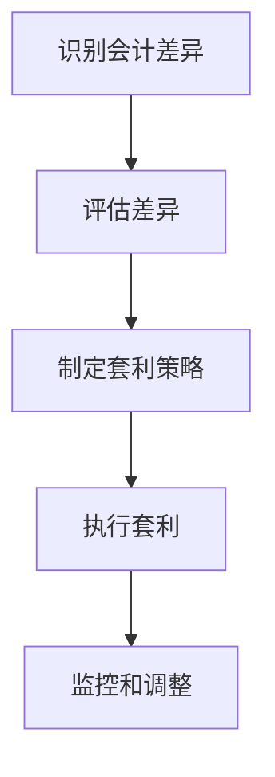
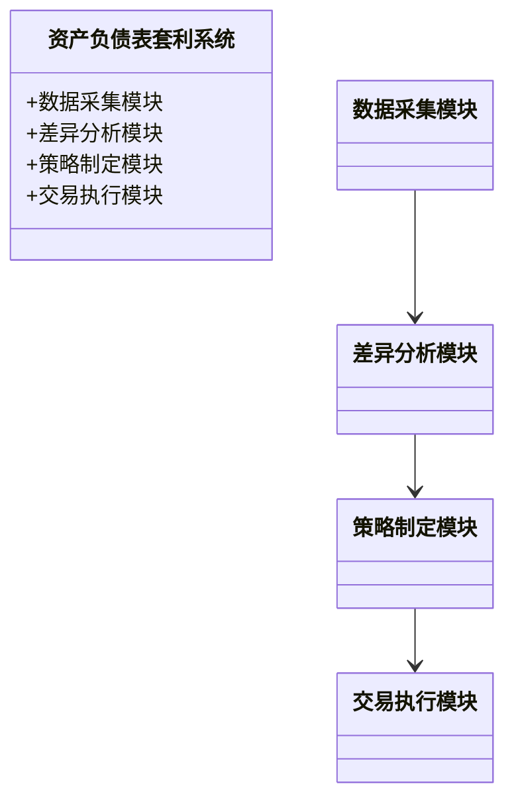
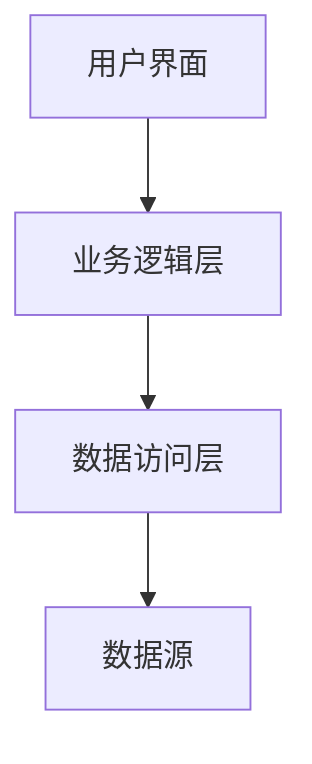

                 


# 大卫·德雷曼的资产负债表套利：利用会计差异创造价值

## 关键词
- 资产负债表套利
- 会计差异
- 投资策略
- 财务分析
- 价值创造

## 摘要
本文深入探讨了大卫·德雷曼提出的资产负债表套利方法，通过分析会计差异来创造投资价值。文章从套利的背景出发，详细阐述了会计差异的类型、资产负债表套利的核心原理、套利策略的选择与评估，以及系统架构设计。通过实际案例分析，展示了如何利用资产负债表套利在投资中创造价值，并总结了套利过程中需要注意的事项和未来的发展趋势。

---

## 第一部分：资产负债表套利的背景与基础

### 第1章：资产负债表套利概述

#### 1.1 什么是资产负债表套利

**1.1.1 资产负债表的基本概念**

资产负债表是反映企业在某一特定时期内资产、负债和所有者权益的财务报表。它通过记录企业的财务状况，帮助投资者和债权人评估企业的财务健康状况。

**1.1.2 套利的定义与分类**

套利是指利用市场上的价格差异，通过同时买进和卖出相同资产以赚取无风险利润的行为。套利可以分为多种类型，如跨市场套利、跨期套利和跨资产套利。

**1.1.3 资产负债表套利的定义与特点**

资产负债表套利是一种利用会计差异进行投资的策略。其特点是通过分析资产负债表中的差异，寻找市场定价错误的机会，从而在无风险或低风险的情况下获得收益。

---

#### 1.2 资产负债表套利的意义与价值

**1.2.1 资产负债表套利在投资中的作用**

通过资产负债表套利，投资者可以发现市场中的定价错误，利用会计差异进行投资，从而在市场调整之前获利。

**1.2.2 套利如何创造价值**

套利通过识别和利用市场中的价格差异，帮助市场更高效地定价，同时为投资者创造价值。

**1.2.3 资产负债表套利的边界与外延**

虽然套利可以利用会计差异，但其边界在于市场效率和信息不对称。套利的外延包括对市场结构和企业财务状况的深入分析。

---

#### 1.3 资产负债表套利的核心要素

**1.3.1 资产负债表的主要组成部分**

资产负债表包括资产、负债和所有者权益三部分。资产包括流动资产和非流动资产，负债包括流动负债和非流动负债，所有者权益包括股本、资本公积、盈余公积和未分配利润等。

**1.3.2 会计差异的定义与分类**

会计差异是指企业在不同会计期间或不同会计主体之间，由于会计政策、估计和假设的不同而产生的差异。常见的会计差异包括收入确认差异、资产减值差异和负债确认差异。

**1.3.3 资产负债表套利的关键要素**

套利的关键要素包括识别会计差异、评估差异的大小和持续性、制定套利策略以及监控和调整套利头寸。

---

## 第二部分：资产负债表套利的核心概念与联系

### 第2章：会计差异与资产负债表套利

#### 2.1 会计差异的类型与特征

**2.1.1 会计差异的分类**

会计差异可以分为货币性差异、时态差异、计量差异和其他差异。货币性差异是指由于货币时间价值导致的差异；时态差异是指由于会计期间不同导致的差异；计量差异是指由于资产或负债的计量方法不同导致的差异。

**2.1.2 不同会计差异的特征对比**

| 差异类型 | 特征 |
|----------|------|
| 货币性差异 | 时间价值相关，影响现值计算 |
| 时态差异 | 会计期间不同，影响财务报表的比较 |
| 计量差异 | 计量方法不同，影响资产或负债的账面价值 |

**2.1.3 会计差异的影响**

会计差异可能导致企业财务报表的不一致，从而为套利提供机会。

---

#### 2.2 会计差异与企业价值的关系

**2.2.1 会计差异对企业价值的影响**

会计差异可能导致企业市场价值与账面价值的差异。通过分析这些差异，套利者可以发现市场定价错误的机会。

**2.2.2 会计差异对套利机会的影响**

会计差异的存在为套利者提供了潜在的利润来源。套利者可以通过利用这些差异，在市场调整时获利。

---

#### 2.3 资产负债表套利的核心原理

**2.3.1 资产负债表套利的原理**

资产负债表套利的核心原理在于识别和利用会计差异，通过套利策略在市场中获利。

**2.3.2 资产负债表套利的数学模型**

套利的数学模型可以表示为：

$$
\text{套利利润} = \text{市场定价} - \text{内在价值}
$$

其中，内在价值是基于会计差异调整后的价值，市场定价是当前市场价格。

**2.3.3 资产负债表套利的流程图**

以下是一个简单的流程图，展示资产负债表套利的流程：



---

## 第三部分：资产负债表套利的策略与方法论

### 第3章：资产负债表套利的策略

#### 3.1 套利策略的分类

**3.1.1 横向比较套利**

横向比较套利是指在同一会计期间内，比较不同企业之间的财务数据，寻找定价错误的机会。

**3.1.2 纵向分析套利**

纵向分析套利是指在同一企业内，比较不同会计期间的财务数据，寻找会计差异带来的套利机会。

**3.1.3 行业套利**

行业套利是指在同行业中，比较不同企业的财务数据，寻找行业性的会计差异，从而进行套利。

---

#### 3.2 套利策略的选择与评估

**3.2.1 策略选择的依据**

套利策略的选择应基于市场的流动性、差异的大小和持续性、交易成本等因素。

**3.2.2 策略评估的指标**

常用的策略评估指标包括套利收益、风险敞口、交易成本等。

---

## 第四部分：系统分析与架构设计

### 第4章：系统分析与架构设计

#### 4.1 问题场景介绍

套利过程中，需要解决的问题包括数据采集、差异识别、策略制定和交易执行等。

#### 4.2 系统功能设计

**4.2.1 领域模型类图**

以下是一个领域模型类图，展示系统的主要功能模块：



#### 4.3 系统架构设计

**4.3.1 系统架构图**

以下是一个系统架构图，展示系统的分层结构：



---

## 第五部分：项目实战

### 第5章：项目实战

#### 5.1 环境安装

需要安装的工具包括Python、Pandas、NumPy、Matplotlib等。

#### 5.2 核心实现源代码

以下是套利策略的核心代码示例：

```python
import pandas as pd
import numpy as np

# 数据采集模块
def collect_data():
    # 假设从数据库中获取数据
    data = pd.read_sql(...)
    return data

# 差异分析模块
def analyze_differences(data):
    # 计算差异
    differences = data['市场价格'] - data['内在价值']
    return differences

# 策略制定模块
def create_strategy(differences):
    # 制定套利策略
    strategy = []
    for diff in differences:
        if diff > 0:
            strategy.append('买入')
        else:
            strategy.append('卖出')
    return strategy

# 交易执行模块
def execute_trades(strategy):
    # 执行交易
    for action in strategy:
        if action == '买入':
            # 执行买入操作
        else:
            # 执行卖出操作
```

---

## 第六部分：总结与展望

### 第6章：总结与展望

#### 6.1 总结

资产负债表套利通过识别和利用会计差异，为投资者提供了创造价值的机会。套利的核心在于分析市场定价与内在价值的差异，并通过套利策略获利。

#### 6.2 未来展望

随着市场的发展和技术的进步，资产负债表套利将更加依赖于数据分析和人工智能技术。未来的研究可以进一步探索如何利用大数据和机器学习技术，提高套利的效率和准确性。

---

## 第七部分：最佳实践与小结

### 第7章：最佳实践

#### 7.1 最佳实践 tips

- 在进行套利前，需充分了解市场和企业的财务状况。
- 确保套利策略的可行性和可持续性。
- 控制风险，避免过度杠杆和市场波动带来的损失。

#### 7.2 小结

资产负债表套利是一种有效的投资策略，通过分析会计差异，投资者可以在市场中发现定价错误的机会，从而创造价值。

#### 7.3 注意事项

- 套利需谨慎，确保策略的合法性和合规性。
- 保持对市场的敏感性，及时调整套利策略。

#### 7.4 拓展阅读

推荐阅读大卫·德雷曼的相关著作，深入理解资产负债表套利的理论和实践。

---

## 作者：AI天才研究院/AI Genius Institute & 禅与计算机程序设计艺术 /Zen And The Art of Computer Programming

---

以上是《大卫·德雷曼的资产负债表套利：利用会计差异创造价值》的完整内容，涵盖了从基础概念到实际应用的各个方面，帮助读者全面理解资产负债表套利的策略和方法。

