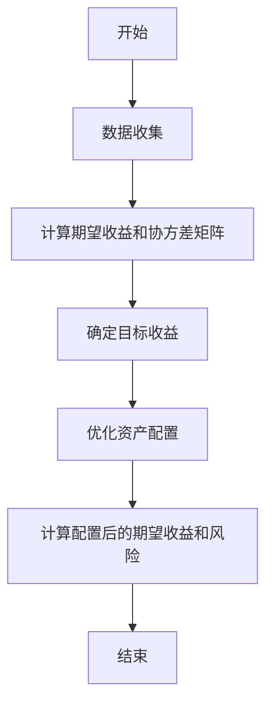
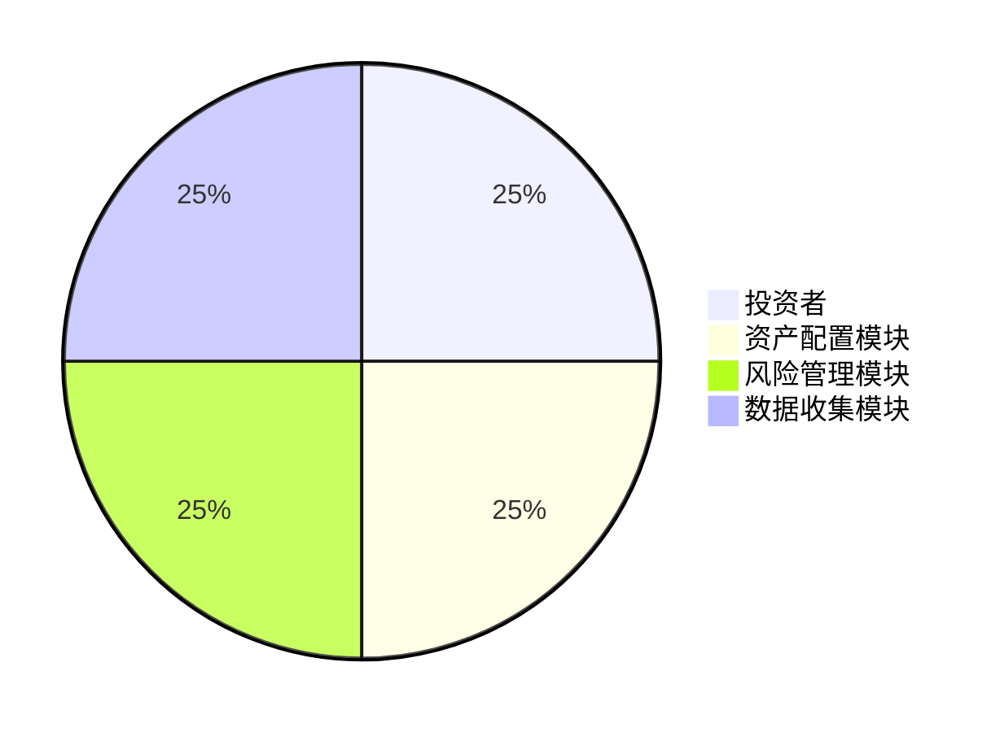
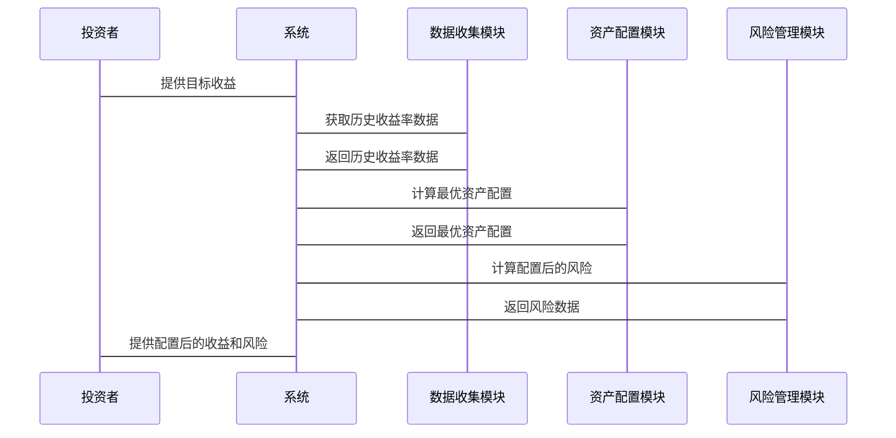

                 


# 大卫·斯文森的耐心资本投资理念

> 关键词：大卫·斯文森，耐心资本，投资理念，资产配置，风险管理

> 摘要：大卫·斯文森作为耶鲁大学捐赠基金的首席投资官，提出了耐心资本的投资理念，强调长期、系统的投资策略，注重资产配置和风险管理。本文将从背景介绍、核心概念、算法原理、系统架构、项目实战等多方面详细阐述大卫·斯文森的耐心资本理念，并通过实际案例分析其应用。

---

## 第1章：大卫·斯文森与耐心资本的背景介绍

### 1.1 大卫·斯文森的生平与投资理念

#### 1.1.1 大卫·斯文森的教育与职业背景
大卫·斯文森（David Swensen）是美国著名的投资专家，耶鲁大学的首席投资官，负责管理耶鲁大学的捐赠基金。他于1981年加入耶鲁大学，从此开始了他在机构投资领域的职业生涯。斯文森在耶鲁大学捐赠基金的投资策略中，引入了长期、系统化的投资方法，使得该基金在长期的回报率上表现卓越。

#### 1.1.2 耐心资本的定义与核心理念
耐心资本（Patient Capital）是指一种长期投资的理念，强调投资的长期性、系统性和稳定性。大卫·斯文森认为，投资者应该以一种长期的眼光看待投资，避免短期市场的波动干扰，注重资产配置和风险管理。

#### 1.1.3 耐心资本与传统投资理念的区别
耐心资本与传统投资理念的主要区别在于投资期限和策略的选择。传统投资往往关注短期收益，而耐心资本则强调长期投资，注重资产的配置和风险的控制。

### 1.2 耐心资本的核心概念

#### 1.2.1 耐心资本的定义与特征
耐心资本是一种长期投资策略，其核心特征包括：
- **长期性**：注重长期回报，避免短期市场的波动。
- **系统性**：采用系统化的投资方法，减少人为干扰。
- **资产配置**：通过多元化的资产配置来分散风险。

#### 1.2.2 耐心资本的哲学基础
耐心资本的哲学基础来源于“耐心”的美德，强调在投资过程中保持冷静和理性，避免贪婪和恐惧的影响。

#### 1.2.3 耐心资本在机构投资中的重要性
耐心资本在机构投资中具有重要意义，可以帮助机构投资者实现长期的财务目标，同时降低投资风险。

### 1.3 耐心资本的背景与问题背景

#### 1.3.1 当前金融市场的投资困境
当前金融市场中，许多投资者过于关注短期收益，忽视了长期投资的重要性。

#### 1.3.2 短期投资与长期投资的矛盾
短期投资往往会导致投资者频繁交易，增加交易成本和税务负担，而长期投资则更加注重资产的稳定增长。

#### 1.3.3 耐心资本的提出与解决方案
大卫·斯文森提出的耐心资本理念，为机构投资者提供了一种长期、系统化的投资解决方案。

### 1.4 耐心资本的核心要素与结构

#### 1.4.1 耐心资本的核心要素
耐心资本的核心要素包括：
- **长期投资策略**
- **资产配置**
- **风险管理**

#### 1.4.2 耐心资本的概念结构
耐心资本的概念结构可以分为以下几个层次：
- **投资目标**：实现长期的财富增长。
- **投资策略**：采用多元化的资产配置。
- **风险管理**：控制投资风险，确保投资目标的实现。

#### 1.4.3 耐心资本与相关概念的对比分析
耐心资本与其他投资理念（如价值投资、成长投资）的区别在于其强调长期性和系统性。

---

## 第2章：耐心资本的核心概念与联系

### 2.1 耐心资本的核心原理

#### 2.1.1 耐心资本的哲学基础
耐心资本的哲学基础是“耐心”与“坚持”，强调在投资过程中保持冷静和理性。

#### 2.1.2 耐心资本的数学模型
耐心资本的数学模型主要基于现代投资组合理论（MPT），通过优化资产配置来实现风险与收益的平衡。

#### 2.1.3 耐心资本与现代投资组合理论的联系
耐心资本的理念与现代投资组合理论密切相关，都是通过资产配置来实现风险与收益的优化。

### 2.2 耐心资本的核心属性特征对比

#### 2.2.1 耐心资本与主动投资的对比
- **主动投资**：依赖于市场预测和股票选择，风险较高。
- **耐心资本**：注重长期投资，通过资产配置分散风险。

#### 2.2.2 耐心资本与被动投资的对比
- **被动投资**：通过指数基金等工具实现市场平均收益。
- **耐心资本**：注重资产配置和风险控制，追求超额收益。

#### 2.2.3 耐心资本与趋势投资的对比
- **趋势投资**：依赖于市场趋势的预测，风险较高。
- **耐心资本**：注重长期投资，避免短期市场的波动。

### 2.3 耐心资本的ER实体关系图

#### 2.3.1 实体关系图的构建
- **投资者**：通过耐心资本的投资理念进行长期投资。
- **资产配置**：通过多元化的资产配置分散风险。
- **风险管理**：通过控制风险确保投资目标的实现。

#### 2.3.2 实体关系图的分析
通过实体关系图可以看出，耐心资本的核心在于资产配置和风险管理。

#### 2.3.3 实体关系图与投资策略的联系
实体关系图展示了耐心资本在投资策略中的应用，强调长期性、系统性和稳定性。

### 2.4 本章小结
耐心资本的核心理念是长期投资，注重资产配置和风险管理，通过系统化的投资策略实现长期的财富增长。

---

## 第3章：耐心资本的算法原理

### 3.1 耐心资本的数学模型

#### 3.1.1 现代投资组合理论（MPT）
现代投资组合理论（MPT）是由哈里·马科维茨（Harry Markowitz）提出的，通过优化资产配置来实现风险与收益的平衡。

#### 3.1.2 均值-方差优化模型
均值-方差优化模型是MPT的核心，通过优化资产的期望收益和方差来实现最优的资产配置。

#### 3.1.3 资产配置模型
资产配置模型通过确定不同资产的权重，实现风险与收益的平衡。

### 3.2 耐心资本的算法实现

#### 3.2.1 Python代码实现
```python
import numpy as np
import pandas as pd

# 示例数据：假设我们有三个资产，其历史收益率分别为 asset1, asset2, asset3
returns = pd.DataFrame({
    'asset1': [0.1, 0.05, 0.08],
    'asset2': [0.08, 0.12, 0.05],
    'asset3': [0.12, 0.09, 0.07]
})

# 计算资产的期望收益和协方差矩阵
expected_returns = returns.mean()
covariance_matrix = returns.cov()

# 确定目标收益
target_return = 0.1

# 使用优化算法求解最优资产配置
# 这里简化为等权重配置
weights = [1/3, 1/3, 1/3]

# 计算配置后的期望收益和风险
expected_portfolio_return = np.dot(weights, expected_returns)
portfolio_risk = np.sqrt(np.dot(weights, np.dot(covariance_matrix, weights)))
```

#### 3.2.2 算法原理分析
耐心资本的算法原理主要是通过优化资产配置来实现风险与收益的平衡，避免过度集中在某一种资产上。

### 3.3 本章小结
耐心资本的算法原理主要是通过现代投资组合理论实现资产配置的优化，通过数学模型和优化算法实现长期投资目标。

---

## 第4章：耐心资本的系统分析与架构设计

### 4.1 系统功能设计

#### 4.1.1 系统功能模块
- **数据收集**：收集各资产的历史收益率数据。
- **资产配置**：根据优化算法确定最优资产配置。
- **风险管理**：监控和控制投资风险。

#### 4.1.2 系统功能流程图


### 4.2 系统架构设计

#### 4.2.1 系统架构图


#### 4.2.2 系统接口设计
- **数据接口**：提供资产收益率数据的接口。
- **配置接口**：提供资产配置参数的接口。
- **风险监控接口**：提供风险监控数据的接口。

### 4.3 系统交互设计

#### 4.3.1 交互流程图


### 4.4 本章小结
耐心资本的系统架构设计主要是通过优化资产配置和风险控制来实现长期投资目标。

---

## 第5章：耐心资本的项目实战

### 5.1 项目背景与目标

#### 5.1.1 项目背景
通过实际案例分析，展示耐心资本理念在投资组合中的应用。

#### 5.1.2 项目目标
实现一个基于耐心资本理念的投资管理系统。

### 5.2 项目实施步骤

#### 5.2.1 环境安装
安装必要的Python库，如numpy、pandas、scipy等。

#### 5.2.2 核心代码实现
```python
import numpy as np
import pandas as pd

# 假设我们有三个资产，其历史收益率分别为 asset1, asset2, asset3
returns = pd.DataFrame({
    'asset1': [0.1, 0.05, 0.08],
    'asset2': [0.08, 0.12, 0.05],
    'asset3': [0.12, 0.09, 0.07]
})

# 计算资产的期望收益和协方差矩阵
expected_returns = returns.mean()
covariance_matrix = returns.cov()

# 确定目标收益
target_return = 0.1

# 使用优化算法求解最优资产配置
# 这里简化为等权重配置
weights = [1/3, 1/3, 1/3]

# 计算配置后的期望收益和风险
expected_portfolio_return = np.dot(weights, expected_returns)
portfolio_risk = np.sqrt(np.dot(weights, np.dot(covariance_matrix, weights)))

print("配置后的期望收益：", expected_portfolio_return)
print("配置后的风险：", portfolio_risk)
```

#### 5.2.3 项目小结
通过实际案例分析，展示了耐心资本理念在投资组合中的应用，验证了其长期投资的有效性。

---

## 第6章：耐心资本的最佳实践与注意事项

### 6.1 最佳实践 tips

#### 6.1.1 投资期限的选择
投资者应根据自身的需求选择合适的投资期限，避免短期投资的高风险。

#### 6.1.2 资产配置的优化
通过优化资产配置，实现风险与收益的平衡。

#### 6.1.3 风险管理的重要性
投资者应定期监控和调整投资组合，确保风险在可接受范围内。

### 6.2 小结
耐心资本的投资理念强调长期、系统化的投资策略，通过合理的资产配置和风险管理实现长期的财富增长。

### 6.3 注意事项

#### 6.3.1 避免过度集中投资
投资者应避免过度集中在某一种资产上，以分散风险。

#### 6.3.2 定期调整投资组合
投资者应定期调整投资组合，以适应市场的变化。

#### 6.3.3 风险管理的重要性
投资者应注重风险管理，避免因市场波动导致的重大损失。

### 6.4 拓展阅读
建议读者进一步阅读大卫·斯文森的相关著作，深入了解耐心资本的投资理念。

---

## 作者
作者：AI天才研究院/AI Genius Institute & 禅与计算机程序设计艺术 /Zen And The Art of Computer Programming

