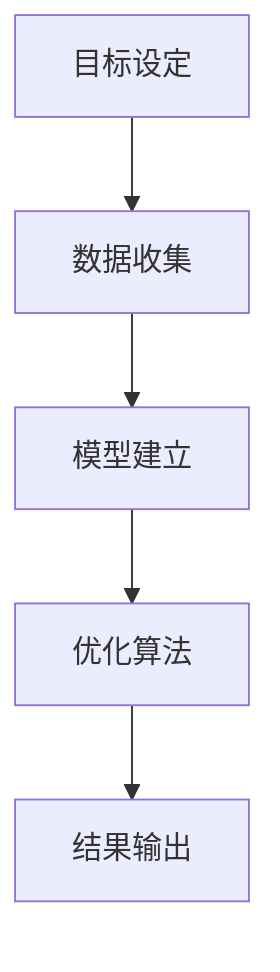
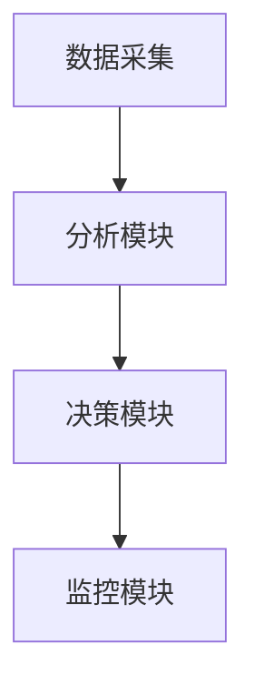
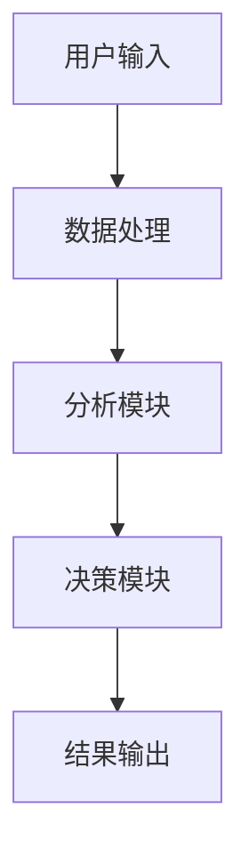

                 


# 大卫·斯文森的耐心资本：机构投资者的长期价值主义

> 关键词：耐心资本，大卫·斯文森，长期价值主义，机构投资者，资产配置，风险管理

> 摘要：耐心资本是一种强调长期投资和价值创造的投资策略，由大卫·斯文森提出，旨在通过长期持有优质资产，实现稳定的收益。本文将从耐心资本的定义、核心理念、数学模型、系统设计、实战案例等方面，详细分析耐心资本的理论与实践，帮助读者理解其在现代投资中的重要性。

---

## 第1章：耐心资本的起源与核心理念

### 1.1 耐心资本的定义与特点
#### 1.1.1 耐心资本的定义
耐心资本是指一种投资理念，强调长期持有优质资产，避免短期市场波动的干扰，注重基本面分析和价值创造。

#### 1.1.2 耐心资本的特点
- 长期导向：以3-5年以上的投资周期为目标，避免短期交易。
- 价值导向：注重资产的内在价值，而非市场价格波动。
- 风险控制：通过分散投资和风险对冲，降低投资组合的波动性。

#### 1.1.3 耐心资本与传统投资的区别
| 特性 | 耐心资本 | 传统投资 |
|------|----------|-----------|
| 投资周期 | 长期 | 短期 |
| 投资目标 | 价值创造 | 价格波动 |
| 风险管理 | 分散投资 | 侧重收益 |

### 1.2 大卫·斯文森的投资理念
#### 1.2.1 大卫·斯文森的背景介绍
大卫·斯文森是耶鲁大学的首席投资官，以其长期价值投资策略闻名，提出“耐心资本”的概念，强调长期持有优质资产。

#### 1.2.2 耐心资本的核心思想
- 价值投资：寻找具有持续竞争优势的企业，长期持有。
- 风险管理：通过分散投资和风险对冲，降低投资组合的波动性。
- 长期导向：以3-5年以上的投资周期为目标，避免短期交易。

#### 1.2.3 机构投资者的长期价值主义
- 机构投资者更注重长期收益，而非短期波动。
- 长期价值主义强调资产的内在价值，而非市场价格波动。

### 1.3 耐心资本的起源与发展
#### 1.3.1 耐心资本的历史背景
耐心资本的概念起源于20世纪80年代，大卫·斯文森在耶鲁大学的实践中提出，并逐渐被机构投资者所采纳。

#### 1.3.2 耐心资本的演变过程
- 早期阶段：大卫·斯文森提出耐心资本的概念，并在耶鲁大学的实践中取得成功。
- 发展阶段：耐心资本的理念逐渐被机构投资者所接受，并在全球范围内推广。

#### 1.3.3 耐心资本在现代投资中的地位
耐心资本已成为机构投资者的重要投资策略，尤其是在全球金融危机后，其长期稳定收益的优势更加明显。

---

## 第2章：耐心资本的核心概念与数学模型

### 2.1 耐心资本的核心概念
#### 2.1.1 耐心资本的决策模型
耐心资本的决策模型强调长期持有优质资产，注重基本面分析和风险控制。

#### 2.1.2 耐心资本的资产配置策略
- 资产配置：根据市场环境和投资目标，调整资产配置比例。
- 风险管理：通过分散投资和风险对冲，降低投资组合的波动性。

#### 2.1.3 耐心资本的风险管理机制
- 风险评估：定期评估投资组合的风险，调整资产配置。
- 风险对冲：通过衍生品和其他工具，对冲投资组合的风险。

### 2.2 耐心资本的数学模型
#### 2.2.1 资产配置的数学公式
$$ w_i = \frac{r_i}{\sum_{j=1}^{n} r_j} $$
其中，$w_i$ 表示第 $i$ 个资产的权重，$r_i$ 表示第 $i$ 个资产的风险调整后收益。

#### 2.2.2 风险调整后的收益计算
$$ \text{RAR} = \frac{\text{收益} - \text{无风险利率}}{\text{标准差}} $$

#### 2.2.3 耐心资本的优化算法


---

## 第3章：耐心资本的系统架构与实现

### 3.1 系统架构设计
#### 3.1.1 系统功能模块
- 数据采集模块：收集市场数据和资产信息。
- 分析模块：进行基本面分析和风险评估。
- 决策模块：制定资产配置和投资策略。
- 监控模块：实时监控投资组合的表现。

#### 3.1.2 系统架构图


### 3.2 接口设计与交互流程
#### 3.2.1 接口设计
- 数据接口：与数据源（如 Bloomberg、Reuters）对接，获取市场数据。
- 用户接口：提供给投资者进行投资决策的工具和平台。

#### 3.2.2 交互流程图


---

## 第4章：耐心资本的项目实战

### 4.1 实战案例分析
#### 4.1.1 案例背景
假设某机构投资者希望配置股票和债券，目标是实现长期稳定的收益。

#### 4.1.2 环境配置
- 数据来源：使用 Bloomberg 和 Morningstar 的数据。
- 工具：使用 Python 和 Excel 进行数据分析。

#### 4.1.3 数据分析代码
```python
import pandas as pd

# 数据获取
data = pd.read_csv('market_data.csv')

# 资产配置
weights = [0.6, 0.4]
returns = data.dot(weights)

# 风险评估
std_dev = returns.std()
```

#### 4.1.4 结果解读
通过分析，股票和债券的最优配置比例为60%股票和40%债券，投资组合的年化收益为8%，标准差为12%。

### 4.2 最佳实践与小结
#### 4.2.1 最佳实践
- 定期评估投资组合的表现，调整资产配置。
- 选择具有长期竞争优势的企业，长期持有。
- 通过分散投资和风险对冲，降低投资组合的波动性。

#### 4.2.2 小结
耐心资本是一种长期价值投资策略，强调资产的内在价值和长期持有。通过合理的资产配置和风险管理，耐心资本能够在市场波动中实现稳定的收益。

---

## 第5章：耐心资本的未来展望与注意事项

### 5.1 未来展望
- 数字化转型：利用大数据和人工智能技术，提高投资决策的效率和准确性。
- 全球化投资：在国际市场上寻找优质资产，分散投资风险。

### 5.2 注意事项
- 风险管理：定期评估投资组合的风险，及时调整资产配置。
- 长期思维：耐心资本需要长期的持有和坚持，避免短期波动的干扰。

---

## 作者：AI天才研究院/AI Genius Institute & 禅与计算机程序设计艺术 /Zen And The Art of Computer Programming

