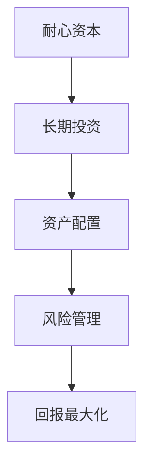
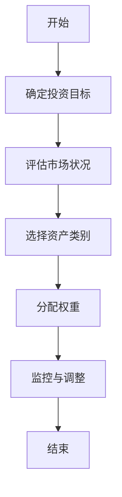
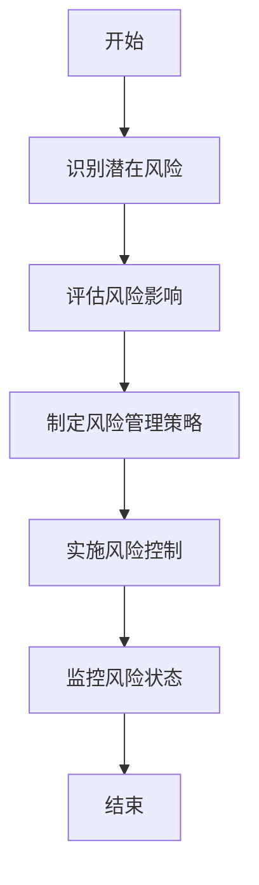
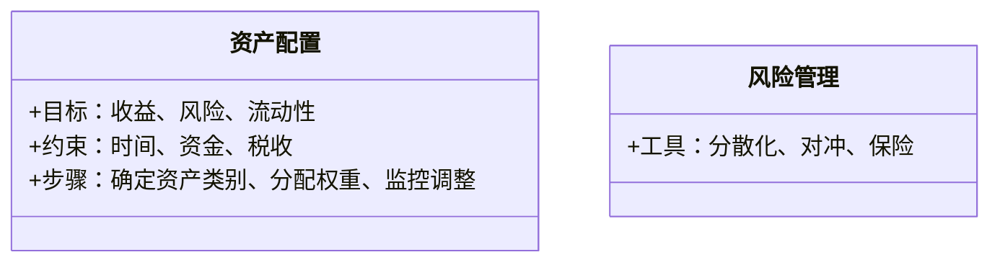

                 


# 大卫·斯文森的耐心资本：长期投资的艺术

## 关键词：耐心资本，长期投资，大卫·斯文森，投资策略，风险管理

## 摘要：大卫·斯文森作为耶鲁大学首席投资官，提出耐心资本理论，强调长期投资的重要性。本文深入分析耐心资本的核心理念、数学模型、算法原理、系统架构及实际案例，探讨其在现代投资中的应用，总结长期投资的艺术与策略。

---

## 第一部分：耐心资本与长期投资的引言

## 第1章：大卫·斯文森与耐心资本概述

### 1.1 大卫·斯文森的背景与贡献

#### 1.1.1 大卫·斯文森的生平简介
大卫·斯文森是耶鲁大学的首席投资官，以其长期投资策略闻名，带领耶鲁大学捐赠基金实现卓越回报，被誉为机构投资领域的权威。

#### 1.1.2 耐心资本理论的提出与影响
斯文森提出耐心资本理论，强调长期视角和资产配置的重要性，影响了全球机构投资策略。

#### 1.1.3 耐心资本在机构投资中的应用
耐心资本通过长期持有优质资产，实现稳定回报，降低交易成本和税务负担，成为机构投资者的重要策略。

### 1.2 耐心资本的核心理念

#### 1.2.1 耐心资本的定义与特征
耐心资本是指长期持有的投资，注重资产质量而非短期波动，具有低流动性需求和高风险承受能力。

#### 1.2.2 耐心资本与短期投资的区别
耐心资本注重长期收益和复利效应，而短期投资关注市场波动和交易机会。

#### 1.2.3 耐心资本在长期投资中的优势
通过分散化和优质资产选择，耐心资本在经济周期波动中表现稳定，实现持续增值。

### 1.3 耐心资本的投资哲学

#### 1.3.1 长期投资的价值观
强调价值投资和基本面分析，注重企业内在价值而非市场情绪。

#### 1.3.2 耐心资本与复利效应的关系
复利效应是耐心资本的核心驱动力，通过时间积累实现指数级增长。

#### 1.3.3 耐心资本在不同经济周期中的表现
在经济繁荣和衰退中，耐心资本通过优质资产配置保持稳定回报，体现其抗周期性。

---

## 第2章：耐心资本的核心概念与理论基础

### 2.1 耐心资本的定义与属性

#### 2.1.1 耐心资本的定义
耐心资本是指投资者长期持有优质资产，追求稳定和可持续的回报。

#### 2.1.2 耐心资本的核心属性对比
| 属性 | 耐心资本 | 短期投资 |
|------|----------|----------|
| 时间框架 | 长期 | 短期 |
| 风险承受 | 高 | 低 |
| 操作频率 | 低 | 高 |

#### 2.1.3 耐心资本的实体关系图


### 2.2 耐心资本的数学模型

#### 2.2.1 耐心资本的复利计算公式
$$ FV = PV \times (1 + r)^n $$
其中，FV为终值，PV为现值，r为年化收益率，n为投资年数。

#### 2.2.2 耐心资本的风险调整回报模型
$$ R = r + \beta \times (m - r) $$
其中，R为调整后的回报，r为无风险利率，β为资产的系统性风险系数，m为市场预期回报率。

#### 2.2.3 耐心资本的资产配置优化公式
$$ \text{最优权重} = \frac{\sigma^2}{\sigma^2 + \lambda} $$
其中，σ²为资产的波动率，λ为风险厌恶系数。

### 2.3 耐心资本的算法原理

#### 2.3.1 耐心资本的资产配置算法


#### 2.3.2 耐心资本的风险管理算法


---

## 第3章：长期投资策略的系统分析与架构设计

### 3.1 投资策略的系统分析

#### 3.1.1 投资目标与约束条件
明确投资目标（如保值、增值）和约束条件（如时间、资金、风险承受能力）。

#### 3.1.2 投资环境的分析框架
分析宏观经济、行业趋势和市场波动，评估潜在风险和机会。

#### 3.1.3 投资策略的分类与选择
根据市场环境和投资目标，选择价值投资、成长投资或股息投资策略。

### 3.2 资产配置的系统架构

#### 3.2.1 资产配置的层次结构


#### 3.2.2 资产配置的优化模型
使用现代投资组合理论（MPT）优化资产配置，通过协方差矩阵计算风险最小化配置。

### 3.3 风险管理的系统架构

#### 3.3.1 风险识别与评估
利用波动率、VaR等指标评估潜在风险。

#### 3.3.2 风险控制策略
通过分散投资、对冲交易和保险产品降低风险敞口。

#### 3.3.3 风险监控与调整
定期评估风险指标，及时调整投资组合以应对市场变化。

---

## 第4章：耐心资本的算法实现与项目实战

### 4.1 环境安装与依赖管理

#### 4.1.1 系统环境
Python 3.8+, 安装numpy、pandas、matplotlib库。

### 4.2 核心算法实现

#### 4.2.1 资产配置算法
```python
import numpy as np

def optimal_asset_allocation(risk_aversion, covariance_matrix, return_vector):
    # 计算最优权重
    sigma_squared = np.diag(covariance_matrix)
    lambda_param = risk_aversion
    optimal_weights = sigma_squared / (sigma_squared + lambda_param)
    return optimal_weights
```

#### 4.2.2 风险管理算法
```python
import pandas as pd

def risk_management(portfolio, VaR_threshold):
    # 计算VaR
    VaR = portfolio.return_series.quantile(VaR_threshold)
    # 对冲策略
    hedge_ratio = VaR / portfolio.volatility
    return hedge_ratio
```

### 4.3 项目实战与案例分析

#### 4.3.1 理论框架与案例选择
以美股市场为例，分析长期投资策略的收益与风险。

#### 4.3.2 数据收集与预处理
收集过去十年的标普500指数数据，计算收益率、波动率和相关指标。

#### 4.3.3 投资组合构建与优化
使用MPT优化资产配置，计算最优股票和债券权重。

#### 4.3.4 风险管理与监控
应用VaR模型评估潜在损失，制定对冲策略降低风险。

### 4.4 项目小结与经验总结

#### 4.4.1 项目小结
通过算法实现，验证耐心资本在长期投资中的有效性。

#### 4.4.2 经验总结
定期监控和调整投资组合是实现长期回报的关键，风险管理不可或缺。

---

## 第5章：耐心资本的未来展望与最佳实践

### 5.1 未来投资趋势

#### 5.1.1 数字化与智能化投资
人工智能和大数据技术将改变投资方式，提高决策效率。

#### 5.1.2 ESG投资的兴起
环境、社会和公司治理因素在投资中的重要性日益增加。

### 5.2 最佳实践 tips

#### 5.2.1 长期投资的核心要素
明确投资目标，分散化投资，定期调整组合，耐心持有。

#### 5.2.2 风险管理的关键步骤
识别潜在风险，评估影响，制定控制策略，持续监控。

### 5.3 小结与展望

总结耐心资本的优势，展望其在投资领域的发展前景，强调长期投资的艺术与科学。

---

## 作者：AI天才研究院/AI Genius Institute & 禅与计算机程序设计艺术 /Zen And The Art of Computer Programming

---

以上是《大卫·斯文森的耐心资本：长期投资的艺术》的技术博客文章，涵盖了耐心资本的核心理念、数学模型、算法实现、系统架构及实际案例分析，结合理论与实践，深入探讨长期投资的艺术与策略。

