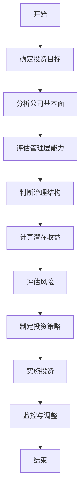

                 


# 大卫·艾伦·科恩的activist投资策略

## 关键词：activist投资策略，激进投资，大卫·艾伦·科恩，投资算法，数学模型，系统架构

## 摘要：大卫·艾伦·科恩的activist投资策略是一种激进的投资方法，通过持有目标公司大量股份，施加压力以推动公司治理和战略的改变，以实现投资回报的最大化。本文将详细分析该策略的核心概念、算法原理、数学模型、系统架构，以及实际案例，并总结其最佳实践和未来发展趋势。

---

# 第一部分: 大卫·艾伦·科恩的activist投资策略背景介绍

## 第1章: activist投资策略的定义与背景

### 1.1 activist投资策略的定义

#### 1.1.1 什么是activist投资
activist投资，也称为激进投资，是指投资者通过大量买入目标公司的股票，成为其主要股东，并利用其股东地位对公司治理、战略决策或管理层施加压力，以实现自身投资目标的过程。

#### 1.1.2 activist投资的核心目标
- **财务回报**：通过改变公司战略、资产剥离或分红等方式，提升公司股价或实现资本增值。
- **治理优化**：推动公司改善治理结构，提高透明度和股东权益。
- **价值实现**：通过优化管理层或战略调整，挖掘公司潜在价值。

#### 1.1.3 activist投资的兴起背景
- **全球化资本流动**：全球资本市场的开放和流动，使得激进投资者能够跨国布局。
- **股东权利意识增强**：投资者越来越关注自身权益，推动公司治理改革。
- **技术进步**：大数据和人工智能技术的应用，使得激进投资者能够更精准地识别和分析投资目标。

### 1.2 activist投资策略的背景分析

#### 1.2.1 全球资本市场的现状
- 全球资本市场规模庞大，流动性强，为激进投资者提供了丰富的投资机会。
- 技术驱动的金融创新，如高频交易和算法交易，为激进投资者提供了新的工具和策略。

#### 1.2.2 激进投资的兴起原因
- **市场不完美性**：某些公司存在治理不善、管理层低效等问题，激进投资者通过介入改善这些问题。
- **股东价值最大化**：激进投资者希望通过干预公司运营，释放公司价值，从而实现自身收益。

#### 1.2.3 activist投资对企业的潜在影响
- **正面影响**：推动公司治理优化，提升运营效率，增强股东信心。
- **负面影响**：可能导致公司战略不稳定，管理层动荡，影响公司长期发展。

### 1.3 activist投资策略的边界与外延

#### 1.3.1 激进投资的边界条件
- **投资规模**：激进投资者需要持有足够股份，通常需要达到5%以上。
- **目标公司特征**：公司治理存在问题，具有较高价值潜力。
- **市场环境**：法律法规相对宽松，便于激进投资者行动。

#### 1.3.2 激进投资的外延领域
- **私募股权**：激进投资者可能通过收购成为控股股东。
- ** activism inESG**：将环境、社会和治理因素融入激进投资策略。
- **跨市场投资**：在全球范围内寻找投资机会，利用市场差异进行套利。

#### 1.3.3 激进投资与其他投资策略的区别
- **短期 vs 长期**：激进投资通常为短期策略，而价值投资注重长期持有。
- **主动干预 vs 被动持有**：激进投资强调主动干预，而被动投资注重持有等待价值回归。
- **高风险 vs 低风险**：激进投资风险较高，收益潜力大，而稳健投资注重风险控制。

---

## 第2章: activist投资策略的核心概念与联系

### 2.1 核心概念原理

#### 2.1.1 激进投资的核心原理
- **信息不对称**：激进投资者通过深入研究发现市场未识别的价值。
- **治理干预**：通过股东大会、董事会干预等方式，推动公司变革。
- **价值重估**：通过改变市场对公司估值的预期，实现股价上涨。

#### 2.1.2 激进投资者的行为模式
- **集中持股**：持有目标公司较大比例的股份，以增强话语权。
- **主动参与**：积极参与公司治理，推动管理层变动或战略调整。
- **短期高收益**：通过快速实现公司价值重估，获得资本增值。

#### 2.1.3 激进投资的驱动因素
- **市场机会**：发现市场低估的公司。
- **治理问题**：公司存在治理缺陷，激进投资者通过干预改善。
- **资本效率**：利用杠杆或融资工具放大投资收益。

### 2.2 核心概念属性特征对比表

| 特性                | 激进投资          | 价值投资          | 成长投资          |
|---------------------|------------------|------------------|------------------|
| 投资目标            | 改变公司治理      | 买入低估资产      | 投资成长潜力大的公司 |
| 投资期限            | 短期（1-3年）    | 长期（5年以上）    | 中长期           |
| 风险承受能力        | 高              | 中               | 中高             |
| 投资策略            | 主动干预         | 被动持有         | 买入并持有       |
| 适用场景            | 公司治理问题     | 市场低估资产      | 高增长行业       |

### 2.3 ER实体关系图

```mermaid
er
actor: 激进投资者
goal: 投资目标
action: 投资行为
outcome: 投资结果
```

---

## 第3章: activist投资策略的算法原理

### 3.1 算法原理概述

#### 3.1.1 激进投资的决策逻辑
- **目标筛选**：通过财务指标、治理结构、管理层能力等多维度筛选潜在目标。
- **投资决策**：基于市场环境、公司估值、干预可行性等多因素进行综合判断。
- **风险控制**：评估干预可能带来的风险，并制定应对策略。

#### 3.1.2 投资组合优化算法
- **目标函数**：最大化投资回报，最小化投资风险。
- **约束条件**：持股比例不超过一定限制，避免触发收购要约。
- **优化方法**：使用线性规划或遗传算法等优化技术，寻找最优投资组合。

#### 3.1.3 风险评估与收益预测模型
- **风险评估**：使用VaR（Value at Risk）模型评估潜在风险。
- **收益预测**：基于历史数据和市场预期，预测未来收益。

### 3.2 算法流程图



---

## 第4章: activist投资策略的数学模型

### 4.1 价值评估模型

#### 4.1.1 模型公式
$$ V = \frac{E}{1 - g} $$
其中：
- \( V \) 表示公司价值
- \( E \) 表示公司盈利
- \( g \) 表示增长率

#### 4.1.2 应用场景
用于评估公司潜在价值，判断是否低估。

### 4.2 风险评估模型

#### 4.2.1 模型公式
$$ \text{VaR} = \mu + z \cdot \sigma $$
其中：
- \( \mu \) 表示平均收益
- \( z \) 表示标准正态分布的分位数
- \( \sigma \) 表示收益的标准差

#### 4.2.2 应用场景
用于评估投资组合的风险，制定风险控制策略。

---

## 第5章: activist投资策略的系统分析与架构设计

### 5.1 项目介绍

#### 5.1.1 项目背景
通过构建激进投资分析系统，帮助投资者识别和分析潜在投资目标。

### 5.1.2 项目目标
实现激进投资策略的自动化分析，包括目标筛选、风险评估、投资决策支持。

### 5.2 系统功能设计

#### 5.2.1 领域模型


#### 5.2.2 系统架构设计


### 5.3 接口设计与交互

#### 5.3.1 系统接口
- 输入：公司基本面数据、市场数据。
- 输出：投资建议、风险评估。

#### 5.3.2 交互流程


---

## 第6章: activist投资策略的项目实战

### 6.1 环境安装与配置

#### 6.1.1 系统需求
- 操作系统：Windows 10或更高版本。
- 开发工具：Python 3.8+，Jupyter Notebook。
- 依赖库：Pandas、NumPy、Matplotlib。

### 6.2 核心实现源代码

#### 6.2.1 价值评估模型实现

```python
import pandas as pd
import numpy as np

def calculate_value(company_data):
    # 计算潜在价值
    V = company_data['E'] / (1 - company_data['g'])
    return V

# 示例数据
data = {
    'E': [100, 200, 150],
    'g': [0.05, 0.03, 0.04]
}
df = pd.DataFrame(data)
print(calculate_value(df))
```

#### 6.2.2 风险评估模型实现

```python
import numpy as np

def calculate VaR(returns, confidence_level=0.95):
    sorted_returns = np.sort(returns)
    index = int(confidence_level * len(sorted_returns))
    return sorted_returns[index]

# 示例数据
returns = np.array([0.05, -0.02, 0.03, -0.01, 0.04])
print(calculate VaR(returns, 0.95))
```

### 6.3 案例分析与解读

#### 6.3.1 案例介绍
以烟草行业为例，分析激进投资者如何通过改变公司治理结构，提升公司价值。

#### 6.3.2 实施步骤
1. 筛选目标公司：选择治理结构不佳、股价低估的公司。
2. 分析公司基本面：评估财务状况、管理层能力和市场环境。
3. 制定干预策略：推动管理层变动或资产重组。
4. 监控与调整：持续跟踪公司变化，调整投资策略。

### 6.4 项目小结

---

## 第7章: 总结与展望

### 7.1 总结
大卫·艾伦·科恩的activist投资策略通过主动干预公司治理，实现投资收益最大化。本文详细分析了该策略的核心概念、算法原理、数学模型和系统架构，并通过案例展示了其实际应用。

### 7.2 展望
随着技术进步和市场发展，激进投资策略将更加智能化和精准化。未来，可以通过大数据和人工智能技术，进一步优化投资决策和风险控制。

---

## 第8章: 最佳实践 tips、小结、注意事项、拓展阅读

### 8.1 最佳实践 tips

#### 8.1.1 投资前的深入研究
- 了解公司基本面、治理结构和管理层能力。
- 评估市场环境和政策风险。

#### 8.1.2 风险控制
- 设定止损点，避免重大损失。
- 分散投资，降低风险集中度。

#### 8.1.3 持续学习
- 关注市场动态，学习新的投资策略和工具。
- 总结经验教训，优化投资决策。

### 8.2 小结
大卫·艾伦·科恩的activist投资策略是一种高风险、高回报的投资方式，通过主动干预公司治理，实现投资目标。本文通过详细分析，为投资者提供了理论支持和实践指导。

### 8.3 注意事项

#### 8.3.1 法律法规
- 遵守相关法律法规，避免违法行为。
- 了解目标市场的监管环境。

#### 8.3.2 市场风险
- 评估市场波动对投资的影响。
- 制定应对市场变化的策略。

### 8.4 拓展阅读
- 《The Activist's Handbook》：了解激进投资的详细步骤和策略。
- 《Investing in the Future》：探讨激进投资的未来发展趋势。

---

## 作者：AI天才研究院/AI Genius Institute & 禅与计算机程序设计艺术 /Zen And The Art of Computer Programming

---

这篇文章全面分析了大卫·艾伦·科恩的activist投资策略，从背景介绍到系统设计，再到实际案例，为投资者提供了丰富的理论支持和实践指导。通过深入分析和详细讲解，帮助读者理解激进投资的精髓，并为未来的投资决策提供参考。

