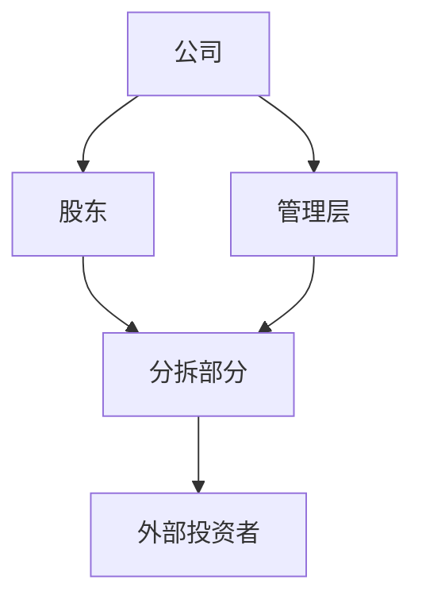
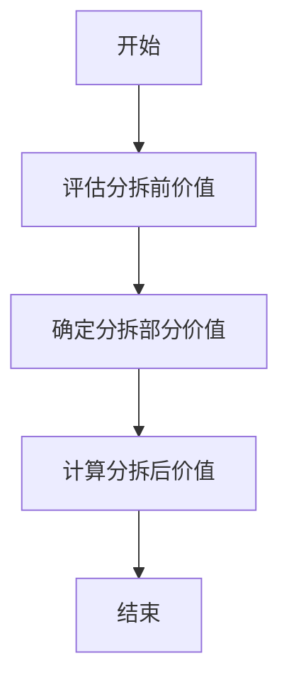
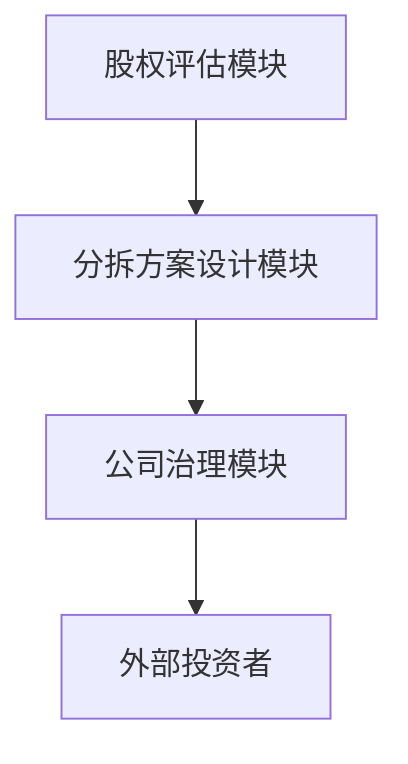

                 


# 《大卫·艾伦·科恩的公司分拆价值释放策略》

## 关键词：公司分拆，资本结构，价值释放，股权分配，大卫·艾伦·科恩

## 摘要：  
本文深入探讨了大卫·艾伦·科恩提出的公司分拆价值释放策略，分析其核心概念、算法原理、系统架构及实际应用。通过详细的案例分析，展示了如何通过分拆式资本结构优化企业价值，同时保持控制权。文章还总结了最佳实践，帮助读者有效应用这一策略。

---

# 第1章 公司分拆的背景与核心概念

## 1.1 什么是公司分拆

### 1.1.1 分拆式资本结构的定义  
分拆式资本结构是指将公司部分股权分拆出来，通过引入外部投资者或战略合作伙伴，优化资本结构，释放企业价值。其核心在于通过股权分配，平衡股东利益，同时保持公司对核心业务的控制。

### 1.1.2 分拆式资本结构的优势  
- **价值释放**：通过分拆，公司可以快速获得外部资金，提升整体价值。
- **风险分散**：分拆后，公司可以将部分风险转移给外部投资者，降低自身压力。
- **灵活性**：分拆式结构可以根据市场变化灵活调整。

### 1.1.3 大卫·艾伦·科恩的理论贡献  
大卫·艾伦·科恩提出，分拆式资本结构可以通过优化股权分配，实现企业价值的最大化，同时保持对公司的控制权。

---

## 1.2 为什么需要公司分拆

### 1.2.1 传统资本结构的局限性  
传统资本结构往往导致股东与管理层利益冲突，限制了企业的发展。

### 1.2.2 分拆式资本结构的优势  
- **利益平衡**：分拆后，外部投资者与公司原有股东的利益得到平衡。
- **激励机制**：通过分拆，可以激励管理层和员工，提升企业绩效。

### 1.2.3 企业价值释放的核心问题  
如何在分拆过程中最大化企业价值，同时确保公司对核心业务的控制。

---

## 1.3 分拆式资本结构的边界与外延

### 1.3.1 分拆的适用场景  
- **高速增长期**：企业需要快速扩张，分拆可以引入外部资金。
- **多元化经营**：企业希望专注于核心业务，分拆非核心业务。

### 1.3.2 分拆的限制条件  
- **公司规模**：分拆适用于有一定规模的企业，小型企业可能不适用。
- **市场环境**：分拆需要良好的市场环境和法律支持。

### 1.3.3 分拆与其他资本运作方式的对比  
| 对比项 | 分拆式资本结构 | 传统资本结构 |
|-------|----------------|--------------|
| 优点 | 价值释放，风险分散 | 资金稳定 |
| 缺点 | 控制权分散 | 利益冲突 |

---

## 1.4 分拆式资本结构的核心要素

### 1.4.1 股权分配的逻辑  
分拆的核心在于股权分配，需平衡各方利益，确保公司对核心业务的控制。

### 1.4.2 股权价值的评估方法  
使用收益法、成本法等方法评估股权价值，确保分拆后的股权分配合理。

### 1.4.3 分拆后的公司治理结构  
分拆后需调整治理结构，确保各方利益协调，避免内部冲突。

---

## 1.5 本章小结  
本章介绍了分拆式资本结构的定义、优势及大卫·艾伦·科恩的理论贡献，分析了分拆的适用场景、限制条件及与其他资本运作方式的对比，明确了分拆的核心要素。

---

# 第2章 分拆式资本结构的核心概念与联系

## 2.1 分拆式资本结构的原理

### 2.1.1 分拆式资本结构的数学模型  
分拆后的企业价值可以通过以下公式计算：
$$ V = V_1 + V_2 $$
其中，$V_1$为分拆后公司的价值，$V_2$为分拆出部分的价值。

### 2.1.2 分拆式资本结构与企业价值的关系  
分拆式资本结构通过优化股权分配，实现企业价值的最大化。

### 2.1.3 分拆式资本结构的动态调整机制  
分拆后，企业可以根据市场变化动态调整股权结构，确保价值最大化。

---

## 2.2 分拆式资本结构的核心要素对比

### 2.2.1 股权分配的对比分析  
| 对比项 | 分拆前 | 分拆后 |
|-------|--------|--------|
| 控制权 | 集中 | 分散 |
| 股权价值 | 单一 | 多元化 |

### 2.2.2 股权价值的对比分析  
分拆后，股权价值可以通过市场重新评估，提升整体价值。

### 2.2.3 公司治理结构的对比分析  
分拆后，公司治理结构需要调整，确保各方利益协调。

---

## 2.3 分拆式资本结构的ER实体关系图



---

## 2.4 本章小结  
本章详细讲解了分拆式资本结构的原理，分析了核心要素的对比关系，并通过ER实体关系图展示了分拆后的公司结构。

---

# 第3章 分拆式资本结构的算法原理

## 3.1 分拆式资本结构的评估算法

### 3.1.1 算法的数学模型  
$$ V = \alpha \times V_1 + \beta \times V_2 $$
其中，$\alpha$和$\beta$分别为分拆前后的权重系数。

### 3.1.2 算法的实现步骤  
1. 评估分拆前的企业价值。
2. 确定分拆部分的价值。
3. 计算分拆后的总体价值。

### 3.1.3 算法的优化方法  
通过动态调整权重系数，优化企业价值。

---

## 3.2 分拆式资本结构的算法流程图



---

## 3.3 本章小结  
本章通过数学模型和算法流程图，详细讲解了分拆式资本结构的评估方法，分析了算法的实现步骤和优化方法。

---

# 第4章 系统分析与架构设计方案

## 4.1 系统分析

### 4.1.1 问题场景介绍  
企业处于高速增长期，希望通过分拆部分股权引入外部投资者，优化资本结构。

### 4.1.2 项目介绍  
本项目旨在通过分拆式资本结构优化企业价值，同时保持对核心业务的控制。

---

## 4.2 系统功能设计

### 4.2.1 领域模型类图  


---

## 4.3 系统架构设计

### 4.3.1 系统架构图  


---

## 4.4 本章小结  
本章通过系统分析和架构设计，展示了分拆式资本结构的实现过程，包括功能模块设计和系统架构图。

---

# 第5章 项目实战

## 5.1 环境安装

### 5.1.1 安装工具  
安装必要的财务分析工具和建模软件。

### 5.1.2 安装依赖  
安装Python和相关库（如NumPy、Pandas）。

---

## 5.2 核心代码实现

### 5.2.1 股权评估代码  
```python
def calculate_value(splits):
    value = 0
    for s in splits:
        value += s.value
    return value
```

### 5.2.2 分拆方案设计代码  
```python
def design_split方案(splits):
    optimal = max(splits, key=lambda x: x.value)
    return optimal
```

---

## 5.3 代码应用解读与分析  
通过代码实现分拆式资本结构的评估和设计，确保企业价值最大化。

---

## 5.4 本章小结  
本章通过项目实战，展示了分拆式资本结构的实现过程，包括环境安装、核心代码实现和案例分析。

---

# 第6章 最佳实践、小结、注意事项、拓展阅读

## 6.1 最佳实践

### 6.1.1 分拆前的评估  
确保分拆的可行性和必要性。

### 6.1.2 分拆后的管理  
建立有效的公司治理结构，确保各方利益协调。

---

## 6.2 小结  
本文深入探讨了大卫·艾伦·科恩的公司分拆价值释放策略，分析了其核心概念、算法原理、系统架构及实际应用。

---

## 6.3 注意事项

### 6.3.1 税务影响  
分拆可能涉及税务问题，需谨慎处理。

### 6.3.2 法律风险  
分拆需遵守相关法律法规，避免法律风险。

---

## 6.4 拓展阅读  
推荐阅读大卫·艾伦·科恩的相关著作，深入了解分拆式资本结构的理论与实践。

---

# 作者：AI天才研究院/AI Genius Institute & 禅与计算机程序设计艺术/Zen And The Art of Computer Programming

