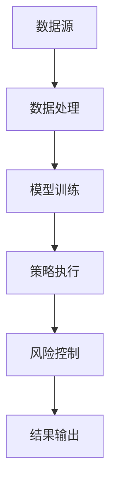

                 


# 大卫·艾因霍恩的做空策略：价值投资的另一面

---

## 关键词：  
价值投资，做空策略，大卫·艾因霍恩，对冲基金，投资分析

---

## 摘要：  
大卫·艾因霍恩作为世界著名对冲基金经理，以其独特的做空策略闻名。本文将深入探讨大卫·艾因霍恩的做空策略，分析其与传统价值投资的关系，揭示其背后的数学模型和系统架构，并通过实际案例展示其在投资实践中的应用。本文旨在为投资者提供一种新的视角，理解价值投资的另一面。

---

## 第一部分：价值投资与做空策略的背景

### 第1章：价值投资的起源与发展

#### 1.1 价值投资的定义与核心理念  
价值投资是一种长期投资策略，强调购买被市场低估的资产，等待其价值回归。其核心理念包括：  
1. **内在价值**：资产的真实价值与其未来现金流的现值有关。  
2. **安全边际**：买入价格低于内在价值，以降低风险。  
3. **市场无效性**：市场并非总是正确定价资产。  

#### 1.2 价值投资的核心原则  
- **长期视角**：关注企业的长期盈利能力，而非短期市场波动。  
- **深度分析**：通过财务报表、行业趋势等多维度分析，寻找低估资产。  
- **逆向思维**：在市场恐慌时寻找机会，避免 crowd-following。  

### 第2章：做空策略的定义与特点

#### 2.1 做空策略的定义  
做空是指借入股票卖出，期望以更低价格买回，从而获利。其核心逻辑是：当资产价格过高时，通过卖空获利。  

#### 2.2 做空策略的特点  
1. **高杠杆风险**：借入资金放大收益，但也放大损失。  
2. **短期导向**：做空通常基于短期价格波动，而非长期价值判断。  
3. **逆向思维**：做空需要识别市场泡沫，与价值投资的逆向思维有相似之处。  

### 第3章：价值投资与做空策略的联系与区别

#### 3.1 联系  
- 两者都基于市场无效性，寻找价格与价值的偏离。  
- 价值投资寻找低估资产，做空寻找高估资产，两者互补。  

#### 3.2 区别  
1. **目标不同**：价值投资买入低估资产，做空卖出高估资产。  
2. **时间框架**：价值投资注重长期，做空注重短期。  
3. **风险偏好**：价值投资风险较低，做空风险较高。  

---

## 第二部分：大卫·艾因霍恩的做空策略

### 第4章：大卫·艾因霍恩的做空策略概述

#### 4.1 大卫·艾因霍恩的背景介绍  
大卫·艾因霍恩是Greenlight Capital的创始人，以成功做空安然、世通等公司闻名。他的投资理念结合了价值投资的深度分析和做空的逆向思维。  

#### 4.2 做空策略的特点  
1. **基本面驱动**：基于公司财务数据和行业趋势判断。  
2. **严格筛选**：选择具有明显缺陷或高估的公司。  
3. **风险控制**：严格管理仓位和杠杆，避免重大损失。  

### 第5章：大卫·艾因霍恩做空策略的核心原则

#### 5.1 公司基本面分析  
艾因霍恩通过分析财务报表，识别公司潜在问题，如高负债、低利润、现金流不足等。  

#### 5.2 市场情绪分析  
利用市场情绪指标，如短期涨幅、成交量、投资者情绪等，判断市场是否高估资产。  

#### 5.3 行业趋势分析  
关注行业周期，选择处于下行周期的行业，寻找被高估的公司。  

### 第6章：大卫·艾因霍恩做空策略的数学模型与算法

#### 6.1 做空策略的数学模型  
艾因霍恩的做空模型基于现金流折现法（DCF）和相对估值法（PE、PB等）。  

1. **现金流折现法（DCF）**  
   公式：$$内在价值 = \sum_{t=1}^{n} \frac{CF_t}{(1 + r)^t} + \frac{TV}{(1 + r)^n}$$  
   其中，$CF_t$是第$t$年的自由现金流，$r$是折现率，$TV$是终值。  

2. **相对估值法**  
   通过比较公司与行业 peers 的估值指标，判断是否高估。  

#### 6.2 做空策略的算法实现  
以下是做空策略的Python代码示例：  

```python
import pandas as pd
import numpy as np

def calculate_intrinsic_value(financials, discount_rate):
    cf = financials['free_cash_flow']
    tv = financials['terminal_value']
    intrinsic_value = 0
    for t in range(len(cf)):
        if t == 0:
            intrinsic_value += cf[t]
        else:
            intrinsic_value += cf[t] / (1 + discount_rate)**t
    intrinsic_value += tv / (1 + discount_rate)**len(cf)
    return intrinsic_value

def is_overvalued(market_price, intrinsic_value, margin_of_safety=0.2):
    return market_price > intrinsic_value * (1 - margin_of_safety)

# 示例数据
financials = {
    'free_cash_flow': [100, 110, 120],
    'terminal_value': 1200,
    'discount_rate': 0.08
}
market_price = 150

intrinsic_value = calculate_intrinsic_value(financials, financials['discount_rate'])
if is_overvalued(market_price, intrinsic_value):
    print("股票被高估，建议做空。")
else:
    print("股票合理或低估，不做空。")
```

### 第7章：大卫·艾因霍恩做空策略的系统架构与实现

#### 7.1 系统架构设计  
以下是做空策略的系统架构图：  



#### 7.2 系统功能设计  
1. 数据收集：获取目标公司的财务数据和市场数据。  
2. 数据处理：清洗、转换和整合数据。  
3. 模型训练：使用DCF模型和相对估值法计算内在价值。  
4. 策略执行：判断是否高估，决定是否做空。  
5. 风险控制：管理仓位和杠杆，设定止损点。  

---

## 第三部分：项目实战与案例分析

### 第8章：项目实战

#### 8.1 环境安装  
需要安装以下工具：  
- Python  
- Pandas、NumPy  
- Matplotlib  
- 财务数据API（如Yahoo Finance）  

#### 8.2 核心实现  
以下是做空策略的核心代码：  

```python
import yfinance as yf
import pandas as pd
import numpy as np

# 下载股票数据
msft = yf.download('MSFT', start='2020-01-01', end='2023-12-31')

# 计算相对估值指标
pe_ratio = msft['Close'] / msft['Earnings'].ffill().bfill()
ps_ratio = msft['Close'] / (msft['Revenue'].ffill().bfill() / 1000)
pb_ratio = msft['Close'] / (msft['Book Value'].ffill().bfill() / 1000)

# 判断是否高估
market_price = msft['Close'].iloc[-1]
intrinsic_value = ...  # 计算内在价值
if market_price > intrinsic_value * 0.8:
    print("MSFT 被高估，建议做空。")
else:
    print("MSFT 合理或低估，不做空。")
```

#### 8.3 实际案例分析  
以安然为例，分析艾因霍恩如何通过基本面分析发现其财务造假，并成功做空获利。  

---

## 第四部分：最佳实践与小结

### 第9章：最佳实践

#### 9.1 做空策略的注意事项  
1. **严格控制风险**：避免过度杠杆，设定止损点。  
2. **关注基本面**：做空基于公司财务问题，而非市场情绪。  
3. **选择合适的时机**：做空适合短期市场波动，而非长期趋势。  

#### 9.2 小结  
大卫·艾因霍恩的做空策略为价值投资提供了新的视角，通过识别高估资产，投资者可以在传统价值投资之外，寻找新的投资机会。然而，做空策略风险较高，需要谨慎操作。  

---

## 作者：  
AI天才研究院/AI Genius Institute  
禅与计算机程序设计艺术/Zen And The Art of Computer Programming

