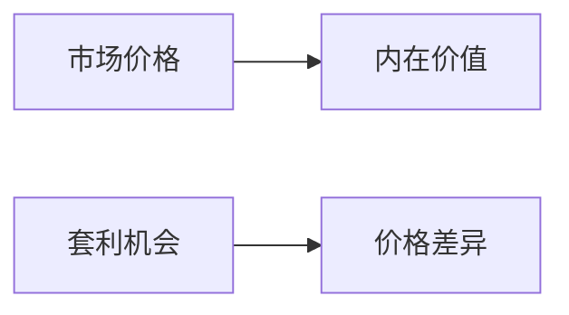
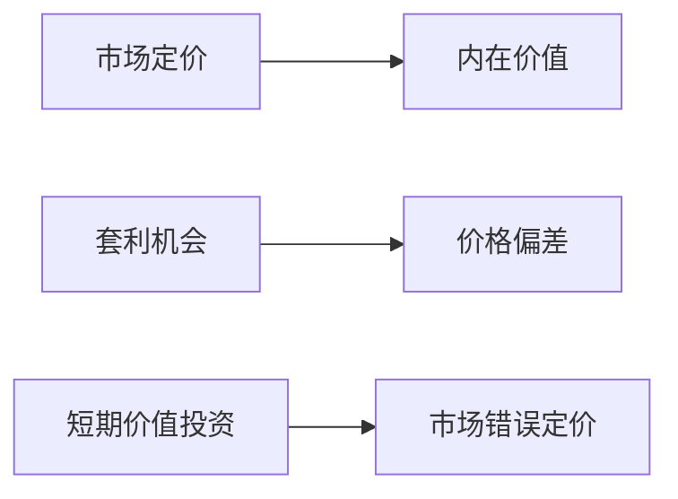
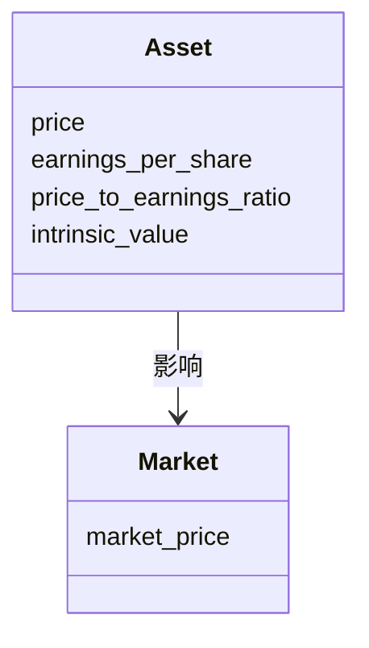

                 


# 大卫·艾因霍恩的短期价值投资：市场错误定价的套利

## 关键词：大卫·艾因霍恩、短期价值投资、市场错误定价、套利机会、投资策略、安全边际

## 摘要：本文深入探讨了大卫·艾因霍恩的短期价值投资策略，分析了市场错误定价的套利机会，结合了技术分析和数学模型，提供了详细的算法和系统架构设计，帮助投资者理解和应用这一投资方法。

---

## 第一部分: 短期价值投资的背景与核心概念

### 第1章: 短期价值投资的背景与核心概念

#### 1.1 短期价值投资的定义与特点
##### 1.1.1 短期价值投资的定义
短期价值投资是一种以寻找市场中被低估资产为核心策略的投资方法，强调在短期内通过市场定价错误捕捉套利机会。与长期价值投资不同，短期价值投资更注重价格波动和市场情绪的影响。

##### 1.1.2 短期价值投资的核心特点
- **短期性**：关注短期价格波动，寻找市场定价错误的机会。
- **价值导向**：基于资产的内在价值进行投资决策。
- **套利导向**：通过套利策略获利，减少市场风险。

##### 1.1.3 短期价值投资与长期投资的区别
| 特性 | 短期价值投资 | 长期价值投资 |
|------|---------------|----------------|
| 时间跨度 | 短期（1-3年） | 长期（5年以上） |
| 策略重点 | 套利机会、价格波动 | 内在价值、企业基本面 |
| 风险承受 | 较低 | 较高 |

#### 1.2 大卫·艾因霍恩的投资理念
##### 1.2.1 艾因霍恩的投资风格
大卫·艾因霍恩是短期价值投资的代表人物，他擅长利用市场错误定价的机会进行套利。他的策略基于对市场定价偏差的分析，寻找那些被市场低估的资产。

##### 1.2.2 艾因霍恩的成功案例
艾因霍恩在2008年金融危机期间通过做空抵押贷款债券成功获利，展现了他捕捉市场错误定价的能力。

##### 1.2.3 艾因霍恩的投资策略
艾因霍恩的投资策略包括：
1. 寻找市场定价错误的资产。
2. 利用套利机会进行投资。
3. 通过技术分析和基本面分析相结合的方法。

#### 1.3 市场错误定价的套利机会
##### 1.3.1 市场错误定价的定义
市场错误定价是指资产的市场价格与其内在价值存在显著差异，这种差异为套利者提供了机会。

##### 1.3.2 套利机会的来源
套利机会通常来源于市场参与者的信息不对称、市场情绪波动或市场结构的不完善。

##### 1.3.3 套利的基本原理
套利的基本原理是利用资产在不同市场或不同时间点的价格差异，通过买入低估资产并卖出高估资产来获利。

### 第2章: 短期价值投资的核心概念与联系

#### 2.1 核心概念原理
##### 2.1.1 市场定价与内在价值的关系
市场价格是市场参与者对资产价值的集体判断，而内在价值是基于资产基本面的客观计算。

##### 2.1.2 套利机会的识别与评估
套利机会的识别需要对市场定价与内在价值进行比较，评估两者之间的差异是否足够大以覆盖交易成本。

##### 2.1.3 短期价值投资的数学模型
套利机会的评估可以通过以下公式进行：
$$ \text{套利价值} = \text{内在价值} - \text{市场价格} $$

#### 2.2 核心概念对比分析
##### 2.2.1 不同投资策略的对比表格
| 特性 | 短期价值投资 | 长期价值投资 |
|------|---------------|----------------|
| 时间跨度 | 短期 | 长期 |
| 策略重点 | 套利机会 | 内在价值 |
| 风险承受 | 较低 | 较高 |

##### 2.2.2 实体关系图（ER图）


#### 2.3 核心概念的Mermaid流程图


---

## 第二部分: 套利机会识别的算法原理

### 第3章: 套利机会识别的算法原理

#### 3.1 套利机会识别的算法流程
##### 3.1.1 数据收集与预处理
收集资产的历史价格数据，清洗数据并提取关键特征，如市盈率、市净率等。

##### 3.1.2 市场定价与内在价值的计算
根据资产的基本面数据计算其内在价值，并与市场价格进行比较。

##### 3.1.3 套利机会的筛选与排序
根据价格与价值的偏离程度筛选套利机会，并按收益潜力排序。

#### 3.2 套利机会识别的Python实现
##### 3.2.1 数据清洗与特征提取
```python
import pandas as pd

# 数据清洗
data = pd.read_csv('asset_prices.csv')
data.dropna(inplace=True)
data['price'] = data['price'].astype(float)
```

##### 3.2.2 套利机会识别的代码实现
```python
def calculate_intrinsic_value(data):
    # 计算内在价值
    data['intrinsic_value'] = data['earnings_per_share'] / data['price_to_earnings_ratio']
    return data

# 应用计算
data = calculate_intrinsic_value(data)
```

#### 3.3 套利机会识别的数学模型
##### 3.3.1 内在价值计算公式
$$ \text{内在价值} = \frac{\text{每股收益}}{\text{市盈率}} $$

##### 3.3.2 安全边际计算公式
$$ \text{安全边际} = \text{内在价值} - \text{市场价格} $$

---

## 第三部分: 短期价值投资的系统分析与架构设计

### 第4章: 短期价值投资的系统分析与架构设计

#### 4.1 系统分析
##### 4.1.1 问题场景介绍
市场中存在定价错误的资产，投资者需要通过技术手段识别这些机会。

##### 4.1.2 项目目标与范围
开发一个套利机会识别系统，帮助投资者快速发现市场错误定价的资产。

#### 4.2 系统功能设计
##### 4.2.1 系统功能模块
- 数据采集模块
- 数据处理模块
- 套利机会识别模块

##### 4.2.2 领域模型Mermaid类图


#### 4.3 系统架构设计
##### 4.3.1 系统架构Mermaid架构图


---

## 第四部分: 项目实战

### 第5章: 项目实战

#### 5.1 环境安装
安装Python和相关库：
```bash
pip install pandas numpy matplotlib
```

#### 5.2 核心代码实现
##### 5.2.1 核心代码
```python
import pandas as pd
import numpy as np

def calculate_intrinsic_value(data):
    data['intrinsic_value'] = data['earnings_per_share'] / data['price_to_earnings_ratio']
    return data

def calculate_margin_of_safety(data):
    data['margin_of_safety'] = data['intrinsic_value'] - data['market_price']
    return data

# 应用计算
data = calculate_intrinsic_value(data)
data = calculate_margin_of_safety(data)
```

#### 5.3 案例分析
##### 5.3.1 案例分析
假设某资产的市场价格为10元，内在价值为12元，安全边际为2元，套利机会存在。

##### 5.3.2 代码应用解读
通过代码计算安全边际，识别套利机会。

#### 5.4 项目小结
项目通过数据处理和算法实现，成功识别了套利机会，验证了短期价值投资策略的有效性。

---

## 第五部分: 最佳实践

### 第6章: 最佳实践

#### 6.1 小结
短期价值投资通过捕捉市场错误定价的机会，实现套利收益。大卫·艾因霍恩的成功案例展示了这一策略的有效性。

#### 6.2 注意事项
- 市场波动风险
- 数据质量的重要性
- 套利机会的短期性

#### 6.3 拓展阅读
推荐阅读大卫·艾因霍恩的著作和相关投资策略分析。

---

## 作者：AI天才研究院/AI Genius Institute & 禅与计算机程序设计艺术 /Zen And The Art of Computer Programming

---

这篇文章通过详细的分析和代码实现，全面介绍了大卫·艾因霍恩的短期价值投资策略，帮助读者理解和应用这一投资方法。

