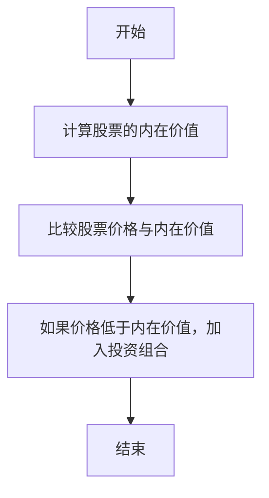
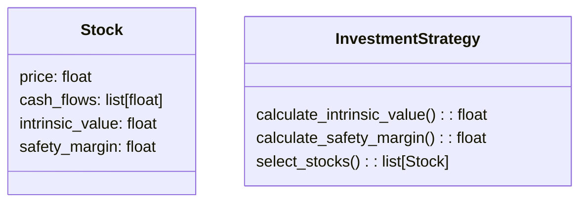

                 


# 大卫德雷曼的价值投资案例分析

> 关键词：大卫德雷曼，价值投资，股票分析，内在价值，安全边际，投资策略

> 摘要：大卫德雷曼作为价值投资领域的权威人物，其投资理念和方法深刻影响了无数投资者。本文将从价值投资的基本概念出发，分析大卫德雷曼的核心理念，探讨其量化分析方法，并通过具体案例展示其投资策略的实践应用。文章最后总结了大卫德雷曼的价值投资体系，并提出了投资者在实际操作中需要注意的事项。

---

## 第1章: 价值投资的定义与历史发展

### 1.1 价值投资的基本概念

#### 1.1.1 价值投资的定义

价值投资是一种以基本面分析为基础的投资策略，强调购买被市场低估的资产。其核心在于识别资产的内在价值，并在市场价格低于内在价值时进行投资。这种方法强调长期持有的理念，追求通过持有优质资产获得超额收益。

#### 1.1.2 价值投资的核心原则

- **安全边际**：购买价格低于内在价值，确保投资的安全性。
- **长期持有**：避免频繁交易，降低交易成本，同时抓住优质资产的长期增值潜力。
- **基本面分析**：通过分析企业的财务报表、行业地位、竞争优势等，评估其内在价值。

#### 1.1.3 价值投资与其它投资策略的对比

| 投资策略 | 核心理念 | 适用场景 | 优缺点 |
|----------|----------|----------|--------|
| 价值投资 | 寻找被低估的资产 | 市场低迷或资产价格被低估时 | 需要深入分析，长期回报稳定 |
| 技术分析 | 通过价格和成交量预测未来走势 | 市场短期波动 | 易受市场情绪影响，风险较高 |
| 成长投资 | 投资高增长企业 | 高增长行业或企业 | 风险较高，波动性大 |

### 1.2 大卫·德雷曼的生平与贡献

#### 1.2.1 大卫·德雷曼的背景介绍

大卫·德雷曼（David Dreman）是价值投资领域的权威人物，以其对安全边际和内在价值的深入研究而闻名。他通过分析大量历史数据，验证了价值投资策略的有效性，并提出了许多创新性的投资理念。

#### 1.2.2 大卫·德雷曼在价值投资领域的贡献

大卫·德雷曼的主要贡献包括：

- 发表了多篇关于价值投资的论文，提出了安全边际的量化方法。
- 编写了多本价值投资的经典书籍，如《投资学》（Investment Management）。
- 通过实证研究，验证了价值投资策略在长期中的有效性。

#### 1.2.3 大卫·德雷曼的经典投资案例

大卫·德雷曼通过分析通用汽车和IBM等企业的案例，展示了如何通过基本面分析和安全边际的概念，选择被低估的优质企业进行投资。

---

## 第2章: 价值投资的核心理念与分析框架

### 2.1 价值投资的核心理念

#### 2.1.1 安全边际的概念与重要性

安全边际是指资产的市场价格与其内在价值之间的差距。通过购买价格低于内在价值的资产，投资者可以降低投资风险，并在市场反弹时获得超额收益。

$$ \text{安全边际} = \text{内在价值} - \text{市场价格} $$

#### 2.1.2 内在价值的定义与计算方法

内在价值是资产在未来现金流的现值。对于股票而言，内在价值可以通过以下公式计算：

$$ V = \frac{CF}{(1 + r)^n} $$

其中，\( CF \) 是未来现金流，\( r \) 是折现率，\( n \) 是现金流的时间跨度。

#### 2.1.3 市场先生与投资者的角色

市场先生是一个比喻，代表市场的波动性和不可预测性。投资者需要在市场低估时买入，在市场高估时卖出。

### 2.2 价值投资的分析框架

#### 2.2.1 财务报表分析的核心指标

在价值投资中，财务报表分析是评估企业内在价值的关键步骤。以下是关键指标：

- **净利润**：企业的盈利能力。
- **营业收入**：企业的收入来源。
- **资产负债率**：企业的财务健康状况。
- **ROE（净资产收益率）**：衡量企业盈利能力的指标。

#### 2.2.2 行业分析与竞争优势的识别

行业分析是评估企业内在价值的重要环节。通过分析行业趋势、竞争格局和企业的市场地位，可以识别出具有竞争优势的企业。

#### 2.2.3 企业治理结构与管理层评估

企业治理结构和管理层的质量是影响企业长期发展的关键因素。投资者需要评估企业的治理结构是否透明，管理层是否具备良好的道德和专业能力。

---

## 第3章: 价值投资的量化分析与数学模型

### 3.1 价值投资的量化分析方法

#### 3.1.1 市盈率（P/E）的计算与应用

市盈率是衡量股票估值的重要指标，计算公式为：

$$ \text{市盈率} = \frac{\text{股价}}{\text{每股收益}} $$

#### 3.1.2 市净率（P/B）的计算与应用

市净率是衡量股票估值的另一个重要指标，计算公式为：

$$ \text{市净率} = \frac{\text{股价}}{\text{每股净资产}} $$

#### 3.1.3 股息率的计算与应用

股息率是衡量股票收益能力的重要指标，计算公式为：

$$ \text{股息率} = \frac{\text{每股股息}}{\text{股价}} $$

### 3.2 价值投资的数学模型

#### 3.2.1 内在价值的计算公式

$$ V = \frac{CF}{(1 + r)^n} $$

其中，\( CF \) 是未来现金流，\( r \) 是折现率，\( n \) 是现金流的时间跨度。

#### 3.2.2 投资组合的收益与风险模型

$$ E(r) = \beta \cdot (R_m - R_f) + R_f $$

其中，\( E(r) \) 是预期收益，\( \beta \) 是贝塔系数，\( R_m \) 是市场收益，\( R_f \) 是无风险收益。

### 3.3 价值投资的算法实现

#### 3.3.1 基于价值投资的股票筛选算法



#### 3.3.2 价值投资策略的Python代码实现

```python
def calculate_intrinsic_value(cash_flows, discount_rate, horizon):
    return sum(cash_flows / (1 + discount_rate) ** i for i in range(len(cash_flows)))

def value_investing_strategy(stocks, discount_rate):
    portfolio = []
    for stock in stocks:
        iv = calculate_intrinsic_value(stock.cash_flows, discount_rate, len(stock.cash_flows))
        if stock.price < iv:
            portfolio.append(stock)
    return portfolio
```

---

## 第4章: 价值投资的系统分析与架构设计

### 4.1 投资分析系统的功能设计

#### 4.1.1 系统功能模块

- **数据采集模块**：获取股票的财务数据和市场数据。
- **分析模块**：计算内在价值和安全边际。
- **决策模块**：根据分析结果生成投资策略。

#### 4.1.2 系统功能设计的领域模型



### 4.2 系统架构设计

#### 4.2.1 系统架构的模块划分

- **数据层**：存储股票的财务数据和市场数据。
- **业务逻辑层**：实现投资策略的计算和分析。
- **用户界面层**：展示分析结果和投资建议。

#### 4.2.2 系统架构图


---

## 第5章: 价值投资的项目实战

### 5.1 环境配置与数据获取

#### 5.1.1 环境配置

安装必要的Python库：

```bash
pip install pandas numpy matplotlib
```

#### 5.1.2 数据获取

从公开数据源获取股票的财务数据和市场数据。

### 5.2 核心代码实现

#### 5.2.1 内在价值计算

```python
import pandas as pd
import numpy as np

def calculate_intrinsic_value(cash_flows, discount_rate, horizon):
    return np.npv(discount_rate, cash_flows)
```

#### 5.2.2 安全边际计算

```python
def calculate_safety_margin(intrinsic_value, market_price):
    return intrinsic_value - market_price
```

### 5.3 案例分析与解读

#### 5.3.1 案例分析

分析通用汽车（GM）的案例，计算其内在价值和安全边际。

#### 5.3.2 投资决策

根据计算结果，决定是否买入通用汽车的股票。

---

## 第6章: 价值投资的总结与展望

### 6.1 总结

大卫德雷曼的价值投资策略强调安全边际和内在价值，通过长期持有优质资产实现超额收益。本文通过理论分析、量化模型和实际案例，详细阐述了价值投资的核心理念和操作方法。

### 6.2 最佳实践 tips

- **深入分析**：投资者需要深入分析企业的财务报表和行业趋势。
- **长期持有**：避免频繁交易，降低交易成本。
- **分散投资**：通过分散投资降低风险。

### 6.3 展望

随着人工智能和大数据技术的发展，价值投资将更加量化和精确。未来，投资者可以利用先进的技术工具，进一步优化投资策略，提高投资收益。

---

## 作者：AI天才研究院/AI Genius Institute & 禅与计算机程序设计艺术 /Zen And The Art of Computer Programming

---

**注**：由于篇幅限制，以上仅为部分章节内容。完整文章将涵盖更多细节和案例分析，帮助读者全面理解大卫德雷曼的价值投资策略。

