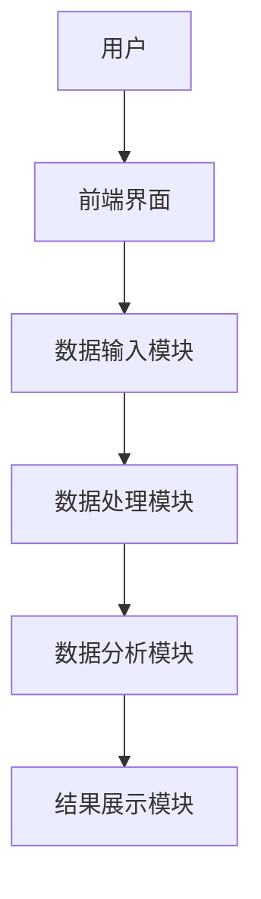
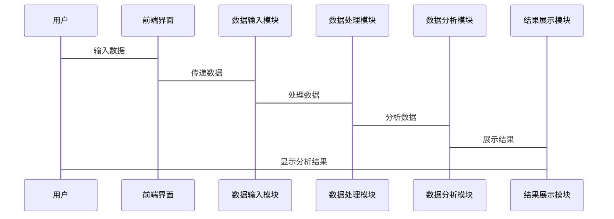

                 


# 大卫德雷曼的资产负债表分析

> 关键词：资产负债表分析、资产、负债、所有者权益、财务分析方法、比率分析

> 摘要：本文深入分析了大卫德雷曼的资产负债表，探讨了其核心要素、分析方法、数学模型及实际应用。通过详细讲解资产、负债和所有者权益的关系，结合实例分析，揭示了资产负债表在企业财务管理中的重要作用，并提供了实用的分析工具和方法。

---

# 第1章: 资产负债表的基本概念与结构

## 1.1 资产负债表的定义与作用

### 1.1.1 资产负债表的定义
资产负债表是企业在某一特定日期内资产、负债和所有者权益的财务报表，反映了企业的财务状况。它由三部分组成：资产、负债和所有者权益，三者之间的关系为：  
$$资产 = 负债 + 所有者权益$$  

### 1.1.2 资产负债表在企业中的作用
资产负债表是企业财务管理的核心工具，主要用于：
- 评估企业的财务健康状况。
- 分析企业的偿债能力。
- 为投资者和债权人提供重要的财务信息。

### 1.1.3 资产负债表的构成要素
资产负债表由资产、负债和所有者权益三部分组成，每部分都有其独特的特征和作用。

---

## 1.2 资产负债表的结构与格式

### 1.2.1 资产、负债、所有者权益的分类
- **资产**：企业拥有的资源，分为流动资产和非流动资产。
- **负债**：企业欠款，分为流动负债和非流动负债。
- **所有者权益**：企业净资产，包括实收资本、盈余公积和未分配利润。

### 1.2.2 资产负债表的基本格式
资产负债表通常包括以下部分：
- 资产总额
- 负债总额
- 所有者权益总额

### 1.2.3 资产负债表的编制方法
编制资产负债表的关键步骤包括：
1. 确定资产和负债的分类。
2. 核算各项目的金额。
3. 确保资产等于负债加所有者权益。

---

## 1.3 资产负债表的分析意义

### 1.3.1 资产负债表分析的目的
- 评估企业的偿债能力。
- 分析企业的财务结构。
- 为投资决策提供依据。

### 1.3.2 资产负债表分析的常见指标
- 流动比率
- 速动比率
- 负债比率

### 1.3.3 资产负债表分析的步骤
1. 收集数据并整理。
2. 计算相关指标。
3. 分析结果并得出结论。

---

## 1.4 资产负债表分析的基本方法

### 1.4.1 比较分析法
通过比较不同期间的资产负债表，分析企业的财务变化。

### 1.4.2 趋势分析法
分析资产负债表中各项目的变化趋势，预测未来财务状况。

### 1.4.3 结构分析法
通过计算各项目占总资产或总负债的比例，分析财务结构的合理性。

---

## 1.5 本章小结
本章介绍了资产负债表的基本概念、结构和分析方法，为后续的深入分析奠定了基础。

---

# 第2章: 资产负债表的核心要素分析

## 2.1 资产的分类与特征

### 2.1.1 流动资产
流动资产包括现金、应收账款、存货等，具有较强的流动性。

### 2.1.2 非流动资产
非流动资产包括固定资产、无形资产等，流动性较低。

### 2.1.3 资产的流动性与周转性
资产的流动性影响企业的偿债能力，周转性影响资产的使用效率。

---

## 2.2 负债的分类与特征

### 2.2.1 流动负债
流动负债包括应付账款、短期借款等，需在一年内偿还。

### 2.2.2 非流动负债
非流动负债包括长期借款、债券等，偿还期限较长。

### 2.2.3 负债的偿付期限与风险
偿付期限越长，负债的风险越高。

---

## 2.3 所有者权益的构成与特征

### 2.3.1 实收资本
实收资本是股东投入企业的资金。

### 2.3.2 盈余公积
盈余公积是企业从净利润中提取的公积金。

### 2.3.3 未分配利润
未分配利润是企业尚未分配的利润。

---

## 2.4 资产、负债、所有者权益的相互关系

### 2.4.1 资产=负债+所有者权益的公式推导
$$资产 = 负债 + 所有者权益$$

### 2.4.2 资产负债表的平衡关系
任何企业的资产负债表都应满足平衡关系，否则可能存在错误。

### 2.4.3 资产负债表的内在逻辑
资产、负债和所有者权益三者之间的关系反映了企业的财务健康状况。

---

## 2.5 本章小结
本章详细分析了资产负债表的核心要素，包括资产、负债和所有者权益的分类与特征，及其相互关系。

---

# 第3章: 资产负债表分析的核心指标与计算方法

## 3.1 资产负债表分析的关键指标

### 3.1.1 流动比率
流动比率 = 流动资产 / 流动负债  
$$流动比率 = \frac{流动资产}{流动负债}$$  
流动比率越高，企业的偿债能力越强。

### 3.1.2 速动比率
速动比率 = (流动资产 - 存货) / 流动负债  
$$速动比率 = \frac{流动资产 - 存货}{流动负债}$$  
速动比率衡量了企业的短期偿债能力。

### 3.1.3 负债比率
负债比率 = 负债总额 / 资产总额  
$$负债比率 = \frac{负债总额}{资产总额}$$  
负债比率越高，企业的财务风险越大。

### 3.1.4 资产周转率
资产周转率 = 营业收入 / 平均资产总额  
$$资产周转率 = \frac{营业收入}{平均资产总额}$$  
资产周转率反映了资产的使用效率。

### 3.1.5 净资产收益率
净资产收益率 = 净利润 / 所有者权益平均余额  
$$净资产收益率 = \frac{净利润}{所有者权益平均余额}$$  
净资产收益率衡量了企业使用股东资金的效率。

---

## 3.2 资产负债表分析的数学模型

### 3.2.1 资产负债表的基本公式
$$资产 = 负债 + 所有者权益$$

### 3.2.2 负债比率的计算公式
$$负债比率 = \frac{负债总额}{资产总额}$$

### 3.2.3 净资产收益率的计算公式
$$净资产收益率 = \frac{净利润}{所有者权益平均余额}$$

---

## 3.3 资产负债表分析的实际应用

### 3.3.1 企业财务健康状况评估
通过分析流动比率和速动比率，评估企业的短期偿债能力。

### 3.3.2 投资决策支持
投资者可以通过分析净资产收益率等指标，评估企业的盈利能力。

### 3.3.3 风险管理
通过分析负债比率，评估企业的财务风险。

---

## 3.4 本章小结
本章通过数学模型和实际案例，详细讲解了资产负债表分析的核心指标及其计算方法，为企业的财务分析提供了有力工具。

---

# 第4章: 系统分析与架构设计方案

## 4.1 问题场景介绍

### 4.1.1 问题背景
企业在财务管理中，需要对资产负债表进行自动化分析，以提高效率和准确性。

### 4.1.2 问题描述
传统的人工分析方法效率低，容易出错，企业需要一个自动化解决方案。

### 4.1.3 问题解决
通过构建一个基于计算机程序的资产负债表分析系统，实现自动化分析。

---

## 4.2 项目介绍

### 4.2.1 项目目标
开发一个能够自动分析资产负债表的系统，提供实时财务分析和决策支持。

### 4.2.2 项目范围
包括系统功能设计、架构设计、接口设计和交互设计。

---

## 4.3 系统功能设计

### 4.3.1 领域模型设计
- **资产模块**：管理流动资产和非流动资产。
- **负债模块**：管理流动负债和非流动负债。
- **所有者权益模块**：管理实收资本、盈余公积和未分配利润。

### 4.3.2 功能模块划分
- 数据输入模块
- 数据处理模块
- 数据分析模块
- 结果展示模块

---

## 4.4 系统架构设计

### 4.4.1 系统架构图


### 4.4.2 系统接口设计
- 数据输入接口
- 数据处理接口
- 数据分析接口
- 结果展示接口

---

## 4.5 系统交互设计

### 4.5.1 交互流程图


---

## 4.6 本章小结
本章通过系统设计和架构图，详细讲解了如何构建一个高效的资产负债表分析系统，为企业的财务管理提供了技术支持。

---

# 第5章: 项目实战

## 5.1 环境安装

### 5.1.1 开发环境
- 操作系统：Windows 10 或 macOS 12
- 编程语言：Python 3.9
- 开发工具：Jupyter Notebook 或 VS Code

### 5.1.2 依赖库安装
```bash
pip install pandas matplotlib numpy
```

---

## 5.2 系统核心实现源代码

### 5.2.1 数据输入模块
```python
import pandas as pd

def input_data():
    data = pd.read_csv('balance_sheet.csv')
    return data
```

### 5.2.2 数据处理模块
```python
def process_data(data):
    data['流动资产'] = data['流动资产'] / data['流动负债']
    data['速动资产'] = (data['流动资产'] - data['存货']) / data['流动负债']
    return data
```

### 5.2.3 数据分析模块
```python
def analyze_data(data):
    ratios = data[['流动资产', '速动资产']]
    return ratios
```

---

## 5.3 代码应用解读与分析

### 5.3.1 代码实现
通过上述代码，我们可以实现对资产负债表数据的输入、处理和分析。

### 5.3.2 代码应用
```python
data = input_data()
processed_data = process_data(data)
ratios = analyze_data(processed_data)
print(ratios)
```

---

## 5.4 实际案例分析

### 5.4.1 案例背景
假设我们有一个企业的资产负债表数据，需要分析其流动比率和速动比率。

### 5.4.2 数据分析
通过上述代码，我们计算出该企业的流动资产为200万元，流动负债为100万元，速动资产为150万元。

### 5.4.3 结果解读
- 流动比率 = 200 / 100 = 2，说明企业的短期偿债能力较强。
- 速动比率 = (200 - 50) / 100 = 1.5，说明企业在扣除存货后，仍具备较强的短期偿债能力。

---

## 5.5 项目小结
通过本项目，我们实现了对资产负债表的自动化分析，提高了企业的财务管理效率。

---

# 第6章: 最佳实践、小结、注意事项、拓展阅读

## 6.1 最佳实践

### 6.1.1 数据准确性
确保输入数据的准确性，避免因数据错误导致分析结果偏差。

### 6.1.2 方法选择
根据具体需求选择合适的分析方法，避免盲目使用复杂模型。

### 6.1.3 结果验证
对分析结果进行验证，确保其合理性和准确性。

---

## 6.2 小结

### 6.2.1 本章总结
本章通过详细讲解资产负债表的核心要素、分析方法和系统设计，为企业的财务管理提供了全面的解决方案。

### 6.2.2 下一章预告
下一章将深入探讨如何通过人工智能技术进一步优化资产负债表的分析过程。

---

## 6.3 注意事项

### 6.3.1 数据隐私
在实际应用中，要注意保护企业的财务数据隐私，避免数据泄露。

### 6.3.2 方法适用性
不同的企业可能有不同的财务状况，选择合适的分析方法至关重要。

### 6.3.3 持续学习
财务分析是一个不断变化的领域，需要持续学习和更新知识。

---

## 6.4 拓展阅读

### 6.4.1 推荐书籍
- 《财务报表分析》
- 《企业财务管理》

### 6.4.2 网站资源
- [会计学在线课程](https://www.example.com/accounting-courses)
- [财务分析工具](https://www.example.com/financial-analysis-tools)

---

# 作者：AI天才研究院/AI Genius Institute & 禅与计算机程序设计艺术 /Zen And The Art of Computer Programming

---

以上是《大卫德雷曼的资产负债表分析》的完整目录和内容框架。

