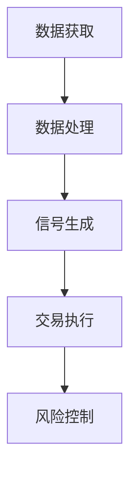
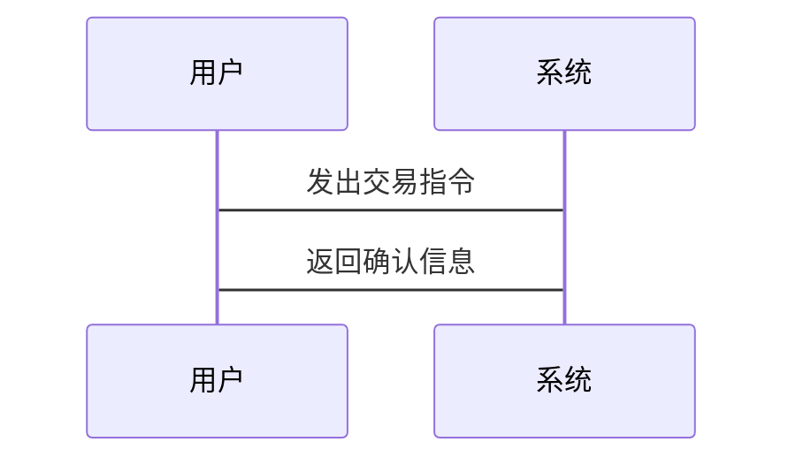

                 


# 《大卫斯文森的另类投资策略》

> **关键词**：大卫·斯文森、另类投资、资产配置、风险管理、投资组合优化

> **摘要**：本文深入探讨大卫·斯文森的另类投资策略，分析其核心思想、数学模型、系统架构和实战案例，帮助读者理解并掌握其投资方法。

---

## 正文

### 第一部分: 大卫斯文森另类投资策略的背景与基础

#### 第1章: 大卫斯文森与另类投资概述

##### 1.1 大卫·斯文森的背景与投资理念

**1.1.1 大卫·斯文森的教育与职业经历**

大卫·斯文森（David Swensen）是耶鲁大学的首席投资官，以其卓越的投资成绩闻名。他在耶鲁大学建立了庞大的捐赠基金，使其成为全球最成功的大学捐赠基金之一。

**1.1.2 斯文森投资哲学的核心思想**

斯文森的投资哲学强调长期投资、资产配置和风险管理。他主张通过分散化投资降低风险，避免过度依赖单一资产类别。

**1.1.3 斯文森与耶鲁大学捐赠基金的成功案例**

斯文森通过创新的资产配置策略，将耶鲁大学捐赠基金从1981年的600万美元增长到2020年的超过300亿美元。

##### 1.2 另类投资的定义与特点

**1.2.1 另类投资的定义**

另类投资指传统股票、债券之外的资产类别，包括房地产、私募股权、对冲基金、 commodities等。

**1.2.2 另类投资与传统投资的区别**

| 属性         | 传统投资       | 另类投资       |
|--------------|----------------|----------------|
| 资产类别     | 股票、债券      | 房地产、私募股权等 |
| 流动性       | 高             | 低             |
| 风险         | 中风险         | 高风险         |
| 收益         | 稳定           | 波动性大       |

**1.2.3 另类投资的主要类型与风险特征**

主要类型包括房地产、私募股权、对冲基金、大宗商品等，风险较高但收益潜力大。

##### 1.3 斯文森投资策略的核心要素

**1.3.1 资产配置的重要性**

资产配置是投资组合的核心，斯文森主张将资金分配到多个资产类别以分散风险。

**1.3.2 风险管理的关键作用**

通过严格的风险管理，斯文森确保投资组合在不同市场环境下的稳定性。

**1.3.3 投资组合的分散化策略**

分散化投资降低特定资产的风险，斯文森通过多样化配置实现这一目标。

### 第2章: 另类投资的数学模型与风险评估

#### 2.1 投资组合的数学模型

##### 2.1.1 现代投资组合理论（MPT）的概述

MPT由哈里·马科维茨提出，旨在通过优化资产配置实现风险调整后的收益最大化。

##### 2.1.2 投资组合的期望收益与风险计算公式

- 期望收益：$$E(r) = \sum w_i E(r_i)$$
- 方差：$$Var = \sum w_i^2 Var_i + \sum w_i w_j Cov(r_i, r_j)$$

##### 2.1.3 投资组合优化的数学模型

优化模型：$$\text{minimize } \sigma^2 \text{ subject to } \mu = \text{target return}$$

#### 2.2 风险评估与夏普比率

##### 2.2.1 风险的定义与衡量方法

风险是投资收益的波动性，通常用标准差衡量。

##### 2.2.2 夏普比率的计算公式与意义

夏普比率：$$\text{Sharp Ratio} = \frac{E(r_p) - r_f}{\sigma_p}$$

##### 2.2.3 风险调整后的收益评估

夏普比率帮助投资者评估投资回报是否超过风险调整后的收益。

#### 2.3 投资组合的优化与调整

##### 2.3.1 资产配置的优化方法

通过优化算法找到最优资产配置。

##### 2.3.2 投资组合的动态调整策略

定期重新评估并调整投资组合以适应市场变化。

##### 2.3.3 风险与收益的平衡点分析

找到风险与收益的最佳平衡点。

### 第3章: 斯文森投资策略的核心算法与实现

#### 3.1 资产配置的算法实现

##### 3.1.1 现代投资组合理论（MPT）的算法实现

步骤：计算资产期望收益、方差和协方差矩阵，求解优化问题。

##### 3.1.2 基于Python的资产配置优化代码

```python
import numpy as np

def optimize_portfolio(expected_returns, covariance_matrix):
    n = len(expected_returns)
    # 定义优化问题
    # 使用scipy.optimize中的minimize函数
    pass
```

##### 3.1.3 算法实现的步骤与流程

1. 收集历史数据计算期望收益和协方差矩阵。
2. 设定目标收益或风险水平。
3. 求解优化问题得到最优权重。

#### 3.2 风险管理的算法实现

##### 3.2.1 风险调整后的收益计算算法

$$\text{风险调整后的收益} = \text{夏普比率} \times \sigma$$

##### 3.2.2 基于夏普比率的资产选择算法

选择夏普比率高的资产。

##### 3.2.3 风险

---

### 第四部分: 系统分析与架构设计

#### 第4章: 投资系统的设计与实现

##### 4.1 数据获取与处理模块

数据获取：从金融数据源获取实时数据。

##### 4.2 信号生成与策略执行模块

使用技术指标或算法生成交易信号。

##### 4.3 交易执行与风险控制模块

确保交易执行符合风险控制规则。

#### 4.2 系统架构设计

系统架构：



#### 4.3 系统交互设计



### 第五部分: 项目实战

#### 第5章: 实战项目实现

##### 5.1 因子投资策略实现

使用Python实现因子投资策略，分析因子表现。

##### 5.2 算法交易策略实现

实现基于技术指标的算法交易策略，监控交易执行。

### 第六部分: 最佳实践与注意事项

#### 第6章: 投资策略的注意事项

##### 6.1 风险管理的重要性

始终将风险管理放在首位。

##### 6.2 税务优化与成本控制

优化税务和降低交易成本。

##### 6.3 定期回顾与调整

定期评估投资组合并进行必要的调整。

---

### 作者：AI天才研究院/AI Genius Institute & 禅与计算机程序设计艺术 /Zen And The Art of Computer Programming

---

以上是文章的完整目录和部分章节内容，您可以根据需要扩展每个部分的具体内容。

