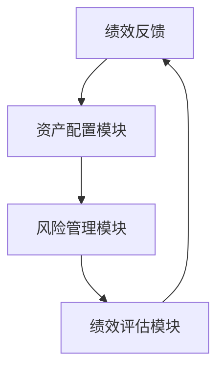

                 


# 大卫斯文森的耐心资本理念

## 关键词：耐心资本，大卫·斯文森，投资策略，长期投资，机构投资，资产配置，风险管理

## 摘要：  
大卫·斯文森是耶鲁大学捐赠基金的首席投资官，他提出的耐心资本理念是一种强调长期投资、注重机构化和系统化的方法。本文将详细分析耐心资本的核心理念、数学模型、算法原理以及在实际投资中的应用。通过构建耐心资本的系统架构和提供实际案例，本文旨在为读者提供一个全面理解耐心资本的机会。

---

## 第一部分：耐心资本理念的背景与核心概念

### 第1章：耐心资本的起源与发展

#### 1.1 耐心资本的定义与核心理念
- **1.1.1 耐心资本的定义**  
  耐心资本是一种长期投资策略，强调通过系统的资产配置和风险管理，在较长的时间跨度内实现资本的稳定增长。与短期投资不同，耐心资本注重投资的深度和持久性，而非短期收益。

- **1.1.2 耐心资本的核心理念**  
  大卫·斯文森提出的耐心资本理念强调以下几点：
  1. **长期性**：投资是长期的，需要耐心等待市场的波动和周期。
  2. **机构化**：投资必须系统化，避免情绪化决策。
  3. **多元化**：通过多元化的资产配置降低风险。
  4. **纪律性**：严格按照投资策略执行，避免偏离目标。

- **1.1.3 耐心资本与传统投资的区别**  
  传统投资往往追求短期收益，注重市场波动和交易机会。而耐心资本则关注长期价值，注重资产配置和风险管理，强调纪律性和系统性。

#### 1.2 大卫·斯文森的贡献
- **1.2.1 大卫·斯文森的背景介绍**  
  大卫·斯文森是耶鲁大学的首席投资官，以其卓越的投资业绩和创新的投资理念闻名。他在耶鲁大学捐赠基金的管理中，成功实现了长期稳定的收益，为机构投资领域树立了标杆。

- **1.2.2 耐心资本理念的提出与实践**  
  斯文森提出耐心资本理念的核心是通过长期、系统化的投资策略，实现资产的稳健增长。他强调，投资必须基于长期目标，避免短期市场波动的干扰。

- **1.2.3 耐心资本在耶鲁大学捐赠基金中的应用**  
  在耶鲁大学捐赠基金的管理中，斯文森通过耐心资本理念，将资产分配到不同的资产类别中，如股票、债券、房地产和私募股权等，实现了长期稳定的收益。

---

## 第二部分：耐心资本的核心概念与联系

### 第2章：耐心资本的核心原理

#### 2.1 耐心资本的属性特征对比
- **2.1.1 投资期限的长短对比**  
  耐心资本注重长期投资，而传统投资往往追求短期收益。

- **2.1.2 投资目标的差异性**  
  耐心资本的目标是实现资产的长期稳定增长，而传统投资的目标是追求短期收益的最大化。

- **2.1.3 风险承受能力的对比**  
  耐心资本能够承受短期市场波动带来的风险，而传统投资往往对短期波动敏感。

#### 2.2 耐心资本的ER实体关系图
- 以下是耐心资本的核心要素及其关系的ER实体关系图：

```mermaid
erDiagram
    actor 投资者 {
        <属性> 投资目标
        <属性> 投资期限
        <属性> 风险承受能力
    }
    actor 资产配置模块 {
        <属性> 资产类别
        <属性> 资产比例
    }
    actor 风险管理模块 {
        <属性> 风险指标
        <属性> 风险控制策略
    }
    actor 绩效评估模块 {
        <属性> 投资收益
        <属性> 风险调整后收益
    }
    投资者 --> 资产配置模块 : 配置资产
    资产配置模块 --> 风险管理模块 : 控制风险
    风险管理模块 --> 绩效评估模块 : 评估绩效
```

---

## 第三部分：耐心资本的算法原理讲解

### 第3章：耐心资本的数学模型与公式

#### 3.1 耐心资本的数学模型
- **3.1.1 投资组合优化的数学表达**  
  投资组合优化的目标是最大化收益，同时最小化风险。数学表达如下：
  $$
  \text{max} \sum_{i=1}^{n} w_i R_i - \lambda \sum_{i=1}^{n} w_i^2 \sigma_i^2
  $$
  其中，\( w_i \) 是资产 \( i \) 的权重，\( R_i \) 是资产 \( i \) 的预期收益，\( \sigma_i^2 \) 是资产 \( i \) 的方差，\( \lambda \) 是风险厌恶系数。

- **3.1.2 风险调整后的收益模型**  
  风险调整后的收益可以通过夏普比率来衡量：
  $$
  \text{夏普比率} = \frac{E(R_p) - R_f}{\sigma_p}
  $$
  其中，\( E(R_p) \) 是投资组合的预期收益，\( R_f \) 是无风险利率，\( \sigma_p \) 是投资组合的波动率。

- **3.1.3 资产配置的数学公式**  
  资产配置可以通过马科维茨的有效前沿理论来实现：
  $$
  \text{min} \sum_{i=1}^{n} w_i^2 \sigma_i^2
  $$
  在给定的收益约束下，找到最优的资产配置比例。

#### 3.2 算法原理的详细讲解
- **3.2.1 算法的输入与输出**  
  输入：资产的历史收益率、方差、协方差矩阵、投资期限、风险厌恶系数。  
  输出：最优资产配置比例、预期收益、风险调整后收益。

- **3.2.2 算法的步骤分解**  
  1. 计算各资产的历史收益率和风险指标。  
  2. 构建资产的协方差矩阵。  
  3. 使用优化算法（如二次规划）求解最优资产配置比例。  
  4. 计算投资组合的预期收益和风险调整后收益。  
  5. 输出结果并进行风险评估。

- **3.2.3 算法的实现代码**  
  下面是一个简单的资产配置算法的Python代码示例：

```python
import numpy as np
from scipy.optimize import minimize

def optimize_portfolio(weights, returns, cov_matrix, risk_aversion):
    # 定义目标函数
    def objective(weights):
        return - (np.sum(weights * returns) - risk_aversion * np.dot(weights.T, np.dot(cov_matrix, weights)))

    # 定义约束条件
    constraints = [
        {'type': 'eq', 'fun': lambda w: np.sum(w) - 1}
    ]

    # 使用SLSQP优化器求解
    result = minimize(objective, weights, method='SLSQP', constraints=constraints)

    return result.x

# 示例数据
n = 3
returns = np.array([0.1, 0.15, 0.08])
cov_matrix = np.array([[0.16, 0.05, 0.07],
                        [0.05, 0.20, 0.02],
                        [0.07, 0.02, 0.12]])
risk_aversion = 5

# 初始权重
initial_weights = np.array([1/3, 1/3, 1/3])

# 优化权重
optimal_weights = optimize_portfolio(initial_weights, returns, cov_matrix, risk_aversion)

print("最优权重:", optimal_weights)
print("预期收益:", np.sum(optimal_weights * returns))
print("风险调整后收益:", np.sum(optimal_weights * returns) - risk_aversion * np.dot(optimal_weights.T, np.dot(cov_matrix, optimal_weights)))
```

---

## 第四部分：耐心资本的系统分析与架构设计方案

### 第4章：耐心资本的系统架构设计

#### 4.1 问题场景介绍
- **4.1.1 耐心资本的应用场景**  
  耐心资本适用于机构投资者，尤其是那些有长期投资目标的机构，如大学捐赠基金、养老基金等。

- **4.1.2 系统的目标与范围**  
  系统的目标是为机构投资者提供基于耐心资本理念的投资解决方案，包括资产配置、风险管理、绩效评估等功能。

- **4.1.3 系统的约束条件**  
  系统需要考虑市场风险、流动性风险、操作风险等。

#### 4.2 系统功能设计
- **4.2.1 资产配置模块**  
  - 功能：根据投资者的长期目标和风险偏好，优化资产配置比例。  
  - 输入：资产收益率、协方差矩阵、风险厌恶系数。  
  - 输出：最优资产配置比例。

- **4.2.2 风险管理模块**  
  - 功能：监控和管理投资组合的风险，制定风险控制策略。  
  - 输入：投资组合的实时数据、风险指标。  
  - 输出：风险评估报告、风险调整建议。

- **4.2.3 绩效评估模块**  
  - 功能：评估投资组合的绩效，衡量风险调整后的收益。  
  - 输入：投资组合的收益、风险指标。  
  - 输出：绩效评估报告。

#### 4.3 系统架构设计
- **4.3.1 系统架构图**  
  下图展示了耐心资本系统的整体架构：



- **4.3.2 模块之间的关系**  
  资产配置模块为投资者提供最优资产配置比例，风险管理模块监控和管理风险，绩效评估模块评估投资组合的绩效，并将结果反馈给投资者。

- **4.3.3 接口设计与交互流程**  
  1. 投资者输入投资目标和风险偏好。  
  2. 资产配置模块根据输入生成最优资产配置比例。  
  3. 风险管理模块实时监控投资组合的风险，并制定风险控制策略。  
  4. 绩效评估模块评估投资组合的绩效，并将结果反馈给投资者。

---

## 第五部分：耐心资本的项目实战

### 第5章：耐心资本的实际应用案例

#### 5.1 项目环境安装
- **5.1.1 系统环境要求**  
  需要安装Python、NumPy、SciPy、Matplotlib等库。

- **5.1.2 开发工具安装**  
  建议使用Jupyter Notebook或PyCharm进行开发。

- **5.1.3 数据库配置**  
  需要历史市场数据，可以通过Yahoo Finance API获取。

#### 5.2 核心代码实现
- **5.2.1 资产配置算法实现**  
  如前所述，使用Python代码实现资产配置的优化算法。

- **5.2.2 风险管理模块实现**  
  以下是一个风险监控的示例代码：

```python
import pandas as pd
import yfinance as yf

# 下载历史数据
tickers = ['AAPL', 'MSFT', 'GOOGL']
data = yf.download(tickers, start='2020-01-01', end='2023-12-31')

# 计算收益率
returns = data['Adj Close'].pct_change().dropna()

# 计算波动率
volatility = returns.std() * np.sqrt(252)

print("各资产的波动率:", volatility)
```

- **5.2.3 绩效评估模块实现**  
  以下是一个绩效评估的示例代码：

```python
def calculate_sharpe_ratio(returns, risk_free_rate=0.02):
    return (returns.mean() * np.sqrt(252) - risk_free_rate * np.sqrt(252)) / returns.std() * np.sqrt(252)

print("夏普比率:", calculate_sharpe_ratio(returns))
```

#### 5.3 代码解读与分析
- **5.3.1 代码的功能分析**  
  资产配置代码通过优化算法实现最优资产配置，风险管理代码计算资产的波动率，绩效评估代码计算投资组合的夏普比率。

- **5.3.2 代码的优化建议**  
  可以引入更多的风险指标，如最大回撤、VaR等，以更全面地评估风险。

- **5.3.3 代码的扩展性分析**  
  可以将代码扩展为一个完整的投资管理系统，集成更多的功能模块，如交易执行、报告生成等。

---

## 第六部分：耐心资本的最佳实践与小结

### 第6章：耐心资本的最佳实践

#### 6.1 小结
- 耐心资本是一种长期投资策略，强调系统化、纪律性和多元化。
- 通过资产配置和风险管理，可以实现投资的长期稳定增长。

#### 6.2 注意事项
- 投资者需要具备长期视角，避免短期市场波动的干扰。
- 在实际操作中，需要结合市场环境和机构目标进行动态调整。

#### 6.3 拓展阅读
- 阅读大卫·斯文森的著作《机构投资的创新》（*Pioneering Portfolio Management*），深入了解耐心资本的理念和实践。

---

## 作者：AI天才研究院/AI Genius Institute & 禅与计算机程序设计艺术 /Zen And The Art of Computer Programming

