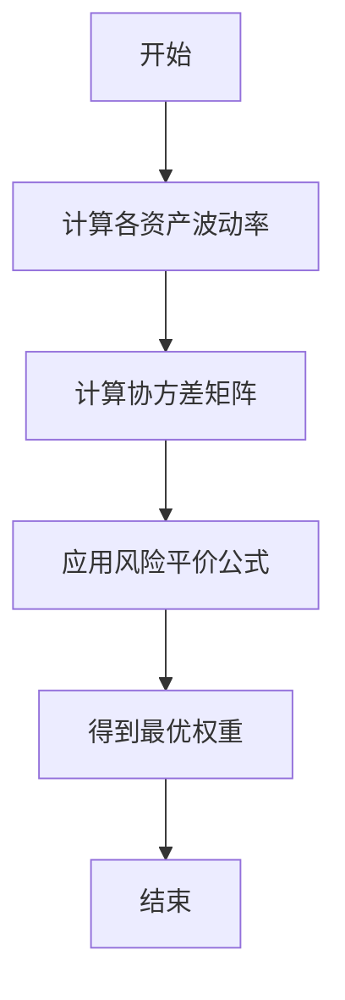
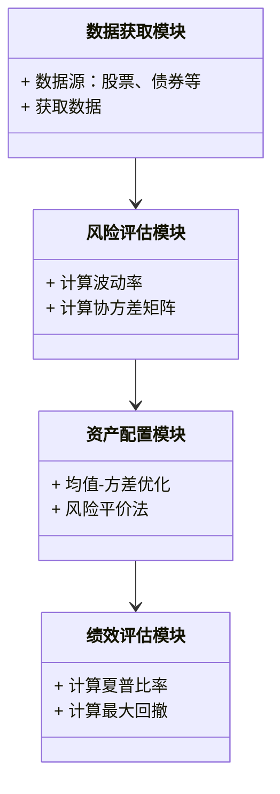

                 


# 大卫斯文森的长期资本配置

> 关键词：长期资本配置，大卫·斯文森，机构投资，资产配置，风险管理

> 摘要：本文深入探讨了大卫·斯文森的长期资本配置理论，分析其核心概念、算法原理、系统架构，并通过实际案例展示其应用。文章旨在帮助读者理解如何在机构投资中实施有效的长期资本配置策略，优化资产组合，降低风险，实现长期稳健收益。

---

## 第1章：长期资本配置的概述

### 1.1 长期资本配置的定义与核心概念

长期资本配置是指将资金分配到不同资产类别（如股票、债券、房地产等）以实现长期投资目标的过程。其核心在于通过多元化投资降低风险，同时追求资产的长期增值。

#### 核心要素：
- **时间跨度**：通常为5年以上的长期投资。
- **资产多样性**：分散投资以降低特定资产类别的风险。
- **风险承受能力**：机构投资者通常具有较高的风险承受能力。
- **战略导向**：基于市场长期趋势制定投资策略。

### 1.2 大卫·斯文森的贡献

大卫·斯文森作为耶鲁大学的首席投资官，提出了长期资本配置的系统性方法。他强调：
- **多元化**：通过投资不同资产类别降低风险。
- **长期视角**：关注资产的长期表现，而非短期波动。
- **动态调整**：定期重新平衡资产配置以适应市场变化。

### 1.3 机构投资中的长期资本配置

机构投资者通常管理的资金规模庞大，对长期资本配置的需求更为迫切。长期资本配置在机构投资中的应用包括：
- **养老基金**：确保长期资金的保值与增值。
- **主权财富基金**：通过多元化投资实现国家财富的长期增长。
- **捐赠基金**：支持大学和其他非营利机构的长期资金需求。

---

## 第2章：长期资本配置的核心概念

### 2.1 长期资本配置的特征

长期资本配置与短期投资相比，具有以下特征：

| 特征           | 长期资本配置      | 短期投资          |
|----------------|-------------------|-------------------|
| 时间跨度       | 5年以上           | 几周或几个月       |
| 风险承受能力   | 较高             | 较低             |
| 资产多样性     | 高               | 低               |
| 战略性         | 高度规划         | 更注重战术调整     |

### 2.2 长期资本配置与其他投资策略的对比

长期资本配置与主动投资和被动投资的主要区别在于其战略性和时间跨度。

#### 主动投资 vs 被动投资：
- **主动投资**：通过精选个股或时机选择来跑赢市场。
- **被动投资**：通过指数基金等工具复制市场表现。
- **长期资本配置**：通过多元化资产配置，优化风险与收益的平衡。

---

## 第3章：长期资本配置的算法与数学模型

### 3.1 均值-方差优化模型

均值-方差优化是一种经典的资产配置方法，目标是在给定风险下最大化收益，或在给定收益下最小化风险。

#### 数学模型：
$$
\text{Minimize } \sigma^2 \text{ subject to } \mu = \text{target return}
$$

其中：
- $\sigma^2$ 是投资组合的方差（风险）。
- $\mu$ 是预期收益。

#### Python代码实现：

```python
import numpy as np
import pandas as pd

# 假设我们有三个资产的预期收益和协方差矩阵
mu = np.array([0.1, 0.15, 0.08])
cov_matrix = np.array([
    [0.05, 0.02, 0.01],
    [0.02, 0.10, 0.03],
    [0.01, 0.03, 0.08]
])

# 使用numpy.linalg.solve求解最优权重
A = np.array([[1, 1, 1]])
b = np.array([1])

# 解方程组，得到权重
weights = np.linalg.solve(cov_matrix, mu)
weights = weights / np.sum(weights)

print("最优权重为：", weights)
```

### 3.2 风险平价法

风险平价法通过分配资产的波动性权重，使每种资产的风险贡献相等。

#### 数学模型：
$$
w_i = \frac{1}{\sqrt{\sum_{j} w_j^2 \sigma_{ij}}}
$$

其中：
- $w_i$ 是第i个资产的权重。
- $\sigma_{ij}$ 是资产i和资产j的协方差。

#### Mermaid流程图：



---

## 第4章：长期资本配置的系统架构

### 4.1 投资组合管理系统架构

#### 系统功能模块：
1. **数据获取模块**：收集各资产的历史数据。
2. **风险评估模块**：计算资产的波动率和相关性。
3. **资产配置模块**：应用均值-方差优化或风险平价法生成配置方案。
4. **绩效评估模块**：定期评估投资组合的表现。

#### 系统架构图：



---

## 第5章：项目实战

### 5.1 案例分析：机构投资者的全球资产配置

#### 数据预处理：
使用历史数据计算各资产的预期收益和协方差矩阵。

#### 模型实现：
应用均值-方差优化生成最优权重。

#### 结果分析：
通过回测验证投资组合的风险和收益是否符合预期。

---

## 第6章：总结与扩展阅读

### 6.1 核心要点回顾

长期资本配置的关键在于：
- **多元化**：分散投资降低风险。
- **长期视角**：关注资产的长期表现。
- **动态调整**：定期重新平衡资产配置。

### 6.2 进一步阅读

建议阅读大卫·斯文森的《机构投资的创新》以及相关学术论文，深入了解长期资本配置的理论与实践。

---

作者：AI天才研究院 & 禅与计算机程序设计艺术

