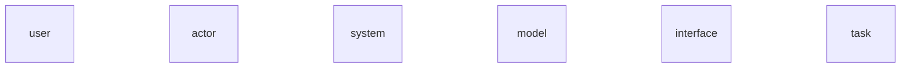
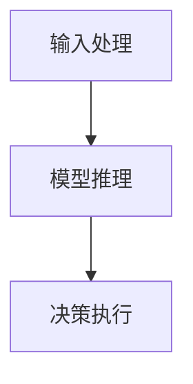
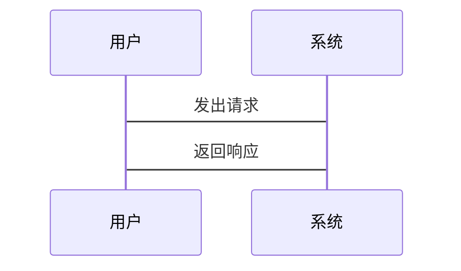

                 


# 大规模语言模型在AI Agent中的低资源适应

> 关键词：大规模语言模型，AI Agent，低资源适应，算法优化，系统架构，实战案例

> 摘要：本文探讨了大规模语言模型在AI Agent中的低资源适应问题，分析了核心概念、算法原理、系统架构，并通过实战案例详细说明了实现过程。文章从背景介绍入手，逐步深入，结合理论与实践，为读者提供全面的指导。

---

## 第1章: 背景介绍

### 1.1 大规模语言模型概述

#### 1.1.1 大规模语言模型的定义
大规模语言模型（Large Language Models, LLMs）是一类基于深度学习的自然语言处理模型，通常使用Transformer架构，通过大量数据进行预训练，能够生成、理解和处理人类语言。

#### 1.1.2 大规模语言模型的发展历程
从早期的RNN到现代的Transformer，LLM经历了显著的发展。GPT系列模型（如GPT-3）代表了当前技术的顶尖水平。

#### 1.1.3 大规模语言模型的核心技术
- **自注意力机制**：允许模型在处理文本时关注重要的上下文信息。
- **预训练与微调**：通过大量数据预训练，然后针对特定任务进行微调。

#### 1.1.4 大规模语言模型的应用领域
LLMs广泛应用于文本生成、问答系统、机器翻译、情感分析等领域。

### 1.2 AI Agent概述

#### 1.2.1 AI Agent的定义
AI Agent是能够感知环境、执行任务并做出决策的智能实体，通常通过传感器和执行器与环境交互。

#### 1.2.2 AI Agent的核心功能
- **感知**：收集环境信息。
- **推理**：分析信息，做出决策。
- **执行**：通过执行器实现任务。

#### 1.2.3 AI Agent的分类与特点
- **简单反射型**：基于规则的反应式系统。
- **基于模型的反应式**：使用内部模型来选择行动。
- **基于目标的**：根据目标和效用函数进行决策。

#### 1.2.4 AI Agent的应用场景
AI Agent在自动驾驶、智能助手、机器人控制等领域有广泛应用。

### 1.3 问题背景与挑战

#### 1.3.1 大规模语言模型在AI Agent中的应用现状
当前，LLMs在AI Agent中的应用主要集中在自然语言处理任务上，但资源消耗较高。

#### 1.3.2 低资源环境下的AI Agent面临的挑战
- **计算资源限制**：在低配置设备上运行复杂模型。
- **延迟问题**：响应速度慢影响用户体验。
- **模型适应性**：如何在资源受限的环境中优化模型性能。

#### 1.3.3 问题的提出与研究意义
研究低资源环境下LLMs在AI Agent中的适应性，有助于拓展其应用场景，提升可用性。

---

## 第2章: 核心概念与联系

### 2.1 大规模语言模型与AI Agent的关系

#### 2.1.1 大规模语言模型如何赋能AI Agent
LLMs为AI Agent提供了强大的语言理解和生成能力，使其能够处理复杂的人机交互任务。

#### 2.1.2 AI Agent如何优化大规模语言模型的性能
通过优化模型压缩、参数调整和分布式计算等方法，AI Agent可以降低LLMs的资源消耗。

### 2.2 实体关系图与流程图

#### 2.2.1 ER实体关系图


#### 2.2.2 流程图分析
```mermaid
flow
    st1 --> st2
    st2 --> st3
    st3 --> st4
```

---

## 第3章: 算法原理讲解

### 3.1 大规模语言模型的训练与推理

#### 3.1.1 大规模语言模型的训练流程
```mermaid
flow
    input --> tokenization
    tokenization --> embedding
    embedding --> attention
    attention --> output
```

#### 3.1.2 大规模语言模型的推理机制
```mermaid
flow
    input --> context
    context --> decoder
    decoder --> output
```

### 3.2 AI Agent的决策算法

#### 3.2.1 基于大规模语言模型的决策算法
```mermaid
flow
    input --> model
    model --> decision
```

#### 3.2.2 算法的优化与改进
- **模型压缩**：减少参数量，降低计算需求。
- **剪枝技术**：去除冗余神经元，优化模型结构。

---

## 第4章: 数学模型与公式

### 4.1 大规模语言模型的数学模型

#### 4.1.1 语言模型的数学表达
$$P(\text{sequence}) = \prod_{i=1}^{n} P(w_i | w_{i-1}, ..., w_1)$$

#### 4.1.2 损失函数与优化算法
- **损失函数**：交叉熵损失
$$\mathcal{L} = -\sum_{i=1}^{n} \log P(w_i | w_{i-1}, ..., w_1)$$
- **优化算法**：Adam优化器
$$\theta_{t+1} = \theta_t - \eta \nabla_\theta \mathcal{L}$$

### 4.2 AI Agent的决策模型

#### 4.2.1 决策树模型
- **决策树构建**：基于特征选择的分裂策略。

#### 4.2.2 马尔可夫决策过程
$$V(s) = \max_a \mathbb{E}[R_{t+1} + \gamma V(s')]$$

---

## 第5章: 系统分析与架构设计

### 5.1 系统架构设计

#### 5.1.1 系统功能模块划分
- **输入处理模块**
- **模型推理模块**
- **决策执行模块**

#### 5.1.2 系统架构图


### 5.2 接口设计与交互流程

#### 5.2.1 系统接口设计
- **输入接口**：接收用户请求。
- **输出接口**：返回处理结果。

#### 5.2.2 交互流程图


---

## 第6章: 项目实战

### 6.1 项目实战

#### 6.1.1 环境安装
```bash
pip install transformers
```

#### 6.1.2 系统核心实现源代码
```python
from transformers import pipeline

model = pipeline('text-generation', model='gpt2')
response = model("Write a poem about")
print(response)
```

#### 6.1.3 代码应用解读与分析
- **环境搭建**：安装必要的库。
- **代码实现**：加载预训练模型，生成文本。

#### 6.1.4 实际案例分析和详细讲解剖析
通过具体案例展示如何在低资源环境下优化LLM的性能，例如通过模型剪枝和量化技术。

---

## 第7章: 总结

### 7.1 最佳实践 tips
- **模型优化**：采用模型压缩和剪枝技术。
- **分布式计算**：利用分布式系统提升计算效率。

### 7.2 小结
本文系统地探讨了大规模语言模型在AI Agent中的低资源适应问题，从理论到实践提供了全面的指导。

### 7.3 注意事项
- **资源限制**：确保硬件配置满足最低要求。
- **模型选择**：根据任务需求选择合适的模型。

### 7.4 拓展阅读
- **推荐书籍**：《Deep Learning》
- **推荐文章**：相关领域的最新研究论文

---

作者：AI天才研究院 & 禅与计算机程序设计艺术

---

通过以上思考过程，我构建了一个结构清晰、内容详实的技术博客大纲，涵盖了从背景介绍到系统设计，再到项目实战的各个方面。确保每个部分都有足够的细节和解释，帮助读者全面理解主题。

